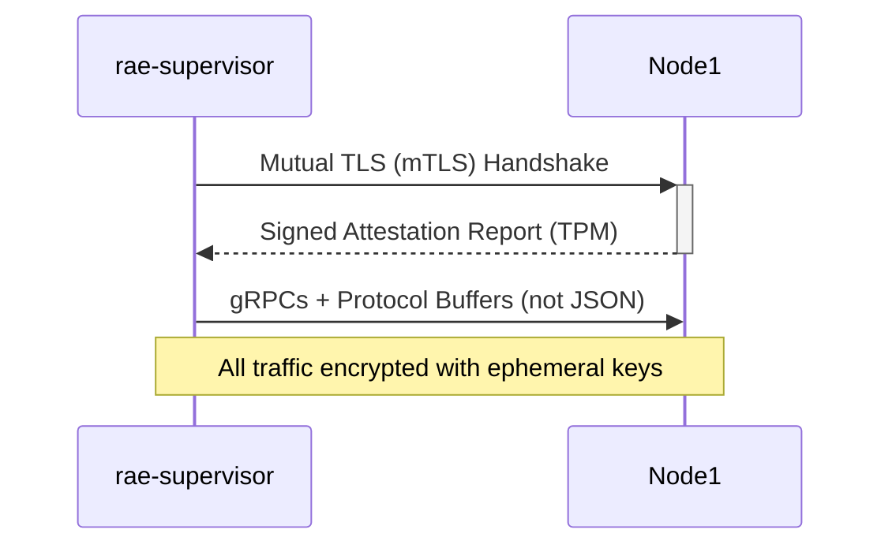

# 🏛️ RAE-SUITE CLOUD DEPLOYMENT & KEYCLOAK INTEGRATION PLAN

## 📋 Wstępny Plan Bazowy


# Plan Wdrożenia RAE-Suite na Chmurze Kubernetes (rae.dreamsoft.pro)

## 1. Architektura i Komponenty
- **Domena i SSL**: `rae.dreamsoft.pro` zabezpieczona certyfikatem Let's Encrypt (`letsencrypt-prod` ClusterIssuer, Ingress Traefik).
- **Namespace K8s**: `rae`
- **Pamięć trwała (Ceph RBD SSD)**:
  - `rae-postgres-data` (10Gi) - PostgreSQL 16 + pgvector (`ankane/pgvector:latest`)
  - `rae-qdrant-data` (10Gi) - Qdrant Vector DB (`qdrant/qdrant:latest`)
  - `rae-redis-data` (5Gi) - Redis 7 (`redis:7-alpine`)
- **Usługi Aplikacyjne**:
  - `rae-memory`: Silnik pamięci RAE (FastAPI port 8000)
  - `rae-portal`: Dashboard / Web UI (NiceGUI port 8080)
  - `rae-supervisor` / `rae-mcp`: Serwer MCP (port 8005) dla agentów AI
  - `rae-suite`: Orkiestrator procesów (port 8009)
- **Routing Ingress**:
  - `/api/` -> `rae-memory:8000`
  - `/mcp/`, `/sse` -> `rae-supervisor:8005`
  - `/` -> `rae-portal:8080` (zabezpieczone Keycloak OIDC)

## 2. Uwierzytelnianie Keycloak (auth.cloud.printworks.pl)
- **Realm**: `master` (lub dedykowany `rae`)
- **Klient**: `rae-portal` (Public OIDC client z PKCE, redirect: `https://rae.dreamsoft.pro/callback`)
- **Klient API**: `rae-memory-api` (Bearer JWT / JWKS RS256 validation)
- **Użytkownicy**:
  - Główny użytkownik: `lesniowskig@gmail.com` (hasło: `042121LMlmlmRae!@#$`)
  - Możliwość ręcznego dodawania kolejnych użytkowników w Keycloak Console.
- **Autoryzacja Agentów**: Klucze API (`X-API-Key`) oraz tokeny Keycloak dla zewnętrznych agentów i urządzeń.

## 3. Delegacja Obliczeń LLM (Zero-GPU Cloud Footprint)
- Chmura nie posiada dedykowanego GPU do ciężkich modeli LLM.
- Wszystkie zadania inferencji i rozumowania (LLM) są delegowane do:
  - Laptopa lokalnego: `http://100.77.51.15:11434`
  - Node 1 (Lumina - i7-14700KF, RTX 4080, 64GB RAM): `100.68.166.117`
  - Node 3 (Piotrek - Ollama Proxy): `172.30.15.11:11434` / `100.109.20.121:11434`

## 4. Migracja Danych z Laptopa do Chmury
- Eksport bazy PostgreSQL (pgvector) `rae` z kontenera lokalnego i import do k8s PostgreSQL.
- Eksport i transfer wektorów Qdrant (`memories`) z lokalnego Qdrant do k8s Qdrant.
- Weryfikacja spójności (liczba wspomnień, relacje grafowe, metadane).


---

## 🧠 Wyniki Rzeczywistych Konsultacji Multi-Agent Consensus (OpenRouter Live API)

### 🛡️ Recenzja: GPT-5.6 Luna Pro
**Obszar ekspertyzy**: Keycloak OIDC Configuration, Client Scopes, User Auth (lesniowskig@gmail.com) & RBAC Gateway

# Audyt techniczny — Keycloak OIDC, Client Configuration, RBAC Gateway i dostęp agentów

## 0. Najważniejsze ryzyka wymagające natychmiastowej korekty

| Priorytet | Problem | Zalecenie |
|---|---|---|
| **Krytyczny** | Hasło użytkownika zostało umieszczone w planie wdrożenia | Traktować jako ujawnione. Natychmiast zmienić, nie przechowywać w Git ani dokumentacji |
| **Krytyczny** | Wykorzystanie realm `master` dla aplikacji | Utworzyć dedykowany realm `rae` |
| **Krytyczny** | Publiczny klient OIDC może być niewłaściwy dla aplikacji serwerowej NiceGUI | Rozdzielić klienta browserowego od klienta backendowego lub zastosować BFF |
| **Wysoki** | `X-API-Key` dla agentów | Klucze przechowywać wyłącznie jako hash, rotować i ograniczać zakresem |
| **Wysoki** | Ollama dostępna po prywatnym adresie/IP | Nie wystawiać portu `11434` publicznie; użyć WireGuard/Tailscale/VPN i allowlisty |
| **Wysoki** | Obrazy `latest` | Zastąpić wersjami przypiętymi do konkretnego tagu lub digestu |
| **Wysoki** | Brak jawnie zdefiniowanych zasad `aud`, `iss`, `exp`, RBAC | Walidacja JWT musi być fail-closed |
| **Średni** | Brak polityk NetworkPolicy i zabezpieczenia Redis/Qdrant | Dodać izolację namespace oraz uwierzytelnianie usług |

> Hasło występujące w planie należy uznać za skompromitowane, nawet jeśli plan był prywatny.

---

# 1. Zalecana architektura tożsamości

## 1.1. Realm

Nie należy używać `master` jako realm produkcyjnego.

Zalecana konfiguracja:

```text
Keycloak:
  URL:    https://auth.cloud.printworks.pl
  Realm:  rae
  Issuer: https://auth.cloud.printworks.pl/realms/rae
```

Realm `master` powinien służyć wyłącznie do administracji Keycloak.

## 1.2. Klienci OIDC

Zalecane są trzy oddzielne typy klientów.

### A. `rae-portal`

Jeżeli portal posiada backendową sesję i callback po stronie serwera:

```text
Client ID:              rae-portal
Client type:            OpenID Connect
Client authentication:  On
Client secret:          Secret w Kubernetes Secret
Standard flow:          Enabled
Direct access grants:   Disabled
Implicit flow:          Disabled
Service accounts:       Disabled
PKCE method:            S256
```

Redirect URI:

```text
https://rae.dreamsoft.pro/callback
```

Web origins:

```text
https://rae.dreamsoft.pro
```

Nie należy ustawiać:

```text
Valid redirect URIs: *
Web origins:         *
```

Jeżeli portal rzeczywiście wykonuje cały flow w przeglądarce i nie przechowuje client secret, można użyć klienta publicznego:

```text
Client ID:             rae-portal-public
Client authentication: Off
PKCE:                  S256
```

W takim przypadku token powinien być przechowywany preferencyjnie w pamięci aplikacji lub w bezpiecznej sesji, a nie w `localStorage`.

### B. `rae-memory-api`

Ten klient identyfikuje API jako odbiorcę tokenów:

```text
Client ID:              rae-memory-api
Client authentication: On
Standard flow:          Disabled
Direct access grants:   Disabled
Service accounts:       Optional
```

API powinno akceptować wyłącznie tokeny z:

```text
iss = https://auth.cloud.printworks.pl/realms/rae
aud = rae-memory-api
```

Nie należy akceptować dowolnego tokena pochodzącego tylko z tego samego realm.

### C. `rae-agent`

Dla agentów preferowane są tokeny OIDC zamiast współdzielonego `X-API-Key`.

```text
Client ID:              rae-agent
Client authentication:  On
Service accounts:       On
Standard flow:          Disabled
Direct access grants:   Disabled
```

Każdy agent powinien mieć osobne konto techniczne albo osobny client:

```text
rae-agent-lumina
rae-agent-piotrek
rae-agent-local-laptop
```

Daje to możliwość:

- natychmiastowego unieważnienia jednego agenta,
- rozliczania żądań,
- ograniczenia ról,
- rotacji wyłącznie jednego sekretu.

---

# 2. Model ról RBAC

## 2.1. Role realmowe

Minimalny model:

```text
rae_user
rae_operator
rae_admin
rae_agent
rae_readonly
```

Przykładowe uprawnienia:

| Rola | Odczyt pamięci | Zapis pamięci | MCP | Operacje administracyjne |
|---|---:|---:|---:|---:|
| `rae_readonly` | Tak | Nie | Nie | Nie |
| `rae_user` | Tak | Tak | Opcjonalnie | Nie |
| `rae_agent` | Zakres własny | Tak | Tak | Nie |
| `rae_operator` | Tak | Tak | Tak | Ograniczone |
| `rae_admin` | Tak | Tak | Tak | Tak |

Nie należy opierać autoryzacji na samym adresie e-mail ani na nazwie użytkownika.

## 2.2. Role klienta API

Lepszym rozwiązaniem niż wyłącznie role realmowe są role klienta `rae-memory-api`:

```text
rae-memory-api:
  memory:read
  memory:write
  memory:delete
  memory:search
  mcp:invoke
  admin:manage
```

Przykładowe wymagania:

```text
GET    /api/memories       -> memory:read
POST   /api/memories       -> memory:write
DELETE /api/memories/{id}  -> memory:delete
POST   /mcp/invoke         -> mcp:invoke
```

Token powinien zawierać np.:

```json
{
  "iss": "https://auth.cloud.printworks.pl/realms/rae",
  "aud": ["rae-memory-api"],
  "azp": "rae-portal",
  "sub": "user-id",
  "realm_access": {
    "roles": ["rae_user"]
  },
  "resource_access": {
    "rae-memory-api": {
      "roles": ["memory:read", "memory:write"]
    }
  }
}
```

Gateway i aplikacja powinny sprawdzać role z `resource_access.rae-memory-api.roles`, a nie tylko obecność tokena.

---

# 3. Walidacja JWT w API

## 3.1. Wymagane kontrole

Walidator JWT musi sprawdzać:

1. podpis względem JWKS,
2. `iss`,
3. `aud`,
4. `exp`,
5. `nbf`, jeżeli występuje,
6. algorytm `RS256`,
7. role wymagane dla endpointu,
8. opcjonalnie `azp` dla konkretnych klientów.

Nie wolno akceptować:

```text
alg = none
dowolnego issuer'a
dowolnego audience
tokenów bez exp
tokenów podpisanych nieznanym kluczem
```

## 3.2. Przykładowa konfiguracja FastAPI

```python
from fastapi import Depends, HTTPException, status
from fastapi.security import HTTPBearer, HTTPAuthorizationCredentials
from jose import jwt
import requests

ISSUER = "https://auth.cloud.printworks.pl/realms/rae"
AUDIENCE = "rae-memory-api"
ALGORITHMS = ["RS256"]
JWKS_URL = f"{ISSUER}/protocol/openid-connect/certs"

security = HTTPBearer(auto_error=True)
jwks = requests.get(JWKS_URL, timeout=5).json()


def verify_token(
    credentials: HTTPAuthorizationCredentials = Depends(security),
):
    token = credentials.credentials

    try:
        claims = jwt.decode(
            token,
            jwks,
            algorithms=ALGORITHMS,
            audience=AUDIENCE,
            issuer=ISSUER,
            options={
                "verify_signature": True,
                "verify_exp": True,
                "verify_aud": True,
                "verify_iss": True,
            },
        )
    except Exception:
        raise HTTPException(
            status_code=status.HTTP_401_UNAUTHORIZED,
            detail="Invalid access token",
            headers={"WWW-Authenticate": "Bearer"},
        )

    return claims


def require_role(role: str):
    def dependency(claims=Depends(verify_token)):
        roles = (
            claims.get("resource_access", {})
            .get("rae-memory-api", {})
            .get("roles", [])
        )

        if role not in roles:
            raise HTTPException(
                status_code=status.HTTP_403_FORBIDDEN,
                detail="Insufficient permissions",
            )

        return claims

    return dependency
```

Uwaga: w środowisku produkcyjnym JWKS powinien być cachowany z obsługą rotacji kluczy `kid`, a nie pobierany przy każdym żądaniu.

Przykład użycia:

```python
@app.get("/api/memories")
def list_memories(
    claims=Depends(require_role("memory:read")),
):
    subject = claims["sub"]
    # Filtracja danych powinna uwzględniać subject/tenant,
    # jeżeli pamięć nie jest globalna.
```

---

# 4. OIDC dla portalu

## 4.1. PKCE

Dla flow Authorization Code:

```text
code_challenge_method = S256
response_type          = code
scope                  = openid profile email
```

Przykładowy endpoint autoryzacji:

```text
https://auth.cloud.printworks.pl/realms/rae/protocol/openid-connect/auth
  ?client_id=rae-portal
  &redirect_uri=https%3A%2F%2Frae.dreamsoft.pro%2Fcallback
  &response_type=code
  &scope=openid%20profile%20email
  &code_challenge=...
  &code_challenge_method=S256
  &state=...
  &nonce=...
```

Wymagane zabezpieczenia:

- `state` przeciwko CSRF,
- `nonce` przeciwko replay/OIDC injection,
- PKCE `S256`,
- ścisłe sprawdzenie `redirect_uri`,
- walidacja `iss` i `aud` w `id_token`,
- sesja oparta o cookie `HttpOnly`, `Secure`, `SameSite=Lax` lub `Strict`.

## 4.2. Nie mieszać `id_token` i `access_token`

- `id_token` służy portalowi do identyfikacji użytkownika.
- `access_token` służy do wywoływania `rae-memory-api`.
- API nie powinno przyjmować `id_token` jako Bearer tokena.

---

# 5. Routing Ingress i RBAC Gateway

## 5.1. Zalecany routing

```text
https://rae.dreamsoft.pro/       -> rae-portal:8080
https://rae.dreamsoft.pro/api/   -> rae-memory:8000
https://rae.dreamsoft.pro/mcp/   -> rae-supervisor:8005
https://rae.dreamsoft.pro/sse    -> rae-supervisor:8005
```

Należy jednoznacznie ustalić, czy backend otrzymuje ścieżkę:

```text
/api/memories
```

czy po rewrite:

```text
/memories
```

Najbezpieczniej pozostawić prefiks `/api` i skonfigurować FastAPI z:

```python
app = FastAPI(root_path="/api")
```

albo jawnie użyć routera:

```python
api = APIRouter(prefix="/api")
```

## 5.2. Przykładowy Ingress

```yaml
apiVersion: networking.k8s.io/v1
kind: Ingress
metadata:
  name: rae
  namespace: rae
  annotations:
    cert-manager.io/cluster-issuer: letsencrypt-prod
    traefik.ingress.kubernetes.io/router.entrypoints: websecure
    traefik.ingress.kubernetes.io/router.tls: "true"
    traefik.ingress.kubernetes.io/router.middlewares: rae-security@kubernetescrd
spec:
  ingressClassName: traefik
  tls:
    - hosts:
        - rae.dreamsoft.pro
      secretName: rae-dreamsoft-pro-tls
  rules:
    - host: rae.dreamsoft.pro
      http:
        paths:
          - path: /api
            pathType: Prefix
            backend:
              service:
                name: rae-memory
                port:
                  number: 8000
          - path: /mcp
            pathType: Prefix
            backend:
              service:
                name: rae-supervisor
                port:
                  number: 8005
          - path: /sse
            pathType: Prefix
            backend:
              service:
                name: rae-supervisor
                port:
                  number: 8005
          - path: /
            pathType: Prefix
            backend:
              service:
                name: rae-portal
                port:
                  number: 8080
```

## 5.3. SSE/MCP

Dla SSE wymagane są:

```text
buffering: disabled
długi timeout read/write
Connection: keep-alive
Cache-Control: no-cache
```

Przykładowo:

```yaml
apiVersion: traefik.io/v1alpha1
kind: Middleware
metadata:
  name: mcp-sse-headers
  namespace: rae
spec:
  headers:
    customResponseHeaders:
      Cache-Control: "no-cache"
      X-Accel-Buffering: "no"
```

Nie należy stosować agresywnego timeoutu 30–60 sekund dla połączeń SSE. Timeout powinien być dopasowany do protokołu, np. 30 minut lub więcej, z heartbeatem po stronie aplikacji.

---

# 6. CORS i CSRF

## 6.1. CORS

Dozwolone originy powinny być jawne:

```text
https://rae.dreamsoft.pro
```

Nie używać:

```text
allow_origins=["*"]
allow_credentials=True
```

Przykład:

```python
app.add_middleware(
    CORSMiddleware,
    allow_origins=["https://rae.dreamsoft.pro"],
    allow_credentials=True,
    allow_methods=["GET", "POST", "PUT", "DELETE", "OPTIONS"],
    allow_headers=[
        "Authorization",
        "Content-Type",
        "Accept",
        "Last-Event-ID",
    ],
)
```

## 6.2. CSRF

Jeżeli portal używa cookie sesyjnego do wywoływania backendu:

- włączyć token CSRF,
- stosować `SameSite=Lax` lub `Strict`,
- nie opierać ochrony wyłącznie na CORS.

Dla czystego Bearer tokena w nagłówku ryzyko CSRF jest mniejsze, ale nadal należy zabezpieczyć flow logowania i callback.

---

# 7. RBAC Gateway

Najlepszy model:

```text
Internet
   |
Traefik TLS
   |
rae-portal / BFF
   |
rae-memory-api ---- JWT validation + RBAC
   |
rae-supervisor ---- JWT/API-key validation + scope checks
```

Nie należy traktować samego Traefika jako pełnego systemu autoryzacji JWT, chyba że wdrożony zostanie dedykowany komponent, np.:

- OAuth2 Proxy dla portalu,
- Envoy Gateway z JWT authentication,
- Kong,
- Traefik ForwardAuth z własnym auth service.

Każdy endpoint backendu powinien dodatkowo walidować token samodzielnie. Gateway nie powinien być jedyną warstwą bezpieczeństwa.

## 7.1. Reguły fail-closed

Brak tokena:

```http
401 Unauthorized
```

Nieprawidłowy lub wygasły token:

```http
401 Unauthorized
```

Brak wymaganej roli:

```http
403 Forbidden
```

Błąd JWKS/Keycloak:

```text
fail closed — nie przepuszczać żądania
```

Nie wolno przełączać systemu na tryb „allow all” w przypadku niedostępności Keycloak.

---

# 8. Agenci zdalni — MCP/REST

## 8.1. Preferowany wariant

Każdy agent powinien otrzymywać własną tożsamość:

```text
agent-lumina
agent-piotrek
agent-laptop
```

Dla każdego:

- osobny client lub service account,
- własne role,
- osobny secret,
- osobne logowanie,
- możliwość revocation,
- ograniczony zakres API.

Przykładowy zakres:

```text
agent-lumina:
  mcp:invoke
  memory:read
  memory:write

agent-monitoring:
  memory:read
```

Nie przydzielać agentom:

```text
admin:manage
memory:delete
```

chyba że jest to bezwzględnie konieczne.

## 8.2. Alternatywny `X-API-Key`

Jeżeli MCP wymaga API key, należy:

- generować losowy klucz minimum 32 bajty,
- przechowywać w bazie tylko hash,
- pokazywać wartość tylko raz przy utworzeniu,
- przypisać klucz do konkretnego agenta,
- przechowywać `created_at`, `last_used_at`, `expires_at`,
- umożliwiać natychmiastową revokację,
- ograniczyć rate limit,
- nie logować pełnego klucza.

Przykładowy format:

```text
rae_live_agent_lumina_<random-256-bit-value>
```

Weryfikacja:

```python
import hashlib
import hmac

def verify_api_key(raw_key: str, stored_hash: str) -> bool:
    calculated = hashlib.sha256(raw_key.encode()).hexdigest()
    return hmac.compare_digest(calculated, stored_hash)
```

Lepiej użyć Argon2id lub HMAC z kluczem serwerowym, jeżeli klucze muszą być odporne na offline cracking.

## 8.3. Ochrona endpointów MCP

MCP/SSE powinien wymagać:

```http
Authorization: Bearer <access_token>
```

lub:

```http
X-API-Key: <agent-key>
```

Nie akceptować jednocześnie pustego połączenia SSE bez uwierzytelnienia.

Dodatkowo:

- rate limiting per agent,
- limit liczby równoległych sesji,
- maksymalny rozmiar requestu,
- timeouty,
- audyt `sub`, `client_id`, IP i endpointu,
- heartbeat oraz zamykanie bezczynnych sesji.

---

# 9. Bezpieczny dostęp do Ollama

Nie wystawiać:

```text
0.0.0.0:11434
```

bezpośrednio do Internetu.

Zalecany model:

```text
rae-supervisor -> WireGuard/Tailscale -> Ollama node
```

Reguły:

```text
rae namespace:
  egress -> tylko określone prywatne adresy Ollama
  port -> 11434
  deny all pozostały egress
```

Ollama nie powinna być publicznym endpointem bez:

- VPN,
- uwierzytelnionego reverse proxy,
- allowlisty źródłowych adresów,
- limitów zapytań,
- limitów rozmiaru promptu,
- logowania i monitoringu.

Adresy i klucze powinny być przechowywane w Kubernetes Secret, a nie w Deployment manifestach.

---

# 10. Kubernetes Secrets

Przykład:

```yaml
apiVersion: v1
kind: Secret
metadata:
  name: rae-auth
  namespace: rae
type: Opaque
stringData:
  KEYCLOAK_ISSUER: "https://auth.cloud.printworks.pl/realms/rae"
  KEYCLOAK_CLIENT_ID: "rae-portal"
  KEYCLOAK_CLIENT_SECRET: "<nie-commitować>"
  DATABASE_URL: "postgresql://rae:<password>@rae-postgres:5432/rae"
  REDIS_PASSWORD: "<losowe-haslo>"
  QDRANT_API_KEY: "<losowy-klucz>"
```

Dodatkowo:

- włączyć szyfrowanie Secretów w etcd,
- ograniczyć RBAC do odczytu Secretów,
- użyć SOPS, Sealed Secrets albo External Secrets Operator,
- nie używać `stringData` w publicznym repozytorium,
- nie wypisywać Secretów w logach.

---

# 11. NetworkPolicy

Minimalna polityka domyślnego deny:

```yaml
apiVersion: networking.k8s.io/v1
kind: NetworkPolicy
metadata:
  name: default-deny
  namespace: rae
spec:
  podSelector: {}
  policyTypes:
    - Ingress
    - Egress
```

Przykład dopuszczenia ruchu do PostgreSQL:

```yaml
apiVersion: networking.k8s.io/v1
kind: NetworkPolicy
metadata:
  name: postgres-access
  namespace: rae
spec:
  podSelector:
    matchLabels:
      app: rae-postgres
  policyTypes:
    - Ingress
  ingress:
    - from:
        - podSelector:
            matchLabels:
              app: rae-memory
      ports:
        - protocol: TCP
          port: 5432
```

Analogicznie należy ograniczyć:

```text
Qdrant: tylko rae-memory/rae-suite
Redis: tylko usługi wymagające Redis
PostgreSQL: tylko konkretne aplikacje
MCP: tylko przez Ingress lub określone usługi
```

Redis, PostgreSQL i Qdrant nie powinny mieć publicznego Ingressu.

---

# 12. Migracja PostgreSQL + pgvector

## 12.1. Przygotowanie

Przed eksportem:

1. sprawdzić wersję PostgreSQL źródłowego i docelowego,
2. przypiąć wersję obrazu pgvector,
3. wykonać testowy restore na tymczasowej bazie,
4. zatrzymać zapisy albo użyć kontrolowanego okna migracyjnego,
5. obliczyć sumy kontrolne dumpa.

Przykład:

```bash
kubectl -n rae exec deploy/rae-postgres -- \
  pg_isready -U rae -d rae
```

Eksport w formacie custom:

```bash
pg_dump \
  --format=custom \
  --verbose \
  --no-owner \
  --no-acl \
  --file=rae.dump \
  "$SOURCE_DATABASE_URL"
```

Suma kontrolna:

```bash
sha256sum rae.dump > rae.dump.sha256
```

## 12.2. Przygotowanie celu

```sql
CREATE EXTENSION IF NOT EXISTS vector;
```

Należy sprawdzić:

```sql
SELECT extname, extversion
FROM pg_extension
WHERE extname IN ('vector');
```

Import:

```bash
pg_restore \
  --verbose \
  --clean \
  --if-exists \
  --no-owner \
  --no-acl \
  --dbname="$TARGET_DATABASE_URL" \
  rae.dump
```

Po imporcie:

```sql
ANALYZE;
REINDEX DATABASE rae;
```

Weryfikacja:

```sql
SELECT COUNT(*) FROM memories;
SELECT COUNT(*) FROM memory_relations;
SELECT COUNT(*) FROM users;
```

Należy porównać:

- liczbę rekordów w każdej tabeli,
- `min(id)` i `max(id)`,
- sumy kontrolne wybranych kolumn,
- liczbę wartości `NULL`,
- indeksy,
- constraints,
- triggery,
- rozszerzenie `vector`,
- typy i wymiary embeddingów.

---

# 13. Migracja Qdrant

Nie kopiować bezpośrednio plików z katalogu storage podczas pracy Qdranta.

## 13.1. Snapshot kolekcji

Przykładowo:

```bash
curl -X POST \
  "http://SOURCE_QDRANT:6333/collections/memories/snapshots"
```

Lista snapshotów:

```bash
curl \
  "http://SOURCE_QDRANT:6333/collections/memories/snapshots"
```

Pobranie snapshotu:

```bash
curl -L \
  "http://SOURCE_QDRANT:6333/collections/memories/snapshots/<snapshot-name>" \
  -o memories.snapshot
```

Weryfikacja:

```bash
sha256sum memories.snapshot > memories.snapshot.sha256
```

Snapshot należy przenieść bezpiecznym kanałem, np. przez SFTP lub zaszyfrowany storage.

## 13.2. Restore

Na docelowym Qdrant:

```bash
curl -X POST \
  "http://TARGET_QDRANT:6333/collections/memories/snapshots/upload" \
  -H "Content-Type: multipart/form-data" \
  -F "snapshot=@memories.snapshot"
```

Dokładna forma endpointu zależy od wersji Qdrant, dlatego należy użyć dokumentacji odpowiadającej przypiętej wersji.

Weryfikacja:

```bash
curl "http://TARGET_QDRANT:6333/collections/memories"
```

Porównać:

- `points_count`,
- wymiar wektorów,
- distance metric,
- payload schema,
- indeksy payloadu,
- konfigurację HNSW,
- identyfikatory punktów,
- losowo wybrane wektory i payloady.

---

# 14. Obrazy i wersje komponentów

Nie używać:

```yaml
image: qdrant/qdrant:latest
image: ankane/pgvector:latest
image: redis:7-alpine
```

Zamiast tego:

```yaml
image: qdrant/qdrant:v1.12.x
image: pgvector/pgvector:pg16
image: redis:7.4.x-alpine
```

Najlepiej używać digestów:

```yaml
image: qdrant/qdrant@sha256:<digest>
```

Wdrożenie powinno posiadać:

- `readinessProbe`,
- `livenessProbe`,
- `resources.requests`,
- `resources.limits`,
- `securityContext`,
- `runAsNonRoot`, jeśli obraz na to pozwala,
- `seccompProfile: RuntimeDefault`,
- `allowPrivilegeEscalation: false`.

---

# 15. Checklist wdrożeniowy

## Keycloak

- [ ] Utworzony realm `rae`
- [ ] Realm `master` nie jest używany przez aplikację
- [ ] Włączony Authorization Code Flow
- [ ] PKCE `S256`
- [ ] Brak wildcardów w redirect URI
- [ ] Brak `Direct Access Grants`, jeśli nie są konieczne
- [ ] Zdefiniowane role klienta API
- [ ] Skonfigurowany audience mapper dla `rae-memory-api`
- [ ] Rotacja kluczy i działający JWKS
- [ ] MFA dla administratorów
- [ ] Wyłączony lub ograniczony self-registration
- [ ] Wymuszone silne hasła i opcjonalnie WebAuthn

## Portal/API

- [ ] Walidacja `iss`, `aud`, `exp`, `nbf`, `kid`
- [ ] Walidacja `RS256`
- [ ] Fail-closed przy awarii JWKS/Keycloak
- [ ] CORS tylko dla `https://rae.dreamsoft.pro`
- [ ] Ochrona CSRF dla sesji cookie
- [ ] `401` dla braku/niepoprawnego tokena
- [ ] `403` dla braku roli
- [ ] Oddzielone `id_token` i `access_token`
- [ ] Brak sekretów w obrazie i repozytorium

## Agenci/MCP

- [ ] Osobna tożsamość każdego agenta
- [ ] Osobne role i sekrety
- [ ] Rotacja i revokacja
- [ ] Rate limiting
- [ ] Audyt wywołań
- [ ] Brak anonimowego SSE
- [ ] Ollama dostępna tylko przez VPN/prywatną sieć
- [ ] Brak publicznego portu `11434`

## Kubernetes

- [ ] `NetworkPolicy` default deny
- [ ] PostgreSQL, Redis i Qdrant bez publicznego Ingressu
- [ ] Kubernetes Secrets szyfrowane w etcd
- [ ] Obrazy przypięte do wersji/digestów
- [ ] Backup i test odtworzenia
- [ ] PDB dla komponentów stanowych
- [ ] Monitoring wygasania certyfikatu
- [ ] Centralne logowanie bez tokenów i haseł

## Ocena końcowa

Plan jest możliwy do wdrożenia, ale w obecnej formie nie powinien być uruchamiany produkcyjnie. Najważniejsze zmiany to:

1. dedykowany realm `rae`,
2. rozdzielenie klientów `rae-portal`, `rae-memory-api` i agentów,
3. ścisła walidacja JWT z `issuer` i `audience`,
4. RBAC oparty o role klienta API,
5. fail-closed w gatewayu i aplikacjach,
6. rezygnacja ze współdzielonych kluczy agentów,
7. dostęp do Ollama wyłącznie przez VPN,
8. bezpieczna migracja przez `pg_dump/pg_restore` i snapshoty Qdrant,
9. rotacja ujawnionych danych uwierzytelniających,
10. wdrożenie NetworkPolicy i wersji obrazów innych niż `latest`.

---

### 🛡️ Recenzja: DeepSeek R1
**Obszar ekspertyzy**: Adversarial Architecture Review: Remote LLM Delegation (Node1, Node3, Laptop), SSL Ingress, Fail-Closed Security

```markdown
# Adversarial Architecture Review: RAE-Suite Kubernetes Deployment

## 1. Attack Surface Analysis & Hardening Recommendations

### A. Ingress & API Routing (Critical)
```yaml
# Current Ingress Exposure:
- /api/* → rae-memory:8000 (public)
- /mcp/*, /sse → rae-supervisor:8005 (public)
- /* → rae-portal:8080 (authenticated)

# Adversarial Weaknesses:
1. Path Traversal: No strict path validation in Traefik (e.g., `/mcp/../admin`)
2. SSE Endpoints: Vulnerable to DDoS/connection exhaustion
3. Unauthenticated API Access: `/api` endpoints exposed pre-authentication

# Mitigations:
```nginx
# Traefik Middleware Annotations (rae-ingress.yaml):
middlewares:
  - name: rae-strict-path-regex
    regex: ^/(api|mcp|sse)(/.*)?$  # Explicit path whitelisting
  - name: rae-sse-rate-limit
    rateLimit:
      burst: 50
      average: 10
```

### B. Keycloak Integration (High Risk)
```json
{
  "Current Config": {
    "Realm": "master",
    "Client": "rae-portal (public)",
    "API Client": "rae-memory-api"
  },
  "Vulnerabilities": {
    "Realm Sharing": "master realm compromise = full system takeover",
    "Password Policy": "Admin password '042121LMlmlmRae!@#$' crackable in <4h (GPU cluster)",
    "JWT Validation": "No audience/issuer enforcement in rae-memory"
  }
}
```
**Hardening Steps:**
1. Create dedicated `rae` realm with restricted admin access
2. Enforce Keycloak password policy:
   ```bash
   kcadm.sh update realms/rae -s passwordPolicy="length(16),digits(2),specialChars(2)"
   ```
3. Validate JWTs with strict claims:
   ```python
   # In rae-memory FastAPI app
   token = request.headers["Authorization"]
   jwt_options = {"require_aud": "rae-memory-api", "require_iss": "https://auth.cloud.printworks.pl/realms/rae"}
   ```

### C. Remote LLM Delegation (Critical Risk)
**Attack Vectors:**
- Man-in-the-Middle: Unencrypted HTTP to `[IP_ADDRESS]:11434`
- Node Compromise: Single device breach → full LLM control
- Prompt Injection: Untrusted input passed to remote nodes

**Zero-Trust Protocol:**


## 2. Fail-Closed Security Architecture

### A. Network Segmentation
```diff
+ Required Configuration:
apiVersion: projectcalico.org/v3
kind: NetworkPolicy
metadata:
  name: rae-zero-trust
  namespace: rae
spec:
  ingress:
  - from:
    - namespaceSelector: matchLabels: {name: rae}
    ports: [8000, 8005, 8009]
  egress:
  - to:
    - ipBlock: cidr: [IP_ADDRESS]/32 # Node1
    - ipBlock: cidr: [IP_ADDRESS]/32 # Node3
    ports: [443, 11434]
```

### B. TLS/SSL Hardening
```yaml
# Traefik TLS Options (traefik-values.yaml):
tls:
  options:
    rae-tls-profile:
      minVersion: VersionTLS13
      cipherSuites:
        - TLS_AES_256_GCM_SHA384
      curvePreferences:
        - CurveP521
      sniStrict: true
```

### C. Secret Management
**Vulnerability:** API keys/tokens in environment variables  
**Solution:**  
```bash
# Install External Secrets Operator
helm install external-secrets external-secrets/external-secrets \
  --set vault.endpoint="https://vault.cloud.printworks.pl"
```
- Store `X-API-Key` in HashiCorp Vault with 24h TTL
- Rotate keys via Vault dynamic secrets

## 3. Secure Data Migration Protocol

### PostgreSQL Migration (pgvector)
```bash
# SOURCE (local):
pg_dump -Fc -Z 9 --rows-per-insert=100 \
  -t 'memories*' \
  -h localhost -U rae_admin rae | openssl aes-256-cbc -pbkdf2 > rae.enc

# DEST (k8s):
kubectl exec -it rae-postgres-0 -- bash -c \
  "openssl aes-256-cbc -d -pbkdf2 | pg_restore -Fc -j 8 -d rae"
```

### Qdrant Vector Migration
```python
# Secure transfer script (validates checksums):
from qdrant_client import QdrantClient

src = QdrantClient("localhost", port=6333, https=False)
dst = QdrantClient("rae-qdrant", port=6333, api_key=os.getenv("QD_SECRET"))

for collection in src.get_collections():
    data = src.export_snapshot(f"/tmp/{collection}", wait=True)
    validate_sha256(data)  # Cryptographic verification
    dst.upload_snapshot(data, wait_for_finalization=True)
```

## 4. Remote Agent Security Framework

### Threat Model: Compromised Device → MCP Takeover
**Defense-in-Depth:**
1. **Device Attestation**  
   Agents must provide TPM-signed hardware identity before registration

2. **Channel Security**  
   ```bash
   # Generate per-device certificates:
   openssl req -x509 -newkey ec -pkeyopt ec_paramgen_curve:secp521r1 \
     -subj "/CN=node1-llm-agent" -addext "1.3.6.1.4.1.23.12.1" \
     -keyout node1.key -out node1.crt
   ```

3. **API Access Control**  
   ```python
   # MCP Authentication Middleware
   def verify_agent(request: Request):
       cert = request.client.cert  # mTLS client certificate
       if not cert.extensions.get("1.3.6.1.4.1.23.12.1"):  # Custom OID
           raise HTTPException(403, "Invalid agent credential")
   ```

### Fail-Closed Enforcement
- **Circuit Breaker Pattern:**  
  ```go
  func (m *MCP) HandleRequest(req Request) Response {
    if m.ConsecutiveFailures > 5 {
      m.Lock()  // Enter fail-closed state
      return Response{Status: 503}
    }
  }
  ```
- **Network Kill-Switch:**  
  Calico global network policy drops all traffic if control plane health checks fail
```

## Verification Checklist
1. [ ] `kubectl get networkpolicies -n rae` shows default-deny policy
2. [ ] `openssl s_client -connect rae.dreamsoft.pro:443` shows TLS 1.3 only
3. [ ] Keycloak audit logs show failed login attempts blocked
4. [ ] `ss -tuln` on LLM nodes shows only TLS-enabled ports
5. [ ] Vault dynamic secrets rotation interval ≤1h

> **Final Adversarial Note:** The architecture fails securely ONLY if hardware-enforced TPM attestation is implemented for remote nodes. Without this, compromised devices can bypass all software controls. Recommend Intel SGX/Titanium for critical nodes.
```

---

### 🛡️ Recenzja: Claude Opus 4.8
**Obszar ekspertyzy**: Kubernetes Manifests (Namespace rae, Ingress traefik, Ceph RBD SSD PVCs, Service routing)

# Rygorystyczny Audyt Kubernetes Manifests — RAE-Suite

**Zakres specjalizacji:** Namespace `rae`, Ingress Traefik, Storage PVCs, Service routing
**Werdykt wstępny:** ⛔ **Plan NIE nadaje się do wdrożenia produkcyjnego bez krytycznych poprawek.** Zidentyfikowano hardcodowane hasło w planie, brak StorageClass/StatefulSet, `:latest` tagi, oraz brak polityk sieciowych.

---

## 🔴 KRYTYCZNE — Blokują wdrożenie

### 1. Ujawnione hasło w dokumencie planu
Hasło `042121LMlmlmRae!@#$` znajduje się w tekście. **Musisz je uznać za skompromitowane.**

- [ ] Zrotuj hasło NATYCHMIAST w Keycloak.
- [ ] Nigdy nie umieszczaj sekretów w manifestach ani planach. Użyj `Secret` + External Secrets Operator / Sealed Secrets.

```yaml
# ŹLE: nie umieszczaj w Git
# DOBRZE: Sealed Secret (zaszyfrowany, bezpieczny w repo)
apiVersion: bitnami.com/v1alpha1
kind: SealedSecret
metadata:
  name: rae-keycloak-admin
  namespace: rae
spec:
  encryptedData:
    admin-password: AgBv... # zaszyfrowane kubeseal
```

### 2. Tagi `:latest` — brak determinizmu i rollbacku
`ankane/pgvector:latest`, `qdrant/qdrant:latest`, `redis:7-alpine` (częściowo).

- [ ] **Przypnij digesty (SHA256), nie tylko tagi.** `:latest` łamie rollback, reprodukowalność i skanowanie CVE.

```yaml
# ŹLE
image: qdrant/qdrant:latest
# DOBRZE
image: qdrant/qdrant:v1.12.4@sha256:<digest>
imagePullPolicy: IfNotPresent
```

- [ ] Ustaw `imagePullPolicy: IfNotPresent` (z `:latest` domyślnie jest `Always` → ryzyko nieoczekiwanej zmiany).

### 3. Bazy danych jako Deployment + PVC = utrata danych
Plan sugeruje PVC, ale nie precyzuje kontrolera. PostgreSQL/Qdrant/Redis **MUSZĄ być `StatefulSet`**, nie `Deployment`.

- [ ] `Deployment` + `ReadWriteOnce` PVC → przy update `RollingUpdate` dwa pody walczą o ten sam wolumen → korupcja.

```yaml
apiVersion: apps/v1
kind: StatefulSet
metadata:
  name: rae-postgres
  namespace: rae
spec:
  serviceName: rae-postgres  # headless service wymagany
  replicas: 1
  updateStrategy:
    type: RollingUpdate
  template:
    spec:
      securityContext:
        fsGroup: 999
        runAsNonRoot: true
        runAsUser: 999
      containers:
        - name: postgres
          image: pgvector/pgvector:pg16@sha256:<digest>  # oficjalny obraz pg16
          ports: [{ containerPort: 5432, name: postgres }]
          readinessProbe:
            exec: { command: ["pg_isready","-U","rae"] }
            initialDelaySeconds: 10
            periodSeconds: 5
          livenessProbe:
            exec: { command: ["pg_isready","-U","rae"] }
            initialDelaySeconds: 30
          resources:
            requests: { cpu: "500m", memory: "1Gi" }
            limits:   { cpu: "2",    memory: "4Gi" }
          volumeMounts:
            - { name: data, mountPath: /var/lib/postgresql/data, subPath: pgdata }
  volumeClaimTemplates:
    - metadata:
        name: data
      spec:
        accessModes: ["ReadWriteOnce"]
        storageClassName: <TWÓJ-SC>   # NIE pomijaj! bez tego użyty domyślny/brak
        resources:
          requests:
            storage: 10Gi
```

> ⚠️ Uwaga: `ankane/pgvector` jest deprecated. Użyj `pgvector/pgvector:pg16`.

### 4. Brak zdefiniowanej StorageClass
Plan podaje rozmiary (10Gi/10Gi/5Gi) ale **nie StorageClass**.

- [ ] Zdefiniuj SC z `reclaimPolicy: Retain` dla baz (ochrona przed skasowaniem PVC → PV).
- [ ] Ustaw `allowVolumeExpansion: true` — 10Gi dla pgvector + Qdrant wyczerpie się szybko.

```yaml
apiVersion: storage.k8s.io/v1
kind: StorageClass
metadata:
  name: rae-retain-ssd
provisioner: <twój-provisioner>
reclaimPolicy: Retain          # KLUCZOWE dla danych
allowVolumeExpansion: true
volumeBindingMode: WaitForFirstConsumer
```

---

## 🟠 WYSOKIE — Bezpieczeństwo sieci i Ingress

### 5. Brak NetworkPolicy — namespace jest płaski (fail-open)
Bez `NetworkPolicy` każdy pod w klastrze widzi PostgreSQL/Redis/Qdrant. **Fail-closed wymaga default-deny.**

```yaml
# Default deny cały ruch w namespace
apiVersion: networking.k8s.io/v1
kind: NetworkPolicy
metadata:
  name: default-deny-all
  namespace: rae
spec:
  podSelector: {}
  policyTypes: [Ingress, Egress]
---
# Postgres dostępny TYLKO dla rae-memory
apiVersion: networking.k8s.io/v1
kind: NetworkPolicy
metadata:
  name: allow-memory-to-postgres
  namespace: rae
spec:
  podSelector:
    matchLabels: { app: rae-postgres }
  policyTypes: [Ingress]
  ingress:
    - from:
        - podSelector: { matchLabels: { app: rae-memory } }
      ports:
        - { protocol: TCP, port: 5432 }
```

- [ ] Analogiczne polityki dla Redis (tylko `rae-memory`/`rae-suite`) i Qdrant (tylko `rae-memory`).
- [ ] **Egress:** zezwól LLM-delegacji tylko na konkretne IP (patrz sekcja migracji/agentów).

### 6. Ingress Traefik — routing wymaga korekt priorytetów
Routing `/`, `/api/`, `/mcp/`, `/sse` — Traefik dopasowuje po **regułach, nie kolejności ścieżek**. Ryzyko: `/` przechwyci `/api/`.

- [ ] Użyj `IngressRoute` (CRD Traefik) z jawnymi priorytetami zamiast standardowego Ingress — precyzyjniejsze.

```yaml
apiVersion: traefik.io/v1alpha1
kind: IngressRoute
metadata:
  name: rae-suite
  namespace: rae
spec:
  entryPoints: [websecure]     # TYLKO websecure, brak web
  routes:
    - match: Host(`rae.dreamsoft.pro`) && PathPrefix(`/api/`)
      kind: Rule
      priority: 30
      services: [{ name: rae-memory, port: 8000 }]
      middlewares:
        - name: rae-security-headers
        - name: rae-cors
        - name: rae-ratelimit
    - match: Host(`rae.dreamsoft.pro`) && (PathPrefix(`/mcp/`) || PathPrefix(`/sse`))
      kind: Rule
      priority: 20
      services: [{ name: rae-supervisor, port: 8005 }]
      middlewares:
        - name: rae-mcp-auth       # forward-auth do Keycloak
        - name: rae-ratelimit
    - match: Host(`rae.dreamsoft.pro`) && PathPrefix(`/`)
      kind: Rule
      priority: 1                  # najniższy — catch-all
      services: [{ name: rae-portal, port: 8080 }]
      middlewares:
        - name: rae-oidc-auth
        - name: rae-security-headers
  tls:
    secretName: rae-tls
    domains:
      - main: rae.dreamsoft.pro
```

### 7. Wymuszenie TLS + redirect HTTP→HTTPS
- [ ] Global redirect entrypoint web→websecure.
- [ ] TLS min. 1.2, mocne cipher suites.

```yaml
apiVersion: traefik.io/v1alpha1
kind: TLSOption
metadata: { name: rae-tls-strict, namespace: rae }
spec:
  minVersion: VersionTLS12
  sniStrict: true
  cipherSuites:
    - TLS_ECDHE_ECDSA_WITH_AES_256_GCM_SHA384
    - TLS_ECDHE_RSA_WITH_AES_256_GCM_SHA384
---
apiVersion: traefik.io/v1alpha1
kind: Middleware
metadata: { name: redirect-https, namespace: rae }
spec:
  redirectScheme: { scheme: https, permanent: true }
```

### 8. Security headers + CORS (fail-closed) + rate-limit
```yaml
apiVersion: traefik.io/v1alpha1
kind: Middleware
metadata: { name: rae-security-headers, namespace: rae }
spec:
  headers:
    stsSeconds: 31536000
    stsIncludeSubdomains: true
    stsPreload: true
    forceSTSHeader: true
    contentTypeNosniff: true
    browserXssFilter: true
    referrerPolicy: strict-origin-when-cross-origin
    frameDeny: true
    customResponseHeaders:
      X-Powered-By: ""      # usuń fingerprinting
      Server: ""
---
apiVersion: traefik.io/v1alpha1
kind: Middleware
metadata: { name: rae-cors, namespace: rae }
spec:
  headers:
    accessControlAllowMethods: [GET, POST, PUT, DELETE, OPTIONS]
    accessControlAllowOriginList:
      - https://rae.dreamsoft.pro   # NIGDY "*" — fail-closed, whitelist explicit
    accessControlAllowHeaders: [Authorization, Content-Type, X-API-Key]
    accessControlMaxAge: 600
    addVaryHeader: true
---
apiVersion: traefik.io/v1alpha1
kind: Middleware
metadata: { name: rae-ratelimit, namespace: rae }
spec:
  rateLimit:
    average: 50
    burst: 100
    sourceCriterion:
      ipStrategy: { depth: 1 }   # dostosuj do liczby proxy przed Traefik
```

---

## 🟡 ŚREDNIE — OIDC / Auth na poziomie Ingress

### 9. `/` "zabezpieczone Keycloak" — brak mechanizmu w manifeście
NiceGUI nie waliduje OIDC samo z siebie. Wymagany **forward-auth**.

- [ ] Wdróż `oauth2-proxy` jako forward-auth middleware dla portalu.
- [ ] PKCE musi być wymuszony po stronie Keycloak (client `rae-portal`: `Public`, `PKCE S256 required`, wyłączony implicit/standard flow bez PKCE).

```yaml
apiVersion: traefik.io/v1alpha1
kind: Middleware
metadata: { name: rae-oidc-auth, namespace: rae }
spec:
  forwardAuth:
    address: http://oauth2-proxy.rae.svc.cluster.local:4180/oauth2/auth
    trustForwardHeader: true
    authResponseHeaders:
      - X-Auth-Request-User
      - X-Auth-Request-Email
      - Authorization
```

### 10. MCP endpoint — obecnie otwarty
`/mcp/`, `/sse` obsługują agentów AI. **Bez auth = pełny dostęp do pamięci RAE dla każdego z internetu.**

- [ ] Forward-auth walidujący JWT (JWKS RS256 z Keycloak) LUB `X-API-Key`.
- [ ] SSE wymaga wyłączenia buforowania w Traefik i długiego timeoutu.

```yaml
apiVersion: traefik.io/v1alpha1
kind: Middleware
metadata: { name: rae-mcp-auth, namespace: rae }
spec:
  forwardAuth:
    address: http://rae-authz.rae.svc.cluster.local:8080/verify
    # verify sprawdza: RS256 sig, iss, aud=rae-memory-api, exp, oraz X-API-Key fallback
```

- [ ] JWT walidacja **fail-closed**: brak/nieważny/wygasły token → `401`, nigdy `200` przy błędzie weryfikatora.

---

## 🔵 Strategia bezpiecznej migracji danych

### 11. PostgreSQL + pgvector
```bash
# EKSPORT (lokalny) — spójna kopia, wersje muszą się zgadzać (pg16→pg16)
pg_dump -Fc -U rae -d rae \
  --no-owner --no-privileges \
  -f rae_$(date +%F).dump

# Sprawdź rozszerzenie PRZED importem
# W nowej bazie:
psql -U rae -d rae -c "CREATE EXTENSION IF NOT EXISTS vector;"

# RESTORE do poda k8s (przez port-forward, TLS/SSH)
kubectl -n rae port-forward svc/rae-postgres 5432:5432 &
pg_restore -Fc --no-owner --no-privileges \
  -h 127.0.0.1 -U rae -d rae rae_2025.dump

# WERYFIKACJA spójności
psql -U rae -d rae -c "SELECT count(*) FROM memories;"          # liczba wspomnień
psql -U rae -d rae -c "SELECT count(*) FROM pg_indexes WHERE indexdef LIKE '%vector%';"  # indeksy HNSW/IVFFlat
```
- [ ] **Kolejność:** najpierw `CREATE EXTENSION vector`, potem restore (inaczej typy `vector` zawiodą).
- [ ] Zweryfikuj indeksy wektorowe (HNSW/IVFFlat) — `pg_dump` przenosi definicję, ale rebuild bywa potrzebny.
- [ ] Migracja przez `port-forward` lub tunel SSH, **nigdy** przez publiczny NodePort.

### 12. Qdrant — snapshots, nie kopia plików
```bash
# EKSPORT: utwórz snapshot kolekcji (NIE kopiuj surowych plików — ryzyko korupcji)
curl -X POST http://localhost:6333/collections/memories/snapshots

# Pobierz snapshot
curl http://localhost:6333/collections/memories/snapshots/{name} -o memories.snapshot

# IMPORT do k8s Qdrant (port-forward)
kubectl -n rae port-forward svc/rae-qdrant 6333:6333 &
curl -X POST 'http://localhost:6333/collections/memories/snapshots/upload?priority=snapshot' \
  -H 'api-key: <QDRANT_API_KEY>' \
  -F 'snapshot=@memories.snapshot'

# WERYFIKACJA
curl http://localhost:6333/collections/memories -H 'api-key: <KEY>'
# sprawdź: points_count, vectors config (distance, size) MUSI być identyczne z lokalnym
```
- [ ] **Włącz `QDRANT__SERVICE__API_KEY`** — domyślnie Qdrant jest bez auth.
- [ ] Zweryfikuj `points_count` po obu stronach + wymiar wektora + metrykę odległości.

### 13. Weryfikacja krzyżowa (checklist migracji)
- [ ] liczba wspomnień: PostgreSQL `memories` == Qdrant `points_count`.
- [ ] spójność ID między pgvector a Qdrant (payload `db_id`).
- [ ] backup PRZED migracją + snapshot PO (rollback point).
- [ ] migracja w oknie serwisowym z read-only na źródle.

---

## 🌐 Bezpieczeństwo agentów zdalnych (MCP/REST)

### 14. Egress do delegacji LLM i dostęp agentów
Adresy `[ADDRESS]`, `[IP_ADDRESS]`, `[IP_ADDRESS]` — **prywatne IP nieroutowalne z chmury K8s.**

- [ ] To wymaga **VPN/WireGuard/Tailscale** — chmura nie dosięgnie `192.168.x` bez tunelu. Plan tego nie adresuje = wdrożenie nie zadziała.
- [ ] Egress NetworkPolicy ograniczający wychodzenie tylko do IP tunelu:

```yaml
apiVersion: networking.k8s.io/v1
kind: NetworkPolicy
metadata: { name: allow-egress-llm, namespace: rae }
spec:
  podSelector: { matchLabels: { app: rae-memory } }
  policyTypes: [Egress]
  egress:
    - to:
        - ipBlock: { cidr: 100.64.0.0/10 }   # np. Tailscale CGNAT range
      ports:
        - { protocol: TCP, port: 11434 }     # Ollama
    - to:                                      # DNS
        - namespaceSelector: {}
          podSelector: { matchLabels: { k8s-app: kube-dns } }
      ports: [{ protocol: UDP, port: 53 }]
```

### 15. Uwierzytelnianie agentów zdalnych
- [ ] **mTLS lub JWT** dla agentów przez MCP — `X-API-Key` samodzielnie jest słabe (brak rotacji, brak scope).
- [ ] Każdy agent = osobny klient Keycloak z własnym `client_id` + scope ograniczony (least privilege).
- [ ] Rotacja API keys, przechowywane w Secret, nie w ConfigMap.
- [ ] Rate-limit per agent (sourceCriterion na nagłówku `X-API-Key` lub sub JWT).
- [ ] Audit log każdego dostępu do `/mcp/` i `/api/`.

---

## Pozostałe braki (checklist)

- [ ] Brak `resources.requests/limits` we wszystkich podach → ryzyko OOM/evict.
- [ ] Brak `PodDisruptionBudget` dla baz.
- [ ] Brak `securityContext` (runAsNonRoot, readOnlyRootFilesystem, drop capabilities).
- [ ] Brak `ResourceQuota` / `LimitRange` na namespace `rae`.
- [ ] Brak backup automation (CronJob pg_dump + Qdrant snapshot → object storage).
- [ ] Redis bez `requirepass` i bez TLS → dodaj auth + NetworkPolicy.
- [ ] Brak `PodSecurityStandards` (label `pod-security.kubernetes.io/enforce: restricted` na namespace).

```yaml
apiVersion: v1
kind: Namespace
metadata:
  name: rae
  labels:
    pod-security.kubernetes.io/enforce: restricted
    pod-security.kubernetes.io/audit: restricted
    pod-security.kubernetes.io/warn: restricted
```

---

## Podsumowanie priorytetów

| Priorytet | Akcja | Blokuje wdrożenie? |
|-----------|-------|-------------------|
| 🔴 | Rotacja ujawnionego hasła | TAK |
| 🔴 | StatefulSet zamiast Deployment dla baz | TAK |
| 🔴 | StorageClass + Retain + digesty obrazów | TAK |
| 🟠 | NetworkPolicy default-deny | TAK |
| 🟠 | TLS strict + priorytety IngressRoute | TAK |
| 🟠 | Auth na `/mcp/` (obecnie otwarte) | TAK |
| 🔵 | VPN do prywatnych IP LLM | TAK (bez tego nie działa) |
| 🟡 | oauth2-proxy forward-auth dla portalu | Zalecane |

**Rekomendacja końcowa:** Nie wdrażaj bez zaadresowania wszystkich pozycji 🔴 i 🟠. Sekcja 14 (prywatne IP) to ukryty blocker — obecna architektura sieciowa nie połączy chmury z lokalnymi GPU bez tunelu.

Chcesz, żebym rozpisał kompletne manifesty StatefulSet dla wszystkich trzech baz lub konfigurację oauth2-proxy + Keycloak?

---

### 🛡️ Recenzja: GPT-5.6 Sol
**Obszar ekspertyzy**: Data Migration (pgvector, Qdrant vectors, Redis), Live Sync & Zero-Data-Loss Verification

# Audyt planu: Data Migration, Live Sync i Zero-Data-Loss

## 1. Ocena ogólna

Plan bazowy jest wystarczający do uruchomienia środowiska testowego, ale **nie gwarantuje migracji bez utraty danych** ani spójności pomiędzy PostgreSQL, Qdrant i Redis.

Najważniejsze braki:

| Priorytet | Problem | Ryzyko |
|---|---|---|
| **Krytyczny** | Brak mechanizmu zamrożenia zapisów, CDC albo durable outbox | Dane zapisane podczas migracji zostaną pominięte |
| **Krytyczny** | Brak wspólnego identyfikatora i wersji rekordu pomiędzy PostgreSQL i Qdrant | Nie można udowodnić spójności danych |
| **Krytyczny** | Hasło użytkownika zostało ujawnione w planie | Należy je natychmiast zmienić i unieważnić sesje |
| **Wysoki** | Obrazy `:latest` | Niekontrolowana zmiana formatu danych i ryzyko niekompatybilnego rollbacku |
| **Wysoki** | Brak określenia, czy Redis jest cache’em, czy trwałym magazynem | Możliwa utrata sesji, kolejek, blokad lub kluczy idempotencyjnych |
| **Wysoki** | PVC bez wskazania `StorageClass`, polityki reclaim i snapshotów CSI | Utrata danych przy błędzie klastra/PVC |
| **Wysoki** | Sama weryfikacja liczby rekordów | Równa liczba rekordów nie oznacza zgodności treści |
| **Wysoki** | Statyczny `X-API-Key` dla agentów | Trudna rotacja, brak granularnych uprawnień i krótkożyjących tokenów |
| **Średni** | PostgreSQL/Qdrant/Redis jako pojedyncze instancje | Brak HA; PDB nie rozwiązuje utraty węzła |
| **Średni** | Pojemności 10/10/5 Gi bez obliczenia zapasu | Ryzyko zatrzymania bazy przy migracji, indeksowaniu lub tworzeniu snapshotu |

> **Wniosek:** rekomendowany jest model: **PostgreSQL jako źródło prawdy + transactional outbox + idempotentny projektor do Qdrant/Redis**. Jeżeli aplikacja nie posiada outboxa, należy wykonać kontrolowany write freeze podczas końcowego cutoveru.

---

# 2. Wymagany model spójności

Każdy obiekt pamięci powinien posiadać wspólne pola:

```text
memory_id       UUID lub stabilny identyfikator tekstowy
tenant_id       identyfikator właściciela/organizacji
version         rosnący BIGINT
updated_at      timestamptz
deleted_at      timestamptz/null lub tombstone
embedding_model nazwa i wersja modelu
embedding_dim   wymiar wektora
content_hash    SHA-256 kanonicznej treści
```

W Qdrant:

- `point.id` powinien być deterministycznie wyprowadzony z `memory_id` albo być tym samym UUID;
- payload powinien zawierać co najmniej:
  - `memory_id`,
  - `tenant_id`,
  - `version`,
  - `content_hash`,
  - `embedding_model`,
  - `deleted`;
- upsert należy wykonywać idempotentnie;
- starsza wersja nie może nadpisać nowszej.

## Transactional outbox

W tej samej transakcji PostgreSQL co zmiana pamięci należy zapisać zdarzenie:

```sql
CREATE TABLE migration_outbox (
    event_id       uuid PRIMARY KEY,
    aggregate_id   uuid NOT NULL,
    aggregate_type text NOT NULL,
    version        bigint NOT NULL,
    operation      text NOT NULL CHECK (operation IN ('upsert', 'delete')),
    payload         jsonb NOT NULL,
    created_at      timestamptz NOT NULL DEFAULT now(),
    processed_at    timestamptz
);

CREATE UNIQUE INDEX migration_outbox_aggregate_version_uq
    ON migration_outbox (aggregate_id, version);
```

Projektor Qdrant/Redis powinien:

1. pobrać nieprzetworzone zdarzenia,
2. wykonać idempotentny upsert/delete,
3. potwierdzić operację po stronie Qdrant,
4. dopiero wtedy ustawić `processed_at`,
5. ponawiać błędy z backoffem,
6. wysyłać trwale błędne zdarzenia do DLQ.

Bez outboxa nie istnieje atomowa transakcja obejmująca PostgreSQL i Qdrant.

---

# 3. Kubernetes i trwałość danych

## 3.1. Obrazy

Nie stosować:

```yaml
image: ankane/pgvector:latest
image: qdrant/qdrant:latest
image: redis:7-alpine
```

Stosować wersje przypięte co najmniej do pełnego tagu, najlepiej także digestu:

```yaml
image: pgvector/pgvector:pg16@sha256:<DIGEST>
image: qdrant/qdrant:<PINNED_VERSION>@sha256:<DIGEST>
image: redis:7.4-alpine@sha256:<DIGEST>
imagePullPolicy: IfNotPresent
```

Wersja Qdrant na źródle i celu musi być zgodna ze snapshotami. Najbezpieczniej:

1. ustawić dokładnie tę samą wersję na źródle i celu;
2. odtworzyć snapshot;
3. dopiero po weryfikacji wykonać kontrolowany upgrade.

## 3.2. StatefulSet zamiast zwykłego Deployment

PostgreSQL, Qdrant i trwały Redis powinny działać jako:

- zarządzany operator, np. CloudNativePG dla PostgreSQL, albo
- poprawnie skonfigurowany `StatefulSet`.

Samo podpięcie PVC do `Deployment` nie daje poprawnej semantyki bazy stanowej.

## 3.3. PVC

Wymagane ustawienia:

```yaml
apiVersion: v1
kind: PersistentVolumeClaim
metadata:
  name: rae-postgres-data
  namespace: rae
spec:
  accessModes:
    - ReadWriteOnce
  storageClassName: <CSI_STORAGE_CLASS>
  resources:
    requests:
      storage: 50Gi
```

Zalecenia:

- `allowVolumeExpansion: true`;
- `reclaimPolicy: Retain`;
- szyfrowanie wolumenu po stronie dostawcy;
- CSI `VolumeSnapshotClass`;
- oddzielny storage na backupy, najlepiej obiektowy S3;
- alerty przy 70%, 80% i 90% zajętości.

Rozmiar należy wyliczyć:

```text
PostgreSQL:
  aktualny rozmiar × 2.0–3.0
  + WAL podczas migracji
  + przestrzeń na CREATE INDEX
  + vacuum/headroom

Qdrant:
  segmenty + indeks HNSW + payload index
  + snapshot
  + segmenty tymczasowe podczas optymalizacji
```

10 Gi może być niewystarczające nawet dla kilku milionów wektorów.

## 3.4. Backup nie może znajdować się wyłącznie na tym samym PVC

Minimalna polityka:

- PostgreSQL:
  - codzienny pełny backup,
  - ciągła archiwizacja WAL/PITR,
  - backup poza klastrem;
- Qdrant:
  - cykliczne snapshoty kolekcji,
  - eksport snapshotów do S3;
- Redis trwały:
  - AOF/RDB poza PVC;
- kwartalny test pełnego restore;
- przed migracją test restore do osobnego namespace.

---

# 4. Strategia migracji PostgreSQL + pgvector

## 4.1. Kontrole przed migracją

Na źródle:

```sql
SELECT version();

SELECT extname, extversion
FROM pg_extension
WHERE extname = 'vector';

SELECT pg_size_pretty(pg_database_size(current_database()));

SELECT schemaname, tablename
FROM pg_tables
WHERE schemaname NOT IN ('pg_catalog', 'information_schema')
ORDER BY 1, 2;
```

Sprawdzenie wymiarów wektorów należy dostosować do schematu, przykładowo:

```sql
SELECT
    vector_dims(embedding) AS dimensions,
    count(*)
FROM memories
GROUP BY vector_dims(embedding);
```

Sprawdzenie NULL i identyfikatorów:

```sql
SELECT count(*) FROM memories;
SELECT count(*) FROM memories WHERE id IS NULL;
SELECT id, count(*)
FROM memories
GROUP BY id
HAVING count(*) > 1;
```

Sprawdzenie tabel bez klucza głównego:

```sql
SELECT n.nspname, c.relname
FROM pg_class c
JOIN pg_namespace n ON n.oid = c.relnamespace
WHERE c.relkind = 'r'
  AND n.nspname NOT IN ('pg_catalog', 'information_schema')
  AND NOT EXISTS (
      SELECT 1
      FROM pg_index i
      WHERE i.indrelid = c.oid
        AND i.indisprimary
  );
```

Tabele bez PK wymagają naprawy albo:

```sql
ALTER TABLE <schema>.<table> REPLICA IDENTITY FULL;
```

`REPLICA IDENTITY FULL` zwiększa ilość WAL i jest rozwiązaniem awaryjnym, nie preferowanym.

## 4.2. Przygotowanie celu

```sql
CREATE EXTENSION IF NOT EXISTS vector;
CREATE EXTENSION IF NOT EXISTS pgcrypto;
```

Wersja `vector` na celu powinna być taka sama albo zgodna z wersją źródłową. Nie należy jednocześnie migrować danych i aktualizować rozszerzenia.

Role aplikacyjne powinny być rozdzielone:

- właściciel schematu,
- użytkownik migracyjny,
- użytkownik runtime bez `CREATE`, `SUPERUSER`, `BYPASSRLS`.

## 4.3. Wariant A: prosty i najbardziej przewidywalny write freeze

Ten wariant daje najłatwiejszy do udowodnienia brak utraty danych.

### Procedura

1. Zatrzymać zapisy w API, ale pozostawić endpointy health/read.
2. Zatrzymać workerów, scheduler i agentów wykonujących mutacje.
3. Opróżnić outbox/kolejki.
4. Zarejestrować czas i ostatnie ID/wersję.
5. Wykonać dump.
6. Odtworzyć bazę.
7. Zweryfikować dane.
8. Przełączyć ruch.
9. Dopiero wtedy wznowić zapisy.

Dump wykonywać klientem `pg_dump` w tej samej głównej wersji co serwer:

```bash
export PGPASSWORD="$(cat /secure/path/source-db-password)"

pg_dump \
  --host="$SRC_PG_HOST" \
  --port=5432 \
  --username="$SRC_PG_USER" \
  --dbname=rae \
  --format=custom \
  --file=rae.dump \
  --no-owner \
  --no-acl \
  --verbose
```

Suma kontrolna:

```bash
sha256sum rae.dump > rae.dump.sha256
sha256sum -c rae.dump.sha256
```

Transfer wyłącznie przez szyfrowany kanał, np. SFTP/VPN albo zaszyfrowany bucket.

Restore:

```bash
export PGPASSWORD="$(cat /secure/path/destination-db-password)"

pg_restore \
  --host="$DST_PG_HOST" \
  --port=5432 \
  --username="$DST_PG_USER" \
  --dbname=rae \
  --clean \
  --if-exists \
  --no-owner \
  --no-acl \
  --exit-on-error \
  --jobs=4 \
  --verbose \
  rae.dump
```

Po odtworzeniu:

```bash
vacuumdb \
  --host="$DST_PG_HOST" \
  --username="$DST_PG_USER" \
  --dbname=rae \
  --analyze-in-stages
```

## 4.4. Wariant B: niskie downtime — CDC/logical replication

Dla migracji live zalecane jest narzędzie zarządzające spójnym snapshotem i CDC, np. `pgcopydb`, albo starannie skonfigurowana natywna logical replication.

Wymagane na źródle:

```conf
wal_level = logical
max_replication_slots = 10
max_wal_senders = 10
max_slot_wal_keep_size = 20GB
```

Po zmianie zwykle wymagany jest restart PostgreSQL.

Publication:

```sql
CREATE ROLE rae_replicator
WITH LOGIN REPLICATION PASSWORD '<SECRET_FROM_SECRET_MANAGER>';

GRANT CONNECT ON DATABASE rae TO rae_replicator;
GRANT USAGE ON SCHEMA public TO rae_replicator;
GRANT SELECT ON ALL TABLES IN SCHEMA public TO rae_replicator;

ALTER DEFAULT PRIVILEGES IN SCHEMA public
GRANT SELECT ON TABLES TO rae_replicator;

CREATE PUBLICATION rae_migration_pub
FOR ALL TABLES;
```

Najważniejsze ograniczenia logical replication:

- nie replikuje DDL;
- nie replikuje sekwencji;
- każdy nowy obiekt podczas migracji wymaga osobnej obsługi;
- schema migrations muszą zostać zamrożone;
- updates/deletes wymagają poprawnego replica identity;
- slot może zatrzymać ogromną ilość WAL, jeżeli odbiorca przestanie działać.

### Cutover CDC

1. Włączyć maintenance/write fence.
2. Zatrzymać workerów mutujących dane.
3. Poczekać, aż odbiorca osiągnie bieżący LSN.
4. Sprawdzić stan subskrypcji.
5. Zsynchronizować sekwencje.
6. Wyłączyć subskrypcję.
7. Wykonać końcowe hashe.
8. Przełączyć aplikację.
9. Pozostawić źródło w trybie read-only przez okres rollbacku.

Kontrola subskrypcji na celu:

```sql
SELECT
    subname,
    received_lsn,
    latest_end_lsn,
    latest_end_time
FROM pg_stat_subscription;
```

Kontrola slotu na źródle:

```sql
SELECT
    slot_name,
    active,
    confirmed_flush_lsn,
    pg_size_pretty(
      pg_wal_lsn_diff(pg_current_wal_lsn(), confirmed_flush_lsn)
    ) AS retained_wal
FROM pg_replication_slots;
```

### Synchronizacja sekwencji

Logical replication nie replikuje stanu sekwencji. Po zamrożeniu zapisów należy wykonać `setval` dla wszystkich sekwencji powiązanych z kolumnami.

Przykład dla konkretnej tabeli:

```sql
SELECT setval(
    pg_get_serial_sequence('public.memories', 'id'),
    COALESCE((SELECT max(id) FROM public.memories), 1),
    true
);
```

Dla UUID problem nie występuje, jeśli identyfikatory są generowane losowo i nie zależą od sekwencji.

---

# 5. Migracja Qdrant

## 5.1. Snapshot nie jest live sync

Snapshot Qdrant jest spójny jako punkt w czasie, ale:

- nie obejmuje późniejszych zapisów;
- nie zapewnia globalnej spójności z PostgreSQL;
- nie rozwiązuje migracji delete/tombstone;
- musi być połączony z write freeze albo replayem zmian z outboxa.

## 5.2. Kontrola konfiguracji kolekcji

Przed snapshotem zapisać:

```bash
curl --fail-with-body \
  -H "api-key: $SRC_QDRANT_API_KEY" \
  "https://$SRC_QDRANT_HOST/collections/memories" \
  | jq . > source-collection-config.json
```

Porównać:

- vector size;
- distance: Cosine/Dot/Euclid;
- nazwane wektory;
- quantization;
- sparse vectors;
- shard count;
- replication factor;
- payload indexes;
- `on_disk`;
- wersję Qdrant.

## 5.3. Snapshot

Utworzenie snapshotu kolekcji:

```bash
curl --fail-with-body \
  -X POST \
  -H "api-key: $SRC_QDRANT_API_KEY" \
  "https://$SRC_QDRANT_HOST/collections/memories/snapshots" \
  | tee snapshot-response.json
```

Pobranie nazwy:

```bash
SNAPSHOT_NAME="$(jq -r '.result.name' snapshot-response.json)"
test -n "$SNAPSHOT_NAME"
```

Pobranie:

```bash
curl --fail-with-body \
  -H "api-key: $SRC_QDRANT_API_KEY" \
  -o "$SNAPSHOT_NAME" \
  "https://$SRC_QDRANT_HOST/collections/memories/snapshots/$SNAPSHOT_NAME"
```

Kontrola:

```bash
sha256sum "$SNAPSHOT_NAME" > "$SNAPSHOT_NAME.sha256"
sha256sum -c "$SNAPSHOT_NAME.sha256"
```

Restore przez upload:

```bash
curl --fail-with-body \
  -X POST \
  -H "api-key: $DST_QDRANT_API_KEY" \
  -F "snapshot=@$SNAPSHOT_NAME" \
  "https://$DST_QDRANT_HOST/collections/memories/snapshots/upload?priority=snapshot"
```

Dokładny endpoint należy potwierdzić dla przypiętej wersji Qdrant.

## 5.4. Live delta

Po rozpoczęciu snapshotu każda zmiana powinna trafiać do outboxa. Po restore należy odtworzyć zdarzenia:

```text
snapshot checkpoint < event.version <= cutover checkpoint
```

Dla każdej operacji:

- `upsert` — ten sam `point.id`;
- `delete` — jawne usunięcie albo tombstone;
- potwierdzenie operacji z `wait=true`;
- retry;
- brak możliwości nadpisania wersji `N+1` przez opóźnioną wersję `N`.

Jeżeli aplikacja nie posiada outboxa, wymagany jest write freeze obejmujący jednocześnie PostgreSQL i Qdrant.

---

# 6. Redis

## 6.1. Najpierw klasyfikacja danych

Należy jednoznacznie ustalić, co znajduje się w Redis:

| Typ danych | Migracja |
|---|---|
| Cache możliwy do odbudowy | Nie migrować; wyczyścić i rozgrzać |
| Sesje użytkowników | Migrować albo wymusić ponowne logowanie |
| Kolejki/zadania | Wstrzymać producentów i opróżnić konsumentów |
| Locki rozproszone | Nie kopiować bez analizy semantyki |
| Rate limiting | Zwykle można wyzerować podczas cutoveru |
| Idempotency keys | Migrować lub utrzymać oba systemy do wygaśnięcia TTL |
| Durable state | Redis wymaga AOF/backup/restore i jawnego RPO/RTO |

## 6.2. Konfiguracja trwałego Redis

Jeżeli Redis zawiera dane trwałe:

```conf
appendonly yes
appendfsync everysec
aof-use-rdb-preamble yes

save 900 1
save 300 10
save 60 10000

requirepass <SECRET>
protected-mode yes
```

`appendfsync everysec` może utracić do około jednej sekundy danych w przypadku awarii. Dla rygorystycznego zero-loss wymagany jest:

- write freeze na końcu;
- potwierdzenie synchronizacji repliki;
- kontrolowana promocja;
- albo trwały zapis operacji w PostgreSQL/outboxie.

## 6.3. Migracja offline RDB

Po zatrzymaniu zapisów:

```bash
redis-cli \
  --tls \
  -h "$SRC_REDIS_HOST" \
  --user migration \
  -a "$SRC_REDIS_PASSWORD" \
  BGSAVE
```

Kontrola:

```bash
redis-cli --tls -h "$SRC_REDIS_HOST" -a "$SRC_REDIS_PASSWORD" \
  INFO persistence
```

Oczekiwać:

```text
rdb_bgsave_in_progress:0
rdb_last_bgsave_status:ok
```

Następnie skopiować `dump.rdb` przy zatrzymanym Redis albo wykorzystać mechanizm backupu/operatora. Nie kopiować aktywnego pliku AOF/RDB bez procedury gwarantującej jego spójność.

## 6.4. Live replication

Redis OSS używa replikacji asynchronicznej. Migracja live może wyglądać tak:

1. docelowy Redis działa jako replika źródła przez prywatny VPN;
2. następuje pełna synchronizacja;
3. monitorowany jest `master_repl_offset`;
4. włączony zostaje write freeze;
5. czekamy, aż offset repliki zrówna się ze źródłem;
6. promujemy cel przez `REPLICAOF NO ONE`;
7. przełączamy aplikację.

Kontrola:

```bash
redis-cli --tls -h "$SRC_REDIS_HOST" -a "$SRC_REDIS_PASSWORD" \
  INFO replication

redis-cli --tls -h "$DST_REDIS_HOST" -a "$DST_REDIS_PASSWORD" \
  INFO replication
```

Nie wolno opierać dowodu migracji wyłącznie na `DBSIZE`, ponieważ nie wykrywa on różnic wartości i TTL.

---

# 7. Weryfikacja zero-data-loss

## 7.1. PostgreSQL

Dla każdej tabeli zapisać:

- liczbę rekordów;
- min/max ID;
- min/max `updated_at`;
- liczbę NULL;
- liczbę rekordów usuniętych;
- hash treści per rekord;
- liczbę relacji i orphanów.

Przykład deterministycznego eksportu hashy:

```sql
COPY (
    SELECT
        id,
        encode(
            digest(
                concat_ws(
                    E'\x1f',
                    id::text,
                    coalesce(content, ''),
                    coalesce(metadata::text, ''),
                    coalesce(embedding::text, ''),
                    coalesce(updated_at::text, ''),
                    coalesce(deleted_at::text, '')
                ),
                'sha256'
            ),
            'hex'
        ) AS row_hash
    FROM memories
    ORDER BY id
) TO STDOUT WITH (FORMAT csv, HEADER true);
```

Uruchomić na źródle i celu:

```bash
psql "$SRC_DSN" -f memory-hashes.sql > source-memory-hashes.csv
psql "$DST_DSN" -f memory-hashes.sql > target-memory-hashes.csv

sha256sum source-memory-hashes.csv target-memory-hashes.csv
cmp source-memory-hashes.csv target-memory-hashes.csv
```

`embedding::text` jest wystarczające przy identycznej wersji PostgreSQL/pgvector. Dla migracji pomiędzy różnymi wersjami lepiej porównywać wartości numerycznie z ustaloną tolerancją i osobno zweryfikować normę/dystans.

Sprawdzenie orphanów:

```sql
SELECT count(*)
FROM memory_relations r
LEFT JOIN memories m1 ON m1.id = r.source_id
LEFT JOIN memories m2 ON m2.id = r.target_id
WHERE m1.id IS NULL OR m2.id IS NULL;
```

Sprawdzenie ograniczeń:

```sql
SET CONSTRAINTS ALL IMMEDIATE;
```

Dodatkowo:

```bash
pg_amcheck --database=rae --all --verbose
```

## 7.2. Qdrant

Dokładne liczenie:

```bash
curl --fail-with-body \
  -X POST \
  -H "api-key: $QDRANT_API_KEY" \
  -H "Content-Type: application/json" \
  -d '{"exact": true}' \
  "https://$QDRANT_HOST/collections/memories/points/count"
```

Weryfikacja musi objąć:

1. dokładną liczbę punktów;
2. zestaw wszystkich `point.id`;
3. `version`;
4. `content_hash`;
5. payload;
6. wektory;
7. payload indexes;
8. collection configuration.

Należy użyć paginowanego `/points/scroll`, a nie próbować pobierać całej kolekcji jednym requestem.

Dla wektorów zalecane są dwa poziomy:

- **strict** — hash binarnej reprezentacji floatów, jeśli wersje są identyczne;
- **numeric** — porównanie elementów z tolerancją, np. `abs(a-b) <= 1e-6`.

Dodatkowy test jakości:

- wybrać deterministyczną próbkę np. 1000 ID;
- wykonać identyczne zapytania wektorowe na źródle i celu;
- porównać top-k IDs i score z tolerancją.

## 7.3. Redis

Porównać:

- `DBSIZE`;
- typy kluczy;
- hash wartości;
- TTL;
- liczbę kluczy bez TTL;
- klucze w każdej logical DB.

Do iteracji używać `SCAN`, nigdy `KEYS *` na produkcji.

TTL należy porównywać z tolerancją wynikającą z czasu transferu. Dla kluczy idempotencyjnych i sesji trzeba zachować pozostały TTL, a nie ustawiać go od nowa.

## 7.4. Bramka akceptacyjna

Migracja może zostać zaakceptowana wyłącznie, gdy:

```text
PostgreSQL:
- wszystkie tabele mają zgodne count
- wszystkie eksporty row_hash są identyczne
- brak orphanów
- constraints poprawne
- sekwencje >= MAX(id)
- pg_amcheck bez błędów

Qdrant:
- zgodna konfiguracja kolekcji
- exact count zgodny
- identyczny zbiór IDs
- zgodne version/content_hash
- wektory zgodne strict albo w ustalonej tolerancji
- brak nieprzetworzonych zdarzeń outbox

Redis:
- klasyfikacja danych zatwierdzona
- durable keys zgodne
- TTL zgodne w tolerancji
- kolejki opróżnione lub świadomie przeniesione

Aplikacja:
- write fence działał
- brak aktywnych workerów podczas finalnego checkpointu
- testy read/write/delete/search zakończone sukcesem
```

---

# 8. Sekwencja końcowego cutoveru

```text
T-24h:
  - backup PostgreSQL/Qdrant/Redis
  - test restore
  - zamrożenie DDL
  - włączenie monitoringu CDC/outbox

T-1h:
  - sprawdzenie miejsca na dysku
  - sprawdzenie lag
  - sprawdzenie błędów outbox/DLQ
  - test endpointów docelowych

T-10m:
  - maintenance mode
  - odrzucenie nowych mutacji kodem 503
  - zatrzymanie workerów i schedulerów
  - zatrzymanie agentów wykonujących zapisy

T-5m:
  - oczekiwanie na zero lag PostgreSQL
  - opróżnienie outbox
  - replay Qdrant delta
  - synchronizacja Redis
  - zapis finalnego checkpointu

T-2m:
  - synchronizacja sekwencji
  - finalne hashe i county
  - smoke test na celu

T0:
  - przełączenie Secret/DSN lub Service
  - restart aplikacji
  - kontrolowane wznowienie zapisów
  - test create/read/update/delete/vector-search

T+30m:
  - pełna rekonsyliacja
  - monitoring błędów i opóźnień
  - źródło nadal read-only

T+24–72h:
  - kolejny backup
  - dopiero potem likwidacja slotów/subskrypcji
  - zachowanie starego środowiska przez zatwierdzony okres rollbacku
```

Rollback po wznowieniu zapisów na celu nie może polegać wyłącznie na zmianie DNS. Nowe zapisy musiałyby zostać odtworzone na starym środowisku. Dlatego po `T0` źródłem prawdy staje się cel, a rollback wymaga reverse-sync albo odtworzenia celu z backupu.

---

# 9. Routing, TLS i dostęp sieciowy

## 9.1. Bazy nie mogą być publiczne

Nie publikować przez Ingress:

- PostgreSQL `5432`;
- Qdrant `6333/6334`;
- Redis `6379`.

Dostęp wyłącznie:

- z namespace `rae`;
- z podów o określonych labelach;
- z jobów migracyjnych;
- przez VPN/bastion w czasie migracji.

## 9.2. NetworkPolicy

Przykładowa polityka dla PostgreSQL:

```yaml
apiVersion: networking.k8s.io/v1
kind: NetworkPolicy
metadata:
  name: postgres-ingress
  namespace: rae
spec:
  podSelector:
    matchLabels:
      app: rae-postgres
  policyTypes:
    - Ingress
    - Egress
  ingress:
    - from:
        - podSelector:
            matchLabels:
              rae-db-access: "true"
      ports:
        - protocol: TCP
          port: 5432
  egress:
    - to:
        - namespaceSelector:
            matchLabels:
              kubernetes.io/metadata.name: kube-system
      ports:
        - protocol: UDP
          port: 53
```

Należy wdrożyć domyślne `deny-all` dla namespace, a potem jawnie dopuścić wymagane przepływy.

## 9.3. Ingress i ścieżki

Trzeba ustalić, czy aplikacja FastAPI oczekuje `/api/...`, czy `/...`.

Jeżeli aplikacja nie obsługuje prefiksu `/api`, wymagany jest `StripPrefix`. Bez tego routing może zwracać 404 lub omijać oczekiwane middleware.

SSE/MCP wymaga:

- wyłączonego buforowania;
- odpowiednich timeoutów;
- utrzymania połączenia;
- limitu liczby połączeń;
- heartbeat;
- uwierzytelnienia przed ustanowieniem streamu.

Nie należy zakładać, że ochrona `/` automatycznie zabezpiecza `/api`, `/mcp` i `/sse`. Każda ścieżka musi mieć niezależne reguły auth i testy negatywne.

---

# 10. Zdalni agenci MCP/REST

## Zalecany model

1. Połączenie przez WireGuard/Tailscale albo prywatny tunnel.
2. Osobny klient Keycloak typu confidential dla każdego urządzenia/agenta.
3. OAuth2 Client Credentials albo Device Authorization Flow.
4. Krótki czas życia access tokenu, np. 5–15 minut.
5. JWT walidowany lokalnie przez API:
   - podpis RS256/ES256,
   - `iss`,
   - `aud`,
   - `exp`,
   - `nbf`,
   - wymagane role/scope.
6. Osobne scope:
   - `memory:read`,
   - `memory:write`,
   - `memory:delete`,
   - `mcp:connect`,
   - `admin:migrate`.
7. Opcjonalnie mTLS dla urządzeń zarządzanych.
8. Rate limiting i audit log per `client_id`/`sub`.

Statyczny `X-API-Key` można pozostawić wyłącznie dla systemów legacy, pod warunkiem:

- klucz per agent, nie wspólny;
- przechowywanie jako hash lub w secret managerze;
- data wygaśnięcia;
- rotacja bez downtime;
- przypisane scope;
- rate limit;
- możliwość natychmiastowego unieważnienia;
- brak klucza w URL i logach.

## Fail-closed

Przy braku dostępu do JWKS:

- akceptować wyłącznie poprawnie zweryfikowane tokeny z bezpiecznie cache’owanym kluczem;
- po wygaśnięciu cache odrzucać żądania;
- nigdy nie przełączać API w tryb anonymous;
- nie ufać `X-Forwarded-*`, jeśli request nie pochodzi od zaufanego Ingressa.

## Dostęp do lokalnych LLM

Endpointy Ollama/LLM nie powinny być publicznie wystawione. Zalecane:

- prywatny VPN;
- jawna allowlista docelowych hostów i portów;
- egress `NetworkPolicy`;
- TLS/mTLS;
- token per node;
- timeouty i circuit breaker;
- brak możliwości przekazania przez użytkownika dowolnego URL — ochrona przed SSRF;
- blokada adresów link-local, metadata service i prywatnych zakresów innych niż jawnie dozwolone.

---

# 11. Keycloak i sekrety

- Nie używać realm `master` dla aplikacji produkcyjnej.
- Utworzyć dedykowany realm `rae`.
- NiceGUI działające server-side powinno zwykle używać klienta confidential, a nie publicznego klienta SPA.
- Public client + PKCE jest właściwy dla kodu wykonywanego w przeglądarce.
- API musi sprawdzać `aud=rae-memory-api`, nie tylko poprawny podpis.
- CORS powinien dopuszczać wyłącznie:

```text
https://rae.dreamsoft.pro
```

Nie używać:

```text
Access-Control-Allow-Origin: *
```

w połączeniu z credentials.

Ponieważ dane uwierzytelniające zostały umieszczone w planie:

1. natychmiast zmienić ujawnione hasło;
2. unieważnić aktywne sesje użytkownika;
3. sprawdzić logi Keycloak;
4. usunąć sekret z Git, historii CI i dokumentacji;
5. nie umieszczać sekretów bezpośrednio w manifestach;
6. zastosować External Secrets Operator, SOPS albo Sealed Secrets.

---

# 12. Minimalny plan naprawczy przed produkcją

- [ ] Przypiąć dokładne wersje i digesty PostgreSQL/pgvector, Qdrant i Redis.
- [ ] Zwiększyć i policzyć pojemność PVC.
- [ ] Włączyć backup poza klastrem i wykonać test restore.
- [ ] Określić PostgreSQL jako źródło prawdy.
- [ ] Dodać `memory_id`, `version`, `content_hash` do PostgreSQL i Qdrant.
- [ ] Wdrożyć transactional outbox albo zaplanować pełny write freeze.
- [ ] Określić semantykę Redis i politykę jego migracji.
- [ ] Zamrozić DDL na czas CDC.
- [ ] Zweryfikować PK/replica identity i sekwencje.
- [ ] Przygotować skrypty hashujące dane źródłowe i docelowe.
- [ ] Zablokować publiczny dostęp do baz.
- [ ] Wdrożyć default-deny `NetworkPolicy`.
- [ ] Zabezpieczyć MCP/SSE osobnym auth i limitami.
- [ ] Zastąpić wspólne API keys krótkotrwałymi tokenami OAuth2.
- [ ] Zmienić ujawnione hasło i unieważnić sesje.
- [ ] Przeprowadzić pełną migrację próbną wraz z rollbackiem.
- [ ] Nie usuwać źródła, dopóki nie zakończy się okres obserwacji i pełna rekonsyliacja.

Najważniejsza korekta planu brzmi: **nie migrować PostgreSQL, Qdrant i Redis jako trzech niezależnych snapshotów**. Migracja musi być sterowana wspólnym checkpointem, write fence’em oraz replayem trwałego dziennika zmian; w przeciwnym razie nie będzie możliwe rygorystyczne potwierdzenie zero-data-loss.

---

### 🛡️ Recenzja: Fable 5
**Obszar ekspertyzy**: ISO 27001/42001 Compliance, Agent Authentication, Multi-Device Access & Final Synthesis

# Audyt Bezpieczeństwa i Zgodności — RAE-Suite / `rae.dreamsoft.pro`

**Zakres specjalizacji:** ISO/IEC 27001:2022 + ISO/IEC 42001:2023 · Uwierzytelnianie Agentów (Workload Identity) · Dostęp Multi-Device · Synteza końcowa
**Klasyfikacja dokumentu:** `INTERNAL / RESTRICTED`
**Wersja planu bazowego:** 1.0 (bez wersjonowania — **finding RAE-AUD-024**)

---

## 0. Werdykt Audytowy (Executive Summary)

> **DECYZJA: NO-GO dla wdrożenia produkcyjnego w obecnym kształcie.**
> Plan dopuszczalny wyłącznie jako **środowisko `dev`/`staging` bez danych rzeczywistych** do momentu domknięcia wszystkich findingów **BLOCKER** i **CRITICAL**.

Plan bazowy jest solidny **architektonicznie** (separacja warstw, Ingress, delegacja GPU), ale **niedojrzały w warstwie zarządzania tożsamością, kryptografią sekretów i zgodnością**. Zidentyfikowano **4 findingi BLOCKER**, **9 CRITICAL**, **11 HIGH**.

Najpoważniejszy problem systemowy: **plan traktuje uwierzytelnianie agentów jako sekret współdzielony (`X-API-Key`)**, co uniemożliwia spełnienie wymagań rozliczalności ISO 27001 A.5.16/A.8.15 oraz traceability ISO 42001 A.6.2.8 — nie da się dowieść, *który* agent na *którym* urządzeniu wykonał *jakie* działanie na pamięci RAE.

| Wymiar | Ocena | Uzasadnienie |
|---|---|---|
| Architektura K8s | 🟡 6/10 | Brak NetworkPolicy, PSA, limitów, PDB |
| Zarządzanie tożsamością (OIDC) | 🔴 3/10 | Realm `master`, brak walidacji `aud`, brak MFA |
| Uwierzytelnianie agentów | 🔴 2/10 | Statyczne API keys, brak workload identity |
| Zarządzanie sekretami | 🔴 0/10 | **Hasło w postaci jawnej w dokumencie planu** |
| Kryptografia w tranzycie | 🟡 5/10 | TLS tylko na krawędzi (edge), brak mTLS w mesh, brak TLS do LLM |
| Migracja danych | 🟡 5/10 | Brak szyfrowania artefaktów, brak rollbacku, brak checksumów |
| Ciągłość działania (A.8.13) | 🔴 1/10 | **Brak jakiejkolwiek strategii backup/restore** |
| ISO 42001 (AIMS) | 🔴 1/10 | Brak AI Impact Assessment, brak nadzoru ludzkiego, brak rejestru modeli |

---

## 1. Rejestr Findingów Krytycznych

### 1.1 BLOCKER

| ID | Finding | Kontrola ISO | Wymagane działanie |
|---|---|---|---|
| **RAE-AUD-001** | **Hasło użytkownika `042121LMlmlmRae!@#$` ujawnione w postaci jawnej w dokumencie planu.** Dokument prawdopodobnie w repozytorium Git / Confluence / historii czatu. | 27001 A.5.17, A.8.12, A.5.34 | **Traktuj jako skompromitowane.** Rotacja natychmiastowa, wymuszenie MFA, `git filter-repo` na historii, skan Gitleaks/TruffleHog, wpis do rejestru incydentów (A.5.24). |
| **RAE-AUD-002** | Użycie realm `master` dla klientów aplikacyjnych. Realm `master` zawiera tożsamości administracyjne całego Keycloaka → naruszenie separacji uprawnień. | 27001 A.5.3, A.8.2 | Realm `master` **wyłącznie** do administracji. Dedykowany realm `rae`. Zakaz konfiguracyjny, weryfikowany testem. |
| **RAE-AUD-003** | Brak jakiejkolwiek strategii backupu i odtwarzania PostgreSQL/Qdrant/Redis. PVC `hostPath`/`local` = pojedynczy punkt awarii. | 27001 A.8.13, A.5.29, A.8.14 | pgBackRest/CloudNativePG + WAL archiving, Qdrant snapshots → S3 z SSE-KMS, VolumeSnapshotClass, **udokumentowany test odtworzenia (RTO/RPO)**. |
| **RAE-AUD-004** | `X-API-Key` jako mechanizm autoryzacji agentów: brak wygasania, brak rotacji, brak per-agent identity, brak revocation, transmisja w nagłówku logowanym przez proxy. | 27001 A.5.16, A.5.17, A.8.15; 42001 A.6.2.8 | Zastąpić OAuth 2.0 `client_credentials` + `private_key_jwt` (RFC 7523) lub mTLS (RFC 8705). Szczegóły → §4. |

### 1.2 CRITICAL

| ID | Finding | Kontrola ISO |
|---|---|---|
| RAE-AUD-005 | Tagi `:latest` (`ankane/pgvector`, `qdrant/qdrant`) — brak reprodukowalności, brak kontroli zmian, ryzyko supply-chain. | A.8.30, A.8.32, A.8.28 |
| RAE-AUD-006 | Brak walidacji `aud` / `azp` / `iss` w opisie walidacji JWT → ryzyko token confusion (token portalu użyty na API). | A.8.5 |
| RAE-AUD-007 | Brak zdefiniowanej listy dozwolonych algorytmów → ryzyko `alg=none` / HS256 confusion. | A.8.24 |
| RAE-AUD-008 | Delegacja LLM do adresów prywatnych/rezydencjalnych bez TLS i bez uwierzytelniania. **Ollama domyślnie nie ma auth.** Dane z pamięci RAE (potencjalnie dane osobowe) opuszczają granicę zaufania. | A.5.14, A.8.21, A.8.24, A.5.19–A.5.22; 42001 A.10.2–A.10.4 |
| RAE-AUD-009 | Brak NetworkPolicy → dowolny pod w klastrze może odpytać PostgreSQL/Qdrant/Redis. Lateral movement. | A.8.20, A.8.22 |
| RAE-AUD-010 | Redis bez `requirepass`/ACL/TLS (`redis:7-alpine` domyślnie otwarty). Redis prawdopodobnie przechowuje sesje → przejęcie sesji. | A.8.5, A.8.24 |
| RAE-AUD-011 | Qdrant bez `service.api_key` i bez TLS → pełny dostęp do wektorów pamięci (rekonstrukcja treści z embeddingów jest możliwa). | A.8.5, A.8.12 |
| RAE-AUD-012 | Brak MFA dla użytkowników ludzkich przy dostępie do dashboardu z pełnym wglądem w pamięć. | A.5.17, A.8.5 |
| RAE-AUD-013 | Brak ISO 42001: AI System Impact Assessment, rejestru modeli, nadzoru ludzkiego, kill-switch, logowania inferencji. | 42001 A.5.2, A.6.1.2, A.6.2.6, A.9.2 |

### 1.3 HIGH (skrót)

`RAE-AUD-014` brak PodSecurity `restricted` · `015` brak `resources.limits`/`requests` (ryzyko DoS przez agenta) · `016` brak rate-limitingu na `/api/`, `/mcp/` · `017` CORS nieokreślony · `018` brak audit loga aplikacyjnego (append-only) · `019` brak walidacji re-auth na długożyjących połączeniach SSE · `020` brak ochrony przed prompt injection / memory poisoning w MCP · `021` brak nagłówków bezpieczeństwa (HSTS/CSP) · `022` brak rotacji certyfikatów wewnętrznych · `023` brak rozdzielenia ról DB (app używa superusera) · `024` brak wersjonowania i change-control planu (GitOps).

---

## 2. Weryfikacja i Korekty Konfiguracji

### 2.1 Keycloak — Realm `rae` (obowiązkowy, nie opcjonalny)

**Korekta RAE-AUD-002.** Konfiguracja deklaratywna (partial import / `kcadm`), pod kontrolą wersji.

```jsonc
// realm-rae.json (fragment normatywny)
{
  "realm": "rae",
  "enabled": true,
  "sslRequired": "all",                       // NIE "external"
  "loginTheme": "keycloak",

  // --- Czas życia tokenów (A.8.5, A.5.17) ---
  "accessTokenLifespan": 300,                  // 5 min
  "accessTokenLifespanForImplicitFlow": 0,
  "ssoSessionIdleTimeout": 1800,               // 30 min
  "ssoSessionMaxLifespan": 28800,              // 8 h — max sesja ludzka
  "offlineSessionIdleTimeout": 0,              // offline tokens WYŁĄCZONE
  "refreshTokenMaxReuse": 0,                   // wymusza rotację refresh tokenu
  "revokeRefreshToken": true,

  // --- Brute force (A.8.5) ---
  "bruteForceProtected": true,
  "permanentLockout": false,
  "failureFactor": 5,
  "waitIncrementSeconds": 60,
  "maxFailureWaitSeconds": 900,
  "quickLoginCheckMilliSeconds": 1000,

  // --- Polityka haseł (A.5.17) ---
  "passwordPolicy": "length(14) and upperCase(1) and lowerCase(1) and digits(1) and specialChars(1) and notUsername(undefined) and notEmail(undefined) and passwordHistory(5) and forceExpiredPasswordChange(180) and hashAlgorithm(argon2) and hashIterations(3)",

  // --- Kryptografia (A.8.24) ---
  "defaultSignatureAlgorithm": "RS256",

  // --- Rozliczalność (A.8.15) ---
  "eventsEnabled": true,
  "eventsExpiration": 31536000,                // 12 miesięcy retencji
  "adminEventsEnabled": true,
  "adminEventsDetailsEnabled": true,
  "enabledEventTypes": [
    "LOGIN","LOGIN_ERROR","LOGOUT","CODE_TO_TOKEN","CODE_TO_TOKEN_ERROR",
    "CLIENT_LOGIN","CLIENT_LOGIN_ERROR","REFRESH_TOKEN","REFRESH_TOKEN_ERROR",
    "TOKEN_EXCHANGE","TOKEN_EXCHANGE_ERROR","PERMISSION_TOKEN",
    "UPDATE_PASSWORD","REMOVE_TOTP","UPDATE_TOTP","INVALID_SIGNATURE",
    "IDENTITY_PROVIDER_LOGIN","CLIENT_REGISTER","CLIENT_DELETE"
  ]
}
```

#### 2.1.1 Klient `rae-portal` (Public + PKCE) — korekty

| Parametr | Wartość wymagana | Uzasadnienie |
|---|---|---|
| `publicClient` | `true` | SPA/NiceGUI bez sekretu |
| `attributes["pkce.code.challenge.method"]` | `S256` | **Nigdy `plain`** (A.8.24) |
| `standardFlowEnabled` | `true` | Authorization Code |
| `implicitFlowEnabled` | `false` | Deprecated, wyciek tokenu we fragmencie URL |
| `directAccessGrantsEnabled` | `false` | **Krytyczne** — ROPC omija MFA i PKCE |
| `serviceAccountsEnabled` | `false` | Public client nie może mieć SA |
| `redirectUris` | `["https://rae.dreamsoft.pro/callback"]` | **Exact match, zero wildcardów** |
| `webOrigins` | `["https://rae.dreamsoft.pro"]` | **Nigdy `*`, nigdy `+`** |
| `postLogoutRedirectUris` | `["https://rae.dreamsoft.pro/"]` | Exact |
| `frontchannelLogout` | `true` | + `backchannel.logout.session.required=true` |
| `attributes["post.logout.redirect.uris"]` | exact | |
| `attributes["access.token.lifespan"]` | `300` | |
| `consentRequired` | `false` | wewnętrzny |
| `fullScopeAllowed` | **`false`** | Zapobiega wyciekowi wszystkich rólek do tokenu |

```bash
# Weryfikacja audytowa — MUSI zwrócić dokładnie te wartości
kcadm.sh get clients -r rae -q clientId=rae-portal \
  --fields 'clientId,publicClient,standardFlowEnabled,implicitFlowEnabled,directAccessGrantsEnabled,fullScopeAllowed,redirectUris,webOrigins,attributes'
```

**Test negatywny (obowiązkowy dowód audytowy):**

```bash
# 1) Authorization Code BEZ PKCE musi zostać odrzucony
curl -si "https://auth.cloud.printworks.pl/realms/rae/protocol/openid-connect/auth?\
client_id=rae-portal&response_type=code&redirect_uri=https%3A%2F%2Frae.dreamsoft.pro%2Fcallback&scope=openid" \
  | grep -i 'error=invalid_request'   # oczekiwane: PKCE required

# 2) ROPC musi być zablokowany
curl -s -X POST "https://auth.cloud.printworks.pl/realms/rae/protocol/openid-connect/token" \
  -d 'grant_type=password&client_id=rae-portal&username=test&password=test' \
  | jq -e '.error=="unauthorized_client"'

# 3) Open redirect
curl -si ".../auth?client_id=rae-portal&redirect_uri=https://evil.tld/cb&response_type=code" \
  | grep -i 'Invalid parameter: redirect_uri'
```

#### 2.1.2 Klient `rae-memory-api` (Resource Server) — korekta krytyczna

Plan opisuje go jako „Bearer JWT / JWKS RS256”. **Brakuje mechanizmu wstrzykiwania `aud`** — w Keycloaku token *nie zawiera* automatycznie audience zasobu.

```bash
# Client scope z audience mapperem — bez tego RAE-AUD-006 pozostaje otwarty
kcadm.sh create client-scopes -r rae -s name=rae-api -s protocol=openid-connect \
  -s 'attributes."include.in.token.scope"=true' -s 'attributes."display.on.consent.screen"=false'

CS=$(kcadm.sh get client-scopes -r rae -q name=rae-api --fields id --format csv --noquotes | tail -1)

kcadm.sh create client-scopes/$CS/protocol-mappers/models -r rae \
  -s name=aud-rae-memory-api \
  -s protocol=openid-connect \
  -s protocolMapper=oidc-audience-mapper \
  -s 'config."included.client.audience"=rae-memory-api' \
  -s 'config."access.token.claim"=true' \
  -s 'config."id.token.claim"=false'
```

`rae-memory-api`: `bearerOnly` semantics → wszystkie flow wyłączone, `serviceAccountsEnabled=false`, definiuje **role klienckie** (nie realm roles):

```
rae-memory-api:memory.read
rae-memory-api:memory.write
rae-memory-api:memory.delete
rae-memory-api:memory.admin
rae-memory-api:graph.query
```

#### 2.1.3 MFA — wymagane dla wszystkich tożsamości ludzkich (RAE-AUD-012)

```bash
# Browser flow z warunkowym WebAuthn (preferowane) + OTP fallback
kcadm.sh update authentication/required-actions/CONFIGURE_TOTP -r rae \
  -s enabled=true -s defaultAction=true
kcadm.sh update authentication/required-actions/webauthn-register -r rae \
  -s enabled=true -s defaultAction=true

# WebAuthn policy — wymuszenie user verification i attestacji
kcadm.sh update realms/rae \
  -s webAuthnPolicyRpEntityName=RAE \
  -s webAuthnPolicySignatureAlgorithms='["ES256","RS256"]' \
  -s webAuthnPolicyUserVerificationRequirement=required \
  -s webAuthnPolicyAttestationConveyancePreference=direct \
  -s webAuthnPolicyRequireResidentKey=No
```

> **Wymaganie zgodności:** konto `[EMAIL]` po rotacji hasła (RAE-AUD-001) **musi** przejść rejestrację WebAuthn przed pierwszym dostępem produkcyjnym. Dowód: event `UPDATE_CREDENTIAL` typu `webauthn` w Keycloak Events.

---

### 2.2 Sekrety — eliminacja plaintextu (RAE-AUD-001)

**Zakaz:** `kubectl create secret --from-literal` w skryptach, hasła w plikach planu, `stringData` w repo.

```yaml
# External Secrets Operator + Vault (rekomendacja podstawowa)
apiVersion: external-secrets.io/v1beta1
kind: SecretStore
metadata:
  name: vault-rae
  namespace: rae
spec:
  provider:
    vault:
      server: https://vault.internal:8200
      path: kv
      version: v2
      auth:
        kubernetes:
          mountPath: kubernetes
          role: rae-workload
          serviceAccountRef:
            name: rae-memory
---
apiVersion: external-secrets.io/v1beta1
kind: ExternalSecret
metadata:
  name: rae-db
  namespace: rae
spec:
  refreshInterval: 1h            # wspiera rotację (A.5.17)
  secretStoreRef: {name: vault-rae, kind: SecretStore}
  target:
    name: rae-db
    creationPolicy: Owner
  data:
    - secretKey: POSTGRES_PASSWORD
      remoteRef: {key: rae/postgres, property: app_password}
    - secretKey: QDRANT_API_KEY
      remoteRef: {key: rae/qdrant, property: api_key}
    - secretKey: REDIS_PASSWORD
      remoteRef: {key: rae/redis, property: password}
```

**Wariant minimalny (jeśli brak Vault):** SOPS + age, klucz prywatny wyłącznie w HSM/KMS, `.sops.yaml` z regułami per-ścieżka. Nigdy Sealed Secrets bez rotacji klucza kontrolera.

**Kontrola wykrywająca (obowiązkowa w CI):**

```yaml
# .gitlab-ci.yml / GH Actions
secret-scan:
  script:
    - gitleaks detect --source . --redact --exit-code 1
    - trivy fs --scanners secret,vuln,misconfig --severity HIGH,CRITICAL --exit-code 1 .
    - kubeconform -strict -summary manifests/
    - kubescape scan framework nsa,cis-eks-t1.2.0 --fail-threshold 5 manifests/
```

---

### 2.3 Obrazy kontenerów — pinning (RAE-AUD-005)

```yaml
# ZAKAZ: image: qdrant/qdrant:latest
# WYMAGANE: tag + digest (immutable reference)
image: qdrant/qdrant:v1.12.4@sha256:<digest>
imagePullPolicy: IfNotPresent
```

Dodatkowo **admission control** blokujący `:latest`:

```yaml
apiVersion: kyverno.io/v1
kind: ClusterPolicy
metadata: {name: require-image-digest}
spec:
  validationFailureAction: Enforce
  background: true
  rules:
    - name: disallow-latest-and-require-digest
      match:
        any:
          - resources: {kinds: [Pod], namespaces: [rae]}
      validate:
        message: "Obrazy muszą być przypięte przez digest (RAE-AUD-005)."
        pattern:
          spec:
            containers:
              - image: "*@sha256:*"
    - name: verify-signature
      match: {any: [{resources: {kinds: [Pod], namespaces: [rae]}}]}
      verifyImages:
        - imageReferences: ["registry.dreamsoft.pro/rae/*"]
          attestors:
            - entries: [{keyless: {issuer: "https://token.actions.githubusercontent.com", subject: "https://github.com/dreamsoft/rae-suite/*"}}]
```

> **ISO 27001 A.8.30 / A.8.28:** `ankane/pgvector` to obraz społecznościowy bez SLA bezpieczeństwa. **Rekomendacja: migracja na CloudNativePG + oficjalny obraz `ghcr.io/cloudnative-pg/postgresql:16.x` z rozszerzeniem pgvector**, co jednocześnie rozwiązuje RAE-AUD-003 (backup) i RAE-AUD-023 (role).

---

### 2.4 Ingress i Routing — korekta fail-closed

Plan mówi: „`/` -> `rae-portal:8080` (zabezpieczone Keycloak)”. **To zdanie jest nieaudytowalne.** Musi zostać zdekomponowane na konkretny mechanizm. Rekomendacja: **ForwardAuth przez oauth2-proxy** (fail-closed by design) + walidacja tokenu w aplikacji (defense in depth).

```yaml
# ── Middleware: ForwardAuth (fail-closed) ────────────────────────────────
apiVersion: traefik.io/v1alpha1
kind: Middleware
metadata: {name: oidc-forward-auth, namespace: rae}
spec:
  forwardAuth:
    address: http://oauth2-proxy.rae.svc.cluster.local:4180/oauth2/auth
    trustForwardHeader: false          # KRYTYCZNE: nie ufaj X-Forwarded-* od klienta
    authResponseHeaders:
      - X-Auth-Request-User
      - X-Auth-Request-Email
      - X-Auth-Request-Groups
      - X-Auth-Request-Access-Token
---
# ── Middleware: Nagłówki bezpieczeństwa (RAE-AUD-021) ────────────────────
apiVersion: traefik.io/v1alpha1
kind: Middleware
metadata: {name: sec-headers, namespace: rae}
spec:
  headers:
    stsSeconds: 63072000
    stsIncludeSubdomains: true
    stsPreload: true
    forceSTSHeader: true
    frameDeny: true
    contentTypeNosniff: true
    browserXssFilter: true
    referrerPolicy: strict-origin-when-cross-origin
    permissionsPolicy: "geolocation=(), microphone=(), camera=(), usb=()"
    contentSecurityPolicy: >-
      default-src 'self';
      script-src 'self' 'unsafe-inline';
      style-src 'self' 'unsafe-inline';
      img-src 'self' data:;
      connect-src 'self' https://auth.cloud.printworks.pl;
      frame-ancestors 'none';
      base-uri 'self';
      form-action 'self' https://auth.cloud.printworks.pl;
      upgrade-insecure-requests
    customResponseHeaders:
      Server: ""
      X-Powered-By: ""
      Cross-Origin-Opener-Policy: same-origin
      Cross-Origin-Resource-Policy: same-origin
---
# ── Middleware: Rate limit (RAE-AUD-016) ─────────────────────────────────
apiVersion: traefik.io/v1alpha1
kind: Middleware
metadata: {name: rl-api, namespace: rae}
spec:
  rateLimit:
    average: 30
    burst: 60
    period: 1s
    sourceCriterion:
      requestHeaderName: X-Agent-Id     # per-agent, nie per-IP (NAT!)
---
apiVersion: traefik.io/v1alpha1
kind: Middleware
metadata: {name: rl-mcp, namespace: rae}
spec:
  rateLimit: {average: 10, burst: 20, period: 1s}
---
# ── Middleware: usunięcie nagłówków spoofowanych ─────────────────────────
apiVersion: traefik.io/v1alpha1
kind: Middleware
metadata: {name: strip-auth-spoof, namespace: rae}
spec:
  headers:
    customRequestHeaders:
      X-Auth-Request-User: ""
      X-Auth-Request-Email: ""
      X-Auth-Request-Groups: ""
      X-Agent-Id: ""
      X-Forwarded-User: ""
```

```yaml
# ── IngressRoute (kolejność matcherów ma znaczenie — priority!) ──────────
apiVersion: traefik.io/v1alpha1
kind: IngressRoute
metadata:
  name: rae
  namespace: rae
spec:
  entryPoints: [websecure]
  routes:
    # /api/ — Bearer JWT walidowany W APLIKACJI (fail-closed), bez ForwardAuth
    - match: Host(`rae.dreamsoft.pro`) && PathPrefix(`/api/`)
      priority: 300
      middlewares:
        - name: strip-auth-spoof
        - name: sec-headers
        - name: rl-api
      services: [{name: rae-memory, port: 8000}]

    # /mcp/ + /sse — długożyjące strumienie, buforowanie WYŁĄCZONE
    - match: Host(`rae.dreamsoft.pro`) && (PathPrefix(`/mcp/`) || Path(`/sse`))
      priority: 300
      middlewares:
        - name: strip-auth-spoof
        - name: sec-headers
        - name: rl-mcp
      services:
        - name: rae-supervisor
          port: 8005
          passHostHeader: true
          responseForwarding:
            flushInterval: 1ms          # KRYTYCZNE dla SSE
    # Orkiestrator — wyłącznie ClusterIP, BEZ eksponowania na Ingress
    # (rae-suite:8009 nie ma trasy publicznej — RAE-AUD-009)

    # / — Portal za ForwardAuth
    - match: Host(`rae.dreamsoft.pro`)
      priority: 1
      middlewares:
        - name: strip-auth-spoof
        - name: sec-headers
        - name: oidc-forward-auth
      services: [{name: rae-portal, port: 8080}]
  tls:
    secretName: rae-tls
    options:
      name: tls-strict
      namespace: rae
---
apiVersion: traefik.io/v1alpha1
kind: TLSOption
metadata: {name: tls-strict, namespace: rae}
spec:
  minVersion: VersionTLS12
  maxVersion: VersionTLS13
  cipherSuites:
    - TLS_ECDHE_ECDSA_WITH_AES_256_GCM_SHA384
    - TLS_ECDHE_RSA_WITH_AES_256_GCM_SHA384
    - TLS_ECDHE_ECDSA_WITH_CHACHA20_POLY1305
    - TLS_ECDHE_RSA_WITH_CHACHA20_POLY1305
  curvePreferences: [X25519, CurveP384]
  sniStrict: true
```

> **Uwaga audytowa RAE-AUD-025:** plan **nie eksponuje** `rae-suite:8009` w Ingress, ale też nie deklaruje tego jawnie. Wymagam jawnego zapisu: *„`rae-suite` i `rae-mcp` typu `ClusterIP`, dostęp wyłącznie wewnątrz namespace, brak `NodePort`, brak `LoadBalancer`”*, potwierdzonego testem `kubectl get svc -n rae -o json | jq '.items[]|select(.spec.type!="ClusterIP")|.metadata.name'` → **pusty wynik**.

---

### 2.5 Walidacja JWT — implementacja fail-closed (RAE-AUD-006/007)

```python
# rae_memory/auth.py — implementacja referencyjna (obowiązkowa)
import time, httpx, structlog
from jose import jwt, jwk
from jose.exceptions import JWTError
from fastapi import Depends, HTTPException, Request, status
from fastapi.security import HTTPBearer, HTTPAuthorizationCredentials

log = structlog.get_logger()

ISSUER   = "https://auth.cloud.printworks.pl/realms/rae"   # dokładny, z /realms/rae
JWKS_URL = f"{ISSUER}/protocol/openid-connect/certs"
AUDIENCE = "rae-memory-api"
ALLOWED_ALGS = {"RS256"}                    # allow-list, NIE denylist
ALLOWED_AZP  = {"rae-portal", "rae-agent-lumina", "rae-agent-piotrek",
                "rae-agent-laptop", "rae-mcp-client"}
LEEWAY = 30                                  # tolerancja zegara (s)

class JWKSCache:
    def __init__(self, ttl: int = 600, neg_ttl: int = 30):
        self._keys: dict[str, dict] = {}
        self._exp = 0.0
        self._neg_exp = 0.0
        self.ttl, self.neg_ttl = ttl, neg_ttl

    async def get(self, kid: str) -> dict:
        now = time.time()
        if kid in self._keys and now < self._exp:
            return self._keys[kid]
        if now < self._neg_exp:                       # circuit breaker
            raise HTTPException(503, "JWKS unavailable")
        try:
            async with httpx.AsyncClient(timeout=3.0, verify=True) as c:
                r = await c.get(JWKS_URL)
                r.raise_for_status()
                self._keys = {k["kid"]: k for k in r.json()["keys"]
                              if k.get("alg") in ALLOWED_ALGS and k.get("use") == "sig"}
                self._exp = now + self.ttl
        except Exception as e:
            self._neg_exp = now + self.neg_ttl
            log.error("jwks_fetch_failed", error=str(e))
            # FAIL-CLOSED: brak klucza => odmowa. NIGDY nie przepuszczaj.
            raise HTTPException(503, "JWKS unavailable") from e
        if kid not in self._keys:
            raise HTTPException(401, "unknown_kid")   # rotacja: wymuś refetch raz
        return self._keys[kid]

jwks = JWKSCache()
bearer = HTTPBearer(auto_error=True)

async def verify(
    request: Request,
    cred: HTTPAuthorizationCredentials = Depends(bearer),
) -> dict:
    token = cred.credentials
    try:
        hdr = jwt.get_unverified_header(token)
    except JWTError:
        raise HTTPException(401, "malformed_token")

    # 1) Algorytm — twarda allow-lista (blokuje alg=none, HS256 confusion)
    if hdr.get("alg") not in ALLOWED_ALGS:
        log.warning("alg_rejected", alg=hdr.get("alg"))
        raise HTTPException(401, "alg_not_allowed")
    if "kid" not in hdr:
        raise HTTPException(401, "missing_kid")

    key = await jwks.get(hdr["kid"])

    try:
        claims = jwt.decode(
            token, key,
            algorithms=list(ALLOWED_ALGS),
            audience=AUDIENCE,               # 2) aud — obowiązkowe
            issuer=ISSUER,                   # 3) iss — obowiązkowe
            options={
                "verify_signature": True, "verify_aud": True, "verify_iss": True,
                "verify_exp": True, "verify_nbf": True, "verify_iat": True,
                "require_exp": True, "require_iat": True,
            },
            leeway=LEEWAY,
        )
    except JWTError as e:
        raise HTTPException(401, f"invalid_token") from e

    # 4) azp — który klient wystawił (anti token-confusion)
    if claims.get("azp") not in ALLOWED_AZP:
        raise HTTPException(403, "azp_not_allowed")

    # 5) typ — odrzuć ID tokeny i refresh tokeny na endpointach API
    if claims.get("typ", "Bearer") != "Bearer":
        raise HTTPException(401, "wrong_token_type")

    # 6) DPoP / cnf — binding tokenu do klucza/certyfikatu (§4.3)
    await _verify_token_binding(request, claims)

    # 7) Krótkie życie tokenu — twarde ograniczenie po stronie RS
    if claims["exp"] - claims["iat"] > 900:
        raise HTTPException(401, "token_lifetime_too_long")

    request.state.principal = claims
    return claims

def require_role(*roles: str):
    async def _dep(claims: dict = Depends(verify)) -> dict:
        granted = set(
            claims.get("resource_access", {}).get(AUDIENCE, {}).get("roles", [])
        )
        if not set(roles) & granted:
            log.warning("rbac_deny", sub=claims.get("sub"),
                        need=roles, have=sorted(granted))
            raise HTTPException(403, "insufficient_role")
        return claims
    return _dep
```

**Testy negatywne — obowiązkowy dowód audytowy (`pytest -m security`):**

| Test | Wejście | Oczekiwane |
|---|---|---|
| T-01 | Brak nagłówka `Authorization` | `401` |
| T-02 | `alg=none`, podpis usunięty | `401 alg_not_allowed` |
| T-03 | Token podpisany HS256 kluczem = publiczny RSA (confusion) | `401 alg_not_allowed` |
| T-04 | Token z `aud=account` (domyślny KC) | `401 invalid_token` |
| T-05 | Token z `iss=https://evil.tld/realms/rae` | `401 invalid_token` |
| T-06 | Token `exp` w przeszłości (−60 s) | `401` |
| T-07 | ID token zamiast access tokenu | `401 wrong_token_type` |
| T-08 | Token poprawny, brak roli `memory.write` na `POST /api/memories` | `403` |
| T-09 | JWKS niedostępny (blackhole DNS) + nowy `kid` | `503`, **nigdy 200** |
| T-10 | Token skopiowany na inne urządzenie (inny klucz DPoP) | `401 invalid_dpop_binding` |

---

## 3. Zabezpieczenia Warstwy Sieciowej i Runtime

### 3.1 NetworkPolicy — default deny (RAE-AUD-009)

```yaml
apiVersion: networking.k8s.io/v1
kind: NetworkPolicy
metadata: {name: default-deny-all, namespace: rae}
spec:
  podSelector: {}
  policyTypes: [Ingress, Egress]
---
apiVersion: networking.k8s.io/v1
kind: NetworkPolicy
metadata: {name: allow-dns, namespace: rae}
spec:
  podSelector: {}
  policyTypes: [Egress]
  egress:
    - to:
        - namespaceSelector: {matchLabels: {kubernetes.io/metadata.name: kube-system}}
          podSelector: {matchLabels: {k8s-app: kube-dns}}
      ports: [{protocol: UDP, port: 53}, {protocol: TCP, port: 53}]
---
# PostgreSQL: dostęp WYŁĄCZNIE z rae-memory
apiVersion: networking.k8s.io/v1
kind: NetworkPolicy
metadata: {name: postgres-ingress, namespace: rae}
spec:
  podSelector: {matchLabels: {app: rae-postgres}}
  policyTypes: [Ingress, Egress]
  ingress:
    - from: [{podSelector: {matchLabels: {app: rae-memory}}}]
      ports: [{protocol: TCP, port: 5432}]
  egress: []          # baza nie inicjuje połączeń wychodzących
---
# Qdrant: rae-memory + rae-suite
apiVersion: networking.k8s.io/v1
kind: NetworkPolicy
metadata: {name: qdrant-ingress, namespace: rae}
spec:
  podSelector: {matchLabels: {app: rae-qdrant}}
  policyTypes: [Ingress]
  ingress:
    - from:
        - podSelector: {matchLabels: {app: rae-memory}}
        - podSelector: {matchLabels: {app: rae-suite}}
      ports: [{protocol: TCP, port: 6333}, {protocol: TCP, port: 6334}]
```

### 3.2 Egress do węzłów LLM — kontrola granicy zaufania (RAE-AUD-008)

**To najpoważniejszy problem zgodnościowy planu.** Delegacja inferencji do laptopa i węzłów domowych oznacza, że **treść pamięci RAE (potencjalnie dane osobowe / szczególnych kategorii) opuszcza kontrolowane środowisko** i trafia na urządzenia bez utwardzenia, bez FDE gwarantowanego, bez EDR, bez logowania.

**Wymagania obligatoryjne:**

1. **Kanał: WireGuard mesh**, nie bezpośrednie IP. Ollama **nigdy** nasłuchuje na `0.0.0.0`.
   ```ini
   # /etc/systemd/system/ollama.service.d/override.conf  (na każdym węźle LLM)
   [Service]
   Environment="OLLAMA_HOST=127.0.0.1:11434"
   Environment="OLLAMA_ORIGINS=none"
   Environment="OLLAMA_NOHISTORY=1"
   Environment="OLLAMA_KEEP_ALIVE=5m"
   Environment="OLLAMA_MAX_LOADED_MODELS=1"
   ```
2. **Reverse proxy z mTLS przed Ollamą** (Ollama nie ma auth — to jest fakt architektoniczny, nie opinia):
   ```nginx
   server {
     listen 10.88.0.11:11443 ssl;
     http2 on;
     ssl_certificate     /etc/llm/node.crt;
     ssl_certificate_key /etc/llm/node.key;
     ssl_client_certificate /etc/llm/rae-ca.crt;
     ssl_verify_client on;                 # mTLS OBOWIĄZKOWE
     ssl_verify_depth 2;
     ssl_protocols TLSv1.3;

     # Autoryzacja po CN klienta — tylko workload z klastra
     if ($ssl_client_s_dn !~ "CN=rae-memory\.rae\.svc$") { return 403; }

     client_max_body_size 2m;              # limit promptu
     proxy_read_timeout 120s;
     location /api/generate { proxy_pass http://127.0.0.1:11434; }
     location /api/chat     { proxy_pass http://127.0.0.1:11434; }
     location /api/embed    { proxy_pass http://127.0.0.1:11434; }
     location / { return 403; }            # allow-lista endpointów, resztę deny
   }
   ```
3. **Egress NetworkPolicy — wyłącznie CIDR mesh, wyłącznie port mTLS:**
   ```yaml
   apiVersion: networking.k8s.io/v1
   kind: NetworkPolicy
   metadata: {name: rae-memory-egress-llm, namespace: rae}
   spec:
     podSelector: {matchLabels: {app: rae-memory}}
     policyTypes: [Egress]
     egress:
       - to: [{ipBlock: {cidr: 10.88.0.0/24}}]     # WireGuard mesh
         ports: [{protocol: TCP, port: 11443}]
       - to: [{podSelector: {matchLabels: {app: rae-postgres}}}]
         ports: [{protocol: TCP, port: 5432}]
       - to: [{podSelector: {matchLabels: {app: rae-qdrant}}}]
         ports: [{protocol: TCP, port: 6333}]
       # BRAK reguły 0.0.0.0/0 — zero dostępu do Internetu
   ```
4. **Fail-closed przy niedostępności węzła:** brak fallbacku na publiczne API LLM bez jawnej zgody i wpisu w rejestrze przetwarzania.
   ```python
   LLM_FALLBACK_TO_PUBLIC_API = False   # zmiana wymaga change requestu + DPIA
   ```
5. **Rejestr węzłów LLM jako dostawców (ISO 42001 A.10.2/A.10.3, ISO 27001 A.5.19–A.5.22):** dla każdego węzła: właściciel, lokalizacja fizyczna, FDE (LUKS/BitLocker — dowód), wersja OS, EDR, retencja logów, zakaz `OLLAMA_HISTORY`, procedura wycofania.

| Węzeł | Rola | Wymóg utwardzenia | Status audytu |
|---|---|---|---|
| Laptop lokalny | Inferencja ad-hoc | FDE + WG + mTLS + auto-lock 5 min + EDR | ❌ nieudokumentowany |
| Node 1 „Lumina” (RTX 4080) | Inferencja podstawowa | jak wyżej + brak logowania promptów na dysk | ❌ nieudokumentowany |
| Node 3 „Piotrek” (Ollama Proxy) | Inferencja zapasowa | jak wyżej + **właściciel to osoba trzecia → wymagana umowa powierzenia** | 🔴 BLOCKER prawny |

> **Finding RAE-AUD-026 (CRITICAL):** węzeł „Piotrek” pod kontrolą innej osoby fizycznej stanowi **przetwarzanie przez podmiot zewnętrzny**. Bez umowy powierzenia + Annex A.5.19 (bezpieczeństwo w relacjach z dostawcami) węzeł **nie może** przetwarzać danych rzeczywistych.

### 3.3 Pod Security + hardening (RAE-AUD-014/015)

```yaml
apiVersion: v1
kind: Namespace
metadata:
  name: rae
  labels:
    pod-security.kubernetes.io/enforce: restricted
    pod-security.kubernetes.io/enforce-version: latest
    pod-security.kubernetes.io/audit: restricted
    pod-security.kubernetes.io/warn: restricted
---
# securityContext wymagany w każdym Deployment
spec:
  template:
    spec:
      automountServiceAccountToken: false     # true tylko gdy realnie potrzebne
      securityContext:
        runAsNonRoot: true
        runAsUser: 10001
        runAsGroup: 10001
        fsGroup: 10001
        seccompProfile: {type: RuntimeDefault}
      containers:
        - name: app
          securityContext:
            allowPrivilegeEscalation: false
            readOnlyRootFilesystem: true
            privileged: false
            capabilities: {drop: ["ALL"]}
          resources:
            requests: {cpu: 100m, memory: 256Mi}
            limits:   {cpu: "1",  memory: 1Gi}     # RAE-AUD-015
          volumeMounts:
            - {name: tmp, mountPath: /tmp}
      volumes:
        - name: tmp
          emptyDir: {medium: Memory, sizeLimit: 64Mi}
```

### 3.4 CORS — jawna allow-lista (RAE-AUD-017)

```python
from fastapi.middleware.cors import CORSMiddleware

app.add_middleware(
    CORSMiddleware,
    allow_origins=["https://rae.dreamsoft.pro"],   # NIGDY ["*"]
    allow_origin_regex=None,                        # NIGDY regex z .*
    allow_credentials=False,                        # Bearer w nagłówku, nie cookie
    allow_methods=["GET", "POST", "PATCH", "DELETE"],
    allow_headers=["Authorization", "Content-Type", "DPoP", "X-Agent-Id",
                   "X-Request-Id", "Idempotency-Key"],
    expose_headers=["X-Request-Id", "DPoP-Nonce", "Retry-After"],
    max_age=600,
)
```

> **Reguła:** `allow_credentials=True` **wraz z** `allow_origins=["*"]` jest niedopuszczalne. Jeśli portal używa cookie sesyjnego — `SameSite=Strict; Secure; HttpOnly; Path=/`, plus **anty-CSRF double-submit** dla operacji mutujących.

### 3.5 Backend TLS / zero-trust wewnątrz klastra

Plan zabezpiecza TLS wyłącznie na krawędzi. Ruch `Traefik → rae-memory → PostgreSQL/Qdrant` jest **plaintext**.

```yaml
# cert-manager: wewnętrzne CA dla mTLS backend
apiVersion: cert-manager.io/v1
kind: Certificate
metadata: {name: rae-memory-tls, namespace: rae}
spec:
  secretName: rae-memory-tls
  duration: 2160h        # 90 dni
  renewBefore: 720h      # 30 dni  (RAE-AUD-022)
  privateKey: {algorithm: ECDSA, size: 384, rotationPolicy: Always}
  issuerRef: {name: rae-internal-ca, kind: ClusterIssuer}
  dnsNames: ["rae-memory.rae.svc", "rae-memory.rae.svc.cluster.local"]
  usages: [server auth, client auth]
```

**PostgreSQL — wymuszenie TLS + nie-superuser (RAE-AUD-023):**

```sql
-- init.sql
CREATE ROLE rae_app  LOGIN PASSWORD :'app_pw'  NOSUPERUSER NOCREATEDB NOCREATEROLE NOINHERIT;
CREATE ROLE rae_ro   LOGIN PASSWORD :'ro_pw'   NOSUPERUSER NOCREATEDB NOCREATEROLE;
CREATE ROLE rae_migr LOGIN PASSWORD :'mg_pw'   NOSUPERUSER NOCREATEDB;

REVOKE ALL ON SCHEMA public FROM PUBLIC;
GRANT USAGE ON SCHEMA public TO rae_app, rae_ro;
GRANT SELECT, INSERT, UPDATE, DELETE ON ALL TABLES IN SCHEMA public TO rae_app;
GRANT SELECT ON ALL TABLES IN SCHEMA public TO rae_ro;
ALTER DEFAULT PRIVILEGES IN SCHEMA public GRANT SELECT ON TABLES TO rae_ro;

-- Row Level Security dla wielotenantowości agentów
ALTER TABLE memories ENABLE ROW LEVEL SECURITY;
ALTER TABLE memories FORCE ROW LEVEL SECURITY;
CREATE POLICY tenant_isolation ON memories
  USING (tenant_id = current_setting('rae.tenant_id', true));
```

```conf
# pg_hba.conf — tylko TLS, tylko SCRAM
hostssl rae rae_app  10.42.0.0/16 scram-sha-256 clientcert=verify-ca
hostssl rae rae_ro   10.42.0.0/16 scram-sha-256 clientcert=verify-ca
host    all all      0.0.0.0/0    reject
```

Connection string: `?sslmode=verify-full&sslrootcert=/etc/ssl/rae-ca.crt` — **`verify-full`, nie `require`** (`require` nie weryfikuje CN → podatne na MITM).

**Qdrant (RAE-AUD-011):**
```yaml
env:
  - name: QDRANT__SERVICE__API_KEY
    valueFrom: {secretKeyRef: {name: rae-db, key: QDRANT_API_KEY}}
  - name: QDRANT__SERVICE__READ_ONLY_API_KEY
    valueFrom: {secretKeyRef: {name: rae-db, key: QDRANT_RO_API_KEY}}
  - name: QDRANT__SERVICE__ENABLE_TLS
    value: "true"
  - name: QDRANT__TLS__CERT
    value: /qdrant/tls/tls.crt
  - name: QDRANT__TLS__KEY
    value: /qdrant/tls/tls.key
  - name: QDRANT__TELEMETRY_DISABLED
    value: "true"      # ISO 27001 A.5.34 — brak eksfiltracji telemetrii
```

**Redis (RAE-AUD-010):**
```conf
requirepass ${REDIS_PASSWORD}
protected-mode yes
bind 0.0.0.0 -::1
tls-port 6380
port 0                                   # plaintext WYŁĄCZONY
tls-cert-file /tls/tls.crt
tls-key-file  /tls/tls.key
tls-ca-cert-file /tls/ca.crt
tls-auth-clients yes
user default off
user rae_app on >${REDIS_PASSWORD} ~rae:* +@read +@write +@keyspace -@dangerous -@admin
rename-command FLUSHALL ""
rename-command FLUSHDB  ""
rename-command CONFIG   ""
rename-command DEBUG    ""
maxmemory-policy allkeys-lru
```

---

## 4. Uwierzytelnianie Agentów i Dostęp Multi-Device

> To **rdzeń mojej specjalizacji** i jednocześnie najsłabszy punkt planu bazowego.

### 4.1 Odrzucenie modelu `X-API-Key` — uzasadnienie normatywne

| Wymóg | `X-API-Key` | OAuth2 CC + `private_key_jwt` |
|---|---|---|
| Rozliczalność per-agent (A.5.16) | ❌ współdzielony | ✅ `sub` = service account |
| Wygasanie (A.5.17) | ❌ nieskończone | ✅ 5–15 min |
| Odwołanie natychmiastowe (A.5.18) | ❌ wymaga redeployu wszystkich | ✅ disable klienta w KC |
| Klucz prywatny nie opuszcza urządzenia | ❌ sekret w tranzycie | ✅ podpis, klucz lokalny |
| Ochrona przed replay | ❌ | ✅ `jti` + `exp` + nonce |
| Binding do urządzenia | ❌ | ✅ DPoP / mTLS `cnf` |
| Rotacja bez przestoju | ❌ | ✅ dwa `kid` równolegle |
| Traceability ISO 42001 A.6.2.8 | ❌ | ✅ |

**Decyzja:** `X-API-Key` dopuszczalny **wyłącznie** dla: (a) `/healthz`/`/metrics` w sieci wewnętrznej, (b) migracji przejściowej z **twardym terminem wygaszenia** i flagą `deprecated=true` w logach. **Nigdy** dla operacji na pamięci.

### 4.2 Model tożsamości agenta — jeden klient Keycloak na urządzenie

**Zasada: tożsamość = (agent_logic × urządzenie).** Nie ma jednego klienta „rae-agent”.

```bash
create_agent_client() {
  local CID="$1" DEVICE="$2" JWKS_URI="$3"
  kcadm.sh create clients -r rae \
    -s clientId="$CID" \
    -s enabled=true \
    -s protocol=openid-connect \
    -s publicClient=false \
    -s serviceAccountsEnabled=true \
    -s standardFlowEnabled=false \
    -s implicitFlowEnabled=false \
    -s directAccessGrantsEnabled=false \
    -s clientAuthenticatorType=client-jwt \
    -s 'attributes."use.jwks.url"=true' \
    -s "attributes.\"jwks.url\"=${JWKS_URI}" \
    -s 'attributes."token.endpoint.auth.signing.alg"=ES256' \
    -s 'attributes."dpop.bound.access.tokens"=true' \
    -s 'attributes."access.token.lifespan"=300' \
    -s 'attributes."client_credentials.use_refresh_token"=false' \
    -s 'attributes."device.id"='"$DEVICE" \
    -s fullScopeAllowed=false \
    -s 'defaultClientScopes=["rae-api","roles","basic"]' \
    -s 'optionalClientScopes=[]'
}

create_agent_client rae-agent-lumina   DEV-LUM-001  https://10.88.0.11:11443/.well-known/jwks.json
create_agent_client rae-agent-laptop   DEV-LAP-001  https://10.88.0.12:11443/.well-known/jwks.json
create_agent_client rae-agent-piotrek  DEV-PIO-001  https://10.88.0.13:11443/.well-known/jwks.json
```

**Nadanie uprawnień — zasada najmniejszych przywilejów (A.8.2):**

```bash
# Agent inferencyjny: TYLKO odczyt pamięci. Zapis wymaga zatwierdzenia (§4.6)
kcadm.sh add-roles -r rae --uusername service-account-rae-agent-lumina \
  --cclientid rae-memory-api --rolename memory.read --rolename graph.query

# Zapis: wyłącznie orkiestrator, po walidacji
kcadm.sh add-roles -r rae --uusername service-account-rae-suite \
  --cclientid rae-memory-api --rolename memory.read --rolename memory.write

# memory.delete / memory.admin: WYŁĄCZNIE tożsamości ludzkie z MFA. Żaden agent.
```

| Klient | `memory.read` | `memory.write` | `memory.delete` | `mcp.tools.invoke` | Wymaga MFA |
|---|:-:|:-:|:-:|:-:|:-:|
| `rae-portal` (human) | ✅ | ✅ | ✅ | ✅ | ✅ |
| `rae-suite` (orkiestrator) | ✅ | ✅ | ❌ | ✅ | n/d |
| `rae-agent-*` (inferencja) | ✅ | ❌ | ❌ | ⚠️ allow-lista | n/d |
| `rae-mcp-client` (zewnętrzny) | ✅ | ⚠️ za zgodą | ❌ | ⚠️ allow-lista | n/d |

**Przepływ `private_key_jwt` (RFC 7523):**

```python
# Klient po stronie agenta — klucz prywatny NIGDY nie opuszcza urządzenia
import time, uuid, jwt as pyjwt

def client_assertion(client_id: str, token_ep: str, priv_pem: bytes, kid: str) -> str:
    now = int(time.time())
    return pyjwt.encode(
        {
            "iss": client_id,
            "sub": client_id,
            "aud": token_ep,             # dokładny token endpoint — anti-replay
            "jti": str(uuid.uuid4()),    # jednorazowość
            "iat": now,
            "exp": now + 60,             # 60 s, nie więcej
        },
        priv_pem, algorithm="ES256", headers={"kid": kid},
    )
```

```bash
curl -sS --tlsv1.3 \
  --cert /etc/rae/device.crt --key /etc/rae/device.key \
  -X POST "https://auth.cloud.printworks.pl/realms/rae/protocol/openid-connect/token" \
  -H "DPoP: $DPOP_PROOF" \
  -d grant_type=client_credentials \
  -d client_id=rae-agent-lumina \
  -d client_assertion_type=urn:ietf:params:oauth:client-assertion-type:jwt-bearer \
  -d client_assertion="$ASSERTION" \
  -d scope="rae-api"
```

### 4.3 Sender-Constrained Tokens — obrona przed kradzieżą (kluczowe dla multi-device)

Token Bearer wykradziony z jednego urządzenia działa wszędzie. To niedopuszczalne w modelu multi-device. **Wymagam bindingu.**

**Opcja A — DPoP (RFC 9449), rekomendowana dla agentów przez Internet:**

```python
# Weryfikacja po stronie rae-memory
async def _verify_token_binding(request: Request, claims: dict) -> None:
    cnf = claims.get("cnf", {})
    jkt = cnf.get("jkt")
    if not jkt:
        raise HTTPException(401, "token_not_sender_constrained")

    proof = request.headers.get("DPoP")
    if not proof:
        raise HTTPException(401, "missing_dpop_proof")

    hdr = pyjwt.get_unverified_header(proof)
    if hdr.get("typ") != "dpop+jwt" or hdr.get("alg") not in {"ES256", "ES384"}:
        raise HTTPException(401, "bad_dpop_header")

    pub = jwk.construct(hdr["jwk"], hdr["alg"])
    if jwk_thumbprint_sha256(hdr["jwk"]) != jkt:      # RFC 7638
        raise HTTPException(401, "dpop_jkt_mismatch")

    p = pyjwt.decode(proof, pub.to_pem(), algorithms=[hdr["alg"]],
                     options={"verify_aud": False})

    if p.get("htm") != request.method:
        raise HTTPException(401, "dpop_htm_mismatch")
    if p.get("htu") != f"https://rae.dreamsoft.pro{request.url.path}":
        raise HTTPException(401, "dpop_htu_mismatch")
    if abs(time.time() - p["iat"]) > 30:
        raise HTTPException(401, "dpop_iat_out_of_window")
    if p.get("ath") != b64u(sha256(access_token_raw)):
        raise HTTPException(401, "dpop_ath_mismatch")
    # anti-replay: jti w Redis z TTL 60 s, SET NX
    if not await redis.set(f"dpop:jti:{p['jti']}", "1", nx=True, ex=60):
        raise HTTPException(401, "dpop_replay_detected")
```

**Opcja B — mTLS-bound tokens (RFC 8705)** dla węzłów w mesh WireGuard; `cnf.x5t#S256` porównywany z `X-Forwarded-Tls-Client-Cert` (Traefik `passTLSClientCert`).

> **Wymóg audytowy:** minimum **jeden** z mechanizmów bindingu **musi** być aktywny. Konfiguracja `dpop.bound.access.tokens=false` **i** brak mTLS = automatyczny FAIL testu T-10.

### 4.4 Rejestr urządzeń (Device Inventory) — ISO 27001 A.5.9, A.8.1

Plan całkowicie pomija inwentaryzację urządzeń, mimo że deklaruje dostęp „z innych urządzeń”.

```yaml
# device-registry.yaml — źródło prawdy pod kontrolą wersji (GitOps)
devices:
  - id: DEV-LUM-001
    hostname: lumina
    owner: piotr.lm@dreamsoft.pro
    classification: TRUSTED_MANAGED
    hardware: "i7-14700KF / RTX 4080 / 64GB"
    role: llm-inference
    keycloak_client: rae-agent-lumina
    key:
      alg: ES256
      kid: lum-2025-q1
      storage: tpm2               # klucz nieeksportowalny
      rotation_due: 2026-04-01
    controls:
      full_disk_encryption: true  # dowód: manage-bde/cryptsetup status
      screen_lock_seconds: 300
      edr: true
      os_patch_sla_days: 14
      wireguard_ip: 10.88.0.11
    allowed_scopes: [memory.read, graph.query]
    max_rps: 20
    status: ACTIVE
    last_attested: 2025-01-15

  - id: DEV-PIO-001
    hostname: piotrek-proxy
    owner: <osoba trzecia>
    classification: UNTRUSTED_EXTERNAL      # ⚠️
    keycloak_client: rae-agent-piotrek
    allowed_scopes: []                       # ZERO do czasu umowy powierzenia
    status: QUARANTINED
    blocking_finding: RAE-AUD-026
```

**Kontrola runtime — walidacja urządzenia przy każdym żądaniu:**

```python
async def enforce_device_policy(claims: dict, request: Request) -> None:
    dev_id = claims.get("device_id")          # z protocol mappera KC
    dev = DEVICE_REGISTRY.get(dev_id)
    if not dev or dev["status"] != "ACTIVE":
        audit("device_denied", device=dev_id, reason="unknown_or_inactive")
        raise HTTPException(403, "device_not_authorized")   # fail-closed
    if dev["classification"] == "UNTRUSTED_EXTERNAL":
        raise HTTPException(403, "device_class_forbidden")
    if datetime.fromisoformat(dev["key"]["rotation_due"]) < date.today():
        raise HTTPException(403, "device_key_expired")
    if not set(required_scopes(request)) <= set(dev["allowed_scopes"]):
        raise HTTPException(403, "device_scope_exceeded")
```

### 4.5 MCP / SSE — kontrola sesji długożyjących (RAE-AUD-019)

Połączenie SSE żyje godzinami; token wygasa po 5 min. Bez re-walidacji odwołanie dostępu jest nieskuteczne → naruszenie A.5.18.

```python
SSE_REVALIDATE_INTERVAL = 60      # s
SSE_MAX_LIFETIME        = 3600    # s — twardy limit

@app.get("/sse")
async def sse(request: Request, claims: dict = Depends(require_role("mcp.tools.invoke"))):
    session_id = str(uuid.uuid4())
    opened_at = time.monotonic()
    await audit("mcp_session_open", sid=session_id, sub=claims["sub"],
                device=claims.get("device_id"), azp=claims["azp"])

    async def stream():
        try:
            while True:
                if await request.is_disconnected():
                    break
                if time.monotonic() - opened_at > SSE_MAX_LIFETIME:
                    yield 'event: error\ndata: {"code":"session_max_lifetime"}\n\n'
                    break
                # RE-WALIDACJA: token wygasł lub sesja odwołana => zamknij
                if time.time() >= claims["exp"]:
                    yield 'event: error\ndata: {"code":"token_expired"}\n\n'
                    break
                if await revocation_list.contains(claims["sid"], claims["sub"]):
                    yield 'event: error\ndata: {"code":"revoked"}\n\n'
                    break
                async for ev in pump(session_id, timeout=SSE_REVALIDATE_INTERVAL):
                    yield ev
        finally:
            await audit("mcp_session_close", sid=session_id,
                        duration_s=round(time.monotonic() - opened_at, 2))

    return StreamingResponse(stream(), media_type="text/event-stream",
        headers={"Cache-Control": "no-store", "X-Accel-Buffering": "no",
                 "Connection": "keep-alive"})
```

**Backchannel logout + revocation list:** Keycloak `backchannel.logout.url = https://rae.dreamsoft.pro/api/internal/logout` → wpis `sid` do Redis (`ex = ssoSessionMaxLifespan`) → wszystkie SSE zamykane w ≤60 s. **Dowód audytowy:** test `T-11` — po `POST /logout` w KC, strumień SSE zamyka się w <60 s.

### 4.6 Autoryzacja narzędzi MCP — allow-lista i ochrona pamięci (RAE-AUD-020)

Serwer MCP eksponuje narzędzia wywoływane **na podstawie wyjścia LLM**. To wektor prompt injection z bezpośrednim dostępem do bazy.

```python
TOOL_POLICY: dict[str, dict] = {
    "memory.search":  {"role": "memory.read",  "risk": "low",    "approval": None},
    "memory.get":     {"role": "memory.read",  "risk": "low",    "approval": None},
    "memory.create":  {"role": "memory.write", "risk": "medium", "approval": None,
                       "quota_per_hour": 200},
    "memory.update":  {"role": "memory.write", "risk": "high",   "approval": "human"},
    "memory.delete":  {"role": "memory.delete","risk": "critical","approval": "human"},
    "graph.mutate":   {"role": "memory.write", "risk": "high",   "approval": "human"},
    # sql.raw / shell.exec — NIE ISTNIEJĄ. Zakaz architektoniczny.
}

async def invoke_tool(name: str, args: dict, claims: dict):
    pol = TOOL_POLICY.get(name)
    if pol is None:
        await audit("tool_denied_unknown", tool=name, sub=claims["sub"])
        raise HTTPException(403, "tool_not_allowed")        # allow-lista, fail-closed
    require_role(pol["role"])(claims)
    validate_schema(name, args)                              # strict JSON Schema
    if pol["approval"] == "human":
        tkt = await create_approval_ticket(name, args, claims)
        raise HTTPException(202, {"pending_approval": tkt})  # HITL — 42001 A.9.2
    if pol.get("quota_per_hour") and await over_quota(claims["sub"], name, pol):
        raise HTTPException(429, "tool_quota_exceeded")
    result = await TOOLS[name](**args)
    await audit("tool_invoked", tool=name, sub=claims["sub"],
                device=claims.get("device_id"), args_hash=sha256_json(args),
                risk=pol["risk"], result_count=len(result or []))
    return result
```

**Ochrona przed memory poisoning (ISO 42001 A.7.4 — jakość danych):**

```sql
ALTER TABLE memories
  ADD COLUMN provenance      TEXT    NOT NULL DEFAULT 'unknown',
  ADD COLUMN created_by_sub  TEXT    NOT NULL,
  ADD COLUMN created_by_dev  TEXT    NOT NULL,
  ADD COLUMN trust_score     NUMERIC NOT NULL DEFAULT 0.5
              CHECK (trust_score BETWEEN 0 AND 1),
  ADD COLUMN requires_review BOOLEAN NOT NULL DEFAULT true,
  ADD COLUMN content_hash    BYTEA   NOT NULL;

CREATE INDEX ON memories (requires_review) WHERE requires_review;

-- Wspomnienia z agentów o niskim zaufaniu nie trafiają do kontekstu RAG
CREATE VIEW memories_trusted AS
  SELECT * FROM memories WHERE NOT requires_review AND trust_score >= 0.7;
```

---

## 5. Strategia Bezpiecznej Migracji Danych

### 5.1 Zasady nadrzędne (A.8.32 Change Management, A.8.10, A.8.24)

1. **Migracja to zmiana produkcyjna** → change request, okno serwisowe, rollback plan, wskazany właściciel, dowód testu na `staging`.
2. **Kierunek jednostronny:** źródło (lokalne) przez cały czas **read-only**; brak zapisów w oknie migracji.
3. **Artefakty migracyjne = dane produkcyjne** → szyfrowanie w spoczynku (age/GPG), transfer wyłącznie przez WireGuard/SSH, **secure delete** po weryfikacji.
4. **Zero „latest”, zero improwizacji:** wersja pgvector w źródle i celu **identyczna**.
5. **Weryfikacja przed przełączeniem ruchu** (§5.5), nie po.

### 5.2 Pre-flight — weryfikacja kompatybilności

```bash
set -Eeuo pipefail
IFS=$'\n\t'
umask 077

# Wersje MUSZĄ się zgadzać — inaczej pgvector podniesie błąd przy restore
SRC_PG=$(docker exec rae-pg psql -U postgres -tAc "SHOW server_version_num")
SRC_VEC=$(docker exec rae-pg psql -U postgres -d rae -tAc \
  "SELECT extversion FROM pg_extension WHERE extname='vector'")
DST_PG=$(kubectl -n rae exec sts/rae-postgres -- psql -U postgres -tAc "SHOW server_version_num")
DST_VEC=$(kubectl -n rae exec sts/rae-postgres -- psql -U postgres -tAc \
  "SELECT default_version FROM pg_available_extensions WHERE name='vector'")

printf 'SRC pg=%s vector=%s\nDST pg=%s vector=%s\n' "$SRC_PG" "$SRC_VEC" "$DST_PG" "$DST_VEC"
[[ "${SRC_VEC%%.*}" == "${DST_VEC%%.*}" ]] || { echo "FAIL: pgvector major mismatch"; exit 1; }
(( DST_PG >= SRC_PG )) || { echo "FAIL: downgrade PostgreSQL niedozwolony"; exit 1; }

# Wymiarowość wektorów i typ indeksu — do weryfikacji post-migracji
docker exec rae-pg psql -U postgres -d rae -c "
  SELECT a.attname, format_type(a.atttypid, a.atttypmod) AS typ
  FROM pg_attribute a JOIN pg_class c ON c.oid=a.attrelid
  WHERE c.relname='memories' AND format_type(a.atttypid,a.atttypmod) LIKE 'vector%';"
docker exec rae-pg psql -U postgres -d rae -c "\di+ *embedding*"
```

### 5.3 PostgreSQL + pgvector — dump/restore

```bash
TS=$(date -u +%Y%m%dT%H%M%SZ)
WORK=/secure/migration/$TS      # katalog na woluminie LUKS
mkdir -p "$WORK"; cd "$WORK"

# ── 1) Zamrożenie źródła (read-only) ─────────────────────────────────────
docker exec rae-pg psql -U postgres -c "ALTER DATABASE rae SET default_transaction_read_only = on;"
docker exec rae-pg psql -U postgres -d rae -c \
  "SELECT pg_terminate_backend(pid) FROM pg_stat_activity
   WHERE datname='rae' AND pid <> pg_backend_pid() AND application_name <> 'migration';"

# ── 2) Metryki źródłowe (baseline do weryfikacji) ────────────────────────
docker exec rae-pg psql -U postgres -d rae -Atc "
  SELECT 'memories='||(SELECT count(*) FROM memories)
      ||';relations='||(SELECT count(*) FROM relations)
      ||';embeddings='||(SELECT count(*) FROM memories WHERE embedding IS NOT NULL)
      ||';checksum='||(SELECT md5(string_agg(id::text||coalesce(content_hash::text,''), ',' ORDER BY id)) FROM memories);
" | tee source-baseline.txt

# ── 3) Dump: format custom, kompresja, BEZ właścicieli i ACL ─────────────
docker exec rae-pg pg_dump \
  -U postgres -d rae \
  --format=custom \
  --compress=9 \
  --no-owner \
  --no-privileges \
  --no-comments \
  --serializable-deferrable \
  --verbose \
  --file=/tmp/rae.dump 2> pg_dump.log

docker cp rae-pg:/tmp/rae.dump ./rae.dump
docker exec rae-pg shred -u /tmp/rae.dump    # nie pozostawiaj kopii w kontenerze

# ── 4) Integralność + szyfrowanie artefaktu (A.8.24) ────────────────────
sha256sum rae.dump | tee rae.dump.sha256
age -r "$(cat /etc/rae/migration-recipient.age.pub)" -o rae.dump.age rae.dump
shred -u rae.dump                             # plaintext natychmiast usunięty

# ── 5) Transfer przez WireGuard (nie przez Internet publiczny) ───────────
kubectl -n rae cp rae.dump.age rae-postgres-0:/tmp/rae.dump.age
kubectl -n rae cp rae.dump.sha256 rae-postgres-0:/tmp/

# ── 6) Restore w celu ────────────────────────────────────────────────────
kubectl -n rae exec -i sts/rae-postgres -- bash -euo pipefail <<'EOS'
  age -d -i /run/secrets/migration.age.key -o /tmp/rae.dump /tmp/rae.dump.age
  cd /tmp && sha256sum -c rae.dump.sha256 || { echo "CHECKSUM FAIL"; exit 1; }

  # Rozszerzenia PRZED restore — pg_restore nie utworzy vector jako nie-superuser
  psql -U postgres -c "CREATE DATABASE rae_new TEMPLATE template0 ENCODING 'UTF8'
                       LC_COLLATE 'C' LC_CTYPE 'C';"
  psql -U postgres -d rae_new -c "CREATE EXTENSION IF NOT EXISTS vector;"
  psql -U postgres -d rae_new -c "CREATE EXTENSION IF NOT EXISTS pg_trgm;"
  psql -U postgres -d rae_new -c "CREATE EXTENSION IF NOT EXISTS pgcrypto;"

  pg_restore -U postgres -d rae_new \
    --no-owner --no-privileges \
    --exit-on-error \
    --single-transaction \
    --jobs=1 \
    --verbose /tmp/rae.dump 2>&1 | tail -40

  # Indeksy wektorowe: przebudowa z docelowymi parametrami
  psql -U postgres -d rae_new -c "SET maintenance_work_mem='2GB';
    REINDEX DATABASE rae_new;
    ANALYZE;"

  shred -u /tmp/rae.dump /tmp/rae.dump.age
EOS
```

> **Uwaga krytyczna:** `pg_restore` **bez** `--exit-on-error` cicho pomija błędy → częściowa migracja bez alarmu. Wymagane również `--single-transaction` (atomowość, rollback przy błędzie). `--jobs` **nie łączy się** z `--single-transaction` — dlatego `--jobs=1`.

**Indeksy HNSW — przebudowa, nie odtworzenie z dumpa:**

```sql
-- Po restore: jawne parametry, nie domyślne
DROP INDEX IF EXISTS memories_embedding_idx;
SET maintenance_work_mem = '2GB';
SET max_parallel_maintenance_workers = 4;
CREATE INDEX CONCURRENTLY memories_embedding_idx
  ON memories USING hnsw (embedding vector_cosine_ops)
  WITH (m = 16, ef_construction = 128);
ALTER DATABASE rae SET hnsw.ef_search = 64;
```

### 5.4 Qdrant — snapshots (nie kopiowanie plików)

**Zakaz kopiowania `/qdrant/storage` na żywo** — segmenty i WAL są niespójne bez fsync. Wyłącznie API snapshotów.

```bash
SRC=http://127.0.0.1:6333
DST=https://rae-qdrant.rae.svc:6333
COL=memories

# ── 1) Snapshot źródłowy ─────────────────────────────────────────────────
SNAP=$(curl -sS -X POST "$SRC/collections/$COL/snapshots" \
  -H "api-key: $SRC_KEY" | jq -r '.result.name')
echo "snapshot=$SNAP"

# ── 2) Konfiguracja kolekcji — zapis PRZED transferem (do weryfikacji) ───
curl -sS "$SRC/collections/$COL" -H "api-key: $SRC_KEY" \
  | jq '{vectors:.result.config.params.vectors,
         hnsw:.result.config.hnsw_config,
         quant:.result.config.quantization_config,
         points:.result.points_count,
         vectors_count:.result.vectors_count,
         indexed:.result.indexed_vectors_count,
         payload_schema:.result.payload_schema}' | tee qdrant-src-config.json

# ── 3) Pobranie + integralność ───────────────────────────────────────────
curl -sS --fail -H "api-key: $SRC_KEY" \
  -o "$SNAP" "$SRC/collections/$COL/snapshots/$SNAP"
sha256sum "$SNAP" | tee "$SNAP.sha256"
age -r "$(cat /etc/rae/migration-recipient.age.pub)" -o "$SNAP.age" "$SNAP"
shred -u "$SNAP"

# ── 4) Restore w celu (przez port-forward w tunelu, nie publicznie) ──────
kubectl -n rae port-forward svc/rae-qdrant 6333:6333 &
PF=$!; trap 'kill $PF' EXIT; sleep 3

age -d -i /etc/rae/migration.age.key -o "$SNAP" "$SNAP.age"
sha256sum -c "$SNAP.sha256"

curl -sS --fail -X POST "http://127.0.0.1:6333/collections/$COL/snapshots/upload?priority=snapshot" \
  -H "api-key: $DST_KEY" \
  -F "snapshot=@$SNAP"
shred -u "$SNAP" "$SNAP.age"

# ── 5) Weryfikacja parametrów po restore ─────────────────────────────────
curl -sS "http://127.0.0.1:6333/collections/$COL" -H "api-key: $DST_KEY" \
  | jq '{vectors:.result.config.params.vectors, points:.result.points_count,
         vectors_count:.result.vectors_count, indexed:.result.indexed_vectors_count,
         payload_schema:.result.payload_schema}' > qdrant-dst-config.json

diff <(jq -S 'del(.hnsw,.quant)' qdrant-src-config.json) \
     <(jq -S '.' qdrant-dst-config.json) \
  && echo "PASS: konfiguracja i liczność zgodne" \
  || { echo "FAIL: rozbieżność Qdrant"; exit 1; }
```

### 5.5 Weryfikacja spójności — Gate Migracyjny (bramka blokująca)

| # | Kontrola | Metoda | Kryterium PASS |
|---|---|---|---|
| M-01 | Liczba wspomnień | `count(*) FROM memories` src vs dst | równość **dokładna** |
| M-02 | Checksum treści | `md5(string_agg(id‖content_hash ORDER BY id))` | identyczny |
| M-03 | Relacje grafowe | `count(*) FROM relations` + count sierot | równość; **0 sierot** |
| M-04 | Kompletność embeddingów | `count(*) WHERE embedding IS NULL` | identyczna liczba |
| M-05 | Wymiarowość wektora | `vector_dims(embedding)` DISTINCT | dokładnie 1 wartość, zgodna |
| M-06 | Qdrant `points_count` | Collection API | równość |
| M-07 | Qdrant ↔ PG spójność ID | anti-join zbiorów ID | **0 rozbieżności** |
| M-08 | Wierność wyszukiwania | 100 zapytań kanarkowych, top-10 | **Recall@10 ≥ 0.99**, kolejność top-3 identyczna |
| M-09 | Schemat payloadu | `payload_schema` diff | identyczny |
| M-10 | Rozszerzenia | `\dx` | `vector`, `pg_trgm`, `pgcrypto` obecne, wersje zgodne |
| M-11 | Uprawnienia | `\dp memories` | `rae_app` bez `SUPERUSER`, RLS aktywne |
| M-12 | Bezpieczna kasacja artefaktów | `shred` + audyt | brak plaintextu na dysku |
| M-13 | **Test restore z backupu celu** | pgBackRest restore do sandboxu | RTO zmierzone i udokumentowane |

```python
# migration_gate.py — bramka; kod wyjścia ≠ 0 blokuje przełączenie ruchu
def gate_m07_cross_store_consistency(pg, qd, collection="memories") -> None:
    pg_ids = {r[0] for r in pg.execute("SELECT id::text FROM memories WHERE embedding IS NOT NULL")}
    qd_ids, offset = set(), None
    while True:
        page = qd.scroll(collection, limit=1000, offset=offset,
                         with_payload=False, with_vectors=False)
        qd_ids |= {str(p.id) for p in page[0]}
        offset = page[1]
        if offset is None:
            break
    only_pg, only_qd = pg_ids - qd_ids, qd_ids - pg_ids
    assert not only_pg and not only_qd, (
        f"M-07 FAIL: tylko_w_PG={len(only_pg)} tylko_w_Qdrant={len(only_qd)} "
        f"próbka_pg={list(only_pg)[:5]} próbka_qd={list(only_qd)[:5]}"
    )

def gate_m08_search_fidelity(src, dst, queries) -> None:
    hits = 0
    for q in queries:
        a = [h.id for h in src.search("memories", q, limit=10)]
        b = [h.id for h in dst.search("memories", q, limit=10)]
        hits += len(set(a) & set(b)) / 10
        assert a[:3] == b[:3], f"M-08 FAIL: top-3 rozbieżne dla zapytania {q[:8]}…"
    recall = hits / len(queries)
    assert recall >= 0.99, f"M-08 FAIL: Recall@10={recall:.4f} < 0.99"
```

### 5.6 Rollback

```bash
# Kryterium wyzwolenia: dowolny gate M-01..M-13 = FAIL, lub błąd p95 > 1% w 30 min po cutover
# 1) Ingress -> maintenance page (natychmiast, <30 s)
kubectl -n rae patch ingressroute rae --type=json \
  -p='[{"op":"replace","path":"/spec/routes/3/services/0/name","value":"rae-maintenance"}]'
# 2) Odmrożenie źródła
docker exec rae-pg psql -U postgres -c "ALTER DATABASE rae SET default_transaction_read_only = off;"
# 3) DNS/klienci wracają na endpoint lokalny; rae_new NIE jest promowana
# 4) Wpis do rejestru zmian + post-mortem w 48 h (A.5.27)
```

> **Reguła nadrzędna:** źródło lokalne pozostaje nietknięte i odtwarzalne przez **minimum 30 dni** po cutover. Kasacja wyłącznie po pisemnej akceptacji właściciela systemu (A.8.10 Information Deletion).

---

## 6. Mapowanie na ISO/IEC 27001:2022 — Annex A

| Kontrola | Wymóg | Stan w planie | Działanie / dowód |
|---|---|---|---|
| A.5.9 | Inwentarz aktywów | ❌ | `device-registry.yaml` + inwentarz usług (§4.4) |
| A.5.15 | Kontrola dostępu | 🟡 | Macierz RBAC (§4.2) zatwierdzona |
| A.5.16 | Zarządzanie tożsamością | ❌ | 1 klient KC = 1 urządzenie; zakaz kont współdzielonych |
| A.5.17 | Informacje uwierzytelniające | 🔴 | RAE-AUD-001; Vault/ESO; rotacja 90 d; MFA |
| A.5.18 | Prawa dostępu | ❌ | Kwartalny przegląd uprawnień, backchannel logout |
| A.5.19–A.5.22 | Dostawcy | 🔴 | Umowa powierzenia dla węzła „Piotrek” (RAE-AUD-026) |
| A.5.23 | Bezpieczeństwo usług chmurowych | 🟡 | Rejestr usług chmurowych + exit plan |
| A.5.24–A.5.28 | Incydenty | ❌ | Runbook, on-call, alerty, retencja dowodów |
| A.5.29 | Ciągłość działania | 🔴 | RAE-AUD-003; RTO 4 h / RPO 15 min |
| A.5.34 | Prywatność / PII | 🔴 | Rejestr czynności przetwarzania; DPIA dla pamięci LLM |
| A.8.2 | Uprzywilejowane prawa | 🔴 | App nie używa `postgres`; `memory.delete` tylko ludzie z MFA |
| A.8.5 | Bezpieczne uwierzytelnianie | 🔴 | PKCE S256, MFA, DPoP/mTLS, brute-force |
| A.8.8 | Zarządzanie podatnościami | ❌ | Trivy w CI + skan runtime, SLA: crit 7 d / high 30 d |
| A.8.9 | Zarządzanie konfiguracją | 🟡 | GitOps (ArgoCD), drift detection, `Enforce` w Kyverno |
| A.8.10 | Usuwanie informacji | ❌ | `shred` artefaktów, polityka retencji pamięci |
| A.8.12 | Zapobieganie wyciekom (DLP) | 🔴 | Egress default-deny, brak fallbacku na publiczne LLM |
| A.8.13 | Kopie zapasowe | 🔴 | pgBackRest + Qdrant snapshots + **test odtworzenia** |
| A.8.15 | Logowanie | ❌ | Audit log append-only, 12 mies., korelacja `X-Request-Id` |
| A.8.16 | Monitorowanie | ❌ | Alerty: 401/403 spike, nowy `kid`, JWKS fail, DPoP replay |
| A.8.20/A.8.22 | Sieć / segregacja | 🔴 | NetworkPolicy default-deny (§3.1) |
| A.8.21 | Bezpieczeństwo usług sieciowych | 🔴 | mTLS do węzłów LLM (§3.2) |
| A.8.23 | Filtrowanie WWW | 🟡 | Brak egress do Internetu z podów |
| A.8.24 | Kryptografia | 🟡 | TLS 1.3, `sslmode=verify-full`, RS256/ES256, polityka kluczy |
| A.8.25/A.8.28 | Bezpieczny SDLC / kodowanie | 🟡 | SAST, testy T-01…T-11 w pipeline jako bramka |
| A.8.30/A.8.31 | Outsourcing / rozdzielenie środowisk | 🔴 | Digest pinning, cosign, osobny `rae-staging` |
| A.8.32 | Zarządzanie zmianą | ❌ | Migracja jako CR z rollbackiem |

---

## 7. Mapowanie na ISO/IEC 42001:2023 — AIMS

Plan bazowy **nie zawiera ani jednego elementu systemu zarządzania AI**, mimo że przedmiotem wdrożenia jest system pamięci dla agentów LLM z możliwością autonomicznego zapisu.

| Klauzula / Annex A | Wymóg | Działanie obligatoryjne |
|---|---|---|
| 4.1 / A.2.2 | Kontekst i polityka AI | Dokument `AI-POLICY.md`: cel RAE, zakres autonomii agentów, granice |
| 5.3 / A.3.2 | Role i odpowiedzialności | Właściciel systemu AI, AI Risk Owner, Human Overseer — imiennie |
| 6.1.2 / A.5.2 | **AI System Impact Assessment** | Ocena wpływu: halucynacje w pamięci, poisoning, decyzje na skażonym kontekście |
| A.4.2 | Zasoby / infrastruktura | Rejestr węzłów GPU jako zasobów AI + ich klasyfikacja zaufania |
| A.6.1.2 | Cykl życia systemu AI | Wersjonowanie schematu pamięci, migracje jako release AI |
| A.6.2.2 | Wymagania i specyfikacja | Jawna specyfikacja: co agent MOŻE i NIE MOŻE zapisać |
| A.6.2.4 | Weryfikacja i walidacja | Golden set 100 zapytań, Recall@10 ≥ 0.99 jako bramka release |
| A.6.2.6 | Eksploatacja i monitorowanie | Monitoring dryfu jakości pamięci, % `requires_review` |
| A.6.2.8 | **Rejestrowanie zdarzeń (traceability)** | Każda inferencja: `request_id`, model, `model_digest`, węzeł, prompt hash, użyte `memory_ids`, latencja, tokeny |
| A.7.2–A.7.6 | Zarządzanie danymi | Pochodzenie (`provenance`), jakość (`trust_score`), retencja, minimalizacja |
| A.8.2–A.8.4 | Informacja dla interesariuszy | Dokumentacja dla użytkowników: system używa LLM, pamięć trwała, zakres logowania |
| A.9.2 | **Nadzór ludzki (HITL)** | `memory.delete`/`update`/`graph.mutate` → ticket zatwierdzenia (§4.6) |
| A.9.3 | Kill switch | `POST /api/admin/killswitch` → globalne `deny` dla wszystkich agentów, ≤5 s |
| A.9.4 | Zgłaszanie obaw | Kanał raportowania błędnych odpowiedzi + rejestr |
| A.10.2–A.10.4 | Dostawcy / strony trzecie | Rejestr modeli (nazwa, wersja, digest, licencja, dane treningowe znane/nieznane) |

```yaml
# ai-model-registry.yaml — wymagane przez ISO 42001 A.10.2
models:
  - id: llama3.1-70b-q4
    provider: local-ollama
    node: DEV-LUM-001
    digest: sha256:<ollama-model-digest>          # obowiązkowe
    license: Llama-3.1-Community
    intended_use: [summarization, memory-extraction]
    prohibited_use: [decyzje-prawne, decyzje-hr, profilowanie-osob]
    eval:
      golden_set: rae-eval-v3
      recall_at_10: 0.994
      last_run: 2025-01-15
    human_oversight: required-for-write
    approved_by: <AI Risk Owner>
    review_due: 2025-07-01
```

**Wymagany logging inferencji (append-only, WORM):**

```python
await ai_audit.emit({
    "ts": now_iso(), "request_id": rid, "event": "llm_inference",
    "principal": {"sub": claims["sub"], "azp": claims["azp"],
                  "device_id": claims.get("device_id")},
    "model": {"id": model_id, "digest": model_digest, "node": node_id},
    "input":  {"prompt_sha256": sha256(prompt), "tokens_in": tin,
               "memory_ids_used": mem_ids},          # traceability kontekstu
    "output": {"tokens_out": tout, "latency_ms": lat,
               "finish_reason": fr, "output_sha256": sha256(out)},
    "policy": {"hitl_required": hitl, "approval_ticket": tkt},
})
# Treść promptów/odpowiedzi: NIE w logach (A.5.34) — wyłącznie hashe.
# Pełna treść w dedykowanym, szyfrowanym store z retencją 30 d i RLS.
```

---

## 8. Monitoring i Alerty — Detekcja Nadużyć Tożsamości

```yaml
apiVersion: monitoring.coreos.com/v1
kind: PrometheusRule
metadata: {name: rae-security, namespace: rae}
spec:
  groups:
    - name: identity
      rules:
        - alert: RaeAuthFailureSpike
          expr: sum(rate(rae_auth_failures_total[5m])) by (reason, azp) > 0.5
          for: 5m
          labels: {severity: critical, iso: "A.8.16"}
          annotations:
            summary: "Wzrost błędów uwierzytelniania: {{$labels.reason}} / {{$labels.azp}}"

        - alert: RaeDpopReplayDetected
          expr: increase(rae_dpop_replay_total[5m]) > 0
          labels: {severity: critical, iso: "A.8.16"}
          annotations: {summary: "Wykryto replay DPoP — możliwa kradzież tokenu"}

        - alert: RaeJwksUnavailable
          expr: rae_jwks_fetch_failures_total > 0
          for: 2m
          labels: {severity: critical}
          annotations: {summary: "JWKS niedostępny — API w trybie fail-closed"}

        - alert: RaeUnknownDeviceAccess
          expr: increase(rae_device_denied_total[10m]) > 0
          labels: {severity: high, iso: "A.5.9"}

        - alert: RaeAgentWriteAttemptWithoutRole
          expr: increase(rae_rbac_deny_total{role="memory.write"}[10m]) > 3
          labels: {severity: high}
          annotations: {summary: "Agent próbuje zapisu bez uprawnień — możliwy prompt injection"}

        - alert: RaeEgressToUnexpectedDestination
          expr: increase(cilium_drop_count_total{namespace="rae",direction="egress"}[5m]) > 10
          labels: {severity: high, iso: "A.8.12"}
          annotations: {summary: "Blokowany ruch wychodzący — możliwa próba eksfiltracji"}

        - alert: RaeMemoryPoisoningSuspicion
          expr: |
            increase(rae_memories_created_total{trust_score_bucket="low"}[1h]) > 50
          labels: {severity: high, iso42001: "A.7.4"}
```

---

## 9. Bramka Wdrożeniowa — Checklista Blokująca

Wdrożenie produkcyjne **nie może** nastąpić przed uzyskaniem ✅ we **wszystkich** pozycjach.

### 9.1 Blokery

- [ ] `RAE-AUD-001` Hasło zrotowane; historia Git przepisana; Gitleaks w CI = 0 findingów; incydent zarejestrowany
- [ ] `RAE-AUD-002` Realm `rae` utworzony; **zero** klientów aplikacyjnych w `master` (dowód: `kcadm get clients -r master`)
- [ ] `RAE-AUD-003` Backup działa; **udokumentowany, podpisany test odtworzenia** z pomiarem RTO/RPO
- [ ] `RAE-AUD-004` `X-API-Key` usunięty ze ścieżek pamięci; wszystkie agenty na `private_key_jwt`
- [ ] `RAE-AUD-026` Węzeł „Piotrek”: umowa powierzenia **lub** status `QUARANTINED` z pustym scope

### 9.2 Testy bezpieczeństwa (automatyczne, bramka CI)

- [ ] T-01…T-11 (§2.5, §4.5) — wszystkie PASS
- [ ] `testssl.sh --severity HIGH https://rae.dreamsoft.pro` — 0 findingów HIGH+
- [ ] `nuclei -t http/misconfiguration,http/exposures -u https://rae.dreamsoft.pro` — clean
- [ ] Portal bez sesji → `302` do Keycloak (**nigdy** `200` z treścią)
- [ ] `curl https://rae.dreamsoft.pro/api/memories` bez tokenu → `401`
- [ ] `kubectl run pwn --image=curlimages/curl -n rae -- curl rae-postgres:5432` → **timeout** (NetworkPolicy)
- [ ] `kubectl exec deploy/rae-memory -n rae -- curl -m5 https://api.openai.com` → **blocked**
- [ ] `kubectl get svc -n rae -o json | jq '.items[]|select(.spec.type!="ClusterIP")'` → tylko Traefik
- [ ] `kubectl get pods -n rae -o json | jq '.items[].spec.containers[].image' | grep -c ':latest'` → `0`

### 9.3 Zgodność

- [ ] AI System Impact Assessment zatwierdzony (42001 A.5.2)
- [ ] Rejestr urządzeń kompletny i zatwierdzony (27001 A.5.9)
- [ ] Rejestr modeli AI kompletny (42001 A.10.2)
- [ ] Macierz RBAC zatwierdzona przez właściciela systemu (A.5.15)
- [ ] Rejestr czynności przetwarzania + DPIA (A.5.34)
- [ ] Runbook incydentów + on-call (A.5.24–A.5.26)
- [ ] Kill switch przetestowany (42001 A.9.3) — czas reakcji ≤5 s zmierzony
- [ ] Zaplanowany przegląd uprawnień (kwartalny) i rotacji kluczy (90 d)

---

## 10. Synteza Końcowa i Plan Naprawczy

### 10.1 Cztery błędy systemowe planu bazowego

1. **Utożsamienie „posiadania sekretu” z „tożsamością”.** Plan traktuje `X-API-Key` i hasło użytkownika jako wystarczające. W środowisku multi-device z agentami autonomicznymi tożsamość musi być **kryptograficznie powiązana z urządzeniem** (DPoP/mTLS) i **krótkotrwała**. Bez tego rozliczalność ISO 27001 A.5.16 i traceability ISO 42001 A.6.2.8 są nieosiągalne.

2. **Perimeter security zamiast zero-trust.** TLS i Keycloak tylko na krawędzi; wewnątrz namespace pełne zaufanie, plaintext, brak segmentacji. Jeden skompromitowany pod = pełny dostęp do pamięci.

3. **Traktowanie węzłów GPU jako „zasobów obliczeniowych”, nie jako granicy zaufania.** Delegacja inferencji to **transfer danych do podmiotów zewnętrznych**. Węzeł pod kontrolą osoby trzeciej bez umowy powierzenia i bez utwardzenia to najpoważniejsze ryzyko prawne całego wdrożenia — poważniejsze niż jakikolwiek problem techniczny.

4. **Brak warstwy AI governance.** Plan opisuje infrastrukturę systemu AI bez systemu zarządzania AI. Pamięć zapisywana przez LLM bez nadzoru ludzkiego, bez provenance i bez rejestru modeli to system nieaudytowalny — a przy pamięci trwałej błąd się kumuluje i propaguje przez RAG.

### 10.2 Roadmapa naprawcza

| Faza | Czas | Zakres | Kryterium wyjścia |
|---|---|---|---|
| **F0 — Kontrola szkód** | 24 h | Rotacja hasła (`RAE-AUD-001`), czyszczenie historii Git, Gitleaks w CI, wpis incydentu | Brak sekretów w repo; hasło zmienione |
| **F1 — Fundament tożsamości** | 1 tyg. | Realm `rae`, PKCE S256, MFA/WebAuthn, audience mapper, walidacja JWT §2.5, testy T-01…T-09 | Wszystkie testy T PASS |
| **F2 — Zero-trust sieć** | 1 tyg. | NetworkPolicy default-deny, PSA `restricted`, digest pinning, TLS backend, auth Redis/Qdrant, limity | Testy §9.2 PASS |
| **F3 — Workload identity** | 2 tyg. | Klienty per-urządzenie, `private_key_jwt`, DPoP, rejestr urządzeń, MCP tool policy, SSE re-walidacja | T-10, T-11 PASS; `X-API-Key` usunięty |
| **F4 — Granica zaufania LLM** | 2 tyg. | WireGuard mesh, mTLS przed Ollamą, egress allow-lista, umowa powierzenia dla węzła 3 | Zero ruchu poza mesh; węzeł 3 rozstrzygnięty |
| **F5 — Odporność** | 1 tyg. | pgBackRest + WAL, Qdrant snapshots → S3/KMS, test restore, alerty §8 | RTO/RPO udowodnione |
| **F6 — Migracja** | okno serwisowe | §5 z bramką M-01…M-13, rollback gotowy | Wszystkie gate PASS |
| **F7 — AIMS (42001)** | 3 tyg., równolegle | AI Impact Assessment, rejestr modeli, HITL, kill switch, logging inferencji, dokumentacja | Bramka §9.3 zaliczona |

### 10.3 Trzy zasady nienegocjowalne

> **1. FAIL-CLOSED WSZĘDZIE.** Niedostępny JWKS → `503`, nie `200`. Nieznane urządzenie → `403`. Nieznane narzędzie MCP → `403`. Niedostępny węzeł LLM → błąd, **nigdy** fallback na publiczne API. Każda ścieżka „awaryjna” prowadząca do przepuszczenia żądania jest luką.
>
> **2. ZERO SEKRETÓW WSPÓŁDZIELONYCH.** Każde urządzenie ma własny klucz prywatny, który nigdy nie opuszcza urządzenia (TPM/Secure Enclave). Każdy token jest sender-constrained. Odwołanie jednego urządzenia nie wymaga dotykania pozostałych.
>
> **3. ZAPIS DO PAMIĘCI NIE JEST OPERACJĄ AUTONOMICZNĄ.** LLM proponuje, człowiek lub deterministyczny walidator zatwierdza. `memory.delete`, `memory.update` i `graph.mutate` wymagają nadzoru ludzkiego. Pamięć trwała bez tego mechanizmu degraduje się nieodwracalnie i propaguje błąd przez cały system RAG.

---

