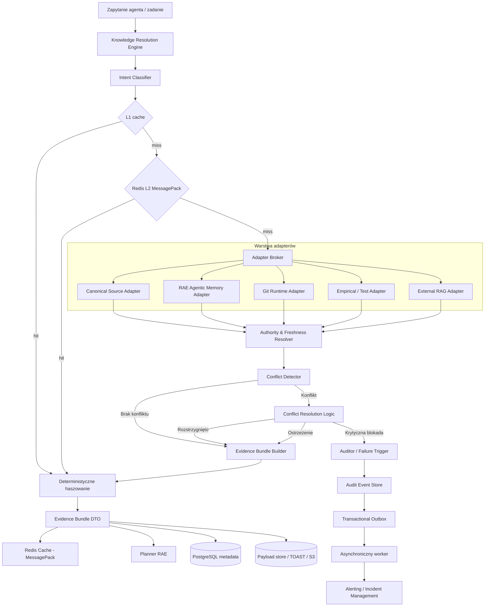
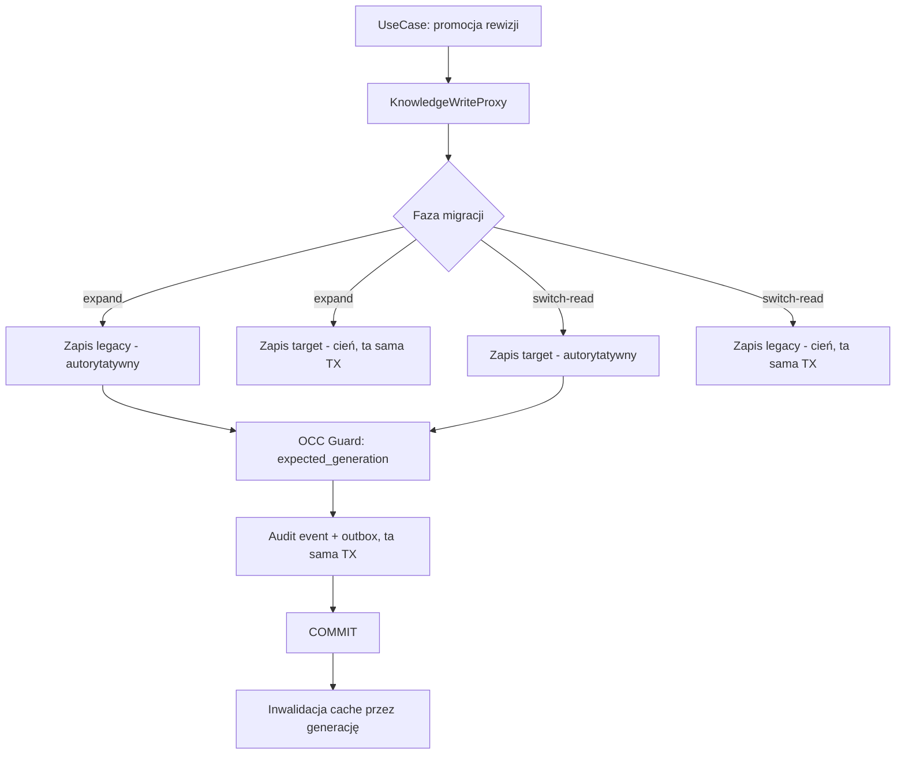

# RAE Knowledge Governance Layer — Szczegółowy Plan Wdrożenia

## 1. Cel i zakres

Warstwa **Knowledge Governance** zapewnia kontrolowany, wydajny i audytowalny dostęp do wiedzy wykorzystywanej przez silnik **RAE (Reflective Agentic Memory Engine)**. Jej zadaniem jest:

- rejestrowanie źródeł wiedzy i ich autorytetu;
- ujednolicenie pobierania danych przez adaptery;
- rozróżnienie wiedzy kanonicznej, zatwierdzonej, obserwowanej i wywnioskowanej;
- wykrywanie konfliktów semantycznych, wersji i dryfu runtime;
- budowanie audytowalnych pakietów dowodowych;
- blokowanie zadań w przypadku krytycznych naruszeń;
- kontrolowane promowanie propozycji zmian do źródeł kanonicznych;
- zapewnienie zgodności z wymaganiami audytowymi ISO 27001 i ISO 42001;
- zapewnienie bezpiecznego cache’owania i deterministycznego haszowania wyników;
- ograniczenie kosztu odczytów PostgreSQL i Qdrant;
- bezpieczna obsługa dużych payloadów bez przeciążania Redis, brokera zadań i pamięci procesu;
- zapewnienie odporności na stampede cache, lawinowe retry i częściową niedostępność źródeł;
- kontrola liczby połączeń do PostgreSQL przez PgBouncer;
- asynchroniczne wykonywanie operacji ciężkich i niekrytycznych dla odpowiedzi runtime.

Plan zakłada:

- Python 3.11 lub nowszy;
- Pydantic v2;
- SQLAlchemy 2.x;
- Alembic;
- PostgreSQL 14+;
- Redis 7+;
- MessagePack jako format cache i komunikacji wewnętrznej;
- opcjonalnie Zstandard do kompresji większych wartości cache;
- PgBouncer;
- Celery lub równoważny system zadań;
- Git jako jedno ze źródeł kanonicznych;
- Qdrant i PostgreSQL jako istniejącą warstwę pamięci RAE;
- magazyn obiektowy zgodny z S3 jako opcjonalne miejsce dla bardzo dużych artefaktów.

> **Uwaga dotycząca Python 3.11:** `collections.abc.Buffer` z PEP 688 jest dostępny od Python 3.12. Przy zachowaniu kompatybilności z Python 3.11 domena używa `bytes`, `bytearray`, `memoryview` oraz własnego neutralnego aliasu `BinaryPayload`. Po przejściu całej platformy na Python 3.12 można rozszerzyć kontrakt o `collections.abc.Buffer`.

## 1.1. Nadrzędne zasady architektury czystej

Poniższe zasady mają charakter wiążący dla całego wdrożenia i są audytowane na każdym kamieniu milowym.

1. **Domena i porty są agnostyczne technologicznie.**  
   Warstwa `rae-core` nie może importować bibliotek infrastrukturalnych: `git`, `yaml`, `sqlalchemy`, `redis`, `msgpack`, `zstandard`, `httpx`, `psycopg`, `asyncpg`, `qdrant_client`, `celery`, `boto3`. Zależności technologiczne żyją wyłącznie w `rae_adapters`, `rae_infrastructure` i `apps/*`.

2. **Typy binarne w domenie są neutralne.**  
   Domena operuje na `bytes`, `bytearray`, `memoryview` lub aliasie `BinaryPayload`, a nie na `git.Blob`, obiektach ORM, odpowiedziach HTTP lub typach klienta Redis.

3. **Nominalne typowanie identyfikatorów.**  
   Identyfikatory nie są przekazywane jako gołe `str`. Do statyki używa się `NewType`, do runtime — `Annotated` z walidatorami. Funkcje domenowe przyjmują typy nominalne, nie prymitywy.

4. **Konteksty operacji są generyczne i jawne.**  
   `RetrievalContext`, `ResolutionContext` oraz `UnitOfWork` są jawnymi obiektami przekazywanymi w sygnaturach, nie ukrytym stanem globalnym.

5. **Izolacja transakcyjna Staging Area.**  
   Zapisy do rejestru kanonicznego odbywają się wyłącznie w ramach jawnej granicy transakcyjnej. Odczyt runtime nigdy nie widzi stanu pośredniego.

6. **Cache nie jest źródłem prawdy.**  
   Redis może przyspieszać odczyt, ale utrata całego cache nie może powodować utraty wiedzy, audytu ani niespójności rejestru.

7. **Duże payloady nie są przesyłane przez kolejki.**  
   Komunikaty Celery zawierają identyfikatory, checksumy i referencje do danych, nie pełną treść artefaktów ani pełne `EvidenceBundle`.

8. **Cache i brokery nie używają Pickle.**  
   Formatami dopuszczonymi są MessagePack i JSON. Pickle jest zabroniony ze względu na ryzyko wykonania kodu.

9. **Operacje sieciowe i bazodanowe mają jawne budżety.**  
   Każde wywołanie ma timeout, limit współbieżności, limit rozmiaru odpowiedzi oraz politykę retry.

10. **Połączenie bazodanowe nie może być utrzymywane podczas wolnego I/O.**  
    Transakcja PostgreSQL rozpoczyna się możliwie późno i kończy możliwie wcześnie. Wywołania Git, HTTP, Qdrant i modeli nie są wykonywane wewnątrz otwartej transakcji SQL.

11. **Wydajność jest kryterium odbioru.**  
    Każda faza ma testy obciążeniowe, metryki p50/p95/p99, budżet pamięci oraz limit rozmiaru payloadu.

---

# 2. Przegląd architektury i przepływu danych



## 2.1. Zasady architektoniczne

1. **Źródło nie jest utożsamiane z dowodem.**  
   Rejestr opisuje źródło lub artefakt, natomiast `EvidenceItem` opisuje konkretny wynik pobrania.

2. **Autorytet jest nadawany przez rejestr, a nie przez adapter.**  
   Końcowy `authority_level` musi zostać zweryfikowany względem konfiguracji.

3. **Brak dowodu nie oznacza dowodu braku.**

4. **Wiedza kanoniczna nie jest modyfikowana przez agenta.**

5. **Tryb `shadow` nie może zmieniać decyzji runtime.**

6. **Tryb `enforce` musi mieć jawnie zdefiniowaną politykę fallbacku.**

7. **Wszystkie operacje audytowe muszą być identyfikowalne.**

8. **Domena nie zna technologii.**

9. **Dane binarne są neutralne.**

10. **Cache jest wielowarstwowy.**
    - L1: mały cache procesu, krótki TTL;
    - L2: Redis z MessagePack;
    - trwały snapshot: PostgreSQL lub magazyn obiektowy.

11. **Klucz cache zawiera pełny kontekst bezpieczeństwa.**  
    Co najmniej: `tenant_id`, wersję polityki, wersję schematu cache, fingerprint zapytania, zakres, identyfikatory adapterów i wersję konfiguracji źródeł.

12. **Inwalidacja jest wersjonowana.**  
    Preferowane są klucze generacyjne i wersje źródeł zamiast masowego `SCAN` i `DEL`.

13. **Duże wartości cache są dzielone.**  
    Redis przechowuje małe DTO lub manifest wskazujący trwały payload. Wartości przekraczające ustalony próg nie są bezwarunkowo zapisywane jako pojedynczy klucz.

14. **Asynchroniczność nie osłabia audytu.**  
    Krytyczny wpis audytowy i outbox powstają w tej samej transakcji co zmiana domenowa. Dostarczenie alertu może być asynchroniczne.

---

# Faza 0: Inwentaryzacja i przygotowanie

## Cel fazy

Identyfikacja punktów odczytu i zapisu, ścieżek autoryzacji, schematów bazy, rozmiarów payloadów, liczby połączeń i profilu obciążenia.

## 0.1. Inwentaryzacja punktów dostępu do pamięci

Należy przeanalizować co najmniej:

- `packages/rae-agentic-memory/apps/memory_api/services/rae_service.py`;
- `packages/rae-agentic-memory/apps/memory_api/main.py`;
- `packages/rae-agentic-memory/rae-core/rae_core/search/strategies.py`;
- miejsca bezpośrednich zapytań do PostgreSQL;
- miejsca bezpośrednich zapytań do Qdrant;
- miejsca zapisu treści pamięci;
- endpointy mogące zwracać dane z różnych tenantów;
- logowanie danych wrażliwych;
- migracje Alembic;
- aktualny model SQLAlchemy i nazewnictwo indeksów;
- liczbę instancji API i workerów;
- aktualny `pool_size`, `max_overflow`, timeout puli i maksymalną liczbę połączeń;
- sposób użycia Redis: cache, broker, backend wyników, blokady;
- średni, p95 i maksymalny rozmiar treści, `metadata`, bundla oraz komunikatu kolejki;
- współczynnik kompresji dla typowych payloadów;
- liczbę wywołań adapterów na jedno zapytanie;
- liczbę zapytań SQL na jedno rozstrzygnięcie;
- zapytania wykonujące `SELECT *` na tabelach z kolumnami TOAST;
- długość transakcji i odsetek `idle in transaction`;
- obecność N+1 w SQLAlchemy;
- koszt serializacji Pydantic, JSON i MessagePack.

## 0.1a. Inwentaryzacja naruszeń granic architektonicznych

- Wyszukaj w `rae-core` importy infrastrukturalne.
- Wyszukaj typy SDK w publicznych sygnaturach.
- Zweryfikuj gołe `str` używane jako identyfikatory.
- Skonfiguruj `import-linter`.
- Dodaj test CI sprawdzający brak `pickle`, `yaml`, `redis`, `sqlalchemy` i `celery` w domenie.

## 0.1b. Bazowy profil wydajności

Przed wdrożeniem należy wykonać test bazowy dla co najmniej trzech profili:

| Profil | RPS | Współbieżność | Rozmiar odpowiedzi | Cel |
|---|---:|---:|---:|---|
| mały | 20 | 20 | do 64 KiB | ścieżka typowa |
| średni | 100 | 100 | do 512 KiB | ruch szczytowy |
| duży | 20 | 50 | 1–10 MiB | duże artefakty i bund­le |

Należy zmierzyć:

- latency p50, p95, p99;
- czas pobrania połączenia z puli;
- liczbę aktywnych połączeń PostgreSQL;
- hit rate L1 i L2;
- liczbę bajtów odczytywanych z Redis;
- czas serializacji i deserializacji;
- obciążenie CPU;
- pamięć RSS procesu;
- liczbę timeoutów adapterów;
- liczbę retry;
- wielkość i wiek kolejki;
- `pg_stat_statements`;
- `pg_stat_database`;
- `pg_stat_user_tables`;
- `pg_stat_activity`;
- `redis INFO memory`, `commandstats`, `latencystats`.

## 0.2. Macierz źródeł

| Źródło | Właściciel | Typ | Zakres | Autorytet | Odświeżanie | Fallback | Dane wrażliwe |
|---|---|---|---|---|---|---|---|
| PostgreSQL memories | RAE Platform | database | tenant/application | observed | near-real-time | brak | potencjalnie tak |
| OpenAPI | API Platform | openapi | repozytorium/API | canonical | przy merge | ostatni zatwierdzony commit | nie |
| Git runtime | DevOps | git | repozytorium | observed | webhook/poll | ostatni znany commit | potencjalnie tak |
| SonarQube | Quality | api | projekt | approved | cykliczna | ostatni snapshot | nie |
| Test reports | QA | test | build/release | approved | przy pipeline | ostatni build | nie |

## 0.3. Plik inwentarza źródeł

Plik:

`/home/grzegorz/cloud/RAE-Suite/config/knowledge-source-inventory.yaml`

```yaml
version: "1.2"

defaults:
  timeout_seconds: 5
  max_results: 20
  max_response_bytes: 2097152
  require_checksum: true
  allow_network: false
  cache:
    enabled: true
    ttl_seconds: 60
    stale_ttl_seconds: 300
    max_value_bytes: 1048576
    compression_threshold_bytes: 32768

sources:
  - id: database-postgres-memories
    type: database
    connection_env: RAE_DATABASE_URL
    tables:
      - memories
      - memory_embeddings
    authority_level: observed
    owner: rae-platform
    enabled: true
    tenant_scoped: true
    refresh_interval_seconds: 30
    data_classification: confidential

  - id: openapi-specification
    type: openapi
    path_env: OPENAPI_SPEC_PATH
    authority_level: canonical
    owner: api-platform
    enabled: true
    tenant_scoped: false
    refresh_interval_seconds: 300
    data_classification: internal

  - id: git-repository-dreamsoft
    type: git
    path_env: DREAMSOFT_REPOSITORY_PATH
    authority_level: observed
    owner: devops
    enabled: true
    tenant_scoped: false
    refresh_interval_seconds: 60
    data_classification: confidential

  - id: sonarqube-metrics
    type: api
    endpoint_env: SONARQUBE_API_URL
    authority_level: approved
    owner: quality
    enabled: true
    tenant_scoped: false
    refresh_interval_seconds: 300
    data_classification: internal

  - id: test-reports
    type: test
    endpoint_env: TEST_REPORTS_URI
    authority_level: approved
    owner: quality
    enabled: true
    tenant_scoped: false
    refresh_interval_seconds: 60
    data_classification: internal
```

### Zasady pliku konfiguracyjnego

- Sekrety nie są przechowywane w YAML.
- `authority_level` jest walidowany przy starcie.
- Każde źródło ma jednoznaczne `id`.
- Źródła sieciowe mają timeout, limit wyników, limit bajtów i kontrolę SSRF.
- Loader YAML należy do infrastruktury.
- Zmiana konfiguracji źródła zwiększa `inventory_generation`, wykorzystywaną w kluczach cache.
- Wartość `max_response_bytes` jest egzekwowana podczas streamingu, nie dopiero po pobraniu całej odpowiedzi.

## 0.4. Neutralny model konfiguracji źródeł

Plik:

`rae-core/rae_core/config/source_inventory.py`

```python
from __future__ import annotations

from pydantic import BaseModel, ConfigDict, Field

from rae_core.models.knowledge import AuthorityLevel, KnowledgeSourceType
from rae_core.types.branded import DataClassificationValue


class CachePolicy(BaseModel):
    model_config = ConfigDict(extra="forbid")

    enabled: bool = True
    ttl_seconds: int = Field(ge=1, le=86_400)
    stale_ttl_seconds: int = Field(ge=0, le=604_800)
    max_value_bytes: int = Field(ge=1024, le=16_777_216)
    compression_threshold_bytes: int = Field(ge=1024, le=16_777_216)


class SourceDefaults(BaseModel):
    model_config = ConfigDict(extra="forbid")

    timeout_seconds: float = Field(gt=0, le=60)
    max_results: int = Field(ge=1, le=1000)
    max_response_bytes: int = Field(ge=1024, le=104_857_600)
    require_checksum: bool = True
    allow_network: bool = False
    cache: CachePolicy


class SourceDefinition(BaseModel):
    model_config = ConfigDict(extra="forbid")

    id: str = Field(min_length=1, max_length=255)
    type: KnowledgeSourceType
    authority_level: AuthorityLevel
    owner: str = Field(min_length=1, max_length=100)
    enabled: bool = True
    tenant_scoped: bool = False
    refresh_interval_seconds: int = Field(ge=0, le=86_400)
    data_classification: DataClassificationValue
    env_bindings: dict[str, str] = Field(default_factory=dict)


class SourceInventory(BaseModel):
    model_config = ConfigDict(extra="forbid")

    version: str = Field(min_length=1, max_length=32)
    defaults: SourceDefaults
    sources: list[SourceDefinition] = Field(min_length=1)

    def enabled_sources(self) -> list[SourceDefinition]:
        return [source for source in self.sources if source.enabled]
```

Loader:

`rae_adapters/config/yaml_inventory_loader.py`

```python
from __future__ import annotations

from pathlib import Path

import yaml

from rae_core.config.source_inventory import SourceInventory


def load_source_inventory(path: str | Path) -> SourceInventory:
    resolved = Path(path).resolve(strict=True)
    if not resolved.is_file():
        raise FileNotFoundError(resolved)

    with resolved.open("r", encoding="utf-8") as handle:
        raw = yaml.safe_load(handle)

    if not isinstance(raw, dict):
        raise ValueError("Inwentarz źródeł musi być mapą")

    inventory = SourceInventory.model_validate(raw)
    source_ids = [source.id for source in inventory.sources]
    if len(source_ids) != len(set(source_ids)):
        raise ValueError("Identyfikatory źródeł muszą być unikalne")
    return inventory
```

## Kamień milowy 0

- Zmapowane wszystkie odczyty i zapisy.
- Zidentyfikowane ścieżki tenant isolation.
- Utworzony inwentarz źródeł.
- Zdefiniowana klasyfikacja danych i retencja.
- Zmierzone rozmiary payloadów p50/p95/p99/max.
- Zmierzona liczba połączeń na instancję API i workera.
- Zebrany profil `pg_stat_statements`.
- Skonfigurowany linter granic.
- Loader YAML odseparowany od domeny.
- Ustalony budżet latency, pamięci, liczby połączeń i rozmiaru cache.

---

# Faza 1: Rejestr kanoniczny i baza danych

## Cel fazy

Wdrożenie rejestru artefaktów, historii wersji, relacji superseding, audytu, outboxu i wydajnego przechowywania dużych payloadów.

## 1.1. Decyzje dotyczące modelu danych

Stosowane są:

- `rae_knowledge_registry` — tożsamość logiczna;
- `rae_knowledge_revisions` — niezmienne wersje i lekkie metadane;
- `rae_knowledge_revision_payloads` — pełna treść przechowywana poza gorącą tabelą;
- `rae_knowledge_supersedes` — relacje wersji;
- `rae_governance_audit_events` — audyt;
- `rae_governance_outbox` — niezawodne kolejkowanie asynchroniczne.

### Rozdzielenie danych gorących i zimnych

Zapytania listujące rewizje nie mogą automatycznie pobierać pełnej treści. Kolumny używane w filtrowaniu i sortowaniu pozostają w tabeli rewizji. Duży payload znajduje się w osobnej tabeli lub magazynie obiektowym.

Progi:

- do 256 KiB: dopuszczalne przechowywanie inline w `BYTEA`;
- 256 KiB–8 MiB: osobna tabela payloadów z TOAST;
- powyżej 8 MiB: preferowany magazyn obiektowy, a w PostgreSQL tylko URI, checksum i rozmiar;
- wartości progowe podlegają walidacji testami obciążeniowymi.

## 1.2. Migracja Alembic

Plik:

`packages/rae-agentic-memory/migrations/versions/xxxx_create_knowledge_governance.py`

```python
"""create knowledge governance tables

Revision ID: xxxx_create_knowledge_governance
Revises: previous_revision_id
Create Date: 2026-07-20
"""

from alembic import op
import sqlalchemy as sa
from sqlalchemy.dialects import postgresql


revision = "xxxx_create_knowledge_governance"
down_revision = "previous_revision_id"
branch_labels = None
depends_on = None


def upgrade() -> None:
    op.execute("CREATE EXTENSION IF NOT EXISTS pgcrypto")

    knowledge_class_enum = postgresql.ENUM(
        "normative", "architectural", "operational",
        "empirical", "episodic", "external",
        name="knowledge_class_enum",
        create_type=False,
    )
    authority_level_enum = postgresql.ENUM(
        "canonical", "approved", "observed", "inferred", "untrusted",
        name="authority_level_enum",
        create_type=False,
    )
    source_type_enum = postgresql.ENUM(
        "git", "openapi", "json-schema", "database", "api", "file", "test",
        name="knowledge_source_type_enum",
        create_type=False,
    )
    revision_status_enum = postgresql.ENUM(
        "active", "superseded", "revoked", "expired",
        name="knowledge_revision_status_enum",
        create_type=False,
    )
    payload_storage_enum = postgresql.ENUM(
        "postgres", "object_store",
        name="knowledge_payload_storage_enum",
        create_type=False,
    )
    outbox_status_enum = postgresql.ENUM(
        "pending", "processing", "published", "failed", "dead",
        name="governance_outbox_status_enum",
        create_type=False,
    )

    for enum in (
        knowledge_class_enum,
        authority_level_enum,
        source_type_enum,
        revision_status_enum,
        payload_storage_enum,
        outbox_status_enum,
    ):
        enum.create(op.get_bind(), checkfirst=True)

    op.create_table(
        "rae_knowledge_registry",
        sa.Column(
            "id", postgresql.UUID(as_uuid=True),
            primary_key=True,
            server_default=sa.text("gen_random_uuid()"),
        ),
        sa.Column("tenant_id", sa.String(128), nullable=False),
        sa.Column("knowledge_id", sa.String(255), nullable=False),
        sa.Column("knowledge_class", knowledge_class_enum, nullable=False),
        sa.Column("owner", sa.String(100), nullable=False),
        sa.Column(
            "scope", postgresql.ARRAY(sa.String(255)),
            nullable=False,
            server_default=sa.text("'{}'::varchar[]"),
        ),
        sa.Column(
            "generation", sa.BigInteger(),
            nullable=False,
            server_default=sa.text("1"),
        ),
        sa.Column(
            "created_at", sa.DateTime(timezone=True),
            nullable=False,
            server_default=sa.text("CURRENT_TIMESTAMP"),
        ),
        sa.Column(
            "updated_at", sa.DateTime(timezone=True),
            nullable=False,
            server_default=sa.text("CURRENT_TIMESTAMP"),
        ),
        sa.UniqueConstraint(
            "tenant_id", "knowledge_id",
            name="uq_rae_knowledge_registry_tenant_knowledge",
        ),
        sa.CheckConstraint(
            "length(trim(knowledge_id)) > 0",
            name="ck_rae_knowledge_registry_knowledge_id_not_empty",
        ),
        sa.CheckConstraint(
            "length(trim(owner)) > 0",
            name="ck_rae_knowledge_registry_owner_not_empty",
        ),
        sa.CheckConstraint(
            "generation > 0",
            name="ck_rae_knowledge_registry_generation_positive",
        ),
    )

    op.create_index(
        "ix_rae_knowledge_registry_class",
        "rae_knowledge_registry",
        ["tenant_id", "knowledge_class"],
    )

    op.create_table(
        "rae_knowledge_revisions",
        sa.Column(
            "id", postgresql.UUID(as_uuid=True),
            primary_key=True,
            server_default=sa.text("gen_random_uuid()"),
        ),
        sa.Column(
            "registry_id", postgresql.UUID(as_uuid=True),
            sa.ForeignKey(
                "rae_knowledge_registry.id",
                ondelete="CASCADE",
                name="fk_rae_revision_registry",
            ),
            nullable=False,
        ),
        sa.Column("revision_no", sa.Integer(), nullable=False),
        sa.Column("authority_level", authority_level_enum, nullable=False),
        sa.Column("source_type", source_type_enum, nullable=False),
        sa.Column("source_ref", sa.String(2048), nullable=False),
        sa.Column("version", sa.String(255), nullable=True),
        sa.Column("valid_from", sa.DateTime(timezone=True), nullable=True),
        sa.Column("valid_until", sa.DateTime(timezone=True), nullable=True),
        sa.Column("checksum", sa.String(64), nullable=False),
        sa.Column("content_summary", sa.Text(), nullable=False),
        sa.Column(
            "content_size_bytes", sa.BigInteger(),
            nullable=False,
            server_default=sa.text("0"),
        ),
        sa.Column(
            "metadata", postgresql.JSONB(),
            nullable=False,
            server_default=sa.text("'{}'::jsonb"),
        ),
        sa.Column(
            "status", revision_status_enum,
            nullable=False,
            server_default=sa.text("'active'"),
        ),
        sa.Column("created_by", sa.String(255), nullable=False),
        sa.Column(
            "created_at", sa.DateTime(timezone=True),
            nullable=False,
            server_default=sa.text("CURRENT_TIMESTAMP"),
        ),
        sa.UniqueConstraint(
            "registry_id", "revision_no",
            name="uq_rae_revision_registry_revision_no",
        ),
        sa.UniqueConstraint(
            "registry_id", "checksum",
            name="uq_rae_revision_registry_checksum",
        ),
        sa.CheckConstraint(
            "checksum ~ '^[0-9a-f]{64}$'",
            name="ck_rae_revision_checksum_sha256",
        ),
        sa.CheckConstraint(
            "valid_until IS NULL OR valid_from IS NULL OR valid_until > valid_from",
            name="ck_rae_revision_valid_range",
        ),
        sa.CheckConstraint(
            "content_size_bytes >= 0",
            name="ck_rae_revision_content_size_non_negative",
        ),
    )

    op.create_index(
        "ix_rae_revision_registry_status",
        "rae_knowledge_revisions",
        ["registry_id", "status"],
    )
    op.create_index(
        "ix_rae_revision_validity",
        "rae_knowledge_revisions",
        ["valid_from", "valid_until"],
    )
    op.create_index(
        "uq_rae_revision_single_active",
        "rae_knowledge_revisions",
        ["registry_id"],
        unique=True,
        postgresql_where=sa.text("status = 'active'"),
    )

    op.create_table(
        "rae_knowledge_revision_payloads",
        sa.Column(
            "revision_id", postgresql.UUID(as_uuid=True),
            sa.ForeignKey(
                "rae_knowledge_revisions.id",
                ondelete="CASCADE",
                name="fk_rae_payload_revision",
            ),
            primary_key=True,
        ),
        sa.Column("storage_kind", payload_storage_enum, nullable=False),
        sa.Column("content_type", sa.String(255), nullable=False),
        sa.Column("content_encoding", sa.String(64), nullable=False),
        sa.Column("payload", postgresql.BYTEA(), nullable=True),
        sa.Column("object_uri", sa.String(2048), nullable=True),
        sa.Column("payload_checksum", sa.String(64), nullable=False),
        sa.Column("payload_size_bytes", sa.BigInteger(), nullable=False),
        sa.Column(
            "created_at", sa.DateTime(timezone=True),
            nullable=False,
            server_default=sa.text("CURRENT_TIMESTAMP"),
        ),
        sa.CheckConstraint(
            "payload_checksum ~ '^[0-9a-f]{64}$'",
            name="ck_rae_payload_checksum_sha256",
        ),
        sa.CheckConstraint(
            "payload_size_bytes >= 0",
            name="ck_rae_payload_size_non_negative",
        ),
        sa.CheckConstraint(
            """
            (storage_kind = 'postgres' AND payload IS NOT NULL AND object_uri IS NULL)
            OR
            (storage_kind = 'object_store' AND payload IS NULL AND object_uri IS NOT NULL)
            """,
            name="ck_rae_payload_storage_consistency",
        ),
    )

    op.create_table(
        "rae_knowledge_supersedes",
        sa.Column(
            "superseding_revision_id", postgresql.UUID(as_uuid=True),
            sa.ForeignKey(
                "rae_knowledge_revisions.id",
                ondelete="CASCADE",
                name="fk_rae_supersedes_newer_revision",
            ),
            nullable=False,
        ),
        sa.Column(
            "superseded_revision_id", postgresql.UUID(as_uuid=True),
            sa.ForeignKey(
                "rae_knowledge_revisions.id",
                ondelete="RESTRICT",
                name="fk_rae_supersedes_older_revision",
            ),
            nullable=False,
        ),
        sa.Column(
            "created_at", sa.DateTime(timezone=True),
            nullable=False,
            server_default=sa.text("CURRENT_TIMESTAMP"),
        ),
        sa.PrimaryKeyConstraint(
            "superseding_revision_id",
            "superseded_revision_id",
            name="pk_rae_knowledge_supersedes",
        ),
        sa.CheckConstraint(
            "superseding_revision_id <> superseded_revision_id",
            name="ck_rae_knowledge_supersedes_not_self",
        ),
    )

    op.create_table(
        "rae_governance_audit_events",
        sa.Column(
            "id", postgresql.UUID(as_uuid=True),
            primary_key=True,
            server_default=sa.text("gen_random_uuid()"),
        ),
        sa.Column("tenant_id", sa.String(128), nullable=False),
        sa.Column("stream_id", sa.String(255), nullable=False),
        sa.Column("sequence_no", sa.BigInteger(), nullable=False),
        sa.Column("event_type", sa.String(100), nullable=False),
        sa.Column("request_id", sa.String(255), nullable=True),
        sa.Column("actor_id", sa.String(255), nullable=True),
        sa.Column("subject_ref", sa.String(2048), nullable=True),
        sa.Column(
            "payload", postgresql.JSONB(),
            nullable=False,
            server_default=sa.text("'{}'::jsonb"),
        ),
        sa.Column("event_hash", sa.String(64), nullable=False),
        sa.Column("previous_event_hash", sa.String(64), nullable=True),
        sa.Column(
            "created_at", sa.DateTime(timezone=True),
            nullable=False,
            server_default=sa.text("CURRENT_TIMESTAMP"),
        ),
        sa.UniqueConstraint(
            "tenant_id", "stream_id", "sequence_no",
            name="uq_rae_audit_stream_sequence",
        ),
        sa.CheckConstraint(
            "event_hash ~ '^[0-9a-f]{64}$'",
            name="ck_rae_audit_event_hash_sha256",
        ),
    )

    op.create_index(
        "ix_rae_audit_tenant_created",
        "rae_governance_audit_events",
        ["tenant_id", "created_at"],
    )
    op.create_index(
        "ix_rae_audit_stream_sequence",
        "rae_governance_audit_events",
        ["tenant_id", "stream_id", "sequence_no"],
    )

    op.create_table(
        "rae_governance_outbox",
        sa.Column(
            "id", postgresql.UUID(as_uuid=True),
            primary_key=True,
            server_default=sa.text("gen_random_uuid()"),
        ),
        sa.Column("tenant_id", sa.String(128), nullable=False),
        sa.Column("event_type", sa.String(100), nullable=False),
        sa.Column("aggregate_ref", sa.String(2048), nullable=False),
        sa.Column(
            "payload", postgresql.JSONB(),
            nullable=False,
            server_default=sa.text("'{}'::jsonb"),
        ),
        sa.Column(
            "status", outbox_status_enum,
            nullable=False,
            server_default=sa.text("'pending'"),
        ),
        sa.Column("attempts", sa.Integer(), nullable=False, server_default="0"),
        sa.Column("available_at", sa.DateTime(timezone=True), nullable=False),
        sa.Column("locked_at", sa.DateTime(timezone=True), nullable=True),
        sa.Column("locked_by", sa.String(255), nullable=True),
        sa.Column("published_at", sa.DateTime(timezone=True), nullable=True),
        sa.Column("last_error", sa.Text(), nullable=True),
        sa.Column(
            "created_at", sa.DateTime(timezone=True),
            nullable=False,
            server_default=sa.text("CURRENT_TIMESTAMP"),
        ),
        sa.CheckConstraint(
            "attempts >= 0",
            name="ck_rae_outbox_attempts_non_negative",
        ),
    )

    op.create_index(
        "ix_rae_outbox_dispatch",
        "rae_governance_outbox",
        ["status", "available_at", "created_at"],
        postgresql_where=sa.text("status IN ('pending', 'failed')"),
    )

    op.execute(
        """
        CREATE OR REPLACE FUNCTION rae_set_updated_at()
        RETURNS TRIGGER AS $$
        BEGIN
            NEW.updated_at = CURRENT_TIMESTAMP;
            RETURN NEW;
        END;
        $$ LANGUAGE plpgsql
        """
    )

    op.execute(
        """
        CREATE TRIGGER trg_rae_knowledge_registry_updated_at
        BEFORE UPDATE ON rae_knowledge_registry
        FOR EACH ROW EXECUTE FUNCTION rae_set_updated_at()
        """
    )


def downgrade() -> None:
    op.execute(
        "DROP TRIGGER IF EXISTS trg_rae_knowledge_registry_updated_at "
        "ON rae_knowledge_registry"
    )
    op.execute("DROP FUNCTION IF EXISTS rae_set_updated_at()")
    op.drop_table("rae_governance_outbox")
    op.drop_table("rae_governance_audit_events")
    op.drop_table("rae_knowledge_supersedes")
    op.drop_table("rae_knowledge_revision_payloads")
    op.drop_index(
        "uq_rae_revision_single_active",
        table_name="rae_knowledge_revisions",
    )
    op.drop_table("rae_knowledge_revisions")
    op.drop_table("rae_knowledge_registry")

    op.execute("DROP TYPE IF EXISTS governance_outbox_status_enum")
    op.execute("DROP TYPE IF EXISTS knowledge_payload_storage_enum")
    op.execute("DROP TYPE IF EXISTS knowledge_revision_status_enum")
    op.execute("DROP TYPE IF EXISTS knowledge_source_type_enum")
    op.execute("DROP TYPE IF EXISTS authority_level_enum")
    op.execute("DROP TYPE IF EXISTS knowledge_class_enum")
```

## 1.3. TOAST i duże payloady

1. `content_summary` pozostaje krótkie. Limit aplikacyjny powinien wynosić 4–16 KiB, mimo że typ SQL to `TEXT`.
2. Pełna treść jest pobierana oddzielnym zapytaniem tylko wtedy, gdy jest potrzebna.
3. Repozytorium nie używa `SELECT *`.
4. ORM powinien oznaczyć relację payloadu jako `lazy="raise"` albo kolumnę jako `deferred`.
5. Nie należy wykonywać masowych aktualizacji dużych wartości `BYTEA`; każda zmiana tworzy nową rewizję.
6. PostgreSQL TOAST działa automatycznie, ale nie eliminuje kosztu dekompresji i transferu.
7. Jeśli build PostgreSQL obsługuje LZ4, po pomiarach można wykonać:

```sql
ALTER TABLE rae_knowledge_revision_payloads
ALTER COLUMN payload SET COMPRESSION lz4;
```

8. Zmiana kompresji dotyczy nowych lub ponownie zapisanych wartości. Nie wolno zakładać automatycznej rekompresji danych istniejących.
9. Nie należy kompresować w aplikacji payloadu, który PostgreSQL i tak efektywnie skompresuje, bez testu CPU/IO. Kompresja aplikacyjna jest uzasadniona przy przesyłaniu przez sieć lub zapisach do magazynu obiektowego.
10. Autovacuum dla tabeli payloadów i jej tabeli TOAST musi być monitorowany oddzielnie.
11. Dla dużych artefaktów preferowany jest streaming z limitem bajtów i checksumą inkrementalną.
12. Maksymalny rozmiar pojedynczego payloadu jest egzekwowany przed zapisem.

## 1.4. Indeksy i wdrożenie online

- Małe, nowe tabele mogą otrzymywać indeksy w migracji transakcyjnej.
- Indeksy na istniejących dużych tabelach tworzy się `CREATE INDEX CONCURRENTLY`.
- Alembic wymaga wtedy `autocommit_block()`.
- `CREATE INDEX CONCURRENTLY` nie może działać wewnątrz zwykłej transakcji migracji.
- Przed dodaniem ograniczenia unikalnego należy wykonać kontrolę duplikatów.
- Po migracji należy uruchomić `ANALYZE`.
- Każda migracja ma oszacowany czas blokady i plan rollbacku.

## 1.5. Branded types i neutralne dane binarne

Plik:

`rae-core/rae_core/types/branded.py`

```python
from __future__ import annotations

import re
from typing import Annotated, NewType, TypeAlias

from pydantic import AfterValidator, BeforeValidator, StringConstraints


BinaryPayload: TypeAlias = bytes | bytearray | memoryview


def _normalize_non_empty(value: object) -> str:
    if not isinstance(value, str):
        raise TypeError("Wartość musi być tekstem")
    normalized = value.strip()
    if not normalized:
        raise ValueError("Wartość nie może być pusta")
    return normalized


def _validate_sha256(value: object) -> str:
    normalized = _normalize_non_empty(value).lower()
    if not re.fullmatch(r"[0-9a-f]{64}", normalized):
        raise ValueError("Checksum musi być 64-znakowym hashem SHA-256")
    return normalized


_ALLOWED_DATA_CLASSIFICATIONS = frozenset(
    {"public", "internal", "confidential", "restricted"}
)


def _validate_data_classification(value: object) -> str:
    normalized = _normalize_non_empty(value).lower()
    if normalized not in _ALLOWED_DATA_CLASSIFICATIONS:
        raise ValueError("Niepoprawna klasyfikacja danych")
    return normalized


KnowledgeId = NewType("KnowledgeId", str)
TenantId = NewType("TenantId", str)
AgentId = NewType("AgentId", str)
SessionId = NewType("SessionId", str)
RequestId = NewType("RequestId", str)
ProposalId = NewType("ProposalId", str)
ActorId = NewType("ActorId", str)
ChecksumSha256 = NewType("ChecksumSha256", str)
PolicyVersion = NewType("PolicyVersion", str)

KnowledgeIdValue = Annotated[
    str,
    BeforeValidator(_normalize_non_empty),
    StringConstraints(min_length=1, max_length=255),
]
TenantIdValue = Annotated[
    str,
    BeforeValidator(_normalize_non_empty),
    StringConstraints(min_length=1, max_length=128),
]
RequestIdValue = Annotated[
    str,
    BeforeValidator(_normalize_non_empty),
    StringConstraints(min_length=1, max_length=255),
]
ActorIdValue = Annotated[
    str,
    BeforeValidator(_normalize_non_empty),
    StringConstraints(min_length=1, max_length=255),
]
ChecksumSha256Value = Annotated[
    str,
    BeforeValidator(_validate_sha256),
    StringConstraints(pattern=r"^[0-9a-f]{64}$"),
]
DataClassificationValue = Annotated[
    str,
    AfterValidator(_validate_data_classification),
]


def make_knowledge_id(value: str) -> KnowledgeId:
    return KnowledgeId(_normalize_non_empty(value))


def make_tenant_id(value: str) -> TenantId:
    return TenantId(_normalize_non_empty(value))


def make_request_id(value: str) -> RequestId:
    return RequestId(_normalize_non_empty(value))


def make_actor_id(value: str) -> ActorId:
    return ActorId(_normalize_non_empty(value))


def make_checksum_sha256(value: str) -> ChecksumSha256:
    return ChecksumSha256(_validate_sha256(value))
```

## 1.6. Model domenowy

Plik:

`rae-core/rae_core/models/knowledge.py`

```python
from __future__ import annotations

from datetime import datetime
from enum import StrEnum
from typing import Any
from uuid import UUID, uuid4

from pydantic import BaseModel, ConfigDict, Field, field_validator, model_validator

from rae_core.types.branded import (
    ChecksumSha256Value,
    KnowledgeIdValue,
    TenantIdValue,
)


class KnowledgeClass(StrEnum):
    NORMATIVE = "normative"
    ARCHITECTURAL = "architectural"
    OPERATIONAL = "operational"
    EMPIRICAL = "empirical"
    EPISODIC = "episodic"
    EXTERNAL = "external"


class AuthorityLevel(StrEnum):
    CANONICAL = "canonical"
    APPROVED = "approved"
    OBSERVED = "observed"
    INFERRED = "inferred"
    UNTRUSTED = "untrusted"


class KnowledgeSourceType(StrEnum):
    GIT = "git"
    OPENAPI = "openapi"
    JSON_SCHEMA = "json-schema"
    DATABASE = "database"
    API = "api"
    FILE = "file"
    TEST = "test"


class KnowledgeRecord(BaseModel):
    model_config = ConfigDict(
        extra="forbid",
        str_strip_whitespace=True,
        validate_assignment=True,
    )

    id: UUID = Field(default_factory=uuid4)
    tenant_id: TenantIdValue
    knowledge_id: KnowledgeIdValue
    knowledge_class: KnowledgeClass
    authority_level: AuthorityLevel
    source_type: KnowledgeSourceType
    source_ref: str = Field(min_length=1, max_length=2048)
    owner: str = Field(min_length=1, max_length=100)
    version: str | None = Field(default=None, max_length=255)
    valid_from: datetime | None = None
    valid_until: datetime | None = None
    supersedes: list[KnowledgeIdValue] = Field(default_factory=list)
    scope: list[str] = Field(default_factory=list, max_length=100)
    checksum: ChecksumSha256Value
    content_summary: str = Field(min_length=1, max_length=16_384)
    content_size_bytes: int = Field(ge=0)
    metadata: dict[str, Any] = Field(default_factory=dict)

    @field_validator("scope")
    @classmethod
    def validate_scope(cls, values: list[str]) -> list[str]:
        normalized = [value.strip() for value in values if value.strip()]
        if len(normalized) != len(set(normalized)):
            raise ValueError("scope nie może zawierać duplikatów")
        return normalized

    @model_validator(mode="after")
    def validate_dates(self) -> "KnowledgeRecord":
        if (
            self.valid_from is not None
            and self.valid_until is not None
            and self.valid_until <= self.valid_from
        ):
            raise ValueError("valid_until musi być późniejsze niż valid_from")
        return self
```

## 1.7. Unit of Work

Plik:

`rae-core/rae_core/persistence/unit_of_work.py`

```python
from __future__ import annotations

from abc import ABC, abstractmethod
from enum import StrEnum
from types import TracebackType
from typing import Protocol, runtime_checkable

from rae_core.models.knowledge import KnowledgeRecord
from rae_core.models.registry import KnowledgeRevisionDraft, KnowledgeRevisionRecord
from rae_core.types.branded import KnowledgeId, TenantId


class IsolationLevel(StrEnum):
    READ_COMMITTED = "read_committed"
    REPEATABLE_READ = "repeatable_read"
    SERIALIZABLE = "serializable"


@runtime_checkable
class KnowledgeRegistryRepository(Protocol):
    async def get_registry(
        self,
        *,
        tenant_id: TenantId,
        knowledge_id: KnowledgeId,
    ) -> KnowledgeRecord | None: ...

    async def append_revision(
        self,
        *,
        draft: KnowledgeRevisionDraft,
    ) -> KnowledgeRevisionRecord: ...

    async def mark_superseded(
        self,
        *,
        superseding_revision_id: str,
        superseded_revision_id: str,
    ) -> None: ...

    async def acquire_advisory_lock(
        self,
        *,
        tenant_id: TenantId,
        knowledge_id: KnowledgeId,
    ) -> None: ...


class UnitOfWork(ABC):
    registry: KnowledgeRegistryRepository
    isolation_level: IsolationLevel

    @abstractmethod
    async def __aenter__(self) -> "UnitOfWork":
        raise NotImplementedError

    @abstractmethod
    async def __aexit__(
        self,
        exc_type: type[BaseException] | None,
        exc: BaseException | None,
        tb: TracebackType | None,
    ) -> None:
        raise NotImplementedError

    @abstractmethod
    async def commit(self) -> None:
        raise NotImplementedError

    @abstractmethod
    async def rollback(self) -> None:
        raise NotImplementedError
```

### Zasady transakcyjne

1. Promocja używa `SERIALIZABLE` lub `REPEATABLE READ` z `pg_advisory_xact_lock`.
2. Używa się wyłącznie blokad transakcyjnych, nie sesyjnych. Jest to wymagane przy PgBouncer w `transaction` pooling.
3. Sekwencja:
   - rozpoczęcie krótkiej transakcji;
   - `pg_advisory_xact_lock`;
   - odczyt aktywnej rewizji;
   - oznaczenie poprzedniej jako `superseded`;
   - dodanie nowej rewizji;
   - zwiększenie `generation`;
   - wpis audytowy;
   - wpis outbox;
   - commit.
4. Payload należy przygotować i przesłać do object storage przed rozpoczęciem transakcji. Transakcja zapisuje tylko gotową referencję.
5. Retry błędu serializacji ma limit, exponential backoff i jitter.
6. Łańcuch audytowy jest serializowany per `(tenant_id, stream_id)`.
7. Odczyt runtime używa `READ COMMITTED`.
8. Żadna transakcja nie obejmuje wywołania HTTP, Git, Qdrant ani Redis.

## 1.8. PgBouncer i pule połączeń

### Topologia

- PgBouncer pracuje w `pool_mode = transaction`.
- Migracje Alembic, operacje administracyjne i diagnostyczne używają osobnego DSN bezpośrednio do PostgreSQL albo osobnego PgBouncera w `session`.
- API i workery używają DSN transakcyjnego.
- Tenant nie może być przełączany przez trwały stan sesji.

### Konfiguracja PgBouncer

Przykładowy punkt startowy:

```ini
[pgbouncer]
pool_mode = transaction
max_client_conn = 2000
default_pool_size = 40
min_pool_size = 10
reserve_pool_size = 10
reserve_pool_timeout = 2
server_idle_timeout = 60
server_lifetime = 3600
query_timeout = 30
query_wait_timeout = 5
client_idle_timeout = 300
idle_transaction_timeout = 15
server_reset_query = DISCARD ALL
ignore_startup_parameters = extra_float_digits
```

Wartości muszą zostać dobrane do:

```text
PostgreSQL max_connections
- połączenia administracyjne
- migracje
- monitoring
- rezerwa awaryjna
= budżet połączeń aplikacyjnych
```

### SQLAlchemy

- Przy PgBouncer nie tworzy się drugiej dużej puli po stronie aplikacji.
- Rekomendacja początkowa: `NullPool` dla połączenia przez PgBouncer.
- Alternatywnie mały `AsyncAdaptedQueuePool`, jeśli potwierdzą to testy.
- `pool_pre_ping` należy testować; zwiększa liczbę round-tripów.
- Ustawić `pool_timeout`.
- Ustawić `statement_timeout`, `lock_timeout` i `idle_in_transaction_session_timeout` per transakcja przez `SET LOCAL`.
- Dla `asyncpg` należy zweryfikować kompatybilność prepared statements z używaną wersją PgBouncer. W razie problemów wyłączyć cache prepared statements albo użyć konfiguracji wspierającej protokół przygotowanych zapytań.
- Nie używać sesyjnych advisory locks, tymczasowych tabel zależnych od sesji ani `LISTEN/NOTIFY` przez połączenie transakcyjne.

Przykład:

```python
from sqlalchemy.ext.asyncio import create_async_engine
from sqlalchemy.pool import NullPool

engine = create_async_engine(
    database_url,
    poolclass=NullPool,
    connect_args={
        "server_settings": {
            "application_name": "rae-governance-api",
        },
        "statement_cache_size": 0,
    },
)
```

Konkretny parametr wyłączenia cache zależy od sterownika i musi zostać potwierdzony testem integracyjnym.

## Kamień milowy 1

- Migracje przechodzą na czystej i istniejącej bazie.
- Duży payload nie jest pobierany w zapytaniach listujących.
- Test 10 MiB nie powoduje wielokrotnego kopiowania treści przez warstwy aplikacji.
- Dwie równoległe promocje nie tworzą dwóch aktywnych rewizji.
- Outbox powstaje atomowo ze zmianą.
- PgBouncer w trybie transakcyjnym przechodzi testy integracyjne.
- Brak sesyjnych advisory locks.
- P95 oczekiwania na połączenie pozostaje poniżej ustalonego budżetu.
- Brak `idle in transaction` powyżej 5 sekund.
- Plan backupu obejmuje payloady w PostgreSQL i object storage.

---

# Faza 2: Warstwa adapterów

## Cel fazy

Ujednolicenie dostępu do źródeł z kontrolą timeoutów, rozmiaru, współbieżności i kosztu.

## 2.1. Modele kontekstu pobrania

Plik:

`rae-core/rae_core/interfaces/adapter.py`

```python
from __future__ import annotations

from abc import ABC, abstractmethod
from datetime import datetime
import hashlib
from typing import Any, Generic, TypeVar

from pydantic import BaseModel, ConfigDict, Field

from rae_core.models.knowledge import AuthorityLevel, KnowledgeSourceType
from rae_core.types.branded import (
    ActorIdValue,
    BinaryPayload,
    ChecksumSha256Value,
    RequestIdValue,
    TenantIdValue,
)


TQueryParams = TypeVar("TQueryParams", bound=BaseModel)


class RetrievalContext(BaseModel, Generic[TQueryParams]):
    model_config = ConfigDict(extra="forbid")

    tenant_id: TenantIdValue
    request_id: RequestIdValue
    actor_id: ActorIdValue | None = None
    scope: list[str] = Field(default_factory=list, max_length=100)
    timeout_seconds: float = Field(default=5.0, gt=0, le=60)
    max_response_bytes: int = Field(default=2_097_152, ge=1024)
    allow_network: bool = False
    params: TQueryParams | None = None


class RetrievedKnowledge(BaseModel):
    model_config = ConfigDict(extra="forbid")

    evidence_id: str = Field(min_length=1, max_length=255)
    content: str = Field(min_length=1)
    source_ref: str = Field(min_length=1, max_length=2048)
    source_type: KnowledgeSourceType
    authority_level: AuthorityLevel
    score: float = Field(ge=0.0, le=1.0)
    observed_at: datetime
    source_version: str | None = Field(default=None, max_length=255)
    checksum: ChecksumSha256Value
    knowledge_id: str | None = Field(default=None, max_length=255)
    metadata: dict[str, Any] = Field(default_factory=dict)


class AdapterError(RuntimeError):
    pass


class AdapterTimeoutError(AdapterError):
    pass


class AdapterUnavailableError(AdapterError):
    pass


class AdapterPayloadTooLargeError(AdapterError):
    pass


def compute_content_checksum(content: BinaryPayload | str) -> str:
    if isinstance(content, str):
        payload = content.encode("utf-8")
    elif isinstance(content, memoryview):
        payload = content
    else:
        payload = memoryview(content)
    return hashlib.sha256(payload).hexdigest()


class IKnowledgeAdapter(ABC, Generic[TQueryParams]):
    adapter_id: str
    source_type: KnowledgeSourceType

    @abstractmethod
    async def retrieve(
        self,
        query: str,
        *,
        limit: int,
        context: RetrievalContext[TQueryParams],
    ) -> list[RetrievedKnowledge]:
        raise NotImplementedError
```

## 2.2. Broker adapterów z ograniczeniem współbieżności

Plik:

`rae-core/rae_core/governance/adapter_broker.py`

```python
from __future__ import annotations

import asyncio
import logging
from typing import Any

from rae_core.interfaces.adapter import (
    AdapterPayloadTooLargeError,
    AdapterTimeoutError,
    AdapterUnavailableError,
    IKnowledgeAdapter,
    RetrievalContext,
    RetrievedKnowledge,
)

logger = logging.getLogger(__name__)


class AdapterBroker:
    def __init__(
        self,
        adapters: list[IKnowledgeAdapter[Any]],
        *,
        max_concurrency: int = 8,
    ) -> None:
        self._adapters = {adapter.adapter_id: adapter for adapter in adapters}
        self._semaphore = asyncio.Semaphore(max_concurrency)

    async def retrieve(
        self,
        query: str,
        *,
        context: RetrievalContext[Any],
        adapter_ids: list[str] | None = None,
        limit_per_adapter: int = 5,
    ) -> list[RetrievedKnowledge]:
        if not query.strip():
            raise ValueError("Zapytanie nie może być puste")
        if not 1 <= limit_per_adapter <= 100:
            raise ValueError("Niepoprawny limit")

        selected_ids = adapter_ids or list(self._adapters)
        missing = [item for item in selected_ids if item not in self._adapters]
        if missing:
            raise ValueError(f"Nieznane adaptery: {sorted(missing)}")

        async def fetch(
            adapter: IKnowledgeAdapter[Any],
        ) -> list[RetrievedKnowledge]:
            try:
                async with self._semaphore:
                    async with asyncio.timeout(context.timeout_seconds):
                        return await adapter.retrieve(
                            query,
                            limit=limit_per_adapter,
                            context=context,
                        )
            except TimeoutError:
                logger.warning(
                    "Adapter timeout",
                    extra={
                        "adapter_id": adapter.adapter_id,
                        "tenant_id": context.tenant_id,
                        "request_id": context.request_id,
                    },
                )
            except (
                AdapterTimeoutError,
                AdapterUnavailableError,
                AdapterPayloadTooLargeError,
            ) as exc:
                logger.warning(
                    "Adapter unavailable",
                    extra={
                        "adapter_id": adapter.adapter_id,
                        "error": type(exc).__name__,
                        "tenant_id": context.tenant_id,
                        "request_id": context.request_id,
                    },
                )
            except Exception:
                logger.exception(
                    "Unexpected adapter failure",
                    extra={"adapter_id": adapter.adapter_id},
                )
            return []

        async with asyncio.TaskGroup() as group:
            tasks = [
                group.create_task(fetch(self._adapters[adapter_id]))
                for adapter_id in selected_ids
            ]

        merged = [item for task in tasks for item in task.result()]
        return self._deduplicate(merged)

    @staticmethod
    def _deduplicate(
        items: list[RetrievedKnowledge],
    ) -> list[RetrievedKnowledge]:
        selected: dict[tuple[str, str], RetrievedKnowledge] = {}
        for item in items:
            key = (item.checksum, item.source_ref)
            current = selected.get(key)
            if current is None or item.score > current.score:
                selected[key] = item
        return list(selected.values())
```

### Zasady wydajności brokera

- Współbieżność jest ograniczona globalnie i opcjonalnie per adapter.
- Timeout obejmuje pozyskanie limitera i wykonanie adaptera.
- Adapter nie może zwrócić więcej niż `limit`.
- Sumaryczny limit wyników jest kontrolowany przed budową bundla.
- Długie wyniki są skracane do excerptu, a pełna treść otrzymuje referencję.
- Retry nie jest wykonywany jednocześnie przez broker, klient HTTP i Celery.
- Dla każdego źródła działa circuit breaker.
- Negatywne wyniki mogą być cache’owane przez krótki TTL, ale nie są interpretowane jako dowód braku.

## 2.3. Adapter OpenAPI

Plik:

`rae_adapters/openapi_adapter.py`

```python
from __future__ import annotations

import asyncio
from datetime import datetime, timezone
from pathlib import Path
from typing import Any

import yaml
from pydantic import BaseModel, ConfigDict

from rae_core.interfaces.adapter import (
    IKnowledgeAdapter,
    RetrievalContext,
    RetrievedKnowledge,
    compute_content_checksum,
)
from rae_core.models.knowledge import AuthorityLevel, KnowledgeSourceType


class OpenAPIQueryParams(BaseModel):
    model_config = ConfigDict(extra="forbid")
    method_filter: str | None = None


class OpenAPIAdapter(IKnowledgeAdapter[OpenAPIQueryParams]):
    adapter_id = "openapi-specification"
    source_type = KnowledgeSourceType.OPENAPI

    def __init__(self, spec_path: str) -> None:
        self.spec_path = Path(spec_path)
        self.spec_data = self._load_spec()
        self._index = self._build_index(self.spec_data)

    def _load_spec(self) -> dict[str, Any]:
        if not self.spec_path.is_file():
            raise FileNotFoundError(self.spec_path)
        with self.spec_path.open("r", encoding="utf-8") as handle:
            data = yaml.safe_load(handle)
        if not isinstance(data, dict):
            raise ValueError("Specyfikacja OpenAPI musi być obiektem")
        return data

    @staticmethod
    def _build_index(
        spec_data: dict[str, Any],
    ) -> list[tuple[str, dict[str, Any], str]]:
        result = []
        for path, methods in spec_data.get("paths", {}).items():
            if not isinstance(methods, dict):
                continue
            rendered = yaml.safe_dump(
                {path: methods},
                sort_keys=True,
                allow_unicode=True,
            )
            result.append((path, methods, rendered))
        return result

    async def retrieve(
        self,
        query: str,
        *,
        limit: int,
        context: RetrievalContext[OpenAPIQueryParams],
    ) -> list[RetrievedKnowledge]:
        query_lower = query.lower().strip()
        method_filter = (
            context.params.method_filter.lower()
            if context.params and context.params.method_filter
            else None
        )
        results: list[RetrievedKnowledge] = []

        for path, methods, rendered in self._index:
            if method_filter and method_filter not in {
                method.lower() for method in methods
            }:
                continue
            if query_lower not in f"{path}\n{rendered}".lower():
                continue
            if len(rendered.encode("utf-8")) > context.max_response_bytes:
                continue

            results.append(
                RetrievedKnowledge(
                    evidence_id=f"openapi:{path}",
                    content=rendered,
                    source_ref=f"file://{self.spec_path}#/paths{path}",
                    source_type=KnowledgeSourceType.OPENAPI,
                    authority_level=AuthorityLevel.CANONICAL,
                    score=1.0,
                    observed_at=datetime.now(timezone.utc),
                    checksum=compute_content_checksum(rendered),
                    metadata={
                        "path": path,
                        "methods": sorted(methods),
                    },
                )
            )
            if len(results) >= limit:
                break

        await asyncio.sleep(0)
        return results
```

Indeks OpenAPI jest budowany przy starcie lub asynchronicznie po zmianie pliku, a nie przy każdym zapytaniu.

## 2.4. Adapter Git

Operacje Git są blokujące i nie mogą działać bezpośrednio na pętli zdarzeń.

```python
from __future__ import annotations

import asyncio
from datetime import timezone

import git

from rae_core.interfaces.adapter import (
    IKnowledgeAdapter,
    RetrievalContext,
    RetrievedKnowledge,
    compute_content_checksum,
)
from rae_core.models.knowledge import AuthorityLevel, KnowledgeSourceType


class GitRuntimeAdapter(IKnowledgeAdapter[None]):
    adapter_id = "git-repository-runtime"
    source_type = KnowledgeSourceType.GIT

    def __init__(self, repo_path: str) -> None:
        self.repo = git.Repo(repo_path, search_parent_directories=False)

    def _retrieve_sync(self, limit: int) -> list[RetrievedKnowledge]:
        head_commit = self.repo.head.commit
        timestamp = head_commit.committed_datetime
        if timestamp.tzinfo is None:
            timestamp = timestamp.replace(tzinfo=timezone.utc)

        content = (
            f"HEAD commit: {head_commit.hexsha}\n"
            f"Author: {head_commit.author}\n"
            f"Message: {head_commit.message.strip()}\n"
        )

        return [
            RetrievedKnowledge(
                evidence_id=f"git:{head_commit.hexsha}",
                content=content,
                source_ref=f"git://{self.repo.working_dir}#HEAD",
                source_type=KnowledgeSourceType.GIT,
                authority_level=AuthorityLevel.OBSERVED,
                score=0.95,
                observed_at=timestamp,
                source_version=head_commit.hexsha,
                checksum=compute_content_checksum(content),
                metadata={
                    "repository": self.repo.working_dir,
                    "commit_sha": head_commit.hexsha,
                },
            )
        ][:limit]

    async def retrieve(
        self,
        query: str,
        *,
        limit: int,
        context: RetrievalContext[None],
    ) -> list[RetrievedKnowledge]:
        return await asyncio.to_thread(self._retrieve_sync, limit)
```

Dla wysokiego ruchu stan Git powinien być odświeżany webhookiem lub zadaniem okresowym i udostępniany jako immutable snapshot, zamiast odczytywania repozytorium dla każdego requestu.

## 2.5. Adapter pamięci RAE

```python
from __future__ import annotations

from pydantic import BaseModel, ConfigDict

from apps.memory_api.services.rae_service import RAEMemoryService
from rae_core.interfaces.adapter import (
    IKnowledgeAdapter,
    RetrievalContext,
    RetrievedKnowledge,
)
from rae_core.models.knowledge import AuthorityLevel, KnowledgeSourceType


class RAEMemoryQueryParams(BaseModel):
    model_config = ConfigDict(extra="forbid")
    layer_filter: str | None = None


class RAEAgenticMemoryAdapter(IKnowledgeAdapter[RAEMemoryQueryParams]):
    adapter_id = "rae-agentic-memory"
    source_type = KnowledgeSourceType.DATABASE

    def __init__(self, rae_service: RAEMemoryService) -> None:
        self.rae_service = rae_service

    async def retrieve(
        self,
        query: str,
        *,
        limit: int,
        context: RetrievalContext[RAEMemoryQueryParams],
    ) -> list[RetrievedKnowledge]:
        layer_filter = context.params.layer_filter if context.params else None

        memories = await self.rae_service.search_memories(
            query=query,
            limit=limit,
            layer_filter=layer_filter,
            tenant_id=context.tenant_id,
            include_content=True,
            max_content_bytes=context.max_response_bytes,
        )

        results: list[RetrievedKnowledge] = []
        for memory in memories:
            content_hash = getattr(memory, "content_hash", None)
            if not content_hash:
                continue

            authority = (
                AuthorityLevel.UNTRUSTED
                if getattr(memory, "info_class", None) == "RESTRICTED"
                else AuthorityLevel.OBSERVED
            )

            results.append(
                RetrievedKnowledge(
                    evidence_id=f"rae-memory:{memory.id}",
                    content=memory.content,
                    source_ref=f"rae-db://memories/{memory.id}",
                    source_type=KnowledgeSourceType.DATABASE,
                    authority_level=authority,
                    score=max(0.0, min(1.0, float(memory.score))),
                    observed_at=memory.created_at,
                    checksum=content_hash,
                    knowledge_id=getattr(memory, "knowledge_id", None),
                    metadata=getattr(memory, "metadata", {}) or {},
                )
            )

        return results
```

## Kamień milowy 2

- Każdy adapter implementuje wspólny interfejs.
- Wszystkie zapytania uwzględniają `tenant_id`.
- Broker ma bounded concurrency.
- Blokujące adaptery nie blokują event loop.
- Każdy adapter respektuje limit bajtów.
- Brak niekontrolowanego `asyncio.gather`.
- Domena nie importuje technologii.
- Git SHA-1 nie jest używany jako checksum SHA-256.
- P95 adapterów mieści się w budżecie.
- Częściowa niedostępność nie wyczerpuje puli połączeń.

---

# Faza 3: Silnik rozstrzygania i spójność DTO

## Cel fazy

Zbudowanie deterministycznego silnika klasyfikującego intencję, pobierającego dowody, oceniającego autorytet, wykrywającego konflikty i tworzącego finalny bundle.

## 3.1. Modele dowodowe

Plik:

`rae-core/rae_core/models/evidence.py`

```python
from __future__ import annotations

from datetime import datetime
from enum import StrEnum
from uuid import UUID, uuid4

from pydantic import BaseModel, ConfigDict, Field

from rae_core.models.knowledge import AuthorityLevel, KnowledgeSourceType
from rae_core.types.branded import (
    ChecksumSha256Value,
    RequestIdValue,
    TenantIdValue,
)


class ConflictType(StrEnum):
    VERSION = "version"
    SEMANTIC = "semantic"
    SCOPE = "scope"
    RUNTIME_DRIFT = "runtime_drift"
    POLICY_VIOLATION = "policy_violation"


class ConflictSeverity(StrEnum):
    INFO = "info"
    WARNING = "warning"
    HIGH = "high"
    CRITICAL = "critical"


class ResolutionStatus(StrEnum):
    RESOLVED = "resolved"
    RESOLVED_WITH_WARNING = "resolved_with_warning"
    AMBIGUOUS = "ambiguous"
    BLOCKED = "blocked"


class EvidenceItem(BaseModel):
    model_config = ConfigDict(extra="forbid")

    evidence_id: str = Field(default_factory=lambda: str(uuid4()), max_length=255)
    knowledge_id: str | None = Field(default=None, max_length=255)
    source_ref: str = Field(min_length=1, max_length=2048)
    source_type: KnowledgeSourceType
    authority_level: AuthorityLevel
    relevance: float = Field(ge=0.0, le=1.0)
    freshness: float = Field(ge=0.0, le=1.0)
    scope_match: float = Field(ge=0.0, le=1.0)
    checksum: ChecksumSha256Value
    observed_at: datetime
    content_excerpt: str | None = Field(default=None, max_length=4000)
    content_ref: str | None = Field(default=None, max_length=2048)
    supports: list[str] = Field(default_factory=list, max_length=100)
    contradicts: list[str] = Field(default_factory=list, max_length=100)
    metadata: dict = Field(default_factory=dict)


class KnowledgeConflict(BaseModel):
    model_config = ConfigDict(extra="forbid")

    conflict_id: str = Field(default_factory=lambda: str(uuid4()), max_length=255)
    subject: str = Field(min_length=1, max_length=2048)
    source_a: str = Field(min_length=1, max_length=2048)
    source_b: str = Field(min_length=1, max_length=2048)
    conflict_type: ConflictType
    severity: ConflictSeverity
    preferred_source: str | None = Field(default=None, max_length=2048)
    resolution_rule: str | None = Field(default=None, max_length=1000)
    rationale: str | None = Field(default=None, max_length=4000)


class EvidenceBundle(BaseModel):
    model_config = ConfigDict(extra="forbid")

    bundle_id: UUID = Field(default_factory=uuid4)
    tenant_id: TenantIdValue
    request_id: RequestIdValue
    query: str = Field(min_length=1, max_length=20_000)
    generated_at: datetime
    policy_version: str = Field(min_length=1, max_length=100)
    evidence: list[EvidenceItem] = Field(default_factory=list, max_length=1000)
    conflicts: list[KnowledgeConflict] = Field(default_factory=list, max_length=500)
    unresolved_questions: list[str] = Field(default_factory=list, max_length=100)
    confidence: float = Field(ge=0.0, le=1.0)
    resolution_status: ResolutionStatus
    content_hash: ChecksumSha256Value | None = None
    audit_hash: ChecksumSha256Value | None = None
    previous_audit_hash: ChecksumSha256Value | None = None
```

## 3.2. Dwa rodzaje hashy

Należy rozdzielić:

- `content_hash` — deterministyczny hash wyniku semantycznego, niezależny od `request_id`, `bundle_id` i czasu;
- `audit_hash` — hash konkretnego zdarzenia audytowego, zawierający identyfikatory, czas i `previous_audit_hash`.

Dzięki temu dwa identyczne rozstrzygnięcia mają ten sam `content_hash`, ale różne zdarzenia audytowe zachowują własną tożsamość.

Plik:

`rae-core/rae_core/governance/hashing.py`

```python
from __future__ import annotations

import hashlib
import json
from typing import Any

from rae_core.models.evidence import EvidenceBundle
from rae_core.types.branded import ChecksumSha256, make_checksum_sha256


def _canonical_json(value: Any) -> bytes:
    return json.dumps(
        value,
        ensure_ascii=False,
        sort_keys=True,
        separators=(",", ":"),
        allow_nan=False,
        default=str,
    ).encode("utf-8")


def calculate_content_hash(bundle: EvidenceBundle) -> ChecksumSha256:
    evidence = [
        {
            "knowledge_id": item.knowledge_id,
            "source_ref": item.source_ref,
            "source_type": item.source_type.value,
            "authority_level": item.authority_level.value,
            "relevance": item.relevance,
            "freshness": item.freshness,
            "scope_match": item.scope_match,
            "checksum": item.checksum,
            "observed_at": item.observed_at.isoformat(),
            "supports": sorted(item.supports),
            "contradicts": sorted(item.contradicts),
        }
        for item in bundle.evidence
    ]

    conflicts = [
        {
            "subject": conflict.subject,
            "source_a": conflict.source_a,
            "source_b": conflict.source_b,
            "conflict_type": conflict.conflict_type.value,
            "severity": conflict.severity.value,
            "preferred_source": conflict.preferred_source,
            "resolution_rule": conflict.resolution_rule,
        }
        for conflict in bundle.conflicts
    ]

    payload = {
        "tenant_id": bundle.tenant_id,
        "query": bundle.query,
        "policy_version": bundle.policy_version,
        "evidence": sorted(
            evidence,
            key=lambda item: (
                item["source_ref"],
                item["checksum"],
            ),
        ),
        "conflicts": sorted(
            conflicts,
            key=lambda item: (
                item["subject"],
                item["source_a"],
                item["source_b"],
            ),
        ),
        "unresolved_questions": sorted(bundle.unresolved_questions),
        "confidence": bundle.confidence,
        "resolution_status": bundle.resolution_status.value,
    }

    return make_checksum_sha256(
        hashlib.sha256(_canonical_json(payload)).hexdigest()
    )


def calculate_audit_hash(
    bundle: EvidenceBundle,
    *,
    previous_audit_hash: str | None,
) -> ChecksumSha256:
    payload = {
        "bundle_id": str(bundle.bundle_id),
        "tenant_id": bundle.tenant_id,
        "request_id": bundle.request_id,
        "generated_at": bundle.generated_at.isoformat(),
        "content_hash": bundle.content_hash,
        "previous_audit_hash": previous_audit_hash,
    }
    return make_checksum_sha256(
        hashlib.sha256(_canonical_json(payload)).hexdigest()
    )
```

### Zasady haszowania

- Daty muszą być UTC.
- NaN i Infinity są zabronione.
- Floaty używane w hashach powinny być kwantyzowane do ustalonej precyzji, np. sześciu miejsc.
- MessagePack nie jest formatem kanonicznym do haszowania.
- Hash jest liczony z jawnego modelu kanonicznego, nie z binarnej reprezentacji cache.
- Audit hash jest kotwiczony okresowo poza główną bazą.

## 3.3. Polityka autorytetu

```python
AUTHORITY_WEIGHT = {
    "canonical": 1.00,
    "approved": 0.85,
    "observed": 0.60,
    "inferred": 0.35,
    "untrusted": 0.05,
}
```

```text
final_score =
    authority_weight
    * relevance
    * freshness
    * scope_match
    * source_reliability
```

Polityka definiuje:

- konflikt dwóch źródeł kanonicznych;
- konflikt kanoniczne kontra nowsze zatwierdzone;
- minimalny confidence;
- typy blokujące;
- maksymalny wiek danych;
- zachowanie przy częściowej niedostępności;
- dopuszczalność stale cache.

## 3.4. Kontekst rozstrzygania

```python
from __future__ import annotations

from abc import ABC, abstractmethod
from datetime import datetime, timezone

from pydantic import BaseModel, ConfigDict, Field

from rae_core.types.branded import (
    ActorIdValue,
    RequestIdValue,
    TenantIdValue,
)


class Clock(ABC):
    @abstractmethod
    def now(self) -> datetime:
        raise NotImplementedError


class SystemClock(Clock):
    def now(self) -> datetime:
        return datetime.now(timezone.utc)


class ResolutionContext(BaseModel):
    model_config = ConfigDict(extra="forbid", frozen=True)

    tenant_id: TenantIdValue
    request_id: RequestIdValue
    actor_id: ActorIdValue | None = None
    scope: list[str] = Field(default_factory=list, max_length=100)
    policy_version: str = Field(min_length=1, max_length=100)
    enforce: bool = False
    shadow: bool = False
```

## 3.5. Silnik

```python
from __future__ import annotations

from abc import ABC, abstractmethod

from rae_core.governance.context import ResolutionContext
from rae_core.models.evidence import EvidenceBundle


class KnowledgeResolutionEngine(ABC):
    @abstractmethod
    async def resolve(
        self,
        query: str,
        *,
        context: ResolutionContext,
    ) -> EvidenceBundle:
        raise NotImplementedError
```

### Zasady wykonania

1. Sprawdzenie L1 i L2 odbywa się przed wywołaniem adapterów.
2. Cache hit nie otwiera transakcji PostgreSQL, chyba że polityka wymaga zapisu synchronicznego audytu.
3. Adaptery wykonują się przed otwarciem transakcji audytowej.
4. Finalizacja tworzy `content_hash`.
5. Audit i outbox są zapisywane w krótkiej transakcji.
6. Cache jest zapisywany po poprawnej finalizacji.
7. Awaria cache nie unieważnia poprawnego wyniku.
8. Awaria obowiązkowego audytu w trybie `enforce` blokuje odpowiedź.
9. W trybie `shadow` audyt może zostać przekazany przez outbox, zgodnie z polityką ryzyka.

## Kamień milowy 3

- `content_hash` jest niezależny od kolejności wejścia.
- `audit_hash` zachowuje tożsamość requestu i łańcuch.
- Silnik nie utrzymuje połączenia SQL podczas adapter I/O.
- Tryb `shadow` nie zmienia decyzji runtime.
- Tryb `enforce` nie stosuje niejawnego fallbacku.
- Testy deterministyczne używają wstrzykniętego zegara.
- Floaty i daty mają jednoznaczny format.

---

# Faza 4: Cache Redis, MessagePack i ochrona przed stampede

## Cel fazy

Wdrożenie wielowarstwowego cache o kontrolowanym rozmiarze, bezpiecznej serializacji, wersjonowaniu schematu i przewidywalnej inwalidacji.

## 4.1. Warstwy cache

### L1 — cache procesu

- Mały cache LRU/TTL.
- Maksymalnie 1000–5000 wpisów lub jawny limit bajtów.
- TTL 5–30 sekund.
- Nie przechowuje payloadów powyżej 256 KiB.
- Nie jest współdzielony między procesami.
- Nie może przechowywać danych bez `tenant_id` w kluczu.

### L2 — Redis

- MessagePack.
- TTL z jitterem.
- Opcjonalna kompresja Zstandard.
- Maksymalny rozmiar wartości domyślnie 1 MiB.
- Większe bundle są redukowane do manifestu i referencji.
- Osobne instancje lub co najmniej osobne polityki dla cache i brokera Celery.
- Redis używany jako cache może mieć politykę `allkeys-lfu`.
- Redis używany jako broker nie może współdzielić ewikcji z cache.

### L3 — trwały snapshot

- PostgreSQL lub object storage.
- Nie jest automatycznie odczytywany na każdej ścieżce runtime.
- Służy do audytu, odtworzenia i dużych payloadów.

## 4.2. Format klucza

```text
rae:kg:v3:{tenant_hash}:{policy_version}:{inventory_generation}:{scope_hash}:{query_hash}
```

Zasady:

- Nie umieszczać surowego query ani danych wrażliwych w kluczu.
- `tenant_hash` nie zastępuje kontroli tenant isolation.
- `scope_hash` powstaje z posortowanego zakresu.
- `query_hash` powstaje z normalizowanego query i listy adapterów.
- Wersja schematu jest częścią klucza.
- Zmiana polityki lub generacji źródła naturalnie unieważnia poprzednie wpisy.

## 4.3. Koperta MessagePack

```python
from __future__ import annotations

from dataclasses import dataclass
from typing import Literal


@dataclass(frozen=True, slots=True)
class CacheEnvelope:
    schema_version: int
    codec: Literal["msgpack"]
    compression: Literal["none", "zstd"]
    created_at_epoch_ms: int
    fresh_until_epoch_ms: int
    stale_until_epoch_ms: int
    content_hash: str
    payload: bytes
```

Serializator znajduje się w infrastrukturze:

```python
from __future__ import annotations

import msgpack
import zstandard

CACHE_SCHEMA_VERSION = 3
COMPRESSION_THRESHOLD = 32 * 1024
MAX_DECOMPRESSED_BYTES = 4 * 1024 * 1024


class CacheDecodeError(ValueError):
    pass


def pack_cache_value(document: dict) -> bytes:
    raw = msgpack.packb(
        document,
        use_bin_type=True,
        strict_types=True,
    )

    if len(raw) >= COMPRESSION_THRESHOLD:
        compressed = zstandard.ZstdCompressor(level=3).compress(raw)
        envelope = {
            "v": CACHE_SCHEMA_VERSION,
            "c": "zstd",
            "n": len(raw),
            "p": compressed,
        }
    else:
        envelope = {
            "v": CACHE_SCHEMA_VERSION,
            "c": "none",
            "n": len(raw),
            "p": raw,
        }

    return msgpack.packb(envelope, use_bin_type=True, strict_types=True)


def unpack_cache_value(value: bytes) -> dict:
    envelope = msgpack.unpackb(
        value,
        raw=False,
        strict_map_key=True,
    )

    if envelope.get("v") != CACHE_SCHEMA_VERSION:
        raise CacheDecodeError("Nieobsługiwana wersja cache")

    expected_size = int(envelope["n"])
    if expected_size < 0 or expected_size > MAX_DECOMPRESSED_BYTES:
        raise CacheDecodeError("Niepoprawny rozmiar payloadu")

    payload = envelope["p"]
    if envelope["c"] == "zstd":
        raw = zstandard.ZstdDecompressor().decompress(
            payload,
            max_output_size=MAX_DECOMPRESSED_BYTES,
        )
    elif envelope["c"] == "none":
        raw = payload
    else:
        raise CacheDecodeError("Nieobsługiwana kompresja")

    if len(raw) != expected_size:
        raise CacheDecodeError("Niezgodny rozmiar payloadu")

    document = msgpack.unpackb(
        raw,
        raw=False,
        strict_map_key=True,
    )
    if not isinstance(document, dict):
        raise CacheDecodeError("Payload cache nie jest mapą")
    return document
```

### Reguły MessagePack

- Nie używać automatycznego kodowania arbitralnych obiektów.
- UUID i datetime serializować jako jawne stringi lub liczby epoch.
- Enum serializować jako `.value`.
- Przed deserializacją Pydantic sprawdza wersję schematu.
- Kompresja ma limit wyjścia, aby uniknąć compression bomb.
- Nie haszować surowych bajtów MessagePack jako domenowego `content_hash`.
- Każda zmiana struktury zwiększa `schema_version`.
- Deserializacja nie może uruchamiać kodu użytkownika.

## 4.4. TTL i stale-while-revalidate

Rekomendowana polityka początkowa:

| Typ danych | Fresh TTL | Stale TTL | Negative TTL |
|---|---:|---:|---:|
| kanoniczne immutable | 300–3600 s | 24 h | 15 s |
| approved snapshot | 120–600 s | 1 h | 15 s |
| observed runtime | 15–60 s | 300 s | 5–10 s |
| wynik konfliktu krytycznego | 5–15 s | brak | brak |

TTL otrzymuje jitter ±10%, aby uniknąć jednoczesnego wygaśnięcia.

Stale wynik może zostać użyty tylko, gdy:

- polityka dopuszcza stale;
- nie jest to krytyczna decyzja `enforce`;
- źródło jest chwilowo niedostępne;
- wynik nie przekroczył `stale_until`;
- odpowiedź jest oznaczona jako stale i audytowalna.

## 4.5. Ochrona przed stampede

- `SET lock_key token NX PX`.
- Lock ma krótki TTL i losowy token.
- Zwolnienie odbywa się skryptem Lua porównującym token.
- Proces, który nie zdobył locka:
  - czeka krótko z jitterem;
  - ponownie sprawdza cache;
  - może użyć stale;
  - nie uruchamia równoległego kosztownego odświeżenia.
- Dla odświeżania w tle preferowana jest deduplikowana kolejka.
- Lock Redis nie jest mechanizmem spójności rejestru; do zapisów kanonicznych służy PostgreSQL.

## 4.6. Inwalidacja

Po promocji rewizji:

1. w transakcji zwiększ `registry.generation`;
2. zapisz outbox `knowledge_generation_changed`;
3. worker publikuje zdarzenie;
4. instancje czyszczą odpowiednie L1;
5. nowe klucze L2 zawierają nową generację;
6. stare klucze wygasają przez TTL.

Nie należy wykonywać `KEYS` ani szerokiego `SCAN` na ścieżce requestu.

## 4.7. Redis — konfiguracja i limity

- `maxmemory` ustawione jawnie.
- Cache: `maxmemory-policy allkeys-lfu` lub polityka potwierdzona pomiarem.
- Broker: osobna instancja, bez losowej ewikcji zadań.
- Używać pipeliningu dla `GET` wielu niezależnych kluczy.
- Unikać dużych struktur Hash z niekontrolowanym wzrostem.
- Monitorować `evicted_keys`, `used_memory_rss`, fragmentation ratio i latency.
- Włączyć TLS i ACL.
- Klient ma ograniczoną pulę połączeń i `socket_timeout`.
- Retry tylko dla bezpiecznych operacji.
- `SCAN`, duże `MGET` i Lua mają limity czasu i liczby elementów.

## Kamień milowy 4

- Cache używa MessagePack, nie Pickle.
- Testy kompatybilności schematu obejmują co najmniej dwie wersje.
- Cache hit nie otwiera połączenia PostgreSQL.
- Payload po dekompresji ma limit.
- Stampede test 100 równoległych requestów uruchamia jedno odświeżenie.
- Redis outage nie powoduje awarii poprawnej ścieżki bez cache.
- P95 deserializacji wartości 1 MiB mieści się w budżecie.
- Hit rate L2 osiąga uzgodniony próg.
- Brak kluczy zawierających surowe query lub dane wrażliwe.

---

# Faza 5: Asynchroniczne kolejkowanie i transactional outbox

## Cel fazy

Przeniesienie operacji ciężkich i niekrytycznych poza ścieżkę synchroniczną bez utraty niezawodności i audytu.

## 5.1. Operacje asynchroniczne

Do kolejki trafiają:

- odświeżenie snapshotów Git i OpenAPI;
- pobieranie SonarQube i raportów testowych;
- budowa indeksów pomocniczych;
- prewarming cache;
- publikacja alertów;
- kotwiczenie hashy audytowych;
- materializacja dużych bundli;
- reindeksacja Qdrant;
- czyszczenie wygasłych payloadów i outboxu;
- generowanie raportów zgodności.

Synchroniczne pozostają:

- decyzja `enforce`;
- minimalny wpis audytowy wymagany polityką;
- atomowa promocja rewizji;
- walidacja tenant isolation;
- wyliczenie `content_hash`.

## 5.2. Wzorzec outbox

Zmiana domenowa i wpis outbox powstają w jednej transakcji. Dispatcher pobiera rekordy:

```sql
SELECT id
FROM rae_governance_outbox
WHERE status IN ('pending', 'failed')
  AND available_at <= now()
ORDER BY created_at
FOR UPDATE SKIP LOCKED
LIMIT 100;
```

Następnie oznacza je jako `processing`, publikuje i aktualizuje status.

Zasady:

- Krótkie transakcje.
- `SKIP LOCKED` umożliwia wielu dispatcherom współpracę.
- Publikacja ma klucz idempotencji równy `outbox.id`.
- Konsument zapisuje obsłużone klucze lub wykonuje naturalnie idempotentny upsert.
- Po przekroczeniu limitu prób rekord trafia do `dead`.
- `last_error` jest redagowany i ograniczony rozmiarem.
- Retencja rekordów `published` jest kontrolowana.

## 5.3. Format komunikatu

```json
{
  "schema_version": 1,
  "event_id": "uuid",
  "tenant_id": "tenant",
  "event_type": "evidence_bundle_materialize",
  "aggregate_ref": "bundle:uuid",
  "content_hash": "sha256",
  "payload_ref": "postgres://rae_governance_bundle_payloads/uuid",
  "created_at": "2026-07-20T12:00:00Z"
}
```

Komunikat nie zawiera:

- pełnej treści bundla;
- pełnego dokumentu OpenAPI;
- tokenów;
- nagłówków HTTP;
- danych binarnych;
- obiektów Pydantic lub ORM;
- payloadu większego niż 64 KiB.

## 5.4. Celery lub system równoważny

Konfiguracja początkowa:

- `task_serializer = "msgpack"` lub JSON;
- `accept_content = ["msgpack", "json"]`;
- `result_serializer = "msgpack"`;
- nie używać Pickle;
- `task_acks_late = True` tylko dla zadań idempotentnych;
- `task_reject_on_worker_lost = True`;
- `worker_prefetch_multiplier = 1` dla zadań ciężkich;
- osobne kolejki: `governance-fast`, `governance-io`, `governance-cpu`, `governance-bulk`;
- twardy i miękki timeout zadania;
- maksymalna liczba retry;
- exponential backoff i jitter;
- worker CPU oddzielony od workerów I/O;
- backend wyników wyłączony dla zadań, które go nie potrzebują;
- Redis broker oddzielony od Redis cache.

## 5.5. Backpressure

- Maksymalna długość kolejki i maksymalny wiek zadania mają alerty.
- Prewarming i reindeksacja są zatrzymywane przed zadaniami audytowymi.
- Zadania bulk mają rate limit.
- Producent może odrzucić zadanie niskiego priorytetu, jeśli kolejka przekroczy limit.
- Scheduler nie tworzy kolejnej instancji zadania okresowego, jeśli poprzednia nadal działa.
- Deduplikacja używa klucza `(task_type, tenant_id, aggregate_ref, generation)`.

## 5.6. Idempotencja

Każde zadanie ma:

- `event_id`;
- `attempt`;
- `schema_version`;
- stabilny `idempotency_key`;
- operację typu upsert lub compare-and-set;
- bezpieczne zachowanie przy wykonaniu co najmniej raz.

Nie zakłada się exactly-once delivery. System projektuje się jako at-least-once z idempotentnym konsumentem.

## Kamień milowy 5

- Utrata workera nie powoduje utraty zadania.
- Powtórzone zadanie nie dubluje alertu ani rewizji.
- Komunikaty nie przekraczają 64 KiB.
- Redis broker nie współdzieli `maxmemory-policy` z cache.
- Outbox może zostać opróżniony przez wielu dispatcherów.
- Kolejka ma dashboard wieku, długości, retry i dead-letter.
- Awaria brokera nie cofa już zatwierdzonej transakcji domenowej.
- Reindeksacja i prewarming nie wpływają na latency API.

---

# Faza 6: Obserwowalność, bezpieczeństwo i testy wydajności

## 6.1. Metryki

### API i silnik

- `governance_resolution_duration_seconds`;
- `governance_resolution_total`;
- `governance_conflict_total`;
- `governance_blocked_total`;
- `governance_fallback_total`;
- `governance_bundle_bytes`;
- `governance_evidence_items`;
- `governance_adapter_duration_seconds`;
- `governance_adapter_timeout_total`.

### Cache

- `governance_cache_l1_hit_total`;
- `governance_cache_l2_hit_total`;
- `governance_cache_miss_total`;
- `governance_cache_stale_total`;
- `governance_cache_decode_failure_total`;
- `governance_cache_value_bytes`;
- `governance_cache_compression_ratio`;
- `governance_cache_lock_wait_seconds`.

### PostgreSQL i PgBouncer

- czas oczekiwania na połączenie;
- liczba aktywnych klientów;
- liczba aktywnych serwerów;
- `cl_waiting`;
- średni czas transakcji;
- liczba rollbacków serializable;
- `idle in transaction`;
- odczyt bloków i trafienia cache;
- liczba i rozmiar odczytów TOAST;
- wielkość tabel i indeksów;
- dead tuples i autovacuum lag.

### Kolejki

- długość kolejki;
- wiek najstarszego zadania;
- czas wykonania;
- retry;
- dead-letter;
- outbox pending;
- outbox publish latency.

Metryki nie mogą zawierać `tenant_id`, `request_id`, query ani source_ref jako nieograniczonych labeli. Identyfikatory trafiają do logów i trace, nie do labeli Prometheus.

## 6.2. Tracing

Span jednego requestu obejmuje:

- klasyfikację intencji;
- L1;
- Redis L2;
- poszczególne adaptery;
- SQL;
- Qdrant;
- conflict detector;
- hashing;
- audyt;
- outbox.

Treść wiedzy, query i payload nie trafiają automatycznie do atrybutów spanów.

## 6.3. Testy wydajności

Scenariusze:

1. 100% cache hit.
2. 100% cache miss.
3. Stampede jednego klucza.
4. Redis niedostępny.
5. PostgreSQL przez PgBouncer pod pełnym obciążeniem.
6. Wolny adapter HTTP.
7. Qdrant timeout.
8. Payload 10 MiB.
9. 100 równoległych promocji tego samego `knowledge_id`.
10. Backlog 1 miliona rekordów outbox.
11. Restart workera podczas zadania.
12. Rekompresja i odczyt TOAST.
13. Migracja online na tabeli o produkcyjnym rozmiarze.

## 6.4. Wstępne SLO

| Operacja | p95 | p99 |
|---|---:|---:|
| L1 hit | 5 ms | 10 ms |
| Redis L2 hit do 256 KiB | 20 ms | 50 ms |
| resolve bez zewnętrznego HTTP | 300 ms | 800 ms |
| resolve z adapterami sieciowymi | 2 s | 5 s |
| promocja rewizji bez uploadu payloadu | 250 ms | 750 ms |
| publikacja outbox | 5 s | 30 s |

SLO są walidowane na infrastrukturze zbliżonej do produkcyjnej.

## 6.5. Bezpieczeństwo

- Redis TLS i ACL.
- PostgreSQL TLS.
- Oddzielne role dla API, workerów, migracji i read-only.
- RLS lub równoważna kontrola tenant isolation.
- `source_ref` i `object_uri` nie zawierają sekretów.
- SSRF: allowlista hostów, blokada adresów prywatnych zgodnie z polityką, kontrola redirectów.
- Logi mają redakcję danych.
- Cache restricted data może być wyłączony lub szyfrowany na poziomie aplikacji.
- Object store używa KMS, wersjonowania i retencji.
- MessagePack decoder przyjmuje tylko oczekiwaną strukturę.
- Wszystkie limity rozmiaru są egzekwowane przed alokacją dużej pamięci, jeśli jest to możliwe.

## Kamień milowy 6

- Dashboardy obejmują API, Redis, PgBouncer, PostgreSQL i kolejki.
- Alerty mają właściciela i runbook.
- Testy awarii są automatyczne.
- Brak wysokokardynalnych labeli.
- Test bezpieczeństwa potwierdza brak Pickle.
- Test tenant isolation obejmuje cache, bazę, Qdrant i kolejki.
- SLO jest spełnione dla ruchu docelowego z 30% zapasem.

---

# Faza 7: Rollout produkcyjny

## 7.1. Etap 1 — infrastruktura

1. Wdrożyć PgBouncer i osobny administracyjny DSN.
2. Utworzyć osobne Redis dla cache i brokera albo zapewnić ich pełną izolację.
3. Wdrożyć tabele rejestru, payloadów, audytu i outboxu.
4. Włączyć monitoring.
5. Nie kierować jeszcze ruchu governance.

## 7.2. Etap 2 — shadow bez cache

- 1% ruchu;
- następnie 5%, 25%, 50%, 100%;
- decyzja legacy pozostaje wiążąca;
- mierzone są różnice, latency, liczba adapterów i rozmiary bundli;
- obowiązuje automatyczny rollback feature flag.

## 7.3. Etap 3 — cache L2

- Włączyć Redis dla 5% ruchu.
- Zweryfikować hit rate i pamięć.
- Włączyć kompresję wyłącznie po pomiarach.
- Zweryfikować stampede.
- Zwiększać ruch do 100%.

## 7.4. Etap 4 — asynchroniczne zadania

- Włączyć outbox dispatcher.
- Uruchomić alerting i snapshot refresh.
- Włączyć prewarming z niskim priorytetem.
- Przetestować awarię brokera i restart workerów.

## 7.5. Etap 5 — enforce

Enforce jest włączany per tenant i per klasa zadania:

1. tenant wewnętrzny;
2. zadania niskiego ryzyka;
3. zadania średniego ryzyka;
4. zadania krytyczne po zatwierdzeniu audytu.

Warunki wejścia:

- conflict false-positive rate poniżej progu;
- fallback rate zgodny z polityką;
- brak krytycznych błędów tenant isolation;
- SLO spełnione przez co najmniej dwa tygodnie;
- sprawdzony rollback;
- runbook on-call gotowy.

## 7.6. Rollback

Rollback aplikacji:

- wyłączenie `enforce`;
- wyłączenie L2 cache;
- zatrzymanie prewarmingu;
- pozostawienie odczytu starych danych;
- zachowanie tabel i audytu.

Rollback migracji destrukcyjnej nie jest wykonywany automatycznie na produkcji. Stosowany jest expand/contract:

1. dodać nowe struktury;
2. dual-write;
3. backfill;
4. przełączyć odczyt;
5. obserwować;
6. usunąć stare struktury w osobnym wydaniu.

---

# Kryteria końcowego odbioru

## Funkcjonalne

- Każde rozstrzygnięcie ma `tenant_id`, `request_id`, wersję polityki i `content_hash`.
- Konflikty krytyczne blokują zgodnie z polityką.
- Promocje są atomowe i audytowalne.
- Każdy adapter respektuje autorytet rejestru.
- Shadow nie zmienia decyzji runtime.

## Wydajnościowe

- Cache hit nie wykonuje zbędnych zapytań SQL.
- Redis używa MessagePack i kontrolowanej kompresji.
- Pojedyncza wartość cache nie przekracza ustalonego limitu.
- Duże payloady nie są pobierane przy odczycie samych metadanych.
- API i workery nie przekraczają budżetu połączeń PostgreSQL.
- PgBouncer nie ma trwałego `cl_waiting` pod ruchem docelowym.
- Kolejki przenoszą referencje, nie pełne payloady.
- Stampede jest ograniczony do jednego odświeżenia.
- Brak transakcji SQL obejmujących zewnętrzne I/O.

## Niezawodnościowe

- Utrata Redis cache nie powoduje utraty danych.
- Utrata brokera nie powoduje utraty wpisu outbox.
- Retry są ograniczone i idempotentne.
- Dead-letter queue ma procedurę obsługi.
- Object storage i PostgreSQL mają spójny proces backupu i odtworzenia.

## Bezpieczeństwa i audytu

- Brak Pickle.
- Brak sekretów w YAML, kluczach cache, logach i komunikatach.
- Tenant isolation działa w bazie, cache, adapterach i kolejkach.
- Audit hash jest łańcuchowany i okresowo kotwiczony.
- Dostęp do dużych payloadów jest autoryzowany niezależnie od dostępu do metadanych.

---

# Docelowa kolejność wdrożenia

1. Inwentaryzacja i baseline.
2. Linter granic architektury.
3. Schemat rejestru, payloadów, audytu i outboxu.
4. PgBouncer i budżet połączeń.
5. Unit of Work i testy współbieżności.
6. Adaptery z timeoutami, limitami bajtów i bounded concurrency.
7. Silnik rozstrzygania oraz rozdzielenie `content_hash` i `audit_hash`.
8. L1 cache.
9. Redis L2 z MessagePack.
10. Kompresja Zstandard po pomiarach.
11. Stale-while-revalidate i ochrona przed stampede.
12. Transactional outbox i workery.
13. Shadow rollout.
14. Testy chaos i obciążenia.
15. Stopniowe `enforce`.
16. Optymalizacja progów TOAST, object storage, TTL, pul i liczby workerów na podstawie danych produkcyjnych.

## Aneks E: Audyt Niezawodności, Bezpieczeństwa i Zgodności ISO (Fable 5)

## E.0. Zakres i status audytu

Niniejszy aneks uzupełnia plan wdrożenia warstwy Knowledge Governance o trzy obszary zidentyfikowane jako niedostatecznie sprecyzowane w Fazach 1, 3 i 7:

1. **Dual-Write z warstwą proxy i strażnikami OCC** dla okna migracji modeli danych (Faza 7.6, wzorzec expand/contract).
2. **Hash Chaining dla `EvidenceBundle` i strumieni audytowych** jako mechanizm dowodowy dla ISO/IEC 27001:2022 (A.8.15, A.8.16, A.5.33) oraz ISO/IEC 42001:2023 (A.6.2.8, A.7.4, wymogi audytowalności decyzji systemu AI).
3. **Strategia Cold Storage** dla rekordów rewizji, payloadów i zdarzeń audytowych z zachowaniem weryfikowalności łańcucha po archiwizacji.

Zasady nadrzędne z rozdziału 1.1 pozostają wiążące: domena nie importuje technologii, transakcje SQL nie obejmują wolnego I/O, kolejki przenoszą referencje, cache nie jest źródłem prawdy.

---

## E.1. Architektura Dual-Write z proxy i OCC guards na czas migracji modeli

### E.1.1. Kontekst i model zagrożeń

Migracja expand/contract (rozdz. 7.6) wymaga okresu, w którym zapis trafia równocześnie do struktury starej (`legacy`) i nowej (`target`). W tym oknie występują następujące ryzyka:

| ID | Ryzyko | Skutek | Klasa |
|---|---|---|---|
| DW-R1 | Zapis do `legacy` powodzi się, zapis do `target` nie (lub odwrotnie) | rozjazd danych, złamanie audytowalności | krytyczne |
| DW-R2 | Współbieżna promocja rewizji podczas backfillu nadpisuje rekord backfillu nowszą wersją starych danych (lost update) | cicha regresja treści kanonicznej | krytyczne |
| DW-R3 | Odczyt runtime widzi stan częściowy (tylko jedna strona zapisana) | naruszenie zasady 5 z rozdz. 1.1 | wysokie |
| DW-R4 | Dual-write wydłuża transakcję i utrzymuje połączenie przez PgBouncer ponad budżet | wyczerpanie puli, `cl_waiting` | wysokie |
| DW-R5 | Rozjazd generacji cache (`inventory_generation`, `registry.generation`) między modelami | serwowanie nieaktualnych bundli | średnie |
| DW-R6 | Retry dual-write bez idempotencji tworzy zdublowane rewizje | naruszenie `uq_rae_revision_registry_checksum` lub duplikaty semantyczne | średnie |

### E.1.2. Zasada nadrzędna: jedno źródło prawdy w każdym momencie

Dual-write w tym wdrożeniu **nie jest zapisem do dwóch źródeł prawdy**. W każdej chwili dokładnie jeden model jest **autorytatywny** (initially `legacy`), a drugi jest **cieniem** (`shadow copy`). Konsekwencje:

- Powodzenie zapisu jest definiowane wyłącznie przez powodzenie zapisu do modelu autorytatywnego.
- Zapis do cienia jest realizowany **w tej samej transakcji PostgreSQL**, jeśli oba modele żyją w tej samej bazie (przypadek preferowany), albo przez **transactional outbox + asynchroniczną replikację idempotentną**, jeśli modele są rozdzielone fizycznie.
- Zabroniony jest wzorzec „dwie niezależne transakcje z best-effort” — to źródło DW-R1. Jeżeli oba zapisy nie mogą być atomowe, cień jest zasilany wyłącznie z outboxu.



### E.1.3. Fazy migracji i maszyna stanów proxy

Proxy zapisu (`KnowledgeWriteProxy`) jest sterowane flagą per tenant i per agregat, przechowywaną w konfiguracji wersjonowanej (zmiana flagi zwiększa `inventory_generation`, co naturalnie inwaliduje cache — mityguje DW-R5):

| Faza | Zapis autorytatywny | Zapis cienia | Odczyt runtime | Odczyt porównawczy (shadow-read) |
|---|---|---|---|---|
| `legacy_only` | legacy | — | legacy | — |
| `dual_write_legacy_authoritative` | legacy | target | legacy | target (asynchronicznie, diff) |
| `dual_write_target_authoritative` | target | legacy | target | legacy (asynchronicznie, diff) |
| `target_only` | target | — | target | — |

Przejścia dozwolone wyłącznie sekwencyjnie i wyłącznie przy spełnieniu bramek jakości:

- `legacy_only → dual_write_legacy_authoritative`: schemat target wdrożony, testy zgodności przeszły.
- `→ dual_write_target_authoritative`: backfill ukończony, **diff rate = 0** przez ustalone okno (rekomendowane 7 dni), łańcuch audytowy target zweryfikowany.
- `→ target_only`: brak odczytów legacy w telemetrii przez 14 dni, zatwierdzenie właściciela danych, snapshot legacy zarchiwizowany (patrz E.3).

Rollback w dowolnym momencie do fazy poprzedniej jest operacją wyłącznie konfiguracyjną (feature flag), bez migracji danych — warunek konieczny odbioru.

### E.1.4. Port proxy w domenie

Proxy jest portem domenowym; wybór modelu jest szczegółem infrastruktury. Sygnatury pozostają neutralne technologicznie (zasada 1 z rozdz. 1.1):

Plik: `rae-core/rae_core/persistence/write_proxy.py`

```python
from __future__ import annotations

from abc import ABC, abstractmethod
from enum import StrEnum

from rae_core.models.registry import KnowledgeRevisionDraft, KnowledgeRevisionRecord
from rae_core.types.branded import KnowledgeId, TenantId


class MigrationPhase(StrEnum):
    LEGACY_ONLY = "legacy_only"
    DUAL_WRITE_LEGACY_AUTH = "dual_write_legacy_authoritative"
    DUAL_WRITE_TARGET_AUTH = "dual_write_target_authoritative"
    TARGET_ONLY = "target_only"


class ConcurrentModificationError(RuntimeError):
    """Naruszenie strażnika OCC — wymagany retry pełnego przepływu."""


class ShadowWriteDegradedError(RuntimeError):
    """Cień niedostępny; zapis autorytatywny powiódł się, uzupełnienie przez outbox."""


class KnowledgeWriteProxy(ABC):
    @abstractmethod
    async def promote_revision(
        self,
        *,
        tenant_id: TenantId,
        knowledge_id: KnowledgeId,
        draft: KnowledgeRevisionDraft,
        expected_generation: int,
        idempotency_key: str,
    ) -> KnowledgeRevisionRecord:
        raise NotImplementedError
```

Kontrakt:

- `expected_generation` — wartość `rae_knowledge_registry.generation` odczytana przez wywołującego przed przygotowaniem draftu. Strażnik OCC (E.1.5).
- `idempotency_key` — stabilny klucz (rekomendowany: `sha256(tenant_id, knowledge_id, draft.checksum, expected_generation)`), zapewniający, że retry po `ConcurrentModificationError` lub po awarii sieci nie utworzy duplikatu (mityguje DW-R6). Klucz jest zapisywany w `metadata` rewizji i objęty unikalnym indeksem częściowym.
- `ShadowWriteDegradedError` **nie jest** propagowany do wywołującego jako błąd operacji — jest logowany, inkrementuje metrykę `governance_dualwrite_shadow_degraded_total` i wyzwala kompensację przez outbox. Operacja autorytatywna pozostaje zatwierdzona.

### E.1.5. Strażnicy OCC (Optimistic Concurrency Control)

Rejestr posiada już monotoniczną kolumnę `generation` (`ck_rae_knowledge_registry_generation_positive`). Strażnik OCC wykorzystuje ją jako wersję optymistyczną, **w połączeniu** z istniejącym `pg_advisory_xact_lock` — advisory lock serializuje pisarzy, OCC chroni przed lost update między odczytem draftu a zapisem (DW-R2), w szczególności między backfillem a ruchem produkcyjnym.

Wzorzec zapisu autorytatywnego (wewnątrz krótkiej transakcji, zgodnie z zasadami rozdz. 1.7):

```sql
-- 1. Serializacja pisarzy (istniejący mechanizm)
SELECT pg_advisory_xact_lock(
    hashtext(:tenant_id), hashtext(:knowledge_id)
);

-- 2. OCC guard: compare-and-swap na generacji
UPDATE rae_knowledge_registry
SET generation = generation + 1,
    updated_at = CURRENT_TIMESTAMP
WHERE tenant_id = :tenant_id
  AND knowledge_id = :knowledge_id
  AND generation = :expected_generation
RETURNING id, generation;
```

Reguły:

1. **Zero zwróconych wierszy = `ConcurrentModificationError`.** Transakcja jest wycofywana w całości (autorytatywny + cień + audyt + outbox). Wywołujący wykonuje pełny retry od odczytu (nowy draft, nowa `expected_generation`), z limitem prób, exponential backoff i jitterem — spójnie z regułą retry serializacji z rozdz. 1.7 pkt 5.
2. **Backfill używa dokładnie tego samego strażnika.** Zadanie backfill odczytuje `generation` rekordu legacy, transformuje, i zapisuje do target z warunkiem `WHERE generation = :read_generation`. Jeśli w międzyczasie ruch produkcyjny podbił generację, backfill tego rekordu jest pomijany — dual-write już zapisał nowszy stan do target. To eliminuje wyścig backfill-vs-live bez blokowania ruchu.
3. **Cień otrzymuje tę samą docelową generację co model autorytatywny.** Kolumna `generation` w target jest ustawiana wartością zwróconą przez `RETURNING`, nie inkrementowana niezależnie. Rozjazd generacji między modelami jest wykrywalny prostym zapytaniem porównawczym i jest warunkiem blokującym przejście fazy.
4. **OCC obejmuje również relację superseding.** Oznaczenie poprzedniej rewizji jako `superseded` wykonuje się z warunkiem `WHERE status = 'active' AND id = :previous_active_id`; zero wierszy = konflikt = rollback. Częściowy indeks unikalny `uq_rae_revision_single_active` pozostaje ostatnią linią obrony (defense in depth), ale nie może być podstawowym mechanizmem wykrywania konfliktu, ponieważ jego naruszenie oznacza już błąd logiki.

### E.1.6. Weryfikacja spójności dual-write (reconciliation)

Asynchroniczny worker (kolejka `governance-bulk`, niski priorytet, rate limit zgodnie z E.5.5 planu) wykonuje cykliczny audyt zgodności:

- porównanie `(tenant_id, knowledge_id, generation, checksum_aktywnej_rewizji)` między modelami, partiami po kluczu, `FOR SHARE SKIP LOCKED` lub odczyt bez blokad z tolerancją opóźnienia replikacji cienia;
- każda rozbieżność generuje zdarzenie audytowe `dualwrite_divergence_detected` (przez standardowy outbox) oraz inkrementuje `governance_dualwrite_diff_total{direction}`;
- rozbieżności **nie są naprawiane automatycznie** w fazie `dual_write_*` — naprawa wymaga jawnego zadania kompensacyjnego z własnym wpisem audytowym (wymóg rozliczalności ISO 27001 A.5.33);
- metryka `governance_dualwrite_diff_total` musi wynosić 0 w oknie bramki przejścia fazy (E.1.3).

### E.1.7. Interakcja z PgBouncer i budżetem transakcji

Dual-write w jednej transakcji zwiększa jej czas. Wymogi:

- payloady dla obu modeli są przygotowane (zserializowane, checksumowane, ewentualnie wgrane do object storage) **przed** otwarciem transakcji — rozszerzenie zasady 4 z rozdz. 1.7 na cień;
- budżet transakcji dual-write: p95 ≤ 2× budżetu transakcji single-write, egzekwowany przez `SET LOCAL statement_timeout`;
- test obciążeniowy Fazy 6 zostaje rozszerzony o scenariusz 14: „100 równoległych promocji tego samego `knowledge_id` w fazie dual-write” — kryterium: dokładnie jedna aktywna rewizja w obu modelach, zgodne generacje, brak `idle in transaction` > 5 s.

### E.1.8. Kryteria odbioru komponentu Dual-Write

- Awaria zapisu cienia nie unieważnia zapisu autorytatywnego; kompensacja przez outbox jest idempotentna.
- Awaria zapisu autorytatywnego wycofuje całą transakcję, w tym cień.
- Test wyścigu backfill-vs-promocja nie produkuje lost update (weryfikacja przez property-based test z losowym przeplotem).
- Rollback fazy jest operacją czysto konfiguracyjną, zweryfikowaną na środowisku staging pod obciążeniem.
- Retry z tym samym `idempotency_key` zwraca istniejącą rewizję, nie tworzy nowej.
- Reconciliation wykrywa sztucznie wprowadzoną rozbieżność w czasie ≤ jednego cyklu.

---

## E.2. Hash Chaining dla Evidence Bundle — wzorce implementacji i zgodność ISO 27001/42001

### E.2.1. Mapowanie na wymogi normatywne

| Mechanizm | ISO/IEC 27001:2022 | ISO/IEC 42001:2023 |
|---|---|---|
| Łańcuch `event_hash → previous_event_hash` per strumień | A.8.15 (Logging), A.8.16 (Monitoring), A.5.33 (Protection of records) | A.7.4 (jakość i pochodzenie danych), zapis decyzji systemu AI |
| Rozdzielenie `content_hash` / `audit_hash` (rozdz. 3.2) | A.5.33 — integralność zapisu vs. tożsamość zdarzenia | A.6.2.8 — rejestrowanie zdarzeń cyklu życia AI, odtwarzalność decyzji |
| Kotwiczenie zewnętrzne (anchoring) | A.8.15 — ochrona logów przed modyfikacją przez administratora | dowód niezaprzeczalności dla audytu zewnętrznego AIMS |
| Weryfikacja ciągła łańcucha | A.8.16 | monitorowanie integralności zapisów decyzji |
| Retencja i archiwizacja z zachowaniem weryfikowalności (E.3) | A.5.33, A.8.10 (Information deletion) | wymogi retencji dokumentacji systemu zarządzania AI |

Interpretacja dla ISO 42001: `EvidenceBundle` jest **zapisem podstawy decyzji agenta** (jakie dowody, z jakim autorytetem, z jaką polityką doprowadziły do rozstrzygnięcia). Łańcuch hashy dostarcza audytorowi dowodu, że zapis ten nie został zmodyfikowany post factum ani selektywnie usunięty — co jest warunkiem wiarygodności całego procesu rozliczalności decyzji AI.

### E.2.2. Model łańcucha: granularność strumieni

Łańcuch globalny (jeden `previous_hash` dla całego systemu) jest **odrzucony**: serializowałby wszystkie zapisy audytowe na jednym punkcie spornym, łamiąc budżety współbieżności i izolację tenantów. Przyjęty model, spójny ze schematem `rae_governance_audit_events` z Fazy 1:

- **Strumień = `(tenant_id, stream_id)`**, gdzie `stream_id` przyjmuje wartości:
  - `resolution:{scope_hash}` — zdarzenia rozstrzygnięć (Evidence Bundle), partycjonowane po zakresie, aby ograniczyć kontencję;
  - `registry:{knowledge_id}` — zdarzenia promocji rewizji;
  - `governance:policy` — zmiany polityk i konfiguracji;
  - `migration:dualwrite` — zdarzenia z E.1 (przejścia faz, rozbieżności, kompensacje).
- W obrębie strumienia obowiązuje ścisła monotonia `sequence_no` (istniejący constraint `uq_rae_audit_stream_sequence`) oraz łańcuch `previous_event_hash = event_hash(sequence_no - 1)`.
- Zdarzenie o `sequence_no = 1` ma `previous_event_hash = NULL` i jest oznaczane w `payload` jako `genesis` z jawnym powodem otwarcia strumienia (nowy tenant, nowy scope, rotacja po archiwizacji — patrz E.3.5).

### E.2.3. Wzorzec zapisu ogniwa — atomowość i serializacja per strumień

Krytyczny wymóg: odczyt `(last_sequence_no, last_event_hash)` i zapis nowego ogniwa muszą być atomowe względem współbieżnych pisarzy tego samego strumienia. Wzorzec (wewnątrz tej samej krótkiej transakcji co zmiana domenowa, zgodnie z zasadą 14 z rozdz. 2.1):

```sql
-- Serializacja per strumień, kompatybilna z PgBouncer transaction pooling
SELECT pg_advisory_xact_lock(
    hashtext(:tenant_id), hashtext(:stream_id)
);

SELECT sequence_no, event_hash
FROM rae_governance_audit_events
WHERE tenant_id = :tenant_id AND stream_id = :stream_id
ORDER BY sequence_no DESC
LIMIT 1;
-- aplikacja liczy event_hash i wykonuje INSERT z sequence_no + 1
```

Reguły implementacyjne:

1. Hash jest liczony **w aplikacji**, z kanonicznego JSON (istniejący `_canonical_json` z rozdz. 3.2), nigdy z reprezentacji MessagePack ani z reprezentacji ORM.
2. Definicja ogniwa:

```python
def calculate_event_hash(
    *,
    tenant_id: str,
    stream_id: str,
    sequence_no: int,
    event_type: str,
    request_id: str | None,
    actor_id: str | None,
    subject_ref: str | None,
    payload_hash: str,          # sha256 kanonicznego JSON kolumny payload
    created_at_iso: str,        # UTC, przypisany przez aplikację przed INSERT
    previous_event_hash: str | None,
    chain_schema_version: int,  # wersjonowanie algorytmu łańcucha
) -> str: ...
```

3. `created_at` używany w hashu jest **generowany przez aplikację** i zapisywany jawnie (nie `server_default`), aby wartość haszowana i wartość w bazie były tożsame co do mikrosekundy. Kolumna `server_default CURRENT_TIMESTAMP` pozostaje jako fallback, ale ścieżka governance zawsze przekazuje czas jawnie.
4. `payload` JSONB jest haszowany przez `payload_hash` liczony z kanonicznego JSON **przed** zapisem — nie wolno haszować JSONB odczytanego z bazy, ponieważ PostgreSQL normalizuje JSONB (kolejność kluczy, duplikaty, format liczb) i hash byłby niereprodukowalny. `payload_hash` jest przechowywany w `payload` pod kluczem zastrzeżonym `_ph`, aby weryfikator mógł potwierdzić zgodność treści z hashem bez rekonstrukcji oryginalnej serializacji.
5. `chain_schema_version` jest częścią haszowanej struktury i jest zapisywany w `payload._csv`. Zmiana algorytmu (np. przejście na SHA-384, zmiana kanoniczności) tworzy zdarzenie graniczne `chain_schema_rotated` wiążące obie wersje (hash starą i nową metodą), bez przerywania weryfikowalności.

### E.2.4. Powiązanie łańcucha z `EvidenceBundle`

Rozdzielenie z rozdz. 3.2 zostaje doprecyzowane o następujący kontrakt:

- `bundle.content_hash` — deterministyczny, powtarzalny, **poza łańcuchem** (dwa identyczne rozstrzygnięcia dzielą wartość);
- `bundle.audit_hash` — jest **tożsamy z `event_hash`** zdarzenia `evidence_bundle_finalized` w strumieniu `resolution:{scope_hash}`; pole `bundle.previous_audit_hash` przenosi `previous_event_hash` tego ogniwa;
- bundle zwracany do plannera i zapisywany do cache **zawiera już przypisane** `audit_hash` w trybie `enforce` (audyt synchroniczny, zasada 8 z rozdz. 3.5); w trybie `shadow` pola mogą być `NULL` w odpowiedzi, a ogniwo powstaje asynchronicznie przez outbox — cache L2 przechowuje wtedy bundle bez `audit_hash`, a materializacja L3 uzupełnia go po publikacji;
- payload zdarzenia zawiera wyłącznie: `bundle_id`, `content_hash`, `resolution_status`, `confidence`, `policy_version`, liczbę dowodów i konfliktów, referencję do materializacji L3 — **nigdy treść dowodów** (zgodnie z zasadą 7 z rozdz. 1.1 i limitem 64 KiB komunikatu).

Dzięki temu audytor może: (a) zweryfikować nienaruszalność sekwencji decyzji (łańcuch), (b) zweryfikować, że zmaterializowany bundle odpowiada zdarzeniu (`content_hash`), (c) odtworzyć podstawę decyzji z L3/archiwum — trzy niezależne warstwy dowodowe wymagane w praktyce audytów 42001.

### E.2.5. Kotwiczenie zewnętrzne (anchoring)

Łańcuch w tej samej bazie chroni przed modyfikacją pojedynczego rekordu, ale nie przed przepisaniem całego strumienia przez podmiot z pełnym dostępem do bazy. Mitygacja — kotwiczenie okresowe (zadanie z listy E.5.1 planu, kolejka `governance-io`):

1. **Checkpoint**: co N zdarzeń lub co T minut (rekomendacja startowa: N=10 000 lub T=60 min, per strumień) worker wylicza `anchor_digest = sha256(tenant_id, stream_id, sequence_no, event_hash)` ostatniego ogniwa.
2. **Publikacja kotwicy** do co najmniej dwóch niezależnych miejsc:
   - object storage z **Object Lock w trybie compliance / WORM** i retencją zgodną z polityką (administrator bazy nie może usunąć kotwicy);
   - dziennik zewnętrzny poza domeną zaufania zespołu platformy (np. append-only log w odrębnym koncie/projekcie z odrębnym IAM, opcjonalnie usługa typu transparency log).
3. Kotwica zawiera: identyfikator strumienia, `sequence_no`, `event_hash`, znacznik czasu ze źródła czasu kotwicy (nie z bazy), podpis HMAC kluczem z KMS dostępnym wyłącznie roli workerowi kotwiczenia.
4. **Zasada rozdziału obowiązków (SoD)**: rola z prawem zapisu do `rae_governance_audit_events` nie ma prawa zapisu do magazynu kotwic i odwrotnie. Wymóg audytowany na kamieniu milowym.

### E.2.6. Weryfikacja ciągła i procedura naruszenia

- **Weryfikator inkrementalny** (zadanie okresowe, `governance-bulk`): przechodzi ogniwa od ostatniego zweryfikowanego checkpointu, przelicza hashe, porównuje z kotwicami. Utrzymuje kursor per strumień; koszt jest liniowy tylko względem przyrostu.
- **Weryfikacja wyrywkowa pełna**: losowy strumień per tenant raz na okres retencji gorącej (E.3), pełne przejście od genesis lub od ostatniego zdarzenia rotacji archiwalnej (E.3.5).
- Metryki: `governance_chain_verify_lag_events`, `governance_chain_break_total` (alert krytyczny, właściciel: security on-call), `governance_anchor_publish_failures_total`.
- **Runbook naruszenia łańcucha** (wymagany przed enforce, spójnie z 7.5):
  1. zamrożenie strumienia (nowe zapisy do strumienia zastępczego z genesis wskazującym incydent);
  2. wyznaczenie ostatniego ogniwa potwierdzonego kotwicą — granica zaufania;
  3. eksport spornego zakresu do WORM, otwarcie incydentu bezpieczeństwa (proces ISO 27001 A.5.24–A.5.28);
  4. decyzja `enforce` dla dotkniętego tenanta przechodzi w tryb blokady lub jawnie zatwierdzonego fallbacku — **nigdy cichej kontynuacji**.

### E.2.7. Kryteria odbioru komponentu Hash Chaining

- Modyfikacja dowolnego pola dowolnego historycznego zdarzenia jest wykrywana przez weryfikator (test mutacyjny w CI na bazie testowej).
- Usunięcie zdarzenia ze środka strumienia jest wykrywane (luka w `sequence_no` + niezgodność `previous_event_hash`).
- Dwa równoległe zapisy do tego samego strumienia nigdy nie produkują rozgałęzienia (test współbieżności: 100 pisarzy, jeden strumień, łańcuch liniowy).
- Kotwica jest niedostępna do modyfikacji dla roli aplikacyjnej i administracyjnej bazy (test uprawnień).
- Weryfikacja pełna strumienia 1 mln zdarzeń mieści się w budżecie zadania bulk bez wpływu na SLO API.
- `event_hash` jest reprodukowalny z danych zapisanych w bazie plus kanoniczna specyfikacja — udokumentowana procedura odtworzenia dla audytora zewnętrznego.

---

## E.3. Strategia archiwizacji starych rekordów (Cold Storage)

### E.3.1. Klasy danych i polityki retencji

| Klasa danych | Tabela / magazyn | Retencja gorąca (hot) | Retencja ciepła (warm) | Retencja zimna (cold/WORM) | Podstawa |
|---|---|---:|---:|---:|---|
| Rewizje aktywne | `rae_knowledge_revisions` (status `active`) | bezterminowo | — | — | operacyjna |
| Rewizje `superseded`/`revoked`/`expired` | j.w. | 90 dni od zmiany statusu | 12 mies. | do końca retencji tenanta | audyt zmian wiedzy |
| Payloady rewizji nieaktywnych | `rae_knowledge_revision_payloads` / object store | 30 dni | 12 mies. (tier IA) | archive tier | koszt TOAST/S3 |
| Zdarzenia audytowe | `rae_governance_audit_events` | 12 mies. | — | 3–7 lat (wg klasyfikacji, WORM) | ISO 27001 A.5.33, 42001 |
| Kotwice łańcucha | object store WORM | — | — | ≥ retencja zdarzeń + 1 rok | E.2.5 |
| Outbox `published` | `rae_governance_outbox` | 7 dni | — | — (agregaty do audytu) | operacyjna |
| Outbox `dead` | j.w. | 90 dni | eksport do cold | wg incydentu | niezawodność |
| Materializacje bundli (L3) | payload store / S3 | 90 dni | 12 mies. | wg klasy zadania | 42001 — odtwarzalność decyzji |

Okresy są parametrami polityki per tenant i per `data_classification`; wartości `confidential`/`restricted` mogą wymagać krótszej retencji treści przy dłuższej retencji metadanych i hashy (patrz E.3.4 — crypto-shredding).

### E.3.2. Zasady architektoniczne archiwizacji

1. **Archiwizacja nie jest usunięciem.** Rekord przechodzi cykl: `hot → warm → cold → (ewentualnie) deletion`, a każde przejście jest zdarzeniem audytowym w strumieniu `governance:retention` (samo podlegającym łańcuchowi z E.2).
2. **Metadane zostają, treść wychodzi.** Z gorącej bazy usuwana jest treść (`payload`, długie `content_summary` powyżej progu), natomiast w bazie pozostaje **stub**: identyfikatory, `checksum`, `content_size_bytes`, `archive_uri`, `archived_at`, status `archived`. Odczyt runtime metadanych nigdy nie wymaga cold storage.
3. **Weryfikowalność łańcucha przetrwa archiwizację.** Zdarzeń audytowych nie wolno usuwać ze środka strumienia — patrz procedura rotacji E.3.5.
4. **Archiwizacja jest idempotentna i wznawialna.** Zadanie działa partiami z kursorem; awaria w połowie partii nie zostawia rekordu bez treści i bez `archive_uri` (kolejność: upload → weryfikacja checksumy → zapis stubu + audyt w jednej transakcji → usunięcie treści w kolejnej transakcji, dopiero po potwierdzeniu trwałości archiwum).
5. **Zero wpływu na ścieżkę runtime.** Zadania archiwizacyjne biegną w `governance-bulk` z rate limit, poza oknami szczytu, z monitorowaniem autovacuum tabel TOAST po masowych usunięciach (masowy `DELETE` payloadów generuje dead tuples — wymagane partycjonowanie lub `pg_repack`/vacuum plan).

### E.3.3. Format pakietu archiwalnego

Jednostką archiwizacji jest **pakiet** (archive package), nie pojedynczy rekord:

```text
s3://rae-cold/{tenant_id}/{class}/{yyyy}/{mm}/package-{ulid}/
├── manifest.json          # wersjonowany schemat, lista rekordów, zakres sequence_no
├── records.msgpack.zst    # treść rekordów, kompresja aplikacyjna (uzasadniona: sieć + storage)
├── checksums.json         # sha256 per rekord + sha256 całego pliku records
└── manifest.sig           # HMAC/podpis KMS manifestu
```

Wymogi:

- manifest zawiera: zakres kluczy, zakres czasowy, `chain_schema_version`, hash pierwszego i ostatniego ogniwa (dla pakietów audytowych), `content_hash` pakietu;
- pakiet w tierze cold ma **Object Lock (compliance mode)** z retencją równą polityce klasy danych; klucz KMS per tenant (warunek crypto-shredding, E.3.4);
- format `records` to MessagePack z jawnym `schema_version` — zgodnie z regułami serializacji z Fazy 4 (brak Pickle, limity dekompresji, brak wykonywania kodu przy odczycie);
- odtworzenie pojedynczego rekordu: odczyt manifestu → zakresowy odczyt pakietu → weryfikacja checksumy rekordu → weryfikacja względem `checksum` w stubie bazy. Rozbieżność = incydent integralności.

### E.3.4. Dane wrażliwe: crypto-shredding zamiast fizycznego czyszczenia łańcucha

Konflikt: prawo do usunięcia danych (`confidential`/`restricted`, żądania podmiotów danych) vs. niemutowalny łańcuch audytowy. Rozwiązanie:

- treść wrażliwa w zdarzeniach i pakietach jest szyfrowana kluczem per tenant (lub per podmiot danych) zarządzanym w KMS, **przed** haszowaniem ogniwa hashowany jest szyfrogram lub `payload_hash` treści jawnej zapisany obok szyfrogramu;
- usunięcie danych = zniszczenie klucza (crypto-shredding). Łańcuch pozostaje weryfikowalny (hashe się zgadzają), treść staje się nieodtwarzalna;
- zniszczenie klucza jest samo zdarzeniem audytowym z zatwierdzeniem dwuosobowym (SoD), zapisanym w strumieniu `governance:retention`;
- klasyfikacja `restricted` domyślnie stosuje ten wzorzec już w hot storage (spójnie z regułą Fazy 6.5 o cache restricted data).

### E.3.5. Rotacja strumienia audytowego przy archiwizacji

Aby zarchiwizować prefiks strumienia bez zrywania weryfikowalności:

1. wyznacz granicę archiwizacji na **ogniwie potwierdzonym kotwicą** (nigdy między kotwicami);
2. eksportuj zakres `[genesis, boundary]` do pakietu archiwalnego (E.3.3); manifest zawiera `event_hash` ogniwa granicznego;
3. zapisz w strumieniu zdarzenie `chain_segment_archived` z: `archive_uri` pakietu, `boundary_sequence_no`, `boundary_event_hash`, hashem manifestu — to zdarzenie jest normalnym ogniwem łańcucha;
4. dopiero po potwierdzeniu trwałości i weryfikacji pakietu usuń z gorącej tabeli rekordy `< boundary`;
5. weryfikator (E.2.6) traktuje `chain_segment_archived` jako nowy punkt startowy weryfikacji hot; weryfikacja pełna sięga do archiwum przez manifesty, tworząc łańcuch: **kotwica WORM ↔ pakiet cold ↔ zdarzenie rotacji ↔ hot chain**.

Konstraint `uq_rae_audit_stream_sequence` pozostaje spełniony (numeracja jest kontynuowana, nie resetowana), a luka `sequence_no` poniżej granicy jest jawnie udokumentowana zdarzeniem rotacji — odróżnialna od manipulacji.

### E.3.6. Odtwarzanie i testy DR

- **RTO/RPO per tier**: hot — zgodnie z DR bazy (istniejący plan backupu z kamienia 1); warm — odczyt ≤ minuty; cold/archive — godziny, akceptowalne wyłącznie dla audytu i postępowań.
- **Test odtworzenia jest cykliczny i automatyczny**: co kwartał losowy pakiet z cold jest pobierany, weryfikowany (checksumy, podpis manifestu, zgodność ze stubami i kotwicami) i raportowany. Nieudany test = incydent, blokada dalszych operacji `deletion` do wyjaśnienia.
- **Spójność backup–archiwum**: procedura restore bazy musi być świadoma stubów — po odtworzeniu bazy z backupu starszego niż ostatnia archiwizacja, zadanie rekoncyliacji porównuje stuby z manifestami i domyka rozjazd (rekordy zarchiwizowane po dacie backupu istnieją w bazie z pełną treścią — bezpieczne; rekordy usunięte, których pakiety istnieją — odtwarzane są stuby).

### E.3.7. Kryteria odbioru komponentu Cold Storage

- Odczyt listy rewizji i rozstrzygnięcie runtime nie wykonują żadnego wywołania do cold storage (test: cold storage odcięty → SLO API bez zmian).
- Archiwizacja partii 100 tys. payloadów nie narusza SLO API ani nie generuje autovacuum lag powyżej progu.
- Pakiet archiwalny jest weryfikowalny bez dostępu do gorącej bazy (samowystarczalny manifest + kotwice).
- Zerwanie łańcucha przez archiwizację jest niemożliwe (test: pełna weryfikacja łańcucha przez granicę rotacji przechodzi).
- Crypto-shredding czyni treść nieodtwarzalną przy zachowanej weryfikowalności hashy (test z kluczem testowym).
- Object Lock uniemożliwia usunięcie pakietu i kotwicy przed końcem retencji nawet roli administracyjnej (test uprawnień).
- Każde przejście retencyjne ma zdarzenie audytowe w łańcuchu.

---

## E.4. Zbiorczy rejestr ryzyk aneksu i pozycja w kolejności wdrożenia

| ID | Ryzyko rezydualne | Mitygacja | Poziom po mitygacji |
|---|---|---|---|
| E-R1 | Kompromitacja konta z dostępem do bazy i workera kotwiczenia jednocześnie | SoD ról, odrębny IAM dla kotwic, alert na anomalie zapisu | niski |
| E-R2 | Dryf zegara aplikacji fałszujący `created_at` w ogniwach | NTP z monitoringiem, czas kotwicy z niezależnego źródła, monotonia `sequence_no` jako porządek pierwotny | niski |
| E-R3 | Długotrwała faza dual-write jako stały koszt i powierzchnia błędu | twardy limit czasu fazy (rekomendowane ≤ 60 dni) z eskalacją, bramki wyjścia z E.1.3 | średni |
| E-R4 | Wzrost kontencji advisory lock na gorących strumieniach `resolution:*` | partycjonowanie `stream_id` po `scope_hash`, monitoring czasu oczekiwania na lock | niski |
| E-R5 | Utrata pakietu cold u dostawcy | replikacja cross-region pakietów i kotwic, kwartalny test odtworzenia | niski |

Umiejscowienie w docelowej kolejności wdrożenia (rozszerzenie listy z planu głównego):

- Hash Chaining i kotwiczenie — wdrażane razem z punktem 3 (schemat audytu) i 12 (outbox); weryfikator przed punktem 13 (shadow rollout), ponieważ shadow generuje pierwsze produkcyjne strumienie.
- Proxy Dual-Write i OCC guards — jako stały element architektury zapisu od punktu 5 (Unit of Work); aktywacja faz dual-write wyłącznie na potrzeby konkretnej migracji expand/contract.
- Cold Storage — po punkcie 14 (testy chaos), przed pełnym `enforce`; retencja i rotacja strumieni muszą być sprawdzone, zanim łańcuchy urosną do rozmiarów utrudniających pierwszą archiwizację.