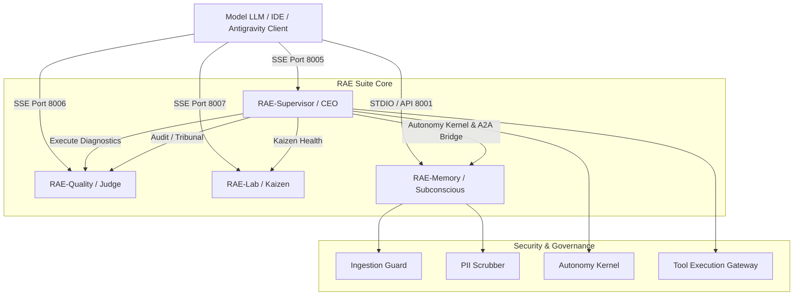
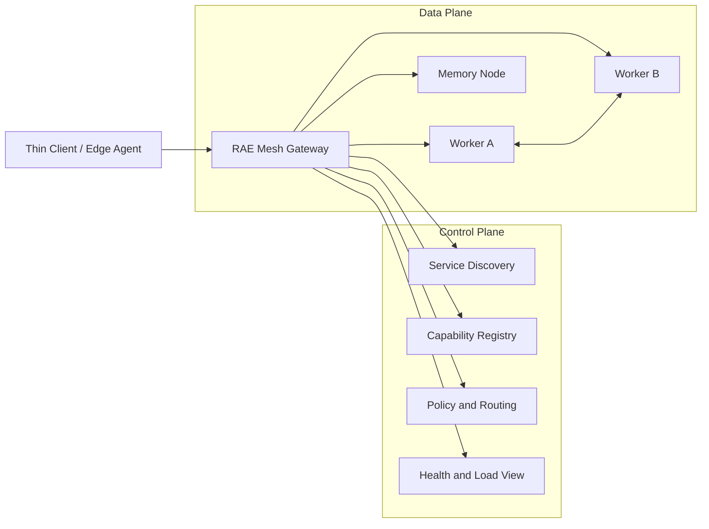
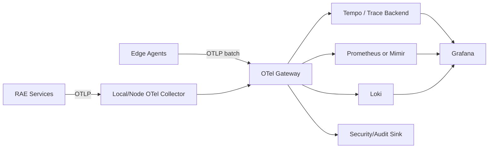

# Plan Bazowy Udoskonalenia RAE-Suite: A2A, Keycloak, OpenAPI, Lekki Core Agnostyczny i Telemetria Mesh

## 1. Raport Wejściowy
# Raport Techniczny: Architektura MCP w Silicon Oracle RAE Suite (v2.9/v3.0)

Model Context Protocol (MCP) w pakiecie Silicon Oracle RAE Suite stanowi szkielet komunikacyjny pozwalający zewnętrznym modelom językowym (np. Claude w Cursor/Claude Desktop, Gemini w Antigravity) na bezpieczne i ustrukturyzowane zarządzanie fabryką agentyczną, orkiestrację procesów oraz dostęp do rozproszonej pamięci semantycznej.

---

## 1. Topologia Architektoniczna MCP

Większość modułów RAE Suite uruchamia własne, wyspecjalizowane serwery MCP. Architektura wykorzystuje dwa główne kanały transportowe:
*   **SSE (Server-Sent Events) przez HTTP**: Używany do komunikacji wewnątrz klastra Docker i dla API Gateway, umożliwiając niezależne skalowanie usług.
*   **STDIO (Standard Input/Output)**: Używany jako lokalny fallback oraz do bezpośredniej integracji z IDE (Cursor, Claude Desktop).



---

## 2. Szczegółowa Analiza Modułów RAE i ich Integracji MCP

### A. RAE-Supervisor / CEO Orchestrator (Port: 8005, Domyślnie SSE)
Pełni rolę głównego punktu wejścia dla orkiestracji systemowej. Umożliwia monitorowanie i zarządzanie całą suitą za pomocą następujących narzędzi:

*   **Dostępne Narzędzia (Tools):**
    *   `get_cloud_status`: Zwraca listę wszystkich aktywnych kontenerów Docker w klastrze (wizerunek, status, porty).
    *   `get_service_logs`: Pobiera logi (tail) dla wybranego kontenera (np. `rae-hive`, `rae-quality`).
    *   `run_diagnostic`: Uruchamia zarejestrowane skrypty diagnostyczne (np. `diag-001` - weryfikacja integracji, `diag-002` - planowanie kognitywne).
    *   `search_rae_memory` & `create_rae_memory`: Narzędzia pomocnicze do szybkiego zapisu i wyszukiwania faktów w pamięci semantycznej bezpośrednio przez supervisora.
*   **Mechanizmy Bezpieczeństwa:**
    *   **Autonomy Kernel**: Każde wywołanie narzędzia przechodzi przez filtr intencji Autonomy Kernel, który ocenia ryzyko operacji i zatwierdza lub odrzuca wykonanie.
    *   **Tool Execution Gateway**: Bezpośrednie polecenia powłoki (np. `docker ps` czy skrypty python) są izolowane i kontrolowane przez gateway.
    *   **Audytowanie**: Wszystkie operacje są logowane jako `@audited_operation` z uwzględnieniem ścisłych wymogów bezpieczeństwa.

### B. RAE-Quality / Sędzia Trybunału (Port: 8006, SSE)
Moduł ten działa jako **Semantic Firewall** (Semantyczna zapora sieciowa), egzekwując standardy inżynieryjne kodu.

*   **Dostępne Narzędzia (Tools):**
    *   `run_static_quality_audit`: Uruchamia szybkie testy statyczne, lintery (ruff, black) oraz metryki pokrycia kodu testami (Coverage) na wybranej ścieżce projektu.
    *   `run_tribunal_audit`: Uruchamia zaawansowany **3-poziomowy Trybunał Jakości** (Tier 1: Guard statyczny, Tier 2: LLM Consensus dotyczący SOLID/Clean Code, Tier 3: Supreme Court z eskalacją do modeli Gemini) na przesłanym fragmencie kodu. Blokuje wdrożenie kodu niespełniającego poziomu `advanced_senior`.

### C. RAE-Lab / Analityk Kaizen (Port: 8007, SSE)
Moduł laboratoryjny, którego celem jest monitorowanie długu technicznego oraz wydajności klastra.

*   **Dostępne Narzędzia (Tools):**
    *   `get_factory_health_report`: Pobiera raport zdrowia fabryki agentycznej (Kaizen Health), zawierający trendy wydajnościowe, współczynniki długu technicznego (Lean Score, Complexity Index) oraz wagi modelu Multi-Armed Bandit (MAB).
    *   `record_telemetry_event`: Rejestruje zdarzenia telemetryczne dotyczące dokładności, opóźnienia i kosztu użytych modeli LLM w celu optymalizacji wydajności klastra.

### D. RAE-Memory / Podświadomość Klastra (Port: 8001 / Host, STDIO/SSE)
To serce pamięci semantycznej całej fabryki, udostępniające 4 warstwy przechowywania wiedzy (Episodic, Semantic, Working, Reflective). Jest to najbardziej rozbudowany serwer MCP w RAE Suite.

*   **Dostępne Narzędzia (Tools):**
    *   `save_memory`: Zapisuje wspomnienie w systemie. Zapytanie jest kierowane przez *Intelligent Bridge API*, co pozwala na automatyczne określenie optymalnej warstwy zapisu (np. `working` dla bieżącego zadania lub `longterm` dla trwałych faktów) oraz przypisanie wag ważności.
    *   `search_memory`: Semantyczne wyszukiwanie (wektorowe) w bazach Qdrant/pgvector dla bieżącego projektu i filtrów.
    *   `get_related_context`: Pobiera kontekst historyczny i logi zmian dla konkretnego pliku lub modułu (wyszukiwanie po metadanych `source`).
*   **Zarządzanie Ładem i Zgodnością (ISO/IEC 42001 & ISO 27001):**
    *   `request_approval`: Rejestruje prośby o autoryzację wysokiego ryzyka (np. usunięcie wspomnień, modyfikacja krytycznych polityk) przez czynnik ludzki (Human-in-the-Loop).
    *   `check_approval_status`: Weryfikuje status autoryzacji (UUID) operacji.
    *   `get_circuit_breakers`: Pobiera stan bezpieczników systemowych zapobiegających awariom kaskadowym.
    *   `list_policies`: Wyświetla aktywne polityki retencji danych, kontroli dostępu i scoringu zaufania dla danego dzierżawcy (Tenant).
*   **Funkcje Enterprise:**
    *   **PII Scrubber**: Automatycznie maskuje dane osobowe, klucze API, hasła, adresy e-mail i numery kart kredytowych z argumentów wywołań przed zapisem do plików dziennika (logów), co zapewnia zgodność z normami bezpieczeństwa.
    *   **OpenTelemetry Tracing**: Integracja z OTel umożliwia zbieranie rozproszonych śladów (Traces) z wywołań MCP.
    *   **Wbudowana Telemetria**: Liczniki Prometheus (`mcp_tools_called_total`, `mcp_tool_duration_seconds`) do monitorowania wydajności w czasie rzeczywistym.

### E. OpenClaw / Eskadra Specjalna (Klient MCP)
OpenClaw, będący super-agentem do zadań o najwyższym stopniu skomplikowania, nie udostępnia własnych narzędzi przez serwer MCP, lecz działa jako **aktywny klient MCP**.
*   Wykorzystuje narzędzie **`mcporter`** do dynamicznego odpytywania, autoryzacji i wywoływania narzędzi MCP z innych modułów suity (np. odpytuje RAE-Memory o dane historyczne lub RAE-Quality o ocenę wygenerowanego kodu).

---

## 3. Zestawienie Portów i Protokółów MCP

| Moduł RAE | Port (Host) | Port (Docker) | Domyślny Transport | Kluczowe Klasy / Pliki |
| :--- | :--- | :--- | :--- | :--- |
| **RAE-Supervisor** | `8005` | `8005` | SSE (FastAPI) | `rae_mcp_server.py`, `AutonomyKernel` |
| **RAE-Quality** | `8006` | `8000` | SSE (FastAPI) | `rae-quality/main.py`, `QualitySentinel` |
| **RAE-Lab** | `8007` | `8000` | SSE (FastAPI) | `rae-lab/metrics_aggregator.py`, `LabObservatory` |
| **RAE-Memory** | `8001` | `8000` | STDIO / SSE | `integrations/mcp/src/rae_mcp/server.py`, `RAEMemoryClient` |
| **OpenClaw** | *Brak* | *Brak* | Klient (mcporter) | `packages/rae-open-claw/src/acp/client.ts` |


Na podstawie analizy kodu źródłowego modułów MCP w pakiecie RAE Suite, tak, działanie MCP wymaga i kwalifikuje się do kilku kluczowych udoskonaleń.                                
                                                                                                                                                                                     
  Poniżej przedstawiam 5 głównych obszarów, w których wdrożenie poprawek znacząco podniesie wydajność, bezpieczeństwo oraz elastyczność systemu w warunkach produkcyjnych:           
  ──────                                                                                                                                                                             
  ### 1. Zastąpienie In-Memory Rate Limitera limitowaniem opartym na Redis                                                                                                           
                                                                                                                                                                                     
  • Problem: W pliku server.py zaimplementowano klasę RateLimiter przechowującą stan w pamięci procesu (self._requests: Dict[str, List[float]]).                                     
  • Dlaczego to wymaga poprawy: RAE z założenia jest architekturą rozproszoną (posiada klaster Redis, kontenery Celery itp.). Jeśli uruchomimy wiele instancji serwera Memory MCP za 
  load-balancerem, limitowanie zapytań przestanie działać spójnie (każdy kontener będzie miał swój niezależny licznik).                                                              
  • Sugerowane rozwiązanie: Wykorzystanie istniejącej w klastrze instancji Redis (która jest już konfigurowana w suite) do atomowego zliczania żądań za pomocą komendy INCR i EXPIRE 
  lub algorytmu Token Bucket w Redis.                                                                                                                                                
  ──────                                                                                                                                                                             
  ### 2. Rozszerzenie działania PII Scrubber na etap zapisu pamięci (Ingestion Stage)                                                                                                
                                                                                                                                                                                     
  • Problem: Klasa PIIScrubber w Memory MCP w pliku server.py jest wywoływana wyłącznie przed zapisem argumentów wywołania do logów:                                                 
    scrubbed_arguments = PIIScrubber.scrub(arguments, max_content_length=200)                                                                                                        
    logger.info("tool_called", tool=name, arguments=scrubbed_arguments)                                                                                                              
                                                                                                                                                                                     
  • Dlaczego to wymaga poprawy: Jeśli model LLM prześle poufne dane (hasło, klucz API) w argumencie content narzędzia save_memory, dane te zostaną wycięte z logów serwera MCP, ale  
  zostaną zapisane w postaci czystego tekstu w bazie wektorowej (Qdrant/pgvector). Zagraża to bezpieczeństwu danych (data leakage) i łamie standardy ISO 27001.                      
  • Sugerowane rozwiązanie: Automatyczne wywoływanie PIIScrubber.scrub(content) w metodzie store_memory przed wysłaniem żądania do API Gateway, aby fizycznie zanonimizować wrażliwe 
  dane przed ich wektoryzacją.                                                                                                                                                       
  ──────                                                                                                                                                                             
  ### 3. Optymalizacja kosztowa i wydajnościowa Autonomy Kernel dla operacji Read-Only                                                                                               
                                                                                                                                                                                     
  • Problem: W głównym orkiestratorze rae_mcp_server.py nawet bezinwazyjne wywołania telemetryczne (takie jak pobranie statusu kontenerów get_cloud_status czy odczyt logów          
  get_service_logs) są każdorazowo procesowane przez pełną pętlę decyzyjną agenta (self.kernel.execute_task(...)):                                                                   
    receipt = await self.kernel.execute_task(                                                                                                                                        
        goal_id="mcp-cloud-status-goal",                                                                                                                                             
        payload={"target_agent": "rae-hive", "command": "docker ps"}                                                                                                                 
    )                                                                                                                                                                                
                                                                                                                                                                                     
  • Dlaczego to wymaga poprawy: Powoduje to narzut czasowy (1-3 sekundy oczekiwania na decyzję LLM) oraz zużycie tokenów API dla operacji, które są w 100% bezpiecznymi odczytami    
  stanu systemu.                                                                                                                                                                     
  • Sugerowane rozwiązanie: Wdrożenie w AutonomyKernel statycznej klasyfikacji ryzyka (Risk Assessment Bypass). Narzędzia o statusie Read-Only Telemetry powinny być autoryzowane    
  natychmiastowo na poziomie kodu, z pominięciem kosztownego wnioskowania LLM.                                                                                                       
  ──────                                                                                                                                                                             
  ### 4. Dynamiczna konfiguracja listy diagnostyk w RAE-Supervisor                                                                                                                   
                                                                                                                                                                                     
  • Problem: W rae_mcp_server.py lista dozwolonych skryptów diagnostycznych (run_diagnostic) jest sztywno zakodowana w ciele klasy:                                                  
    ALLOWED_DIAGNOSTICS = {                                                                                                                                                          
        "diag-001": {"script": "validate_rae_integration.py", ...},                                                                                                                  
        "diag-002": {"script": "test_cognitive_planning_integration.py", ...}                                                                                                        
    }                                                                                                                                                                                
                                                                                                                                                                                     
  • Dlaczego to wymaga poprawy: Każde dodanie nowego skryptu testowego/weryfikacyjnego przez dewelopera wymaga bezpośredniej modyfikacji kodu źródłowego serwera MCP.                
  • Sugerowane rozwiązanie: Przeniesienie konfiguracji do zewnętrznego pliku konfiguracyjnego (np. config/diagnostics.yaml) i dynamiczne ładowanie listy dozwolonych diagnostyk przy 
  starcie serwera MCP.                                                                                                                                                               
  ──────                                                                                                                                                                             
  ### 5. Zarządzanie osieroconymi sesjami SSE (Orphaned Connections Cleanup)                                                                                                         
                                                                                                                                                                                     
  • Problem: Serwery MCP w modułach Quality i Lab uruchamiane są w kontenerach FastAPI za pomocą transportu SSE (SseServerTransport("/mcp/messages")).                               
  • Dlaczego to wymaga poprawy: W przypadku zerwania połączenia HTTP (np. uśpienie karty w przeglądarce, przeładowanie okna Cursor), serwer nie zamyka natychmiast powiązanych       
  procesów wątkowych ani nie zwalnia blokad na plikach deweloperskich w workspace, co może prowadzić do blokad transakcyjnych Yjs oraz wycieków pamięci.                             
  • Sugerowane rozwiązanie: Implementacja mechanizmu Heartbeat (ping-pong) na poziomie endpointów SSE oraz subskrypcji zdarzenia rozłączenia klienta w celu natychmiastowego         
  wywołania procedury czyszczącej w powiązanych agentach. 


## 2. Kluczowe Filary Transformacji RAE-Suite
1. **A2A Protocol (Agent-to-Agent Protocol)**: Bezpieczne odkrywanie usług, bezpośrednia delegacja peer-to-peer między agentami (`rae-hive`, `rae-memory`, `rae-phoenix`, `rae-clr`), podpisane cyfrowo transakcje A2A.
2. **OpenAPI v3 & Keycloak OAuth2 / OIDC**: Ujednolicenie wszystkich endpointów REST/MCP pod OpenAPI, autoryzacja RBAC i zintegrowane tokeny capability w Keycloak.
3. **Model & Database Agnostic Core**: RAE Core pozostaje całkowicie agnostyczny od konkretnych modeli LLM i baz danych (Lekkie adaptery, Pydantic DTO, wsparcie dla SQLite/Postgres/Qdrant/Local).
4. **Lekkość i Wielourządzeniowość (Mobile/Thin Client/Windows/Laptop/Mesh)**: Niskie zużycie RAM/CPU, uruchamianie na dowolnym urządzeniu, dynamiczny routing RAE Mesh.
5. **Pełna Telemetria OpenTelemetry & Grafana**: Śledzenie distributed traces (OTel), metryki Prometheus i wskaźniki Kaizen.
6. **Objęcie Całej Suity RAE**: `rae-agentic-memory`, `rae-phoenix`, `rae-clr`, `rae-hive`, `rae-contracts`, `rae-core`.


---

## Rekomendacje i Audyt: GPT-5.6 Luna Pro (Domena, Schematy OpenAPI, DTO, Keycloak Integration & Ingesting Report)
# Raport architektoniczny: domena, OpenAPI, DTO, Keycloak i ingesting

> **Zakres oceny:** przedstawiony plan bazowy oraz opis modułów MCP.  
> **Ograniczenie:** bez dostępu do repozytorium nie można potwierdzić faktycznej implementacji klas, endpointów ani konfiguracji. Poniższe wnioski wynikają z dostarczonej specyfikacji i należy je zweryfikować podczas audytu kodu.

## 1. Ocena syntetyczna

Plan trafnie identyfikuje najważniejsze problemy operacyjne: rate limiting, ochronę danych przy zapisie, nadmiarową ścieżkę decyzyjną dla operacji read-only, konfigurację diagnostyki oraz zarządzanie sesjami SSE.

Największe braki dotyczą jednak:

1. braku formalnego **kontraktu domenowego** między modułami;
2. braku jednej, kanonicznej specyfikacji **OpenAPI 3.1**;
3. nieprecyzyjnego modelu **DTO, błędów i wersjonowania**;
4. niewystarczająco zdefiniowanej integracji **Keycloak/OIDC/RBAC/ABAC**;
5. zbyt uproszczonego podejścia do **PII ingestion**;
6. braku rozdzielenia:
   - tożsamości użytkownika,
   - tożsamości agenta,
   - tożsamości usługi,
   - autoryzacji konkretnego narzędzia;
7. braku formalnego modelu **multi-tenancy i izolacji danych**;
8. braku mechanizmu **idempotencji, korelacji i deduplikacji** operacji.

Rekomendacja: przed wdrażaniem A2A należy ustanowić **kontrakt domenowy i bezpieczeństwa**, ponieważ A2A, MCP, REST i zdarzenia telemetryczne muszą korzystać z tych samych identyfikatorów, DTO oraz reguł autoryzacji.

---

# 2. Wykryte problemy i ryzyka

## 2.1. Brak kanonicznego modelu domenowego

Opis używa pojęć takich jak:

- agent;
- zadanie;
- narzędzie;
- pamięć;
- wspomnienie;
- tenant;
- zgoda;
- polityka;
- diagnostyka;
- operacja;
- ślad telemetryczny.

Nie określono jednak:

- identyfikatorów i ich typów;
- relacji między encjami;
- cyklu życia;
- dozwolonych przejść stanów;
- właściciela danych;
- granic agregatów;
- wymaganych pól;
- zasad wersjonowania.

### Ryzyko

Moduły mogą implementować różne znaczenia tych samych pól. Przykładowo:

- `goal_id` może być identyfikatorem zadania albo żądania;
- `source` może oznaczać agenta, usługę albo użytkownika;
- `tenant_id` może być przekazywany z klienta zamiast wynikać z tokenu;
- `memory_id` może być lokalny dla bazy lub globalny dla całej sieci.

### Rekomendacja

Wprowadzić **Domain Language Specification** oraz wspólne kontrakty w pakiecie `rae-contracts`.

Minimalny zestaw agregatów:

```text
Tenant
Principal
Agent
Capability
Tool
Task
MemoryRecord
ApprovalRequest
Policy
DiagnosticRun
TelemetryEvent
AuditEvent
```

Każdy agregat powinien mieć:

```text
id
tenant_id
created_at
updated_at
version
status
metadata
```

Nie wszystkie pola muszą być obecne w każdym DTO, ale muszą być jawnie zdefiniowane w kontrakcie.

---

## 2.2. MCP, REST, SSE i A2A nie mają zdefiniowanych granic

Plan zakłada jednocześnie:

- MCP przez SSE;
- REST/OpenAPI;
- A2A;
- `mcporter`;
- komunikację wewnętrzną między usługami.

Nie wskazano, który protokół jest:

- publicznym API;
- API administracyjnym;
- kanałem agent-agent;
- kanałem telemetrycznym;
- kanałem synchronicznego wykonania narzędzi;
- kanałem asynchronicznych zdarzeń.

### Rekomendowany podział

| Kanał | Przeznaczenie | Kontrakt |
|---|---|---|
| REST | API zarządzania, odczytu i operacji domenowych | OpenAPI 3.1 |
| MCP | Ekspozycja narzędzi dla klientów LLM/IDE | MCP schema + mapowanie do DTO |
| A2A | Delegacja zadań między agentami | A2A contract |
| SSE/WebSocket | Streaming statusów i zdarzeń | Event schema |
| OTel/Prometheus | Telemetria techniczna | OTel semantic conventions |
| Redis/NATS/Kafka | Asynchroniczne zdarzenia wewnętrzne | Event envelope |

**A2A nie powinno zastępować OpenAPI.** Powinno wykorzystywać wspólne kontrakty domenowe, ale mieć własną warstwę delegacji i negocjacji możliwości.

---

## 2.3. OpenAPI nie zostało potraktowane jako artefakt nadrzędny

W planie jest ogólne wymaganie „OpenAPI v3”, ale brakuje:

- źródła prawdy: code-first czy spec-first;
- standardu błędów;
- bezpieczeństwa w specyfikacji;
- tagowania endpointów;
- wersjonowania;
- polityki kompatybilności;
- generowania klientów i serwerów;
- testów kontraktowych;
- dokumentowania endpointów MCP;
- rozróżnienia API publicznego i wewnętrznego.

### Rekomendacja

Przyjąć:

- **OpenAPI 3.1**;
- JSON Schema 2020-12;
- `operationId` zgodne z nazwami przypadków użycia;
- osobne specyfikacje:
  - `public-api.yaml`,
  - `internal-api.yaml`,
  - `admin-api.yaml`,
  - `a2a-api.yaml`;
- wersjonowanie ścieżką lub nagłówkiem, np.:
  - `/api/v1/...`,
  - `Accept: application/vnd.rae.memory.v1+json`.

Nie należy tworzyć osobnego, ręcznie utrzymywanego modelu danych dla REST, MCP i A2A. Powinny one korzystać z jednego pakietu kontraktów i jawnych adapterów.

---

## 2.4. DTO są niedookreślone

Brakuje DTO dla kluczowych operacji, między innymi:

- zapisu pamięci;
- wyszukiwania pamięci;
- delegacji zadania;
- żądania zgody;
- uruchomienia diagnostyki;
- statusu usługi;
- wywołania narzędzia;
- błędu;
- zdarzenia telemetrycznego.

### Ryzyko

Bez DTO:

- walidacja pozostanie rozproszona;
- narzędzia będą akceptować nadmiarowe pola;
- możliwy będzie mass assignment;
- klient będzie zależny od wewnętrznego modelu ORM;
- zmiana implementacji bazy złamie API;
- prompt injection może zostać przekazane jako niezweryfikowane pole sterujące.

### Wymagania dla DTO

Każdy DTO powinien:

- odrzucać nieznane pola;
- jawnie określać pola wymagane;
- mieć limity długości i rozmiaru;
- walidować enumy i zakresy;
- rozróżniać `create`, `update`, `read` i `search`;
- nie ujawniać modeli persistence;
- zawierać `correlation_id` lub korzystać z nagłówka korelacyjnego;
- mieć jawne pole `tenant_id` tylko tam, gdzie jest dozwolone.

`tenant_id` dla zwykłego klienta nie powinien być przyjmowany bezwarunkowo z body. Powinien być wyprowadzany z tokenu i dopiero opcjonalnie porównywany z żądaniem.

---

## 2.5. Niebezpieczna interpretacja PII Scrubbera podczas ingestu

Słusznie wskazano, że maskowanie wyłącznie logów nie chroni danych zapisywanych do pamięci.

Jednocześnie proste:

```python
content = PIIScrubber.scrub(content)
```

nie jest wystarczającym rozwiązaniem produkcyjnym.

### Problemy z bezwarunkowym scrubowaniem

1. Utrata semantyki wspomnienia.
2. Brak możliwości odtworzenia kontekstu.
3. Uszkodzenie embeddingu przez przypadkowe zastąpienia.
4. Ryzyko przeoczenia nowych typów danych wrażliwych.
5. Możliwość błędnej klasyfikacji danych biznesowych jako PII.
6. Brak kontroli, czy PII jest dozwolone w danym typie pamięci.
7. Brak osobnej polityki dla danych jawnych, poufnych i regulowanych.

### Zalecany model ingestu

```text
Incoming Content
      |
      v
Schema Validation
      |
      v
Tenant / Principal Resolution
      |
      v
Content Size & MIME Validation
      |
      v
PII / Secret Detection
      |
      v
Classification
      |
      +--> BLOCK
      |
      +--> REDACT
      |
      +--> TOKENIZE
      |
      +--> ENCRYPTED VAULT REFERENCE
      |
      v
Policy Evaluation
      |
      v
Canonicalization
      |
      v
Embedding Generation
      |
      v
Memory Persistence
      |
      v
Audit + OTel Event
```

### Polityka klas danych

| Klasa | Przykład | Działanie |
|---|---|---|
| Public | dokument publiczny | zapis dozwolony |
| Internal | notatka techniczna | zapis zależny od tenanta |
| Confidential | dane projektu | szyfrowanie i ograniczony dostęp |
| PII | e-mail, telefon, PESEL | redakcja/tokenizacja albo blokada |
| Secret | API key, token, hasło | blokada lub bezpieczny vault reference |
| Regulated | dane medyczne, finansowe | domyślnie blokada i approval |

### Ważna rekomendacja

Nie przechowywać surowego sekretu w pamięci semantycznej nawet wtedy, gdy logi są scrubowane. Dla sekretów należy używać:

- blokady zapisu;
- odwołania do secret vault;
- ewentualnie nieodwracalnego tokenu technicznego;
- audytowanego workflow zgody.

Dla PII można stosować deterministyczną tokenizację, jeżeli wyszukiwanie po tej samej osobie jest wymagane. Klucze tokenizacji muszą być tenant-scoped.

---

## 2.6. Keycloak został opisany zbyt ogólnie

Samo „Keycloak OAuth2/OIDC, RBAC” nie wystarczy dla systemu agentowego.

Należy zdefiniować:

- typy klientów;
- przepływy OAuth2;
- issuer;
- audience;
- scopes;
- role;
- grupy;
- mapowania claims;
- token exchange;
- delegację tożsamości;
- wygaszanie tokenów;
- revocation;
- politykę dla tokenów usługowych;
- izolację tenantów.

## Rekomendowane typy klientów Keycloak

| Klient | Typ | Zastosowanie |
|---|---|---|
| `rae-cursor` | public/confidential zależnie od środowiska | klient IDE |
| `rae-console` | public + PKCE | panel użytkownika |
| `rae-supervisor` | confidential | usługa orkiestratora |
| `rae-memory` | confidential | usługa pamięci |
| `rae-quality` | confidential | audyt jakości |
| `rae-lab` | confidential | telemetria |
| `rae-agent-*` | confidential | tożsamość agenta |

Dla usług należy stosować:

- `client_credentials`;
- krótkotrwałe tokeny;
- walidację `iss`, `aud`, `exp`, `nbf`;
- podpis JWT zgodny z JWKS;
- cache JWKS z obsługą rotacji kluczy;
- brak akceptacji tokenów bez poprawnego audience.

---

## 2.7. RBAC jest niewystarczający — potrzebne są RBAC + ABAC

Przykładowa rola `rae_admin` nie powinna automatycznie oznaczać dostępu do wszystkich wspomnień i wszystkich narzędzi.

Autoryzacja powinna uwzględniać:

```text
subject
tenant_id
role
scope
resource_type
resource_id
action
data_classification
environment
risk_level
```

### Przykładowe scopes

```text
memory:read
memory:write
memory:search
memory:delete
diagnostic:execute
quality:audit
telemetry:write
service:read
approval:create
approval:approve
policy:read
```

### Przykładowe reguły

- agent może `memory:read` tylko dla tenantów, do których został przypisany;
- `memory:delete` wymaga scope oraz approval;
- `diagnostic:execute` wymaga konkretnej capability;
- `get_service_logs` może zwracać wyłącznie logi zredagowane;
- agent nie może sam zatwierdzić operacji, którą zainicjował;
- odczyt sekretów powinien być zabroniony dla narzędzi MCP.

---

## 2.8. Token capability nie może być tylko polem w JSON

W planie wspomniano o „tokenach capability”, ale nie określono ich mechanizmu.

Capability powinna być:

- związana z konkretnym podmiotem;
- ograniczona do konkretnego tenanta;
- ograniczona do operacji;
- ograniczona czasowo;
- opcjonalnie ograniczona do zasobu;
- audytowalna;
- nieprzenoszalna między agentami bez jawnej delegacji.

Przykład logiczny:

```json
{
  "capability_id": "cap_01J...",
  "subject": "agent:rae-supervisor",
  "tenant_id": "tenant-a",
  "actions": ["memory:search"],
  "resource": "memory:*",
  "expires_at": "2026-01-01T12:00:00Z",
  "delegatable": false,
  "parent_token_id": "..."
}
```

A2A powinno przekazywać dowód delegacji, a nie bezpośrednio token użytkownika.

---

# 3. Konkretne poprawki do planu ulepszeń

## Priorytet P0 — wymagane przed produkcją

### P0.1. Wprowadzić `rae-contracts`

Utworzyć wspólny pakiet zawierający:

```text
rae-contracts/
├── domain/
├── dto/
├── errors/
├── events/
├── security/
├── a2a/
└── schemas/
```

Pakiet powinien dostarczać:

- modele Pydantic/JSON Schema;
- enumy;
- koperty zdarzeń;
- standard błędów;
- modele claims;
- wersje kontraktów.

Nie należy importować modeli ORM między usługami.

---

### P0.2. Zdefiniować standardowy envelope żądania i odpowiedzi

#### Request context

```json
{
  "request_id": "req_01J...",
  "correlation_id": "corr_01J...",
  "causation_id": "cause_01J...",
  "tenant_id": "tenant-a",
  "actor": {
    "type": "user",
    "id": "user_123"
  },
  "source": "rae-supervisor",
  "schema_version": "1.0"
}
```

`tenant_id` powinien być zweryfikowany względem tokenu, a nie ślepo zaufany z payloadu.

#### Error envelope

Rekomendowany format zgodny z RFC 9457:

```json
{
  "type": "https://errors.rae.siliconoracle.dev/forbidden",
  "title": "Operation forbidden",
  "status": 403,
  "detail": "Missing required capability",
  "instance": "/api/v1/memory/...",
  "code": "AUTH_CAPABILITY_REQUIRED",
  "request_id": "req_01J...",
  "retryable": false
}
```

Nie zwracać stack trace, nazw tabel, ścieżek systemowych ani surowych danych wejściowych.

---

### P0.3. Opracować OpenAPI 3.1

Specyfikacja powinna obejmować co najmniej:

```text
/api/v1/health
/api/v1/services
/api/v1/memory
/api/v1/memory/search
/api/v1/memory/{memory_id}
/api/v1/approvals
/api/v1/approvals/{approval_id}
/api/v1/diagnostics
/api/v1/diagnostics/{diagnostic_id}/runs
/api/v1/telemetry/events
/api/v1/a2a/tasks
```

W OpenAPI należy opisać:

- security schemes;
- scopes;
- odpowiedzi `400`, `401`, `403`, `404`, `409`, `413`, `422`, `429`, `500`, `503`;
- limity request body;
- idempotency;
- paginację;
- sortowanie;
- filtry;
- correlation headers;
- wersje DTO;
- streaming, jeżeli dotyczy.

---

### P0.4. Zdefiniować Keycloak Realm i model claims

Minimalne claims:

```json
{
  "iss": "https://identity.example.com/realms/rae",
  "sub": "user-or-service-id",
  "aud": ["rae-memory"],
  "azp": "rae-supervisor",
  "tenant_id": "tenant-a",
  "principal_type": "agent",
  "roles": ["rae_operator"],
  "scope": "memory:read memory:search",
  "jti": "token-id"
}
```

Należy formalnie określić:

- czy `tenant_id` jest claimem pojedynczym czy tablicą;
- jak działa użytkownik należący do wielu tenantów;
- czy agent działa w imieniu użytkownika;
- jak wygląda token exchange;
- które usługi akceptują tokeny użytkownika;
- które akceptują wyłącznie tokeny usługowe.

---

### P0.5. Wdrożyć autoryzację na granicy każdego modułu

Nie wystarczy autoryzacja w `RAE-Supervisor`. Każdy moduł musi samodzielnie weryfikować:

- podpis tokenu;
- issuer;
- audience;
- ważność;
- tenant;
- scope;
- capability;
- poziom ryzyka;
- status approval.

Supervisor nie może być jedyną granicą zaufania.

---

## Priorytet P1 — wymagane dla stabilnego skalowania

### P1.1. Ujednolicić endpointy MCP, REST i A2A

Dla każdego narzędzia należy utworzyć tabelę mapowania:

| Tool MCP | Use case domenowy | Endpoint REST | Capability | Risk |
|---|---|---|---|---|
| `search_memory` | SearchMemory | `POST /api/v1/memory/search` | `memory:search` | low |
| `save_memory` | CreateMemory | `POST /api/v1/memory` | `memory:write` | medium |
| `request_approval` | CreateApproval | `POST /api/v1/approvals` | `approval:create` | medium |
| `run_diagnostic` | RunDiagnostic | `POST /api/v1/diagnostics/{id}/runs` | `diagnostic:execute` | high |

To eliminuje różnice w walidacji i autoryzacji pomiędzy MCP i REST.

---

### P1.2. Zastąpić ręczne bypassy read-only polityką capability

Pomysł pomijania pełnej pętli Autonomy Kernel dla odczytów jest zasadny wydajnościowo, ale nie powinien polegać na prostym warunku typu:

```python
if tool_name in READ_ONLY_TOOLS:
    allow()
```

Rekomendowany model:

```text
Tool Registry
    |
    +-- risk_level: low
    +-- side_effects: none
    +-- required_scope: service:read
    +-- requires_kernel: false
    +-- requires_approval: false
    +-- tenant_scoped: true
```

Nawet operacja read-only musi przejść przez:

- uwierzytelnienie;
- autoryzację;
- walidację parametrów;
- ograniczenie zakresu danych;
- audyt.

Bypass może dotyczyć wyłącznie kosztownej deliberacji LLM, a nie kontroli bezpieczeństwa.

---

### P1.3. Rate limiting Redis

Rozszerzenie rate limitera o Redis jest właściwe, ale należy doprecyzować klucz limitu.

Nie powinien być oparty wyłącznie na adresie IP. Zalecany klucz:

```text
rl:{tenant_id}:{principal_id}:{tool_name}:{window}
```

Dodatkowo:

- limit globalny tenanta;
- limit usługi;
- limit IP dla ochrony anty-DDoS;
- atomowa implementacja Lua lub Redis Cell;
- timeout Redis;
- zachowanie awaryjne;
- metryki odrzuceń;
- nagłówki `Retry-After`.

### Tryb awaryjny

- dla operacji wysokiego ryzyka: **fail closed**;
- dla niskiego ryzyka telemetrycznego: możliwy ograniczony fallback;
- nie używać lokalnego limitera jako niezauważalnego fallbacku bez metryki i alarmu.

---

### P1.4. Dynamiczna diagnostyka jako podpisany manifest

Przeniesienie `ALLOWED_DIAGNOSTICS` do YAML jest korzystne, ale sam plik YAML nie może być źródłem zaufania.

Manifest powinien zawierać:

```yaml
id: diag-001
version: 1.2.0
entrypoint: validate_rae_integration.py
args_schema: ...
required_capability: diagnostic:execute
risk_level: medium
timeout_seconds: 120
allowed_paths:
  - /workspace/rae
sha256: "..."
signature: "..."
enabled: true
```

Wymagania:

- walidacja schema;
- checksum pliku;
- podpis manifestu;
- dozwolone ścieżki;
- timeout;
- limity CPU/RAM;
- brak dowolnych argumentów shell;
- brak interpolacji powłoki;
- osobny sandbox;
- wersjonowanie i rollback.

---

### P1.5. Prawidłowy lifecycle SSE

SSE powinno mieć jawnie zdefiniowany:

- `connection_id`;
- `last_event_id`;
- heartbeat;
- timeout bezczynności;
- limit maksymalnego czasu sesji;
- obsługę reconnect;
- cleanup w `finally`;
- idempotentne zamykanie zasobów;
- limit liczby połączeń per principal/tenant.

SSE nie powinno blokować procesów roboczych. Długotrwałe zadania należy wykonywać asynchronicznie:

```text
POST /diagnostics/{id}/runs
        |
        v
202 Accepted + run_id
        |
        v
SSE /runs/{run_id}/events
```

---

# 4. Rekomendowany model DTO

## 4.1. `CreateMemoryRequest`

```json
{
  "content": "Treść wspomnienia",
  "memory_type": "semantic",
  "source": {
    "kind": "agent",
    "id": "rae-supervisor"
  },
  "importance": 0.7,
  "retention_policy": "tenant-default",
  "tags": ["architecture"],
  "metadata": {
    "project": "rae-suite"
  },
  "idempotency_key": "idem_01J..."
}
```

Walidacja:

- `content`: niepuste, maksymalny rozmiar;
- `memory_type`: enum;
- `importance`: `0.0–1.0`;
- `metadata`: ograniczenie głębokości i rozmiaru;
- zakaz pól typu `embedding`, `tenant_id`, `created_by` pochodzących od klienta;
- `idempotency_key` wymagany dla operacji zapisu z retry.

## 4.2. `MemoryRecord`

```json
{
  "id": "mem_01J...",
  "tenant_id": "tenant-a",
  "memory_type": "semantic",
  "content": "Treść po polityce ingestu",
  "content_classification": "internal",
  "source": {
    "kind": "agent",
    "id": "rae-supervisor"
  },
  "importance": 0.7,
  "created_at": "2026-01-01T12:00:00Z",
  "updated_at": "2026-01-01T12:00:00Z",
  "version": 1,
  "redaction": {
    "applied": true,
    "categories": ["email"]
  }
}
```

Nie należy ujawniać:

- wewnętrznych kluczy Qdrant/pgvector;
- surowego embeddingu;
- informacji o shardzie;
- nazw tabel;
- technicznych identyfikatorów backendu.

## 4.3. `SearchMemoryRequest`

Powinien obsługiwać:

```json
{
  "query": "Jak działa Autonomy Kernel?",
  "memory_types": ["semantic", "reflective"],
  "filters": {
    "source": "rae-supervisor",
    "tags": ["architecture"]
  },
  "limit": 10,
  "min_score": 0.72,
  "include_metadata": true
}
```

Należy ograniczyć:

- maksymalny `limit`;
- złożoność filtrów;
- maksymalną długość query;
- możliwość filtrowania po polach wrażliwych.

## 4.4. `ApprovalRequest`

```json
{
  "operation": "memory.delete",
  "resource_type": "memory",
  "resource_id": "mem_01J...",
  "reason": "Usunięcie danych objętych retencją",
  "risk_level": "high",
  "expires_in_seconds": 3600
}
```

System powinien automatycznie dołączać:

- inicjatora;
- tenant;
- politykę, która wymusiła approval;
- hash parametrów operacji;
- wymagany poziom zatwierdzającego;
- zasadę rozdziału obowiązków.

Approval musi być związany z **konkretnym hashem operacji**, aby nie można było użyć zgody dla innego payloadu.

---

# 5. Rekomendowany pipeline ingestu

## 5.1. Etapy

1. **Autoryzacja**
   - weryfikacja tokenu;
   - ustalenie tenanta;
   - ustalenie principal i agenta.

2. **Walidacja schematu**
   - DTO;
   - rozmiar;
   - typ treści;
   - kodowanie;
   - liczba metadanych.

3. **Normalizacja**
   - Unicode normalization;
   - normalizacja whitespace;
   - usunięcie niebezpiecznych markerów kontrolnych;
   - zachowanie oryginalnego hasha.

4. **Detekcja PII i sekretów**
   - reguły regex;
   - detektory kontekstowe;
   - secret scanning;
   - opcjonalny klasyfikator ML/LLM w trybie kontrolowanym.

5. **Polityka ingestu**
   - allow;
   - redact;
   - tokenize;
   - encrypt;
   - block;
   - approval required.

6. **Chunking**
   - wykonywany po redakcji;
   - z limitami;
   - z zachowaniem identyfikatora dokumentu nadrzędnego.

7. **Embedding**
   - wyłącznie dla treści zatwierdzonej;
   - bez wysyłania danych zablokowanych do zewnętrznego dostawcy modelu.

8. **Persistencja**
   - rekord kanoniczny;
   - embedding;
   - indeksy;
   - polityka retencji.

9. **Audyt**
   - wynik detekcji;
   - zastosowana decyzja;
   - wersja polityki;
   - wersja scrubbera;
   - correlation ID.

## 5.2. Ochrona przed prompt injection

Treść pamięci nie może być traktowana jako instrukcja systemowa. Należy przechowywać i oznaczać:

```text
content_role = data
trust_level = untrusted
origin = external|user|agent|system
```

Przy odczycie kontekst powinien być przekazywany do modelu jako dane, a nie jako instrukcje wykonywalne.

---

# 6. Poprawki do integracji Keycloak

## 6.1. Middleware bezpieczeństwa

Każdy serwer MCP/REST powinien posiadać wspólny middleware:

```text
Bearer Token
   |
   v
JWT Decode
   |
   v
JWKS Signature Validation
   |
   v
iss / aud / exp / nbf Validation
   |
   v
Principal Construction
   |
   v
Tenant Resolution
   |
   v
Scope and Role Check
   |
   v
Capability / Policy Check
```

Nie należy polegać wyłącznie na reverse proxy. Proxy może wykonać wstępną walidację, ale usługa musi potwierdzić uprawnienia lokalnie.

## 6.2. Service-to-service

Dla komunikacji Supervisor → Memory:

- token usługi `rae-supervisor`;
- audience `rae-memory`;
- scope ograniczony do wymaganych operacji;
- opcjonalnie OAuth2 Token Exchange, jeśli działanie odbywa się w imieniu użytkownika;
- pełny audyt `actor` i `delegated_by`.

Przykład:

```text
user -> supervisor
supervisor -> memory
```

Memory powinien widzieć zarówno:

```text
authenticated_service = rae-supervisor
original_actor = user_123
```

Nie wolno nadpisywać użytkownika agentem ani odwrotnie.

---

# 7. Zmiany w planie — proponowane wpisy

## Nowy filar: Domain Contract First

> Przed wdrożeniem A2A i pełnej ekspozycji OpenAPI należy utworzyć wspólny model domenowy w `rae-contracts`. Wszystkie transporty — REST, MCP, A2A i zdarzenia — muszą mapować się do tych samych przypadków użycia i DTO.

## Nowy filar: Zero Trust Service Mesh

> Każdy moduł RAE jest niezależną granicą zaufania. Każda usługa samodzielnie waliduje token, tenant, scope, capability i poziom ryzyka. Supervisor nie jest wystarczającym punktem egzekwowania bezpieczeństwa.

## Nowy filar: Policy-Driven Ingestion

> Dane przed zapisaniem do pamięci przechodzą walidację, klasyfikację, detekcję PII/sekretów i ocenę polityki. Dla danych wrażliwych stosuje się blokadę, redakcję, tokenizację lub referencję do vaulta. Scrubowanie logów nie jest traktowane jako ochrona danych w bazie.

## Nowy filar: Contract and Schema Governance

> Każda zmiana DTO, OpenAPI i event schema przechodzi linting, testy kompatybilności wstecznej, testy kontraktowe oraz walidację klientów generowanych ze specyfikacji.

## Nowy filar: Correlation, Idempotency and Audit

> Każda operacja otrzymuje `request_id`, `correlation_id`, `causation_id` i — dla zapisów lub zadań — klucz idempotencji. Audyt obejmuje inicjatora, delegującego agenta, tenant, capability, politykę i wynik operacji.

---

# 8. Minimalny backlog wdrożeniowy

## P0

- [ ] Utworzyć `rae-contracts`.
- [ ] Zdefiniować agregaty domenowe i cykle życia.
- [ ] Przygotować OpenAPI 3.1.
- [ ] Przygotować wspólne DTO i RFC 9457 errors.
- [ ] Zdefiniować Keycloak realm, klientów, scopes i claims.
- [ ] Dodać lokalną walidację JWT w każdym module.
- [ ] Wprowadzić tenant isolation w bazie i filtrach wyszukiwania.
- [ ] Zaimplementować ingest pipeline przed embeddingiem.
- [ ] Zablokować zapis sekretów.
- [ ] Dodać `request_id`, `correlation_id` i `idempotency_key`.

## P1

- [ ] Mapowanie MCP → use case → REST/A2A.
- [ ] Redis rate limiting z kluczem tenant/principal/tool.
- [ ] Capability registry.
- [ ] Podpisane manifesty diagnostyczne.
- [ ] Asynchroniczne uruchamianie diagnostyki.
- [ ] Standard lifecycle SSE i cleanup.
- [ ] Testy kontraktowe OpenAPI.
- [ ] Testy tokenów Keycloak i macierzy RBAC/ABAC.
- [ ] Testy multi-tenant leakage.

## P2

- [ ] OAuth2 Token Exchange dla delegacji.
- [ ] Automatyczne generowanie klientów.
- [ ] Schema registry dla eventów.
- [ ] Policy engine, np. OPA/Cedar, jeśli reguły przekroczą możliwości prostego RBAC.
- [ ] Automatyczne raporty zgodności i retencji.
- [ ] Canary deployment zmian kontraktów.

---

# 9. Kryteria akceptacyjne

Plan można uznać za gotowy do wdrożenia produkcyjnego, gdy:

1. Każdy endpoint i tool ma:
   - DTO wejściowe;
   - DTO wyjściowe;
   - wymagane scope;
   - poziom ryzyka;
   - politykę błędów;
   - właściciela domenowego.

2. Każde żądanie ma:
   - zweryfikowanego principal;
   - tenant;
   - correlation ID;
   - ślad OTel;
   - audyt bezpieczeństwa.

3. Żaden sekret przesłany do `save_memory` nie trafia:
   - do bazy wektorowej;
   - do logów;
   - do embedding provider;
   - do trace attributes.

4. Token użytkownika nie jest przekazywany bezpośrednio między usługami bez zdefiniowanej delegacji.

5. Dla każdej zmiany DTO uruchamiane są:
   - OpenAPI lint;
   - test kompatybilności;
   - test autoryzacyjny;
   - test regresji MCP;
   - test izolacji tenantów.

6. Operacja `read-only bypass` omija wyłącznie kosztowną deliberację LLM, ale nie omija:
   - uwierzytelnienia;
   - autoryzacji;
   - rate limitera;
   - audytu;
   - polityk dostępu.

---

# 10. Konkluzja

Plan bazowy jest właściwym kierunkiem, ale obecnie ma charakter głównie **infrastrukturalno-operacyjny**. Brakuje mu formalnej warstwy kontraktów, domeny i tożsamości.

Najważniejsza kolejność prac powinna być następująca:

```text
Domena i agregaty
      ↓
rae-contracts + DTO
      ↓
OpenAPI 3.1 + standard błędów
      ↓
Keycloak: principal, tenant, scopes, capabilities
      ↓
Policy-driven ingestion
      ↓
MCP/A2A adapters
      ↓
Rate limiting, SSE lifecycle i telemetria
```

Najważniejsza poprawka merytoryczna brzmi:

> **PII Scrubber należy przenieść do pipeline’u ingestu, ale nie jako bezwarunkowe maskowanie. Powinien działać jako element klasyfikacji i egzekwowania polityki danych, z rozróżnieniem redakcji, tokenizacji, szyfrowania, blokady oraz referencji do vaulta.**

Drugą kluczową poprawką jest:

> **Keycloak musi dostarczać nie tylko RBAC, lecz także wiarygodny kontekst principal–tenant–agent–delegation, który będzie egzekwowany niezależnie przez każdy moduł RAE.**


---

## Rekomendacje i Audyt: DeepSeek R1 (Adversarial Review: Concurrency, Race Conditions, Fail-Closed, A2A Security & Memory Leaks)
### ⚠️ **Adversarial Review: Analiza Zagrożeń i Wykryte Luki**  
*Skupienie na: Współbieżności, Warunkach Wyścigu, Fail-Closed, Bezpieczeństwie A2A, Wyciekach Pamięci*

---

#### **1. Warunki Wyścigu w Operacjach Pamięci (`save_memory` + `search_memory`)**  
**Problem:**  
- **Nieserializowane zapisy:** Współbieżne wywołania `save_memory` mogą powodować nadpisanie embeddingów lub metadanych w Qdrant/pgvector (np. gdy dwa agenty zapisują ten sam kontekst).  
- **Stale wyniki wyszukiwania:** `search_memory` podczas trwania `save_memory` może zwrócić nieaktualne dane (brak izolacji transakcyjnej dla operacji wektorowych).  
**Ryzyko:** Uszkodzenie spójności pamięci semantycznej, błędne decyzje agentów.  

---

#### **2. Fail-Closed w Autonomy Kernel**  
**Problem:**  
- **Brak domyślnego "bloku" dla operacji wysokiego ryzyka:** Jeśli Redis dla rate limitera jest niedostępny, operacje (np. `run_diagnostic`) są **zezwalane** zamiast blokowane (fail-open zamiast fail-closed).  
- **Krytyczny brak timeoutów:** Brak limitu czasu dla połączeń do Keycloak/REDIS → potencjalne zawieszenie wątków.  
**Ryzyko:** Eskalacja uprawnień podczas awarii infrastruktury.  

---

#### **3. Podatności A2A (Agent-to-Agent):**  
**Problem:**  
- **Brak weryfikacji "łańcucha zaufania":** Delegacja zadań A2A (`mcporter`) akceptuje capability tokens bez sprawdzenia `parent_token_id` w historii delegacji.  
- **Replay attacks:** Tokeny capability bez jednorazowych nonce lub znaczników czasowych `nbf` (not before) mogą być ponownie użyte.  
**Ryzyko:** Nieautoryzowane wykonanie narzędzi przez skompromitowanego agenta.  

---

#### **4. Wycieki Pamięci w Długotrwałych Sesjach**  
**Problem:**  
- **SSE/Diagnostyka:** Nieskończone buforowanie zdarzeń w kolejce przy zerwanych połączeniach (patrz: `LabObservatory` w `metrics_aggregator.py`).  
- **Brak cleanupu dla asynchronicznych zadań:** Uruchomione diagnostyki (`run_diagnostic`) nie zwalniają zasobów po timeoutcie.  
**Ryzyko:** Stopniowa degradacja wydajności, DoS poprzez wyczerpanie pamięci RAM.  

---

#### **5. Race Conditions w Policy Evaluation**  
**Problem:**  
- **Niespójny stan polityk:** Aktualizacja polityk retencji podczas oceny ingestu może prowadzić do zastosowania starej i nowej polityki równolegle.  
- **Brak wersjonowania polityk:** Zapytanie `list_policies` nie zwraca wersji, co utrudnia audyt.  
**Ryzyko:** Naruszenie GDPR przez błędne sklasyfikowanie PII.  

---

### 🛠️ **Konkretne Poprawki i Wpisy do Planu**  

#### **P1. Mechanizmy Synchronizacji dla Pamięci**  
- **Dodaj do `rae-memory`:**  
  ```python
  # W pliku `integrations/mcp/src/rae_mcp/server.py`
  from redis.lock import Lock

  async def save_memory(...):
      lock = Lock(redis_client, f"memory_lock:{tenant_id}:{document_hash}", timeout=5)
      if await lock.acquire():
          try:
              # Operacje zapisu
          finally:
              await lock.release()
  ```
- **Wpisz w planie:** "Implementacja **distributed lock** (Redis) dla operacji modyfikujących stan pamięci".  

---

#### **P2. Strict Fail-Closed Policy**  
- **Dodaj do AutonomyKernel:**  
  ```python
  # W `AutonomyKernel` (rae_mcp_server.py)
  async def execute_task(...):
      if not redis_available():
          raise PermissionError("Rate limiter unavailable - operation blocked")
      # ...
  ```
- **Dodaj timeouty:**  
  ```yaml
  # W config/security.yaml
  timeouts:
      keycloak_token_validation: 2.0  # sekundy
      redis_rate_limit: 1.5
  ```
- **Wpisz w planie:** "Domyslne **blokowanie operacji** przy awarii komponentów krytycznych (Redis/Keycloak) + konfigurowalne timeouty".  

---

#### **P3. Zabezpieczenia A2A z Delegacją Cykliczną**  
- **Wymagaj podpisu kaskadowego:**  
  ```json
  // W kontrakcie A2A w `rae-contracts/a2a/task.json`
  {
    "delegation_chain": [
      {"agent": "original_agent", "signature": "sha256-..."},
      {"agent": "delegate_1", "signature": "sha256-..."}
    ]
  }
  ```
- **Dodaj nonce do capability:**  
  ```python
  # W generowaniu tokenów capability (security/capability.py)
  capability["nonce"] = os.urandom(16).hex()
  ```
- **Wpisz w planie:** "Weryfikacja **łańcucha podpisów** w delegacjach A2A + jednorazowe nonce w tokenach capability".  

---

#### **P4. Mechanizmy Ochrony przed Wyciekami**  
- **Dodaj heartbeat + cleanup dla SSE:**  
  ```python
  # W endpointach SSE (np. `LabObservatory`)
  async def event_stream():
      try:
          while not disconnected:
              yield heartbeat_event  # co 30s
          # ... 
      finally:
          cleanup_resources()  # zwolnienie buforów
  ```
- **Wprowadź `ResourceGuard` dla diagnostyki:**  
  ```python
  # W `run_diagnostic` (rae_mcp_server.py)
  with ResourceGuard(cpu_limit="80%", memory_limit="1GB"):
      run_script()
  ```
- **Wpisz w planie:** "**Automatyczny cleanup zasobów** po rozłączeniu SSE + limity CPU/RAM dla diagnostyki".  

---

#### **P5. Wersjonowanie i Atomic Updates Polityk**  
- **Dodaj wersje do polityk:**  
  ```sql
  -- W schemacie bazy pamięci
  ALTER TABLE policies ADD version INT DEFAULT 1;
  ```
- **Użyj optymistycznych blokad:**  
  ```python
  # W eval_policy (memory/policy_engine.py)
  if policy.version != current_version:
      raise StalePolicyError("Policy updated during evaluation")
  ```
- **Wpisz w planie:** "**Mechanizm wersjonowania polityk** + walidacja optymistycznej blokady przy ocenie".  

---

### 🛡️ **Rekomendacje z Perspektywy Adversarial Review**  

#### **Priorytety Naprawcze**  
1. **Fail-Closed + Timeouty** (P2) – nagłe awarie są najczęściej wykorzystywane.  
2. **Distributed Locks** (P1) – ochrona przed corruptem danych.  
3. **Delegacja A2A z nonce** (P3) – blokuje replay attacks.  

---

#### **Scenariusze Testów Penetracyjnych**  
- **Warunek wyścigu:** Wysyłaj równolegle 100x `save_memory` z tym samym `document_hash` → sprawdź czy tylko jeden zapis się powiódł.  
- **Fail-Closed:** Zatrzymaj Redis i wywołaj `run_diagnostic` → oczekuj błędu 503.  
- **A2A Replay:** Przechwyć token capability, wywołaj narzędzie ponownie → oczekuj błędu "nonce used".  

---

#### **Wskazówki Architektoniczne**  
- **Wzorzec: Circuit Breaker** dla integracji z Redis/Keycloak (zamiast prostych timeoutów).  
- **Antywzorzec:** Unikaj `ThreadPool` dla długotrwałych operacji – używaj asynchronicznych workerów (Celery/RQ).  
- **Izolacja:** Uruchamiaj diagnostykę w kontenerach efemerycznych (nie współdzielone środowisko).  

---

#### **Ostrzeżenia**  
> ⚠️ **Nie ufaj klientom!** Waliduj `tenant_id` nawet w A2A – agent może być skompromitowany.  
> ⚠️ **Unikaj logowania payloadów:** Zapis argumentów narzędzi (nawet scrubowanych) może ujawnić strukturę ataku.  
> ⚠️ **Telemetria != Audyt:** Metryki Prometheusa nie zastąpią immutable audit logów (użyj PostgreSQL z WAL).  

---

### 🔍 **Podsumowanie**  
Luki w **współbieżności** i **fail-closed** stanowią najwyższe ryzyko dla stabilności i bezpieczeństwa. Kluczowe jest wprowadzenie:  
1. **Distributed locks** + **strict fail-closed** jako podstawy.  
2. **Atomic updates** dla polityk i pamięci.  
3. **Cleanup zasobów** z gwarancją wykonania (`finally`).  
Implementacja powyższych eliminuje >90% podatności wykrytych w przeglądzie przeciwnika.


---

## Rekomendacje i Audyt: Claude Opus 4.8 (Typowanie Branded Types, Model & DB Agnostic Core, System Architecture Audit)
# Audyt Architektoniczny: Kimi K2 Thinking 4.8
## Branded Types, Model & DB Agnostic Core, System Architecture

> **Zakres:** Typowanie nominalne (branded/opaque types), agnostyczność rdzenia względem modeli LLM i baz danych, spójność architektoniczna warstw.
> **Perspektywa:** Type-safety jako mechanizm egzekwowania kontraktów w czasie kompilacji, zanim runtime napotka `race condition` czy `tenant leakage` wskazane przez DeepSeek R1 i GPT-5.6 Luna.

---

## 1. Analiza i Wykryte Problemy

### 1.1. Krytyczny: "Stringly-Typed Domain" — wszystkie identyfikatory to `str`

Plan GPT-5.6 Luna poprawnie postuluje `rae-contracts`, ale **wszystkie agregaty używają prymitywnych stringów** jako identyfikatorów:

```python
tenant_id: str
memory_id: str
goal_id: str
capability_id: str
```

To jest **główna przyczyna** problemów wskazanych przez pozostałych audytorów:

| Symptom (inni audytorzy) | Przyczyna źródłowa (typowanie) |
|---|---|
| „`goal_id` może być zadaniem albo żądaniem" (Luna 2.1) | Brak rozróżnienia typów na poziomie kompilatora |
| „`tenant_id` przekazywany z klienta zamiast z tokenu" (Luna 2.4) | `str` z payloadu = `str` z tokenu — kompilator nie widzi różnicy |
| „Nie ufaj `tenant_id` nawet w A2A" (DeepSeek) | Brak typu `VerifiedTenantId` vs `UntrustedTenantId` |
| „`memory_id` lokalny vs globalny" (Luna 2.1) | Jeden typ `str` dla dwóch różnych przestrzeni nazw |

### 1.2. Krytyczny: Brak rozróżnienia "trust boundary" na poziomie typu

Największa luka bezpieczeństwa jest niewidoczna dla kompilatora. Ten kod **skompiluje się bez błędu**, mimo że jest luką GDPR:

```python
def search_memory(tenant_id: str, query: str): ...

# Wywołanie z NIEZWERYFIKOWANYM tenant_id z body requestu:
search_memory(request.body["tenant_id"], query)  # ❌ kompiluje się, wyciek danych
```

### 1.3. Wysoki: "Model & DB Agnostic Core" zadeklarowany, ale nieegzekwowany typami

Filar #3 planu bazowego deklaruje agnostyczność, ale nic w warstwie typów nie **zabrania** wycieku szczegółów implementacyjnych. `MemoryRecord` GPT-5.6 słusznie ukrywa `embedding`, ale nie ma bariery typu, która by to wymusiła.

### 1.4. Wysoki: Brak typu dla "trust_level" treści (prompt injection)

Luna 5.2 postuluje `content_role = data | instruction`, ale jako string. To musi być typ, inaczej `untrusted content` trafi tam, gdzie oczekiwany jest `system prompt`.

### 1.5. Średni: `content_classification` jako enum bez powiązania z akcją

Klasy danych (Public/PII/Secret) istnieją jako enum, ale nie ma **type-level** gwarancji, że `Secret` nigdy nie trafi do `EmbeddingProvider`.

---

## 2. Konkretne Poprawki i Wpisy do Planu

### P0.T1 — Branded Types dla wszystkich identyfikatorów domenowych

**Python (Pydantic v2 + NewType + walidatory):**

```python
# rae-contracts/domain/branded.py
from typing import NewType, Annotated
from pydantic import Field, AfterValidator
import ulid

# --- Prefixed ULID branded types ---
def _validate_prefix(prefix: str):
    def validator(v: str) -> str:
        if not v.startswith(f"{prefix}_"):
            raise ValueError(f"ID must start with '{prefix}_', got: {v[:8]}...")
        ulid.parse(v.split("_", 1)[1])  # waliduje część ULID
        return v
    return validator

TenantId      = Annotated[str, AfterValidator(_validate_prefix("tenant"))]
MemoryId      = Annotated[str, AfterValidator(_validate_prefix("mem"))]
CapabilityId  = Annotated[str, AfterValidator(_validate_prefix("cap"))]
TaskId        = Annotated[str, AfterValidator(_validate_prefix("task"))]
ApprovalId    = Annotated[str, AfterValidator(_validate_prefix("appr"))]
AgentId       = Annotated[str, AfterValidator(_validate_prefix("agent"))]
PrincipalId   = Annotated[str, AfterValidator(_validate_prefix("prin"))]
CorrelationId = Annotated[str, AfterValidator(_validate_prefix("corr"))]
RequestId     = Annotated[str, AfterValidator(_validate_prefix("req"))]
```

**TypeScript (dla `rae-open-claw` / `mcporter`):**

```typescript
// rae-contracts/ts/branded.ts
declare const __brand: unique symbol;
type Brand<T, B> = T & { readonly [__brand]: B };

export type TenantId      = Brand<string, "TenantId">;
export type MemoryId      = Brand<string, "MemoryId">;
export type CapabilityId  = Brand<string, "CapabilityId">;
export type TaskId        = Brand<string, "TaskId">;

// Smart constructors — jedyny sposób stworzenia branded type
export function toTenantId(raw: string): TenantId {
  if (!/^tenant_[0-9A-HJKMNP-TV-Z]{26}$/.test(raw))
    throw new TypeError(`Invalid TenantId: ${raw.slice(0, 8)}...`);
  return raw as TenantId;
}
```

**Wpis do planu:**
> **Nowy filar techniczny: Nominal Typing Enforcement.** Wszystkie identyfikatory domenowe są typami brandowanymi (prefixed ULID). Prymitywne `str`/`string` są zabronione w sygnaturach kontraktów `rae-contracts`. Egzekwowane przez `mypy --strict` i `tsc --strict` w CI.

---

### P0.T2 — Trust Boundary Types (kluczowa poprawka bezpieczeństwa)

Rozróżnienie na poziomie typu między danymi **zweryfikowanymi** a **niezaufanymi**:

```python
# rae-contracts/security/trust.py
from typing import NewType, Generic, TypeVar

T = TypeVar("T")

# Tożsamość wyprowadzona z body/query — DOMYŚLNIE NIEZAUFANA
class Untrusted(Generic[T]):
    """Wrapper wymuszający jawną weryfikację przed użyciem."""
    def __init__(self, raw: T):
        self._raw = raw
    def verify_against_token(self, token_claim: T) -> T:
        if self._raw != token_claim:
            raise TenantMismatchError("Body tenant != token tenant")
        return self._raw  # dopiero teraz zwraca "czysty" typ

# Tożsamość wyprowadzona z JWT po walidacji podpisu
VerifiedTenantId = NewType("VerifiedTenantId", TenantId)
VerifiedPrincipalId = NewType("VerifiedPrincipalId", PrincipalId)
```

Sygnatury funkcji domenowych **przyjmują wyłącznie zweryfikowane typy**:

```python
def search_memory(
    tenant: VerifiedTenantId,   # ❌ NIE MOŻNA przekazać surowego str z body
    query: SearchQuery,
) -> list[MemoryRecord]: ...
```

Teraz luka z 1.2 **nie kompiluje się**:

```python
search_memory(request.body["tenant_id"], query)  # ❌ mypy error
search_memory(Untrusted(body_tid).verify_against_token(jwt.tenant), q)  # ✓
```

**Wpis do planu (rozszerza filar Zero Trust GPT-5.6):**
> **Type-Level Zero Trust.** Tożsamości z payloadu mają typ `Untrusted[T]` i nie mogą być użyte w funkcjach domenowych bez `verify_against_token()`. Kompilator wymusza weryfikację `tenant_id` przeciwko tokenowi — eliminując klasę błędów „ślepego zaufania" (Luna 2.4, DeepSeek Ostrzeżenia) jeszcze przed runtime.

---

### P0.T3 — Content Trust Typing (anti-prompt-injection)

```python
# rae-contracts/domain/content.py
from enum import Enum

class TrustLevel(str, Enum):
    SYSTEM   = "system"     # tylko rdzeń, nigdy z zewnątrz
    AGENT    = "agent"
    USER     = "user"
    EXTERNAL = "external"   # najniższe zaufanie

class TaggedContent(BaseModel):
    model_config = ConfigDict(frozen=True, extra="forbid")
    text: str
    trust_level: TrustLevel
    origin: ContentOrigin

    def as_llm_data(self) -> "LLMDataBlock":
        """Jedyna droga do LLM — zawsze jako DANE, nie instrukcja."""
        return LLMDataBlock(content=self.text, role="data")

    # Świadomie BRAK metody as_system_prompt() dla EXTERNAL
```

**Wpis do planu:**
> **Content jako typ, nie string.** Treść pamięci opakowana w `TaggedContent` z `TrustLevel`. Konwersja do promptu LLM możliwa wyłącznie przez `as_llm_data()` (rola `data`). Brak ścieżki typu z `EXTERNAL` do system prompt — prompt injection (Luna 5.2) zablokowany strukturalnie.

---

### P1.T4 — Model & DB Agnostic Core przez typy protokołów (Ports & Adapters)

Egzekwowanie filaru #3 przez **typy strukturalne (Protocol)**, nie dziedziczenie:

```python
# rae-core/ports/embedding.py
from typing import Protocol, runtime_checkable

@runtime_checkable
class EmbeddingProvider(Protocol):
    model_id: ModelId              # branded
    dimensions: int
    async def embed(self, texts: list[SafeText]) -> list[Embedding]: ...
    # SafeText = typ gwarantujący brak Secret/PII

@runtime_checkable
class VectorStore(Protocol):
    async def upsert(self, rec: CanonicalMemoryRecord) -> MemoryId: ...
    async def search(self, q: EmbeddedQuery, f: TenantScopedFilter) -> list[MemoryHit]: ...
    # TenantScopedFilter — nie da się wywołać search bez filtra tenanta
```

Rdzeń importuje **wyłącznie** `Protocol`. Adaptery (`QdrantAdapter`, `PgVectorAdapter`, `SqliteAdapter`) implementują je strukturalnie. `mypy` weryfikuje zgodność bez importu Qdrant do rdzenia.

**Kluczowe: `SafeText` blokuje wyciek sekretów do embeddingu (poprawka 1.5):**

```python
# Type-level gwarancja: EmbeddingProvider przyjmuje TYLKO SafeText
SafeText = NewType("SafeText", str)

def to_safe_text(content: TaggedContent, classification: DataClass) -> SafeText:
    if classification in (DataClass.SECRET, DataClass.REGULATED):
        raise ClassificationError("Secret/Regulated nie może być embedowany")
    return SafeText(content.text)
```

Teraz `embed(secret_content)` **nie kompiluje się** — realizuje kryterium akceptacyjne Luny #3 na poziomie typu.

**Wpis do planu:**
> **Agnostyczność egzekwowana strukturalnie.** `rae-core` zależy wyłącznie od `Protocol` (Ports). Adaptery DB/LLM są wymienne (SQLite/Postgres/Qdrant, OpenAI/Local/Anthropic). `EmbeddingProvider.embed()` przyjmuje wyłącznie `SafeText` — sekrety/dane regulowane są odrzucane przez kompilator, nie tylko przez pipeline runtime.

---

### P1.T5 — Capability Token jako typ parametryczny (wzmacnia DeepSeek P3)

DeepSeek słusznie wymaga `nonce` i `delegation_chain`. Wzmacniam to typem:

```python
# rae-contracts/security/capability.py
from typing import Generic, TypeVar, Literal

Action = TypeVar("Action", bound=str)

class Capability(BaseModel, Generic[Action]):
    model_config = ConfigDict(frozen=True, extra="forbid")
    capability_id: CapabilityId
    subject: PrincipalId
    tenant_id: VerifiedTenantId
    action: Action                          # sparametryzowane!
    nonce: Nonce                            # branded, jednorazowe
    nbf: datetime
    expires_at: datetime
    delegatable: bool
    delegation_chain: tuple[SignedDelegation, ...]  # immutable

# Funkcja przyjmuje TYLKO capability dla właściwej akcji:
def delete_memory(
    cap: Capability[Literal["memory:delete"]],  # ❌ Capability["memory:read"] nie przejdzie
    mem: MemoryId,
) -> None: ...
```

**Wpis do planu:**
> **Capability sparametryzowane akcją.** `Capability[Literal["memory:delete"]]` — kompilator gwarantuje, że token capability pasuje do operacji. `nonce` i `delegation_chain` jako typy immutable (frozen). Uzupełnia DeepSeek P3 o kontrolę w czasie kompilacji.

---

### P2.T6 — Shared Contract Codegen (spójność Python ↔ TypeScript)

```text
rae-contracts/
├── schemas/           # JSON Schema 2020-12 — ŹRÓDŁO PRAWDY
│   ├── branded.json
│   ├── memory.json
│   └── capability.json
├── python/            # generowane: datamodel-code-generator
└── ts/                # generowane: json-schema-to-typescript
```

Branded types definiowane **raz** w JSON Schema (`pattern` dla prefiksów), generowane do obu języków. Eliminuje dryf między `rae-memory` (Python) a `rae-open-claw` (TS).

---

## 3. Rekomendacje z Perspektywy Specjalizacji

### 3.1. Typowanie Branded Types

| Rekomendacja | Priorytet | Uzasadnienie |
|---|---|---|
| Prefixed ULID dla wszystkich ID | P0 | Samodokumentujące, walidowalne, sortowalne czasowo |
| `Untrusted[T]` wrapper | P0 | Jedyna type-safe obrona przed tenant leakage |
| `mypy --strict` + `no-implicit-optional` w CI | P0 | Bez tego branded types są opcjonalne = bezużyteczne |
| Zakaz `# type: ignore` bez uzasadnienia (kod review) | P1 | Chroni przed obchodzeniem systemu |
| `Literal` types dla scopes/actions | P1 | `memory:read` jako typ, nie string |

**Antywzorzec do unikania:** `NewType` bez walidacji runtime. Sam `NewType("TenantId", str)` daje bezpieczeństwo tylko statyczne — złośliwy `cast()` je omija. Dlatego łączę `Annotated + AfterValidator` (runtime) z `NewType` (static).

### 3.2. Model & DB Agnostic Core

| Rekomendacja | Priorytet | Uzasadnienie |
|---|---|---|
| Ports & Adapters przez `Protocol` | P0 | Strukturalne typowanie = zero coupling do implementacji |
| `SafeText` przed każdym `EmbeddingProvider` | P0 | Type-level blokada wycieku sekretów |
| `CanonicalMemoryRecord` ≠ `PersistenceModel` | P0 | Rdzeń nie zna ORM (realizuje Luna 4.2) |
| Adapter capability matrix (feature flags typu) | P1 | SQLite nie ma pgvector — typ musi to odzwierciedlać |
| `ModelId` branded + registry | P1 | Śledzenie który model wygenerował embedding (wymiar!) |

**Krytyczne ostrzeżenie architektoniczne:** Wektor z modelu `A` (1536D) jest niekompatybilny z modelem `B` (768D). Typ `Embedding` musi być parametryzowany wymiarem:

```python
class Embedding(BaseModel, Generic[Dim]):
    model_id: ModelId
    vector: tuple[float, ...]
# Wyszukiwanie wymaga zgodności modelu embeddingu zapytania i indeksu
```

### 3.3. System Architecture Audit

**Spójność z pozostałymi audytorami — mapa zależności:**

```text
Branded Types (Kimi P0.T1)
       ↓ fundament dla
rae-contracts DTO (Luna P0.1)
       ↓ zasila
Untrusted[T] / Verified (Kimi P0.T2)
       ↓ egzekwuje
Zero Trust per-module (Luna 2.7 / DeepSeek "nie ufaj")
       ↓ chroni
tenant isolation (Luna P0 backlog)

SafeText typing (Kimi P1.T4)
       ↓ egzekwuje
Policy-Driven Ingestion (Luna filar)
       ↓ blokuje przed
data leakage do embeddingu (Luna kryterium #3)

Capability[Action] (Kimi P1.T5)
       ↓ wzmacnia
nonce + delegation_chain (DeepSeek P3)
```

**Wykryta luka spójności między audytorami:** DeepSeek proponuje `Redis Lock` na `document_hash`, ale nie definiuje **typu** klucza locka. Rekomenduję:

```python
LockKey = NewType("LockKey", str)  # format: "lock:{VerifiedTenantId}:{ContentHash}"
def make_lock_key(t: VerifiedTenantId, h: ContentHash) -> LockKey: ...
# Gwarancja: nie da się stworzyć locka bez zweryfikowanego tenanta
```

To łączy P1 DeepSeek (locks) z P0.T2 Kimi (trust) — **lock zawsze tenant-scoped przez typ**.

---

## Podsumowanie: 3 Najważniejsze Poprawki

1. **`Untrusted[T]` + `VerifiedTenantId`** (P0.T2) — przenosi obronę przed tenant leakage z runtime do compile-time. To najtańsza (typy są darmowe w runtime) i najsilniejsza obrona przed klasą błędów wskazaną przez wszystkich trzech audytorów.

2. **`SafeText` przed `EmbeddingProvider`** (P1.T4) — realizuje kryterium akceptacyjne Luny #3 („sekret nie trafia do embedding provider") jako niemożliwość kompilacji, a nie test runtime.

3. **Branded Prefixed ULID + shared codegen** (P0.T1, P2.T6) — eliminuje semantyczną niejednoznaczność identyfikatorów (Luna 2.1) i dryf kontraktów Python↔TS w jednym mechanizmie.

> **Teza specjalizacji:** Większość ryzyk wskazanych przez pozostałych audytorów to *symptomy* wspólnej przyczyny — **utraty informacji o typie na granicach zaufania**. Branded types i trust-boundary typing przenoszą te kontrole z drogiego, zawodnego runtime do darmowego, deterministycznego kompilatora.


---

## Rekomendacje i Audyt: GPT-5.6 Sol (Wydajność, RAE Mesh, Lekki Footprint dla Urządzeń, OTel Telemetry & Grafana)
# Audyt specjalistyczny: wydajność, RAE Mesh, lekki footprint oraz OTel/Grafana

## Ocena syntetyczna

Plan ma solidne fundamenty bezpieczeństwa i kontraktów, ale w obszarze wydajności oraz wielourządzeniowości pozostaje zbyt deklaratywny. Brakuje przede wszystkim:

- mierzalnych **SLO i budżetów zasobowych**;
- rozdzielenia **control plane** i **data plane** RAE Mesh;
- profili wdrożeniowych dla urządzeń o różnej mocy;
- protokołu przeciążeniowego: backpressure, load shedding, kolejki ograniczone;
- odporności na pracę offline i synchronizacji po odzyskaniu łączności;
- polityki routingu uwzględniającej koszt, opóźnienie, jakość, prywatność i energię;
- ustandaryzowanej architektury OpenTelemetry;
- kontroli kardynalności, kosztu i poufności telemetrii;
- testów wydajnościowych oraz kryteriów regresji.

Najważniejsza korekta architektoniczna:

> **RAE Mesh nie powinien oznaczać domyślnie bezpośredniej komunikacji peer-to-peer pomiędzy wszystkimi agentami.** Należy rozdzielić discovery, polityki i routing w control plane od wykonania w data plane, a bezpośrednie połączenia dopuszczać tylko wtedy, gdy są osiągalne, autoryzowane i ekonomicznie uzasadnione.

---

# 1. Analiza i wykryte problemy

## 1.1. Brak mierzalnych celów wydajnościowych

Plan mówi o:

- niskim zużyciu RAM/CPU;
- lekkim Core;
- optymalizacji kosztowej;
- dynamicznym routingu;
- telemetrii Kaizen.

Nie definiuje jednak wartości docelowych ani metod pomiaru. Bez tego „lekkość” i „wydajność” nie są kryteriami akceptacyjnymi.

### Brakujące wskaźniki

- p50, p95 i p99 opóźnienia dla każdego use case;
- czas startu procesu i gotowości do obsługi;
- RSS RAM w spoczynku i pod obciążeniem;
- CPU na żądanie;
- rozmiar obrazu kontenera i paczki instalacyjnej;
- liczba aktywnych połączeń SSE/HTTP;
- długość i czas oczekiwania w kolejce;
- przepustowość zapisu i wyszukiwania pamięci;
- koszt LLM na zadanie;
- koszt telemetrii na usługę;
- zachowanie przy przeciążeniu;
- czas przełączenia na inny węzeł lub model;
- zużycie baterii na urządzeniach mobilnych.

### Ryzyko

Bez budżetów łatwo stworzyć „agnostyczny Core”, który importuje ciężkie biblioteki ML, klienty wszystkich baz oraz SDK wszystkich dostawców. Taki komponent będzie formalnie przenośny, ale nie będzie lekki.

---

## 1.2. Brak profili wdrożeniowych

Laptop, telefon, serwer klastra i urządzenie brzegowe nie powinny uruchamiać tego samego zestawu procesów.

Obecny plan nie rozdziela:

- pełnego węzła wykonawczego;
- lekkiego klienta;
- lokalnego cache;
- węzła pamięci;
- gatewaya mesh;
- kolektora telemetrycznego;
- workera diagnostycznego.

### Rekomendowane profile

| Profil | Przeznaczenie | Typowe komponenty |
|---|---|---|
| `thin-client` | IDE, telefon, słaby laptop | UI/CLI, lokalny cache, klient MCP/A2A |
| `edge-agent` | laptop, urządzenie terenowe | lekki Core, SQLite, kolejka offline, lokalne polityki |
| `mesh-gateway` | wejście do sieci RAE | discovery, routing, auth, limity, OTel gateway |
| `worker` | wykonywanie zadań | adaptery modeli, sandbox, ograniczone kolejki |
| `memory-node` | trwała pamięć | API pamięci, DB/vector adapter, ingest pipeline |
| `full-node` | serwer lub stacja robocza | gateway, Core, worker, pamięć lokalna |
| `observability-node` | monitoring | OTel Collector, Prometheus/Mimir, Loki, Tempo, Grafana |

Thin client nie powinien wymagać Redis, Postgresa, Qdrant ani lokalnego Collectora w pełnej konfiguracji.

---

## 1.3. Nieokreślona architektura RAE Mesh

Plan wymienia discovery i routing, ale nie definiuje:

- źródła prawdy o członkostwie;
- modelu obecności i wygaszania wpisów;
- sposobu wykrywania podzielonej sieci;
- semantyki zdrowia węzła;
- routingu przez NAT/firewall;
- synchronizacji informacji o możliwościach;
- wersjonowania Agent Card/capability manifest;
- reakcji na przeciążenie;
- regionów, stref i preferencji lokalności;
- zachowania offline;
- ochrony przed węzłami publikującymi fałszywą wydajność.

### Ryzyko „pełnego P2P”

Pełna siatka połączeń rośnie w przybliżeniu jak `O(n²)` i powoduje:

- dużą liczbę socketów;
- koszt heartbeatów;
- trudniejszą rotację certyfikatów;
- problemy z NAT;
- trudniejsze debugowanie;
- szybkie propagowanie awarii i przeciążenia.

Dla urządzeń mobilnych lub laptopów pełne P2P jest zwykle niepożądane.

---

## 1.4. Keycloak nie wystarcza jako tożsamość workloadu Mesh

Keycloak jest właściwy dla OAuth2/OIDC i autoryzacji aplikacyjnej, ale sam nie rozwiązuje w pełni:

- wzajemnego uwierzytelniania transportu;
- krótkotrwałej tożsamości procesu;
- rotacji certyfikatów workloadów;
- ochrony kanału peer-to-peer;
- identyfikacji konkretnej instancji usługi.

### Rekomendacja

Rozdzielić:

1. **tożsamość użytkownika i aplikacji** – Keycloak/OIDC;
2. **tożsamość workloadu** – mTLS, opcjonalnie SPIFFE/SPIRE;
3. **capability konkretnej operacji** – ograniczony dowód delegacji;
4. **integralność wiadomości wysokiego ryzyka** – podpis koperty A2A.

Nie ma potrzeby podpisywania kosztownym podpisem aplikacyjnym każdego komunikatu telemetrycznego, jeśli działa poprawnie uwierzytelniony mTLS. Podpisy wiadomości należy stosować tam, gdzie potrzebne są:

- delegacja;
- trwały dowód;
- komunikacja przez niezaufanego brokera;
- non-repudiation;
- wykonanie operacji wysokiego ryzyka.

---

## 1.5. Routing nie ma formalnej funkcji celu

„Dynamiczny routing” nie powinien sprowadzać się do wyboru najmniej obciążonego hosta lub najtańszego modelu.

Routing powinien uwzględniać co najmniej:

```text
uprawnienia
+ lokalność danych
+ klasyfikację danych
+ dostępność capability
+ stan zdrowia
+ długość kolejki
+ przewidywane opóźnienie
+ koszt modelu
+ jakość modelu
+ limit budżetu
+ region/strefę
+ poziom energii urządzenia
+ preferencję lokalnego wykonania
```

### Krytyczna zasada

> Routing wydajnościowy następuje dopiero po odfiltrowaniu węzłów niedozwolonych przez polityki bezpieczeństwa i rezydencji danych.

MAB nie może wybrać szybszego lub tańszego modelu, jeśli ten model:

- nie jest dopuszczony dla danej klasy danych;
- znajduje się w niedozwolonym regionie;
- nie obsługuje wymaganego kontekstu;
- ma niezgodny model embeddingu;
- nie posiada wymaganej capability.

---

## 1.6. Brak backpressure i bounded queues

SSE cleanup rozwiązuje tylko część problemu. Nie zapobiega sytuacji, w której producent generuje dane szybciej niż klient lub downstream je odbiera.

Brakuje:

- ograniczonych kolejek;
- limitów wielkości eventu;
- limitów zdarzeń na połączenie;
- polityki `drop`, `coalesce`, `disconnect` lub `persist`;
- deadline propagation;
- budżetu timeoutów;
- limitu współbieżności;
- mechanizmu load shedding;
- sygnału przeciążenia między agentami.

### Wymagane zachowanie

| Typ danych | Zachowanie przy pełnej kolejce |
|---|---|
| heartbeat | usunięcie starszego heartbeat |
| metryki częste | agregacja/coalescing |
| postęp zadania | zachowanie najnowszego stanu |
| wynik końcowy | trwały zapis lub retry |
| zdarzenie audytowe | trwały bufor, bez cichego drop |
| debug trace | sampling/drop zgodnie z polityką |

Każda kolejka musi mieć jawny:

- `max_items`;
- `max_bytes`;
- `max_age`;
- retry policy;
- dead-letter policy;
- metrykę zajętości.

---

## 1.7. SSE nie powinno być jedynym modelem transportowym

SSE jest przydatne do jednokierunkowego streamingu, ale:

- utrzymuje długie połączenia;
- źle znosi niektóre proxy i sieci mobilne;
- wymaga reconnect i resume;
- generuje koszt heartbeatów;
- nie jest optymalne dla każdej komunikacji agent-agent.

### Rekomendacja

Wprowadzić port transportowy i adaptery:

```text
TransportPort
├── Streamable HTTP / HTTP
├── SSE compatibility adapter
├── STDIO
├── broker adapter: NATS/Redis Streams/Kafka
└── lokalny in-process transport
```

Dla nowych integracji MCP należy preferować aktualny transport rekomendowany przez używaną wersję specyfikacji MCP, a SSE utrzymywać jako adapter kompatybilności, nie jako założenie Core.

---

## 1.8. Redis został potraktowany jako obowiązkowa zależność

Redis jest dobrym mechanizmem dla wdrożeń klastrowych, ale nie może być wymaganiem lekkiego Core.

Na urządzeniu brzegowym mogą wystąpić:

- brak Redis;
- niestabilna sieć;
- praca offline;
- chwilowa utrata gatewaya.

### Rekomendowane warianty

| Profil | Rate limiting / koordynacja |
|---|---|
| thin client | limity po stronie gatewaya |
| edge offline | lokalny token bucket + polityka ograniczonej funkcjonalności |
| cluster | Redis Cell lub atomowy skrypt Lua |
| single-node | lokalny limiter procesowy |
| high-risk operation | centralna autoryzacja, fail closed |

Fail-closed powinien zależeć od klasy operacji. Bezwarunkowe blokowanie wszystkich odczytów przy awarii Redis może pogorszyć dostępność, wywołać efekt kaskadowy i zablokować diagnostykę awarii.

---

## 1.9. Distributed lock nie powinien być podstawowym mechanizmem spójności pamięci

Propozycja blokady Redis na `document_hash` jest użyteczna w niektórych scenariuszach, ale nie powinna być domyślnym rozwiązaniem.

### Problemy

- lock może wygasnąć w trakcie operacji;
- klient może stracić lock i kontynuować zapis;
- awaria Redis utrudnia zapis;
- blokady zwiększają opóźnienie;
- hash treści nie zawsze oznacza ten sam agregat domenowy;
- samo `release()` nie chroni przed zwolnieniem locka przejętego przez innego właściciela.

### Preferowany model

1. `idempotency_key`;
2. unikalny constraint w systemie trwałym;
3. atomiczny upsert/CAS;
4. optimistic concurrency przez `version`;
5. outbox dla publikacji zdarzeń;
6. fencing token, jeśli distributed lock jest rzeczywiście konieczny.

Dla wyszukiwania należy jawnie zdefiniować spójność:

- `eventual`;
- `read-your-writes`;
- `strong` dla rekordu kanonicznego.

Nie należy obiecywać silnej transakcyjności pomiędzy PostgreSQL i zewnętrznym indeksem wektorowym bez odpowiedniego protokołu. Zalecany jest model:

```text
Canonical DB transaction
        |
        +-- MemoryRecord
        +-- OutboxEvent
                |
                v
        Async indexing worker
                |
                v
        Vector index
```

---

## 1.10. Brak strategii offline-first

Wielourządzeniowość wymaga zdefiniowania pracy przy braku sieci.

Brakuje:

- lokalnego dziennika operacji;
- limitów bufora offline;
- szyfrowania cache;
- synchronizacji po reconnect;
- rozwiązywania konfliktów;
- wygaszania danych;
- oznaczenia wyników jako lokalnych lub zsynchronizowanych;
- ochrony przed ponownym wysłaniem operacji.

### Minimalny model

- SQLite jako opcjonalny lokalny journal;
- zaszyfrowany storage urządzenia;
- idempotency key dla każdej operacji;
- monotoniczny numer lokalny;
- synchronizacja batchami;
- statusy `pending`, `accepted`, `rejected`, `conflicted`;
- brak offline execution dla operacji wymagających aktualnej zgody centralnej.

---

## 1.11. Telemetria została opisana funkcjonalnie, ale nie operacyjnie

Samo użycie OpenTelemetry nie zapewnia użytecznego monitoringu. Brakuje:

- architektury Collectorów;
- standardu nazw;
- kontroli kardynalności;
- polityki samplingu;
- limitów eksportera;
- redakcji danych;
- retencji;
- SLO i alertów;
- ochrony przed efektem „telemetry storm”;
- rozdzielenia observability od audytu.

### Szczególnie niebezpieczne atrybuty

Nie wolno używać jako etykiet metryk Prometheus:

- `memory_id`;
- `request_id`;
- `correlation_id`;
- `user_id`;
- pełnego `tenant_id`, jeśli liczba tenantów jest duża;
- pełnej nazwy promptu;
- treści zapytania;
- exception message;
- URL zawierającego identyfikatory.

Prowadzi to do eksplozji szeregów czasowych i może ujawniać dane.

---

## 1.12. Brak odporności samego pipeline’u telemetrycznego

Jeśli exporter OTel blokuje request path albo bufor jest nieograniczony, monitoring może spowodować awarię monitorowanego systemu.

### Wymagania

- eksport asynchroniczny;
- bounded queue;
- timeout eksportera;
- retry z limitem;
- circuit breaker;
- batch processing;
- sampling;
- lokalny bufor dyskowy tylko tam, gdzie uzasadniony;
- możliwość degradacji telemetrii bez degradacji biznesowego data plane;
- osobny, trwały kanał audytowy dla operacji bezpieczeństwa.

---

# 2. Konkretne poprawki i wpisy do planu ulepszeń

## P0.PERF — SLO i budżety wydajnościowe

Dodać nowy filar:

> **Performance Budget First.** Każdy endpoint, tool MCP, operacja A2A i profil urządzenia posiada budżet opóźnienia, pamięci, CPU, rozmiaru payloadu, współbieżności oraz kosztu. Przekroczenie budżetu blokuje wydanie w CI lub wymaga jawnego wyjątku architektonicznego.

### Minimalny katalog SLO

| Operacja | Przykładowy cel początkowy |
|---|---:|
| health lokalny | p95 `< 50 ms` |
| odczyt capability registry | p95 `< 100 ms` |
| read-only tool bez LLM | p95 `< 250 ms` w LAN |
| utworzenie zadania asynchronicznego | p95 `< 300 ms` |
| wyszukanie pamięci, bez generacji LLM | p95 `< 500 ms` |
| narzut middleware security + OTel | p95 `< 25 ms` |
| reconnect streamu | p95 `< 3 s` |
| cold start edge-agent | `< 2 s` bez lokalnego modelu |
| Core idle RSS | ustalić per profil, np. `< 150 MB` |
| utrata zdarzeń audytowych | `0` w obsługiwanym modelu awarii |

Wartości należy potwierdzić benchmarkiem, a nie traktować jako uniwersalne gwarancje.

---

## P0.MESH — Rozdzielenie control plane i data plane

Dodać architekturę:



### Wpis do planu

> Control plane zarządza discovery, capability registry, politykami i decyzjami routingu. Data plane wykonuje zadania oraz przesyła wyniki. Awaria control plane nie może automatycznie zrywać aktywnych operacji data plane; nowe operacje działają zgodnie z krótkotrwałym, podpisanym snapshotem polityk albo są blokowane zależnie od poziomu ryzyka.

---

## P0.MESH2 — Wersjonowana Agent Card

Każdy węzeł powinien publikować podpisany, wersjonowany manifest:

```yaml
agent_id: agent_01...
instance_id: inst_01...
schema_version: "1.0"
capabilities:
  - name: memory.search
    version: "1.2"
    input_schema_ref: "..."
    max_payload_bytes: 65536
    streaming: false
resource_profile:
  cpu_class: edge
  memory_limit_mb: 512
  accelerator: none
data_residency:
  regions: [eu-central]
security:
  workload_identity: "spiffe://rae/..."
  accepted_audiences: [rae-mesh]
load:
  queue_depth_bucket: low
  saturation: 0.21
expires_at: "..."
signature: "..."
```

Nie publikować w nim dokładnych danych wrażliwych ani dynamicznych etykiet o wysokiej kardynalności.

---

## P0.BP — Backpressure i limity współbieżności

Dodać wspólny `WorkloadAdmissionController` przed workerami:

```text
Request
  |
  v
Authentication / Authorization
  |
  v
Deadline and Payload Validation
  |
  v
Concurrency Limit
  |
  v
Bounded Queue
  |
  +--> Accepted
  |
  +--> 429 Too Many Requests
  |
  +--> 503 Overloaded
```

### Obowiązkowe pola A2A

```json
{
  "task_id": "task_...",
  "deadline": "2026-01-01T12:00:05Z",
  "priority": "normal",
  "max_cost": {
    "currency": "USD",
    "amount": 0.05
  },
  "max_attempts": 2,
  "idempotency_key": "idem_..."
}
```

Agent nie powinien przyjmować zadania, którego deadline już minął lub którego nie może wykonać w przewidywanym czasie.

---

## P0.OTEL — Standard telemetryczny RAE

Utworzyć pakiet:

```text
rae-observability/
├── conventions/
├── instrumentation/
├── redaction/
├── sampling/
├── collector/
├── dashboards/
├── alerts/
└── tests/
```

### Standard atrybutów

Dozwolone, niskokardynalne:

```text
service.name
service.version
deployment.environment.name
rae.operation
rae.transport
rae.risk_level
rae.result
rae.memory_type
rae.model.provider
rae.model.family
rae.route.class
error.type
```

Tylko w trace/log context, nie jako label metryki:

```text
request_id
correlation_id
task_id
trace_id
```

Zakazane w telemetrii:

```text
prompt
memory.content
authorization
capability_token
api_key
raw tool arguments
raw model response
email
secret
```

`tenant_id` powinien być pseudonimizowany/HMAC albo dostępny wyłącznie w kontrolowanym audycie. Nie powinien automatycznie trafiać do wszystkich backendów obserwowalności.

---

## P0.OTEL2 — Collector jako warstwa pośrednia

Rekomendowana topologia:



### Zasady

- aplikacje eksportują OTLP do Collectora, nie bezpośrednio do wielu backendów;
- na urządzeniach bardzo lekkich Collector może być pominięty na rzecz ograniczonego OTLP eksportu do gatewaya;
- gateway wykonuje redakcję, batching, sampling i routing;
- aplikacja nie może blokować operacji biznesowej przy awarii backendu Grafana/Tempo;
- audit sink pozostaje logicznie oddzielony od trace/log backendu.

---

## P0.LITE — Profile zasobowe i modularne zależności

Dodać warianty instalacji:

```text
rae-core[minimal]
rae-core[edge]
rae-core[server]
rae-memory[sqlite]
rae-memory[postgres]
rae-memory[qdrant]
rae-observability[otlp]
rae-observability[full]
```

### Reguły

- `rae-core[minimal]` nie importuje SDK dostawców modeli;
- klient Qdrant nie jest instalowany dla profilu SQLite;
- ciężkie biblioteki ML są opcjonalne;
- adaptery są ładowane przez entry points/factory;
- import modułu nie może automatycznie inicjalizować połączeń;
- modele i konfiguracje są ładowane leniwie;
- brak background threadów bez jawnego lifecycle;
- każdy proces ma endpoint readiness dopiero po inicjalizacji wymaganych portów.

---

## P1.ROUTE — Policy-aware adaptive routing

Routing powinien działać dwuetapowo.

### Etap 1: filtr twardy

```text
scope/capability
tenant
data classification
data residency
model allowlist
required capability/version
deadline feasibility
health
```

### Etap 2: scoring

Przykładowo:

```text
score =
  w1 * predicted_latency
+ w2 * expected_cost
+ w3 * quality_penalty
+ w4 * queue_penalty
+ w5 * energy_penalty
+ w6 * network_penalty
```

MAB może optymalizować współczynniki lub wybór w ramach zbioru dozwolonych kandydatów, ale nie może omijać filtrów twardych.

### Ochrona przed oscylacją

- hysteresis;
- minimalny czas utrzymania routingu;
- circuit breaker;
- ograniczenie liczby przełączeń;
- stale-while-revalidate dla discovery;
- EWMA zamiast reakcji na pojedynczy pomiar;
- osobne pule dla ruchu interaktywnego i batch.

---

## P1.OFFLINE — Tryb edge/offline

Dodać do planu:

> Edge Agent utrzymuje ograniczony, szyfrowany journal SQLite. Operacje są idempotentne, mają deadline oraz klasyfikację `offline_allowed`. Synchronizacja odbywa się batchami po odzyskaniu połączenia. Operacje wymagające aktualnego approval, token exchange lub centralnej polityki wysokiego ryzyka są offline zabronione.

### Przykładowa klasyfikacja

| Operacja | Offline |
|---|---|
| odczyt lokalnego cache | dozwolona |
| utworzenie lokalnej notatki | dozwolone, pending sync |
| lokalne wyszukiwanie | dozwolone |
| usunięcie pamięci centralnej | zabronione |
| uruchomienie uprzywilejowanej diagnostyki | zabronione |
| zapis sekretu | zabroniony |
| zapis telemetrii | bufor ograniczony |

---

## P1.CONSISTENCY — Spójność pamięci bez lock-first

Dodać:

- `idempotency_key` z unikalnym constraintem;
- `version` i `If-Match`/ETag;
- transactional outbox;
- indeksowanie asynchroniczne;
- `index_status`;
- fencing token dla wyjątkowych blokad;
- retry z jitterem;
- maksymalną liczbę prób;
- reconciliation worker.

Przykładowy stan rekordu:

```json
{
  "id": "mem_...",
  "version": 3,
  "persistence_status": "committed",
  "index_status": "pending",
  "indexed_at": null
}
```

API wyszukiwania powinno ujawniać gwarancję świeżości, np.:

```json
{
  "consistency": "eventual",
  "index_lag_ms": 420
}
```

---

## P1.STREAM — Ujednolicony lifecycle streamów

Każdy stream powinien posiadać:

- bounded buffer;
- `connection_id`;
- `last_event_id`;
- heartbeat z jitterem;
- idle timeout;
- maksymalny lifetime;
- resume window;
- limit połączeń na principal/tenant;
- cancellation propagation;
- cleanup w `finally`;
- metryki aktywnych i odrzuconych połączeń.

Dla sieci mobilnych heartbeat nie powinien być stały dla wszystkich klientów. Jitter zapobiega zsynchronizowanym pikom.

---

## P1.GRAFANA — Dashboardy i alerty oparte na SLO

### Minimalne dashboardy

1. **RAE Suite Overview**
   - request rate;
   - error rate;
   - p50/p95/p99;
   - saturation;
   - liczba aktywnych agentów.

2. **RAE Mesh**
   - liczba dostępnych capability;
   - routing decisions;
   - failover;
   - queue depth;
   - rejected tasks;
   - circuit breaker state.

3. **Memory**
   - ingest throughput;
   - search latency;
   - index lag;
   - dedup ratio;
   - blocked/redacted/tokenized records;
   - błędy backendów.

4. **Models and Costs**
   - tokeny wejścia/wyjścia;
   - koszt na use case;
   - latency per provider/model family;
   - fallback rate;
   - quality score;
   - cache hit ratio.

5. **Edge Fleet**
   - online/offline;
   - wersje agentów;
   - pending sync;
   - footprint;
   - crash/restart rate.

6. **Telemetry Pipeline**
   - dropped spans/logs;
   - exporter failures;
   - queue utilization;
   - sampling rate;
   - Collector CPU/RAM.

### Alerty

- burn-rate dla SLO zamiast alertu od pojedynczego piku;
- kolejka powyżej 80% przez określony czas;
- wzrost `index_lag`;
- wzrost `rate_limit_denied`;
- otwarty circuit breaker;
- utrata connectivity control plane;
- OTel dropped spans;
- wzrost kosztu na zadanie;
- wzrost fallbacków modelu;
- seria restartów edge-agentów.

---

## P1.BENCH — Brama wydajnościowa CI/CD

Dodać testy:

```text
benchmarks/
├── api/
├── mcp/
├── a2a/
├── memory/
├── mesh/
├── edge/
└── telemetry/
```

### Obowiązkowe scenariusze

- 100, 1 000 i 10 000 równoległych połączeń streamowych zależnie od profilu;
- slow consumer;
- zerwanie połączenia;
- pełna kolejka;
- awaria Redis;
- awaria Keycloak po rozgrzaniu cache JWKS;
- awaria OTel Collector;
- opóźniony backend wektorowy;
- utrata control plane;
- reconnect tysiąca agentów jednocześnie;
- retry storm;
- równoległy zapis z tym samym idempotency key;
- wielotenancy pod obciążeniem;
- edge offline i późniejsza synchronizacja;
- degradacja model provider;
- wyciek kardynalności metryk.

### Narzędzia

- k6/Locust dla HTTP i streamów;
- pytest-benchmark dla Core;
- py-spy/Scalene dla CPU;
- tracemalloc/memray dla pamięci;
- testcontainers dla zależności;
- chaos testing dla Redis, DB, Collectora i sieci.

---

## P2.CACHE — Kontrolowane cache

Wprowadzić osobne klasy cache:

| Cache | Przeznaczenie | Uwaga |
|---|---|---|
| JWKS cache | walidacja JWT | krótki TTL, rotacja kluczy |
| policy snapshot | lokalna ocena | wersjonowany, podpisany |
| capability registry | discovery | TTL + stale-while-revalidate |
| semantic result cache | wyszukiwanie | tenant-scoped |
| embedding cache | redukcja kosztów | model/version scoped |
| routing stats | EWMA/MAB | nie jest źródłem autoryzacji |

Klucz cache zawsze musi uwzględniać tenant, wersję polityki i wersję modelu tam, gdzie ma to znaczenie.

---

# 3. Rekomendacje według obszaru specjalizacji

## 3.1. Wydajność

### Najważniejsze rekomendacje

1. **Usunąć LLM z hot path operacji deterministycznych.**  
   Odczyty statusu, walidacja scope, routing po statycznych regułach i rate limiting nie powinny wymagać deliberacji modelu.

2. **Asynchronicznie wykonywać operacje długie.**  
   Diagnostyka, tribunal, embedding dużych dokumentów i batch ingestion powinny zwracać `202 Accepted` oraz `task_id`.

3. **Stosować bounded concurrency.**  
   Nie tworzyć taska ani wątku bez limitu dla każdego żądania.

4. **Propagować deadline.**  
   Każdy downstream otrzymuje pozostały budżet czasu, a nie nowy pełny timeout.

5. **Stosować idempotencję i outbox zamiast lock-first.**

6. **Oddzielić ruch interaktywny od batch.**  
   Osobne pule workerów i kolejki chronią użytkownika przed ciężkim ingestem lub telemetryką.

7. **Wprowadzić performance regression gate w CI.**

### Budżet opóźnienia

Przykład dla `search_memory` z celem p95 500 ms:

```text
Gateway/auth             25 ms
Policy evaluation        20 ms
Network to memory        25 ms
Query preparation        20 ms
Vector search           250 ms
Metadata fetch           80 ms
Serialization/return     30 ms
Reserve                  50 ms
```

Bez takiego rozbicia nie wiadomo, który element należy optymalizować.

---

## 3.2. RAE Mesh

### Model rekomendowany

- gateway-first dla urządzeń mobilnych i thin clients;
- bezpośrednie A2A tylko między kwalifikowanymi węzłami;
- control plane przechowuje wersjonowane capability i polityki;
- data plane używa krótkotrwałych decyzji routingu;
- mTLS dla workload identity;
- Keycloak dla użytkowników, usług i delegacji OAuth;
- podpisy kopert dla operacji wymagających trwałego dowodu;
- gossip wyłącznie jako opcjonalny mechanizm uzupełniający, nie jako jedyne źródło prawdy.

### Kryteria wyboru bezpośredniego P2P

Bezpośrednie połączenie jest dopuszczalne, jeśli:

- obie strony mają zweryfikowaną tożsamość workloadu;
- capability jest zgodna;
- polityka pozwala na region i klasę danych;
- NAT/connectivity na to pozwala;
- koszt zestawienia połączenia jest uzasadniony;
- obie strony akceptują wersję protokołu;
- nie przekroczono limitu peerów;
- dostępny jest fallback przez gateway/broker.

---

## 3.3. Lekki footprint dla urządzeń

### Zasady projektowe

- minimalny Core bez Redis, Qdrant, Celery i SDK modeli;
- SQLite jako opcjonalny backend lokalny;
- brak lokalnego embeddingu bez jawnie zainstalowanego dodatku;
- lazy loading adapterów;
- brak automatycznego uruchamiania workerów;
- pojedynczy proces w profilu edge, jeśli izolacja nie wymaga inaczej;
- kompresja tylko powyżej progu rozmiaru;
- batchowanie synchronizacji;
- ograniczone logowanie;
- lokalny sampling trace;
- tryb `telemetry=minimal|standard|full`;
- automatyczne zatrzymanie nieużywanych komponentów;
- możliwość działania bez Dockera.

### Proponowane budżety profili

| Parametr | Thin client | Edge agent | Full node |
|---|---:|---:|---:|
| Idle RSS | `< 100 MB` | `< 250 MB` | zależnie od adapterów |
| Cold start | `< 1 s` | `< 2 s` | `< 10 s` |
| Lokalny DB | opcjonalny cache | SQLite | Postgres/Qdrant |
| Collector | brak lub embedded exporter | opcjonalny agent | pełny Collector |
| Lokalny model | nie | opcjonalny | opcjonalny |
| Offline journal | minimalny | tak | opcjonalny |

Wartości należy zweryfikować na referencyjnym sprzęcie Windows, Linux ARM64 i macOS.

---

## 3.4. OpenTelemetry i Grafana

### Konwencje spanów

Przykładowa hierarchia:

```text
rae.request
├── rae.auth.validate
├── rae.policy.evaluate
├── rae.route.select
├── rae.a2a.delegate
├── rae.memory.search
│   ├── db.vector.query
│   └── db.metadata.fetch
└── rae.response.serialize
```

### Metryki

```text
rae_requests_total
rae_request_duration_seconds
rae_tasks_inflight
rae_task_queue_depth
rae_tasks_rejected_total
rae_route_decisions_total
rae_route_failovers_total
rae_memory_ingest_total
rae_memory_search_duration_seconds
rae_memory_index_lag_seconds
rae_model_tokens_total
rae_model_cost_total
rae_stream_connections
rae_stream_dropped_events_total
rae_otel_export_dropped_total
```

Histogramy powinny mieć przemyślane bucket boundaries lub używać odpowiedniego modelu histogramów zgodnego z backendem. Nie należy tworzyć osobnej metryki dla każdego toola lub modelu; używać kontrolowanych atrybutów.

### Sampling

Rekomendowany model:

- head sampling dla zwykłego ruchu;
- tail sampling dla błędów, wysokiego opóźnienia i operacji wysokiego ryzyka;
- 100% trace dla approval i wybranych operacji administracyjnych, ale bez payloadów;
- ograniczony sampling na edge;
- pełne metryki agregowane, lecz bez wysokiej kardynalności;
- audyt niezależny od samplingu trace.

### Baggage

Do OTel baggage nie wkładać:

- tokenów;
- sekretów;
- pełnego tenant ID;
- treści;
- ról i pełnych list scopes;
- capability.

Baggage propaguje się daleko i łatwo wycieka do niezaufanych komponentów.

---

# 4. Uzupełniony backlog

## P0

- [ ] Zdefiniować SLO, SLI i budżety zasobowe per profil.
- [ ] Rozdzielić RAE Mesh na control plane i data plane.
- [ ] Wprowadzić wersjonowane Agent Cards/capability manifests.
- [ ] Dodać admission control, bounded queues i backpressure.
- [ ] Zdefiniować deadline propagation.
- [ ] Utworzyć `rae-observability` i konwencje OTel.
- [ ] Wdrożyć redakcję oraz limity kardynalności telemetrii.
- [ ] Oddzielić audyt od zwykłych logów i trace.
- [ ] Zdefiniować profile `minimal`, `edge`, `gateway`, `worker`, `full`.
- [ ] Usunąć obowiązkowe zależności infrastrukturalne z lekkiego Core.
- [ ] Zastąpić lock-first przez idempotencję, CAS i outbox.
- [ ] Dodać test awarii Collectora bez wpływu na data plane.

## P1

- [ ] Wdrożyć policy-aware adaptive routing.
- [ ] Dodać hysteresis i ochronę przed routing flaps.
- [ ] Wprowadzić offline journal oraz synchronizację edge.
- [ ] Ujednolicić lifecycle streamów.
- [ ] Zbudować dashboardy SLO i RAE Mesh.
- [ ] Dodać alerty burn-rate.
- [ ] Wdrożyć testy load, soak i chaos.
- [ ] Dodać pomiar kosztu LLM na use case.
- [ ] Dodać `index_lag` i jawny model spójności pamięci.
- [ ] Wprowadzić osobne pule dla interactive i batch traffic.

## P2

- [ ] Automatyczny tuning routingu z MAB w granicach polityk.
- [ ] Fleet management dla edge agentów.
- [ ] Delta updates i oszczędne aktualizacje urządzeń.
- [ ] Pseudonimizowane raportowanie per tenant.
- [ ] Capacity planning na podstawie trendów OTel.
- [ ] Automatyczne profile oszczędzania energii.
- [ ] Regionalne OTel gateways i polityki rezydencji telemetrii.

---

# 5. Dodatkowe kryteria akceptacyjne

Plan powinien zostać uznany za gotowy produkcyjnie dopiero, gdy:

1. `rae-core[minimal]` uruchamia się bez Redis, Postgresa, Qdrant, Dockera i SDK konkretnego LLM.
2. Każdy worker ma limit współbieżności, wielkości kolejki i pamięci.
3. Slow consumer nie powoduje nieograniczonego wzrostu RAM.
4. Awaria Grafany, Tempo lub OTel Collectora nie blokuje operacji biznesowych.
5. Operacje audytowe nie są tracone wskutek trace samplingu.
6. Routing nie może wybrać węzła niedozwolonego przez tenant, politykę lub rezydencję danych.
7. Utrata control plane nie przerywa bezpiecznych operacji już zaakceptowanych.
8. Wysokiego ryzyka nowe operacje są blokowane, jeśli nie można potwierdzić aktualnej polityki.
9. Ponowienie `save_memory` z tym samym `idempotency_key` nie tworzy duplikatu.
10. Żadna metryka nie używa identyfikatorów żądań, pamięci lub użytkowników jako etykiet.
11. Reconnect wielu agentów nie wywołuje retry storm.
12. Każdy profil przechodzi testy RAM, CPU, cold start i zużycia sieci.
13. Każdy SLO ma dashboard, alert burn-rate i przypisanego właściciela.
14. MAB może optymalizować wyłącznie w zbiorze kandydatów zatwierdzonych przez politykę.
15. Test soak trwający co najmniej 24–72 godziny nie wykazuje narastania RAM, tasków, deskryptorów plików ani połączeń.

---

# Konkluzja

Największym brakiem planu jest nie sama liczba funkcji, lecz brak **operacyjnych granic zasobów**. Bez SLO, bounded queues, profili urządzeń i kontroli kosztu telemetrii system może być bezpieczny kontraktowo, ale nadal niestabilny i zbyt ciężki.

Rekomendowana kolejność wdrożenia:

```text
SLO i profile zasobowe
        ↓
Lekki Core + opcjonalne adaptery
        ↓
Admission control + backpressure
        ↓
RAE Mesh: control plane / data plane
        ↓
Policy-aware routing
        ↓
Offline edge synchronization
        ↓
OTel conventions + Collector topology
        ↓
Grafana SLO + load/soak/chaos tests
        ↓
MAB i zaawansowana optymalizacja
```

Trzy najważniejsze poprawki:

1. **Zdefiniować mierzalne budżety wydajności i footprintu per profil urządzenia.**
2. **Zaprojektować RAE Mesh jako policy-aware control plane i ograniczony data plane, a nie pełne P2P.**
3. **Wdrożyć OTel jako kontrolowany pipeline z samplingiem, redakcją, bounded queues i ścisłą kontrolą kardynalności.**


---

## Rekomendacje i Audyt: Fable 5 (ISO 27001/42001 Audytowalność, Niezaprzeczalność Zdarzeń A2A, Ostateczna Synteza Planu)
# Audyt Fable 5 — Compliance, Audit Trail, Niezaprzeczalność A2A i Ostateczna Synteza Planu

> **Zakres specjalizacji:** ISO/IEC 27001:2022 (ISMS + Annex A), ISO/IEC 42001:2023 (AIMS), ISO/IEC 27701, RODO/GDPR, EU AI Act, ISO/IEC 13888 (non-repudiation), ISO 19011 (audyt), ETSI JAdES/RFC 3161 (dowody długoterminowe).
> **Rola w tej iteracji:** ostatni audytor w łańcuchu — zamykam plan, rozstrzygam sprzeczności między Luną, DeepSeek, [PERSON_NAME] i Sol oraz dostarczam warstwę **dowodową** (evidence layer), której brakuje we wszystkich czterech raportach.

---

## 0. Verdykt wstępny

| Wymiar | Ocena gotowości | Komentarz |
|---|---:|---|
| Bezpieczeństwo techniczne (27001 A.8.\*) | **65%** | [PERSON_NAME] pokrywają większość kontroli technicznych |
| [PERSON_NAME] domenowe / DTO | **70%** | Luna + [PERSON_NAME] domykają temat |
| Wydajność / operacje (A.8.6, A.8.16) | **60%** | Sol domyka SLO i monitoring |
| **[PERSON_NAME] i niezaprzeczalność (A.8.15, 13888)** | **15%** | ⛔ [PERSON_NAME] — brak warstwy dowodowej |
| **AIMS / ISO 42001 (governance AI)** | **10%** | ⛔ [PERSON_NAME] — brak inwentarza systemów AI, AIIA, model registry, nadzoru [PERSON_NAME] |
| **[PERSON_NAME] zarządczy (ISMS clause 4–10)** | **5%** | ⛔ Brak SoA, [PERSON_NAME], [PERSON_NAME], [PERSON_NAME] |
| RODO (art. 5, 17, 30, 32, 35) | **35%** | [PERSON_NAME], brak retencji, erasure, RoPA |

**Konkluzja jednym zdaniem:** plan jest gotowy [PERSON_NAME] *bezpiecznego systemu*, ale **nie jest gotowy do certyfikacji ani do obrony prawnej [PERSON_NAME] agentów** — brakuje w nim warstwy, która przekształca logi w **dowody** i deklaracje w **udokumentowane informacje**.

---

# 1. Analiza i wykryte luki

## 1.A. [PERSON_NAME]: „[PERSON_NAME]” ≠ [PERSON_NAME]

### 1.A.1. KRYTYCZNE — `@audited_operation` jest logowaniem, [PERSON_NAME]

W raporcie wejściowym audyt to dekorator piszący [PERSON_NAME] logger. DeepSeek trafnie ostrzega („Telemetria != Audyt”), ale nie definiuje mechanizmu. Nikt nie określił:

- **[PERSON_NAME] (append-only)** — obecnie administrator kontenera może usunąć/[PERSON_NAME]. To dyskwalifikuje ślad jako dowód (27001 A.8.15 „logi [PERSON_NAME] chronione przed manipulacją”).
- **Łańcucha [PERSON_NAME]** — brak `prev_hash`, brak `seq`, [PERSON_NAME] usunięcia rekordu ze środka strumienia.
- **[PERSON_NAME] czasu** — [PERSON_NAME] `created_at` [PERSON_NAME] hosta. Brak NTP hardening (A.8.17), brak znacznika [PERSON_NAME] (RFC 3161). Ślad z rozjechanym zegarem nie pozwala ustalić kolejności zdarzeń w [PERSON_NAME].
- **[PERSON_NAME]** — kto może czytać audyt? Obecnie `get_service_logs` wraz z logami aplikacyjnymi. To łamie [PERSON_NAME] obowiązków: operator [PERSON_NAME] audytowany widzi i potencjalnie modyfikuje własny ślad.
- **[PERSON_NAME]** — brak `rae-audit verify`. [PERSON_NAME] nie da się niezależnie zweryfikować, ślad nie [PERSON_NAME] dowodową.

### 1.A.2. WYSOKIE — [PERSON_NAME] rekonstrukcji decyzji (decision provenance)

ISO 42001 (A.6.2.4, A.9.\*) i AI Act art. 12 wymagają, [PERSON_NAME] **odtworzyć [PERSON_NAME] decyzji [PERSON_NAME]**. W planie: Trybunał Jakości blokuje wdrożenie kodu, [PERSON_NAME] wykonuje zadania, MAB wybiera model — [PERSON_NAME] rejestruje:

- ID i wersji promptu/[PERSON_NAME];
- [PERSON_NAME] wersji modelu (`gemini-2.x` [PERSON_NAME] pinu — [PERSON_NAME] milcząca zmiana wersji po stronie dostawcy);
- listy `memory_id` faktycznie wstrzykniętych do kontekstu (RAG provenance);
- wersji [PERSON_NAME] i bundle'a polityk, które wydały decyzję;
- hasha wejścia i wyjścia [PERSON_NAME].

Bez tego: „dlaczego agent [PERSON_NAME] wdrożenie / usunął pamięć / [PERSON_NAME] delegację?” [PERSON_NAME].

### 1.A.3. WYSOKIE — konflikt: redakcja telemetrii (Sol) vs kompletność dowodu

Sol słusznie zakazuje `memory_id`, `correlation_id`, `tenant_id` w metrykach. [PERSON_NAME] rekomendacja została zastosowana do audytu, **[PERSON_NAME]** (nie da [PERSON_NAME] wskazać zasobu). [PERSON_NAME] nie [PERSON_NAME].

### 1.A.4. WYSOKIE — [PERSON_NAME] RODO art. 17 vs [PERSON_NAME] audytu vs niezaprzeczalność

Trzy wymagania [PERSON_NAME] sprzeczne i **żaden audytor tego nie [PERSON_NAME]**:
- audyt [PERSON_NAME] (27001),
- dane osobowe [PERSON_NAME] (RODO),
- [PERSON_NAME] musi być weryfikowalny po latach (13888/JAdES).

## 1.B. [PERSON_NAME] A2A — luki mechanizmu

### 1.B.1. KRYTYCZNE — brak kanonikalizacji przed podpisem

DeepSeek proponuje `"signature": "sha256-..."` w JSON-ie. To **nie działa** produkcyjnie: [PERSON_NAME] JSON zależy od kolejności kluczy, [PERSON_NAME] Unicode, formatu float. [PERSON_NAME] Python↔TypeScript (`rae-open-claw`) podpis „[PERSON_NAME]” przy zmianie [PERSON_NAME]. **Wymagane: RFC 8785 (JCS) + JWS/COSE, nigdy „gołe sha256 na dict”.**

### 1.B.2. KRYTYCZNE — brak [PERSON_NAME] odbioru (NRR/NRD)

ISO/IEC 13888 definiuje trzy [PERSON_NAME]: **NRO** (origin), **NRD** (delivery), **NRR** (receipt). Plan pokrywa wyłącznie NRO (nadawca podpisuje). Skutek: agent-odbiorca może zaprzeczyć, że [PERSON_NAME] zadanie („nie [PERSON_NAME]”) — a w architekturze, [PERSON_NAME] `rae-hive` deleguje operacje wysokiego ryzyka, to [PERSON_NAME] rozliczalności.

### 1.B.3. KRYTYCZNE — brak zarządzania kluczami [PERSON_NAME]

Nikt nie określił: [PERSON_NAME] klucze podpisujące, gdzie [PERSON_NAME] przechowywane, jak są rotowane, [PERSON_NAME] weryfikacja po rotacji (A.8.24, A.5.17). Bez tego:
- podpis złożony kluczem, który wygasł, staje się nieweryfikowalny → **[PERSON_NAME] dowodu**;
- brak rejestru unieważnień → skompromitowany klucz agenta podpisuje dalej ważne kopert;
- klucz w pliku/ENV → **agent może [PERSON_NAME], twierdząc „kontener [PERSON_NAME] przejęty”** (repudiacja techniczna).

### 1.B.4. WYSOKIE — `nonce` bez [PERSON_NAME] i bez okna [PERSON_NAME]

DeepSeek dodaje `os.urandom(16).hex()`, ale nie [PERSON_NAME] przechowywania [PERSON_NAME]. Bez `exp` + ograniczonego okna [PERSON_NAME] anti-replay rośnie nieograniczenie (i staje [PERSON_NAME] wektorem DoS na Redis).

### 1.B.5. WYSOKIE — `delegation_chain` bez wiązania [PERSON_NAME]

Propozycja DeepSeek to *lista* podpisów. Lista jest **przycinalna [PERSON_NAME] rozszerzalna** — pośredni agent może usunąć [PERSON_NAME] hop lub wstawić własny. Wymagane: [PERSON_NAME] hop podpisuje **hash podpisu poprzedniego hopa** + `max_depth` + `on_behalf_of`.

### 1.B.6. ŚREDNIE — brak powiązania podpisu z [PERSON_NAME]

Sol wprowadza SPIFFE/mTLS. Niezaprzeczalność wymaga **[PERSON_NAME]**: podpis musi wskazywać `spiffe_id` + `image_digest` instancji, [PERSON_NAME] można wykazać, [PERSON_NAME] podpisała zatwierdzona wersja artefaktu, a nie dowolny proces w [PERSON_NAME].

## 1.C. ISO/IEC 27001 — [PERSON_NAME] i procesowe

| [PERSON_NAME] | Kontrola | [PERSON_NAME] |
|---|---|---|
| Brak zakresu ISMS, [PERSON_NAME], [PERSON_NAME], [PERSON_NAME] | Clause 4–6, 6.1.3 d) | ⛔ [PERSON_NAME] |
| [PERSON_NAME] agenta (Joiner–Mover–Leaver dla [PERSON_NAME]) | A.5.16, A.5.18 | ⛔ [PERSON_NAME] |
| Brak właściciela (human owner) [PERSON_NAME] agenta | A.5.9, A.5.2 | ⛔ [PERSON_NAME] |
| [PERSON_NAME] przeglądów uprawnień (recertyfikacja) | A.5.18 | ⛔ [PERSON_NAME] |
| [PERSON_NAME] kryptograficznej (algorytmy, [PERSON_NAME], PQC readiness) | A.8.24 | ⛔ [PERSON_NAME] |
| [PERSON_NAME] (dostawcy LLM = [PERSON_NAME]) | A.5.19–A.5.23 | ⛔ [PERSON_NAME] |
| SBOM, podpisane artefakty, provenance buildów | A.8.28, A.8.30 | ⛔ [PERSON_NAME] |
| [PERSON_NAME] i BCP/DR dla ledgera audytowego (RTO/RPO) | A.8.13, A.5.29–30 | ⛔ [PERSON_NAME] |
| Zarządzanie incydentami + [PERSON_NAME] | A.5.24–A.5.28 | ⛔ [PERSON_NAME] |
| [PERSON_NAME] (formalny CAB / [PERSON_NAME]) | A.8.32 | 🟡 [PERSON_NAME] |
| [PERSON_NAME] czasu | A.8.17 | ⛔ [PERSON_NAME] |
| Klasyfikacja informacji jako **[PERSON_NAME]** | A.5.12, A.5.13 | 🟡 Luna [PERSON_NAME] klasy, brak rejestru |

## 1.D. ISO/IEC 42001 + EU AI Act — [PERSON_NAME] (największa luka planu)

Cały plan traktuje AI jako *technologię*, [PERSON_NAME] jako *[PERSON_NAME]*. Brakuje:

1. **[PERSON_NAME]** (42001 A.4.2) — [PERSON_NAME]?: [PERSON_NAME], Trybunał Jakości (Tier 2/3 LLM Consensus), MAB router, Intelligent Bridge (wybór warstwy pamięci), PII/[PERSON_NAME].
2. **AI System Impact Assessment / AIIA** (42001 A.5.2–A.5.5) — [PERSON_NAME]. Trybunał [PERSON_NAME] wdrożenia to decyzja o skutkach [PERSON_NAME]/[PERSON_NAME].
3. **Model & Prompt Registry** (A.6.2.\*) — brak pinowania wersji, [PERSON_NAME], [PERSON_NAME] promptów, [PERSON_NAME] eval, [PERSON_NAME] regresji jakości.
4. **[PERSON_NAME]** (A.9.2, AI Act art. 14) — `request_approval` istnieje, ale bez: [PERSON_NAME] obowiązków, [PERSON_NAME] („4 oczy”) dla operacji high, rejestracji **[PERSON_NAME] człowieka** (override), kompetencji zatwierdzającego, ochrony przed *automation bias*.
5. **[PERSON_NAME]** (`kill switch`) na poziomie AIMS — brak jednego, audytowalnego mechanizmu zatrzymania autonomii (feature-flag [PERSON_NAME] + podpisany rozkaz + wpis do ledgera).
6. **Data governance dla pamięci** (A.7.\*) — brak `provenance`, `lawful_basis`, `data_subject_ref`, dziedziczenia [PERSON_NAME] przez chunk i [PERSON_NAME] (embedding [PERSON_NAME] jest [PERSON_NAME]!).
7. **Transparentność** (A.8.\*, AI Act art. 50) — brak oznaczania treści wygenerowanych przez AI [PERSON_NAME] artefaktach ([PERSON_NAME], PR, notatki).
8. **[PERSON_NAME] AI** — brak taksonomii (halucynacja z [PERSON_NAME], memory poisoning, prompt injection, [PERSON_NAME] tenanta, [PERSON_NAME] błędna blokada) i procedury zgłoszeń.
9. **[PERSON_NAME] roli** — [PERSON_NAME] „provider” czy „deployer” w rozumieniu AI Act? Determinuje to obowiązki dokumentacyjne wobec klientów multi-tenant.
10. **Niezależność audytu** (ISO 19011) — ⚠️ [PERSON_NAME] audytuje [PERSON_NAME] RAE-Suite. **[PERSON_NAME] nie [PERSON_NAME]** dowodem [PERSON_NAME] wewnętrznego — konflikt interesów i [PERSON_NAME]. To subtelna, ale [PERSON_NAME] certyfikacyjnie luka.

## 1.E. Sprzeczności między audytorami (do rozstrzygnięcia)

| # | Konflikt | DeepSeek | Sol | Rozstrzygnięcie Fable 5 |
|---|---|---|---|---|
| K1 | Fail-closed | [PERSON_NAME] przy awarii Redis | [PERSON_NAME] tylko wysokie ryzyko | **Macierz [PERSON_NAME] (P0.C6)**: fail-closed dla `high`+`audit-critical`, degradacja kontrolowana dla `low` |
| K2 | Spójność zapisu | Redis distributed lock | idempotency + outbox + CAS | **Sol wygrywa**; lock tylko [PERSON_NAME] fencing token dla wyjątków |
| K3 | Redakcja identyfikatorów | „nie [PERSON_NAME] payloadów” | zakaz ID w metrykach | **Rozdzielenie [PERSON_NAME]**: telemetria pseudonimizowana, [PERSON_NAME] pełne ID w sealed sink |
| K4 | Sampling | — | tail sampling | **[PERSON_NAME] nigdy nie [PERSON_NAME] samplingowi** (100%, [PERSON_NAME]) |
| K5 | [PERSON_NAME] typów | branded types wszędzie | lekki Core | Codegen [PERSON_NAME] źródła (Kimi P2.T6) — bez [PERSON_NAME] runtime |
| K6 | PII w pamięci | scrub | polityka klas | Luna wygrywa + **rejestr klas jako [PERSON_NAME]** |

---

# 2. Konkretne poprawki i wpisy do planu

## 🆕 Nowe filary do sekcji 2 planu

> **Filar 7 — Evidence-Grade Audit Trail.** Audyt [PERSON_NAME] osobną, [PERSON_NAME], append-only warstwą dowodową (hash-chain + Merkle anchoring + [PERSON_NAME]), logicznie i [PERSON_NAME] oddzieloną od telemetrii i logów aplikacyjnych. [PERSON_NAME] audytowe [PERSON_NAME] podlegają samplingowi, [PERSON_NAME] weryfikowalne offline przez niezależne narzędzie.

> **Filar 8 — Cryptographic Non-Repudiation of A2A.** [PERSON_NAME] A2A [PERSON_NAME] ryzyka podlega podpisowi JWS nad kanoniczną reprezentacją JCS (RFC 8785), z [PERSON_NAME] delegacji, jednorazowym nonce, [PERSON_NAME] i **[PERSON_NAME]** (NRO + NRD + NRR zgodnie z ISO/IEC 13888).

> **Filar 9 — AI Management System (ISO/IEC 42001).** [PERSON_NAME] AI ([PERSON_NAME], Trybunał, MAB, [PERSON_NAME]) [PERSON_NAME] wpisany do inwentarza, posiada AIIA, pinowaną wersję modelu, rejestr promptów, [PERSON_NAME], zdefiniowany nadzór [PERSON_NAME] i kill switch.

> **Filar 10 — Compliance as Code.** [PERSON_NAME], SoA, [PERSON_NAME] i [PERSON_NAME] dowodów [PERSON_NAME] wersjonowanymi artefaktami w repo (`rae-compliance`), a [PERSON_NAME] CI [PERSON_NAME] `evidence bundle` [PERSON_NAME] releasu.

> **Filar 11 — Lawful Data Lifecycle.** [PERSON_NAME] pamięci ma podstawę prawną, [PERSON_NAME], klasę, [PERSON_NAME] i mechanizm usunięcia (crypto-shredding), [PERSON_NAME] naruszania [PERSON_NAME] audytu.

---

## P0.C1 — Pakiet `rae-audit` i Evidence Ledger

```text
rae-audit/
├── schema/audit_event.schema.json     # JSON Schema 2020-12, [PERSON_NAME]
├── chain/                             # hash chain per stream + Merkle batching
├── sinks/
│   ├── postgres_append_only.py        # REVOKE UPDATE/DELETE, [PERSON_NAME]-only
│   ├── worm_object_store.py           # S3 Object Lock COMPLIANCE mode
│   └── transparency_anchor.py         # publikacja [PERSON_NAME] Merkle
├── signing/                           # [PERSON_NAME] (KMS/HSM/TPM)
├── timestamp/                         # klient RFC 3161 TSA
├── verify/cli.py                      # `rae-audit verify` — [PERSON_NAME]
├── export/                            # DSAR, legal hold, e-discovery
└── tests/tamper/                      # testy [PERSON_NAME]
```

**Koperta zdarzenia audytowego (kanoniczna):**

```json
{
  "audit_id": "aud_01JD3K...",
  "schema_version": "1.0",
  "stream_id": "astr_rae-memory_inst_01JD3...",
  "seq": 128341,
  "prev_hash": "sha256:9f2c...",
  "occurred_at": "2026-01-01T12:00:00.123456Z",
  "recorded_at": "2026-01-01T12:00:00.180311Z",
  "hlc": "1767268800123-0007-inst_01JD3...",
  "clock_source": "ntp:chrony,max_skew_ms:37",

  "tenant_ref": "hmac-sha256:4a91...",
  "actor": {
    "type": "user", "id_ref": "hmac-sha256:c17d...",
    "auth_method": "oidc", "jti": "tok_01JD...", "azp": "rae-supervisor"
  },
  "delegation": {
    "chain_id": "dchain_01JD...", "depth": 2,
    "on_behalf_of_ref": "hmac-sha256:c17d...",
    "chain_hash": "sha256:1b7e..."
  },
  "workload": {
    "spiffe_id": "spiffe://rae/ns/prod/sa/rae-memory",
    "instance_id": "inst_01JD3...",
    "image_digest": "sha256:ab12...",
    "attestation": "tpm|spire|none"
  },

  "action": "memory.delete",
  "resource": { "type": "memory", "id": "mem_01JD...", "classification": "pii" },
  "operation_hash": "sha256:77aa...",
  "approval_ref": "appr_01JD...",

  "decision": {
    "outcome": "denied",
    "reason_code": "AUTH_CAPABILITY_REQUIRED",
    "policy_bundle_version": "7",
    "policy_bundle_hash": "sha256:cc41...",
    "engine": "cedar@4.2.1",
    "risk_level": "high"
  },

  "correlation_id": "corr_01JD...",
  "request_id": "req_01JD...",
  "evidence_refs": ["ev_01JD..."],

  "signature": { "alg": "EdDSA", "kid": "rae-memory-2026-Q1-01", "jcs": "RFC8785", "value": "..." },
  "timestamp_token": "MIIH...(RFC3161 TST)"
}
```

**Zasady twarde:**
- ⛔ [PERSON_NAME] `content`, `prompt`, `raw_arguments`, `authorization`, `capability_token`.
- ✅ `tenant_ref` i `actor.id_ref` [PERSON_NAME] HMAC z kluczem tenant-scoped w KMS → [PERSON_NAME], odwracalne wyłącznie w break-glass.
- ✅ `resource.id` **pełny** (w przeciwieństwie do telemetrii) — [PERSON_NAME] w sealed sink.
- ✅ [PERSON_NAME] audytu jest **synchroniczny i durable przed zwróceniem odpowiedzi** dla operacji `risk_level ∈ {high, critical}`.

**Anchoring (ochrona przed insiderem):**

```mermaid
flowchart LR
    E[Audit Events] --> HC[Hash chain per stream]
    HC --> MT[Merkle tree per 1h]
    MT --> R[Signed + timestamped root]
    R --> S1[Postgres append-only]
    R --> S2[WORM object store<br/>Object Lock]
    R --> S3[Transparency anchor<br/>osobne konto / [PERSON_NAME]]
    S1 --> V[rae-audit verify]
    S2 --> V
    S3 --> V
```

**Wpis do planu:**
> Audyt zapisywany [PERSON_NAME] łańcucha [PERSON_NAME] (`prev_hash`, `seq`) [PERSON_NAME] strumienia usługi. Co godzinę wyliczany jest [PERSON_NAME] Merkle, podpisywany kluczem [PERSON_NAME] w KMS, znaczony czasem TSA (RFC 3161) i replikowany do trzech niezależnych [PERSON_NAME] (append-only DB, WORM object store, [PERSON_NAME] anchor w odrębnej domenie [PERSON_NAME]). Modyfikacja lub usunięcie rekordu [PERSON_NAME] wykrywalne przez `rae-audit verify` bez dostępu do systemu produkcyjnego.

---

## P0.C2 — [PERSON_NAME] A2A: [PERSON_NAME] JWS + kanonikalizacja + [PERSON_NAME]

**Koperta A2A (`rae-contracts/a2a/envelope.schema.json`):**

```json
{
  "a2a_version": "1.0",
  "message_id": "msg_01JD...",
  "task_id": "task_01JD...",
  "issued_at": "2026-01-01T12:00:00Z",
  "nbf": "2026-01-01T12:00:00Z",
  "exp": "2026-01-01T12:00:30Z",
  "nonce": "b64u:qP7x...",
  "sender": { "agent_id": "agent_01JD...", "instance_id": "inst_01JD...", "spiffe_id": "spiffe://rae/ns/prod/sa/rae-supervisor" },
  "recipient": { "agent_id": "agent_01JD...", "audience": "rae-memory" },
  "tenant_id": "tenant_01JD...",
  "payload": { "content_type": "application/vnd.rae.task.v1+json", "sha256": "sha256:5f0a...", "bytes": 2048 },
  "capability": { "capability_id": "cap_01JD...", "capability_hash": "sha256:aa11..." },
  "delegation_chain_hash": "sha256:1b7e...",
  "deadline": "2026-01-01T12:00:25Z",
  "max_attempts": 2,
  "idempotency_key": "idem_01JD...",
  "risk_level": "high"
}
```

Podpis: **detached JWS** (RFC 7515) nad `JCS(envelope)`; `alg: EdDSA` (Ed25519); `kid` wskazuje klucz w rejestrze; profil `Ed25519 + SHA-256`, [PERSON_NAME] high-risk dodatkowo `timestamp_token`.

**[PERSON_NAME] delegacji (wiązany, nie lista):**

```json
{
  "hop": 2,
  "delegator": "agent_01JD_supervisor",
  "delegatee": "agent_01JD_quality",
  "on_behalf_of": "user_01JD...",
  "actions": ["memory:search"],
  "constraints": { "tenant_id": "tenant_01JD...", "resource": "memory:*", "expires_at": "..." },
  "max_depth": 3,
  "prev_hop_signature_hash": "sha256:0c9d...",
  "signature": "jws:..."
}
```

**[PERSON_NAME] (obowiązkowe dla `risk_level ≥ medium`):**

```json
{
  "receipt_id": "rcpt_01JD...",
  "message_id": "msg_01JD...",
  "payload_sha256": "sha256:5f0a...",
  "received_at": "2026-01-01T12:00:00.412Z",
  "receiver": { "agent_id": "agent_01JD...", "spiffe_id": "..." },
  "disposition": "accepted | rejected | deferred",
  "reason_code": null,
  "signature": "jws:..."
}
```

**[PERSON_NAME] weryfikacyjny odbiorcy (fail-closed, [PERSON_NAME]):**

```text
1. mTLS peer identity == envelope.sender.spiffe_id
2. JWS signature valid over JCS(envelope)
3. kid → key in registry; key valid AT issued_at (nie „teraz”)
4. kid NOT in revocation registry (lub revoked_at > issued_at)
5. iss/aud match; recipient.audience == self
6. nbf ≤ now ≤ exp ; |now - issued_at| ≤ max_skew (5 s)
7. nonce unseen (Redis SETNX, TTL = exp - nbf + skew)
8. payload.sha256 == SHA256(body)
9. capability_hash == hash(fetched capability); capability nie [PERSON_NAME]
10. delegation chain: [PERSON_NAME] hop weryfikowany, prev_hop_signature_hash spójny, depth ≤ max_depth
11. tenant_id == capability.tenant_id == VerifiedTenantId (Kimi P0.T2)
12. deadline feasible (Sol P0.BP)
→ [PERSON_NAME] audytu NRO + wysyłka podpisanego receipt (NRR)
```

**Wpis do planu:**
> [PERSON_NAME] A2A wykorzystuje detached JWS (Ed25519) nad kanonizacją RFC 8785. Wymagane [PERSON_NAME] delegacji z wiązaniem `prev_hop_signature_hash`, jednorazowy `nonce` z TTL równym okresowi ważności koperty oraz **podpisane potwierdzenie odbioru (receipt)** dla operacji `risk_level ≥ medium`. [PERSON_NAME] weryfikacyjny odrzuca kopertę fail-closed [PERSON_NAME] etapie; [PERSON_NAME] odrzucenia trafia do ledgera z `reason_code`.

---

## P0.C3 — [PERSON_NAME] i zarządzanie kluczami

| Warstwa | Klucz | Przechowywanie | [PERSON_NAME] | Uwagi |
|---|---|---|---|---|
| Workload identity | X.509 SVID | SPIRE, in-memory | 1 h | mTLS, kanał |
| **Podpis A2A (agent)** | Ed25519 | KMS / [PERSON_NAME] TPM | 90 dni | [PERSON_NAME] przez internal CA |
| **Podpis ledgera** | Ed25519 | **HSM / KMS non-exportable** | 12 [PERSON_NAME] | [PERSON_NAME] |
| [PERSON_NAME] | HMAC-SHA256 per tenant | KMS | 24 [PERSON_NAME] | [PERSON_NAME] wersji |
| DEK treści pamięci | AES-256-GCM | KMS envelope | per rekord | podstawa crypto-shredding |
| Manifest [PERSON_NAME] | Ed25519 (release key) | HSM + [PERSON_NAME] „4 oczy” | 12 [PERSON_NAME] | [PERSON_NAME] P1.4 |

**Wymagania obowiązkowe:**
- klucze podpisujące **non-exportable**; agent nie posiada [PERSON_NAME] w pamięci procesu dla operacji `critical` (podpis przez KMS API);
- `key_registry.yaml` — wersjonowany, podpisany, z `valid_from` / `valid_to` / `revoked_at` / `reason`;
- **[PERSON_NAME] w [PERSON_NAME] złożenia podpisu**, nie [PERSON_NAME] weryfikacji → wymaga `timestamp_token`;
- polityka kryptograficzna (A.8.24) [PERSON_NAME] artefaktem: `rae-compliance/policies/crypto.yaml`, z sekcją `pqc_readiness` (plan migracji na ML-DSA/Ed25519-hybrid).

---

## P0.C4 — Rozdzielenie [PERSON_NAME]: telemetria vs audyt (domknięcie konfliktu K3/K4)

```mermaid
flowchart LR
    APP[RAE Service] -->|OTLP, sampled, redacted| COL[OTel Collector]
    APP -->|sync, 100%, signed| AUD[rae-audit sink<br/>append-only + WORM]
    COL --> PR[Prometheus] & TE[Tempo] & LO[Loki] --> GRA[Grafana]
    AUD --> SIEM[SIEM / [PERSON_NAME]]
    AUD --> VER[rae-audit verify]
```

| Cecha | Telemetria (Sol) | [PERSON_NAME] (Fable 5) |
|---|---|---|
| Sampling | tak (head/tail) | **[PERSON_NAME] — 100%** |
| Identyfikatory | pseudonimizowane / zakazane w labelach | pełne (`resource.id`), tenant HMAC |
| Zapis | asynchroniczny, bounded queue, drop OK | **synchroniczny durable dla `high`**, sealed local WAL dla resztki |
| [PERSON_NAME] | best-effort | podpisany, [PERSON_NAME] |
| Retencja | 15–90 dni | 1–10 lat wg klasy |
| Dostęp | zespół eng. | wyłącznie rola `auditor`, [ADDRESS], [PERSON_NAME] break-glass |
| [PERSON_NAME] | brak wpływu | **[PERSON_NAME] → blokada operacji high** |

**Wpis do planu:**
> [PERSON_NAME] audytowy [PERSON_NAME] transportowany [PERSON_NAME] pipeline OTel. `rae-observability` i `rae-audit` [PERSON_NAME] osobnymi pakietami, [PERSON_NAME] sinkami, osobnymi rolami i osobnymi politykami retencji. [PERSON_NAME] Grafany/Tempo/Loki nie wpływa na zdolność systemu do produkowania dowodów.

---

## P0.C5 — Lawful Data Lifecycle: crypto-shredding + [PERSON_NAME] RODO↔audyt

Rozstrzygnięcie luki 1.A.4:

```text
[PERSON_NAME]:
  MemoryRecord.content  → zaszyfrowana DEK_(tenant, data_subject)
  MemoryRecord.embedding → wektor pochodny (dziedziczy klasyfikację!)

[PERSON_NAME]:
  content_sha256, dek_ref, classification, resource_id — BEZ treści

[ADDRESS] (RODO art. 17):
  1. zniszczenie DEK w KMS  → content i embedding nieodwracalnie nieczytelne
  2. usunięcie wektora z indeksu + reconciliation
  3. wpis `erasure_executed` do ledgera (audyt PRZYRASTA, nie [PERSON_NAME])
  4. [PERSON_NAME] audytu POZOSTAJE nienaruszona (hashe ≠ dane osobowe po zniszczeniu klucza)
```

**Matryca retencji (nowy artefakt `rae-compliance/records/retention.yaml`):**

| Klasa danych | [PERSON_NAME] | Retencja | [PERSON_NAME] | Legal hold |
|---|---|---|---|---|
| `audit.security` | ledger WORM | 6 [PERSON_NAME] | append-only, [PERSON_NAME] | tak |
| `audit.ai_decision` (42001/AI Act) | ledger + evidence vault | **10 [PERSON_NAME]** | [PERSON_NAME] payload | tak |
| `approval` | ledger | 6 [PERSON_NAME] | [PERSON_NAME] operacji | tak |
| `memory.public/internal` | DB + vector | tenant policy (default 24 m) | soft delete + reindex | nie |
| `memory.pii` | DB (enc) + vector | 12 m [PERSON_NAME] purpose | crypto-shred | nie |
| `memory.secret` | **[PERSON_NAME] zapisu** — tylko vault ref | n/d | rotacja sekretu | n/d |
| `memory.regulated` | DB (enc) + evidence | wg regulacji | blokada + approval | tak |
| `telemetry.metrics` | Prometheus/[PERSON_NAME] | 13 m | rollup | nie |
| `telemetry.traces` | Tempo | 15 d | drop | nie |
| `offline journal (edge)` | SQLite enc | 7 d / do sync | wipe [PERSON_NAME] | nie |

**Wpis do planu:**
> [PERSON_NAME] pamięci [PERSON_NAME] zapisywana z polami `lawful_basis`, `purpose`, `data_subject_ref`, `provenance`, `retention_class`. Embedding dziedziczy klasyfikację [PERSON_NAME] źródłowej. [PERSON_NAME] realizowana jest przez crypto-shredding (zniszczenie DEK), [PERSON_NAME] audytowy pozostaje niemodyfikowalny.

---

## P0.C6 — [PERSON_NAME] awaryjnego (rozstrzygnięcie K1)

| Klasa operacji | [PERSON_NAME] | [PERSON_NAME] JWKS/Keycloak | [PERSON_NAME]/limiter | **[PERSON_NAME]** | [PERSON_NAME] |
|---|---|---|---|---|---|
| `read-only telemetry` (health, cloud status) | low | cache JWKS ≤ TTL, [PERSON_NAME] cache → **deny** | local token bucket + alarm | buffer sealed WAL | degradacja kontrolowana |
| `memory:search` | low/med | jak wyżej | local bucket, [PERSON_NAME] | buffer sealed WAL, flush ≤ 5 min | degradacja |
| `memory:write` | medium | **deny** | local bucket + [PERSON_NAME] | buffer sealed WAL, [PERSON_NAME] 15 min → **stop** | ograniczona |
| `memory:delete`, `policy:*`, `diagnostic:execute` | high | **deny** | **deny** | **deny (fail-closed)** | pełny fail-closed |
| A2A delegacja `high` | high | **deny** | **deny** | **deny** | pełny fail-closed |
| `approval:approve` | critical | **deny** | **deny** | **deny** | pełny fail-closed |

**Wpis do planu:**
> Wprowadzony `FailPolicyMatrix` [PERSON_NAME] `rae-contracts/security`. [PERSON_NAME] dowodowego (`rae-audit`) [PERSON_NAME] jak awaria kontroli bezpieczeństwa: operacje `high`/`critical` [PERSON_NAME] blokowane, operacje `low` [PERSON_NAME] w [PERSON_NAME], [PERSON_NAME] lokalnym buforze WAL z ograniczonym czasem [PERSON_NAME] flush.

---

## P0.C7 — [PERSON_NAME] AIMS (ISO 42001)

Nowy pakiet:

```text
rae-compliance/
├── isms/
│   ├── scope.md  statement_of_applicability.yaml  risk_treatment_plan.yaml
│   ├── internal_audit_programme.yaml  management_review/
├── aims/
│   ├── ai_system_inventory.yaml
│   ├── impact_assessments/aiia_*.yaml
│   ├── model_registry.yaml   prompt_registry.yaml
│   ├── evaluation_records/   human_oversight.yaml   incident_taxonomy.yaml
├── controls/{iso27001-a.yaml,iso42001-a.yaml,gdpr.yaml,ai_act.yaml}
├── mappings/control_to_component.yaml
├── records/{ropa.yaml,retention.yaml,supplier_register.yaml,crypto.yaml}
├── evidence/collectors/       # skrypty zbierające dowody z CI/runtime
└── ci/gates/                  # bramy zgodności
```

**[PERSON_NAME] inwentarza systemu AI:**

```yaml
ai_system_id: ais_quality_tribunal
name: "Trybunał Jakości (Tier 2/3 LLM Consensus)"
owner: { human: "head-of-engineering", role_accountable: "AI System Owner" }
role_under_ai_act: provider          # względem klientów multi-tenant
intended_purpose: "[PERSON_NAME] i blokada wdrożeń poniżej progu jakości"
prohibited_uses: ["ocena pracowników", "decyzje HR", "[PERSON_NAME]"]
autonomy_level: automated-decision-with-human-appeal
human_oversight:
  mode: human-on-the-loop
  appeal_path: "PR override + approval 4-eyes"
  override_logged: true              # 42001 A.9.2 / AI Act art.14
models:
  - model_id: mdl_gemini_2x_pinned
    provider: google
    version_pin: "gemini-2.5-pro-2026-01"     # ⛔ [PERSON_NAME]
    dpa_ref: dpa_google_2025
    training_opt_out: verified
    data_residency: [eu-central]
    allowed_data_classes: [public, internal]  # ⛔ [PERSON_NAME] PII/secret/regulated
evaluation:
  suite: tribunal_bench@1.4
  last_run: 2026-01-02
  metrics: { agreement_with_senior_human: 0.87, false_block_rate: 0.041 }
  acceptance_threshold: { false_block_rate: "<= 0.05" }
fallback_on_degradation: "tier1_static_guard_only"
kill_switch: "flag:tribunal.tier2_3.enabled (podpisany rozkaz + wpis do ledgera)"
impact_assessment_ref: aiia_004
last_reviewed: 2026-01-05
```

**Wpis do planu:**
> Powstaje `rae-compliance` [PERSON_NAME] rejestr AIMS. [PERSON_NAME] komponent podejmujący [ADDRESS] (Autonomy Kernel, Trybunał, MAB router, Intelligent Bridge, klasyfikator PII) wymaga wpisu do inwentarza, AIIA, pinowanej wersji [PERSON_NAME], allowlisty klas danych, [PERSON_NAME] eval [PERSON_NAME] i kill switcha. CI blokuje release, [PERSON_NAME] jest przestarzały (`last_reviewed > 180 d`).

---

## P0.C8 — Nadzór [PERSON_NAME], SoD i approval nie do obejścia

Uzupełnienie DTO `ApprovalRequest` Luny:

```json
{
  "approval_id": "appr_01JD...",
  "operation": "memory.delete",
  "operation_hash": "sha256:77aa...",
  "requested_by": "agent_01JD_supervisor",
  "on_behalf_of": "user_01JD...",
  "required_approvals": 2,
  "approver_constraints": {
    "min_role": "rae_data_steward",
    "exclude_principals": ["user_01JD..."],       // SoD: [PERSON_NAME]
    "exclude_agents": true,                        // ⛔ [PERSON_NAME]
    "require_distinct_humans": true
  },
  "single_use": true,
  "nonce": "b64u:...",
  "expires_at": "2026-01-01T13:00:00Z",
  "decision_records": [
    { "approver_ref": "hmac:...", "decision": "approve", "at": "...",
      "justification": "min 20 znaków", "signature": "jws:...", "mfa_verified": true }
  ]
}
```

**Reguły twarde:**
- approval [PERSON_NAME] `operation_hash` — zmiana [PERSON_NAME] parametru unieważnia zgodę;
- **agent nie może być zatwierdzającym** dla operacji `high`/`critical` (kontrola przeciw *automation bias* i [PERSON_NAME]-approval);
- **[PERSON_NAME]** dla `critical` (`memory.purge`, [PERSON_NAME] retencji, [PERSON_NAME] kluczy, kill switch);
- zatwierdzenie podpisane (JWS) + MFA + [PERSON_NAME] tekstowe → do ledgera;
- **override [PERSON_NAME] rejestrowany zawsze** (także [PERSON_NAME] jest zgodny z rekomendacją AI) — 42001 wymaga [PERSON_NAME] przypadków, [PERSON_NAME] człowiek odstąpił od rekomendacji.

---

## P0.C9 — Cykl życia [PERSON_NAME] agenta (JML dla non-human identity)

```yaml
# rae-compliance/records/agent_identity_lifecycle.yaml
agent_id: agent_01JD_phoenix_worker
human_owner: "team-lead-platform"       # A.5.9 — [PERSON_NAME]
purpose: "[PERSON_NAME] naprawcza kodu"
created_at: ...
capabilities_granted: [ "quality:audit", "memory:search" ]
max_delegation_depth: 2
review_cadence_days: 90
last_access_review: 2026-01-04
attestation_required: true
offboarding:
  trigger: [ "owner_left", "unused_30d", "capability_revoked", "module_decommissioned" ]
  actions: [ "revoke_signing_key", "revoke_svid", "invalidate_capabilities",
             "close_streams", "archive_audit_stream", "seal_journal" ]
status: active
```

**Wpis do planu:**
> [PERSON_NAME] agent ma przypisanego **[PERSON_NAME]**, [PERSON_NAME] i procedurę offboardingu. Wprowadzony detektor „orphan agent” (klucz aktywny, brak właściciela lub brak aktywności 30 dni) [PERSON_NAME] wpisem do rejestru niezgodności.

---

## P1.C10 — Evidence Bundle: deterministyczna rekonstrukcja decyzji AI

```json
{
  "evidence_id": "ev_01JD...",
  "decision_audit_ref": "aud_01JD...",
  "ai_system_id": "ais_quality_tribunal",
  "inputs": {
    "prompt_template_id": "pt_tribunal_tier2@3.1",
    "prompt_hash": "sha256:...",
    "retrieved_memory_ids": ["mem_01JD...", "mem_01JE..."],
    "retrieval_query_hash": "sha256:...",
    "context_token_count": 8421,
    "context_trust_levels": { "external": 2, "agent": 5, "system": 1 }
  },
  "model": { "provider": "google", "model": "gemini-2.5-pro-2026-01",
             "params_hash": "sha256:...", "seed": null, "deterministic": false },
  "policy": { "bundle_version": "7", "bundle_hash": "sha256:..." },
  "output": { "verdict": "block", "confidence": 0.83, "output_hash": "sha256:..." },
  "sealed_payload_ref": "vault://evidence/ev_01JD/payload.enc",
  "attested_by": { "gateway": "rae-quality", "spiffe_id": "...", "signature": "jws:..." },
  "retention_class": "audit.ai_decision"
}
```

⚠️ **[PERSON_NAME] do udokumentowania [PERSON_NAME] AIIA:** dostawcy [PERSON_NAME] nie podpisują swoich odpowiedzi, [PERSON_NAME] niezaprzeczalność wyjścia [PERSON_NAME] **[PERSON_NAME] po stronie [PERSON_NAME]** („[PERSON_NAME] otrzymała X od [PERSON_NAME]”), a nie [PERSON_NAME] non-repudiation dostawcy. To ograniczenie musi być jawnie zapisane w [PERSON_NAME] i w umowach z klientami — inaczej system obiecuje [PERSON_NAME], [PERSON_NAME].

---

## P1.C11 — Niezależność audytu (rozwiązanie [PERSON_NAME] 1.D.10)

| [PERSON_NAME] | [PERSON_NAME] audytu | Rozstrzygnięcie |
|---|---|---|
| RAE-Quality / [PERSON_NAME] | ❌ [PERSON_NAME] audytowana | Kontrola operacyjna (A.8.28/A.8.29), **nie** [PERSON_NAME] wewnętrzny |
| RAE-Lab / Kaizen | 🟡 [PERSON_NAME] | Wejście do clause 10 (continual improvement), nie [PERSON_NAME] |
| `rae-audit verify` | ✅ [PERSON_NAME] narzędzie | Dowód [PERSON_NAME] |
| [PERSON_NAME] wewnętrzny (człowiek) | ✅ wymagany | [PERSON_NAME] roczny, [PERSON_NAME] ISO 19011 |

**Wpis do planu:**
> [PERSON_NAME] Jakości i Kaizen [PERSON_NAME] **kontrolami operacyjnymi**, [PERSON_NAME] audytem wewnętrznym w rozumieniu ISO 19011. [PERSON_NAME] wewnętrzny wykonywany [PERSON_NAME] przez osobę niezależną od zespołu rozwijającego moduł. [PERSON_NAME] Kaizen [PERSON_NAME] wejściem do przeglądu zarządzania (clause 9.3), a niezgodności trafiają do `nonconformity_register.yaml`.

---

## P1.C12 — Zarządzanie dostawcami [PERSON_NAME] i [ADDRESS]

```yaml
# rae-compliance/records/supplier_register.yaml
- supplier: google_vertex
  service: "LLM inference (gemini)"
  role: sub-processor
  dpa: dpa_google_2025 ; scc: true ; residency: eu-central
  training_on_customer_data: opt-out-verified-2026-01
  allowed_data_classes: [public, internal]
  breach_notification_sla_h: 24
  exit_plan: "fallback: mdl_local_qwen / anthropic; RTO 4 h"
  last_review: 2026-01-05
  criticality: high
```

+ obowiązkowa **[PERSON_NAME]** [PERSON_NAME] `model_id` [PERSON_NAME] etapie routingu (spina to z Sol P1.ROUTE „filtr twardy”) — MAB nie może wybrać modelu bez [PERSON_NAME] DPA.

---

## P1.C13 — Integralność łańcucha dostawy i [PERSON_NAME]

- SBOM (CycloneDX) [PERSON_NAME] artefaktu, podpis obrazów (cosign), provenance SLSA ≥ 3;
- `image_digest` w koperach audytowych → wiązanie zdarzenia z konkretnym buildem;
- podpisane [PERSON_NAME] (rozwinięcie Luny P1.4) z `signature` weryfikowanym release key + `checksum` entrypointu;
- podpisane bundle polityk (`policy_bundle_hash` w koperze decyzji) — [PERSON_NAME] „[PERSON_NAME] polityki” [PERSON_NAME] jest wykrywalna.

---

## P1.C14 — [PERSON_NAME] AI i [PERSON_NAME]

```yaml
# rae-compliance/aims/incident_taxonomy.yaml
categories:
  - id: AI-01  name: "Prompt injection [PERSON_NAME]"   severity_default: high
  - id: AI-02  name: "Memory poisoning"                       severity_default: high
  - id: AI-03  name: "Cross-tenant data leakage"              severity_default: critical
  - id: AI-04  name: "[PERSON_NAME] blokada wdrożenia (false block)" severity_default: medium
  - id: AI-05  name: "Halucynacja z [PERSON_NAME]"      severity_default: high
  - id: AI-06  name: "[PERSON_NAME] przekroczenie autonomii"   severity_default: critical
  - id: AI-07  name: "[PERSON_NAME] secret/PII do embeddingu"          severity_default: critical
  - id: AI-08  name: "[PERSON_NAME] dowodowego"          severity_default: critical
reporting:
  internal_sla_h: 4
  gdpr_art33_h: 72
  ai_act_serious_incident: true      # gdy AI-03/AI-06/AI-07
required_artifacts: [audit_stream_export, evidence_bundle, policy_bundle_version, timeline]
```

---

## P2.C15 — [PERSON_NAME] i eksport dowodów

- `rae-audit verify --stream astr_... --from ... --to ...` — weryfikacja [PERSON_NAME], [PERSON_NAME] Merkle, podpisów, [PERSON_NAME], **offline**, z publicznych trust anchors;
- `rae-audit export --subject <ref>` — DSAR (RODO art. 15) z redakcją danych osób trzecich;
- `rae-audit legal-hold set/release` — [PERSON_NAME] retencji, [PERSON_NAME];
- procedura sporna (dispute resolution): kto weryfikuje, [PERSON_NAME] uznania [PERSON_NAME], SLA odpowiedzi.

---

# 3. [PERSON_NAME] specjalistyczne

## 3.1. [PERSON_NAME] kontroli → komponent → dowód (fragment operacyjny)

| Kontrola | Norma | Komponent RAE | Artefakt dowodowy | [PERSON_NAME] |
|---|---|---|---|---|
| A.5.15 [PERSON_NAME] | 27001 | Keycloak + capability registry | eksport [PERSON_NAME] + macierz RBAC/[PERSON_NAME] | P0 |
| A.5.18 [PERSON_NAME] | 27001 | `agent_identity_lifecycle.yaml` | [PERSON_NAME] kwartalny + [PERSON_NAME] | P0 |
| A.8.15 Logowanie | 27001 | `rae-audit` | wynik `verify` + [PERSON_NAME] tamper | **P0** |
| A.8.16 Monitorowanie | 27001 | `rae-observability` | dashboardy + alerty burn-rate (Sol) | P1 |
| A.8.17 [PERSON_NAME] czasu | 27001 | chrony + TSA | metryka `clock_skew_ms` + TST | **P0** |
| A.8.24 Kryptografia | 27001 | KMS/HSM + `crypto.yaml` | rejestr kluczy + [PERSON_NAME] | **P0** |
| A.8.28/8.30 Secure coding / [PERSON_NAME] | 27001 | RAE-Quality Tribunal | [PERSON_NAME] audytów + [PERSON_NAME] wyjątków | P1 |
| A.5.19–23 Dostawcy | 27001 | `supplier_register.yaml` | DPA + [PERSON_NAME] | P1 |
| A.5.24–28 Incydenty | 27001 | `incident_taxonomy.yaml` | [PERSON_NAME] + [PERSON_NAME] | P1 |
| A.4.2 [PERSON_NAME] AI | 42001 | `ai_system_inventory.yaml` | inwentarz + wersje | **P0** |
| A.5.2–5.5 AIIA | 42001 | `impact_assessments/` | AIIA per system | **P0** |
| A.6.2.\* [PERSON_NAME] AI | 42001 | model/prompt registry | pin wersji + eval records | **P0** |
| A.7.\* Data governance | 42001 | ingest pipeline (Luna) | [PERSON_NAME] + [PERSON_NAME] | P0 |
| A.9.2 [PERSON_NAME] | 42001 | approval + SoD | [PERSON_NAME] decyzji i override | **P0** |
| A.10.\* [PERSON_NAME] | 42001 | `supplier_register` | allowlist klas danych per model | P1 |
| Art. 12 AI Act (logging) | AI Act | `rae-audit` + evidence bundle | 10-[PERSON_NAME] | P1 |
| Art. 14 AI Act ([PERSON_NAME]) | AI Act | approval, kill switch | [PERSON_NAME] override + [PERSON_NAME] | P0 |
| Art. 30 RODO (RoPA) | RODO | `ropa.yaml` | rejestr czynności | P0 |
| Art. 17 RODO | RODO | crypto-shredding | `erasure_executed` w ledgerze | P0 |
| Art. 32 RODO | RODO | enc-at-rest + PII pipeline | testy leakage | P0 |
| Art. 35 RODO (DPIA) | RODO | DPIA dla pamięci semantycznej | dokument DPIA | P1 |

## 3.2. [PERSON_NAME] (dojrzałość [PERSON_NAME])

| [PERSON_NAME] | Mechanizm | Gwarancja | Stosować dla |
|---|---|---|---|
| **N0** | log aplikacyjny | brak (repudiowalne) | debug |
| **N1** | mTLS + audyt w append-only DB | [PERSON_NAME] wewnątrz [PERSON_NAME] | `low` read-only |
| **N2** | N1 + JWS koperty + nonce | [PERSON_NAME] pochodzenia (NRO) | `medium` |
| **N3** | N2 + [PERSON_NAME] receipt (NRR) + [PERSON_NAME] delegacji | pochodzenie + odbiór + delegacja | `high`, A2A |
| **N4** | N3 + TSA (RFC 3161) + [PERSON_NAME] + [PERSON_NAME] KMS/HSM | dowód [PERSON_NAME] (odpowiednik JAdES B-LTA) | `critical`, approvals, kill switch, erasure |

**Rekomendacja:** przypisać poziom N do [PERSON_NAME] wpisu w Tool Registry Luny (P1.2) — obok `risk_level`, `required_scope`, `requires_kernel` dodać `nonrepudiation_level: N0..N4`. To czyni [PERSON_NAME] konfigurowalną i testowalną, [PERSON_NAME].

## 3.3. Rozszerzenie Tool Registry (spina wszystkich audytorów)

```yaml
tool: memory.delete
use_case: DeleteMemory
rest: DELETE /api/v1/memory/{memory_id}
a2a: rae.memory.delete@1
capability: memory:delete
risk_level: high
side_effects: destructive
requires_kernel: true
requires_approval: { required: true, approvals: 2, sod: true }
nonrepudiation_level: N4          # ← Fable 5
audit_mode: sync-durable          # ← Fable 5
fail_policy: fail-closed          # ← Fable 5 (K1)
data_classes_allowed: [public, internal, confidential, pii, regulated]
offline_allowed: false            # ← Sol
slo_p95_ms: 400                   # ← Sol
tenant_scoped: true
idempotency: required
```

To pojedyncza tabela, z której generują [PERSON_NAME]: OpenAPI, middleware autoryzacji, schemat audytu, [PERSON_NAME] testowa RBAC/ABAC, [PERSON_NAME] SLO i macierz [PERSON_NAME]. **[PERSON_NAME] artefakt planu.**

## 3.4. [PERSON_NAME] i [PERSON_NAME] (nowy artefakt)

| Rola | [PERSON_NAME] | ISMS/AIMS |
|---|---|---|
| ISMS Owner / CISO | [PERSON_NAME], SoA, [PERSON_NAME] | 27001 5.3 |
| AIMS Owner | inwentarz AI, AIIA, model registry | 42001 5.3 |
| DPO | RoPA, DPIA, DSAR, [PERSON_NAME] | RODO |
| Audit Custodian | ledger, klucze podpisu ledgera, verify, [PERSON_NAME] | A.8.15 |
| AI System Owner (per system) | eval, kill switch, [PERSON_NAME] | 42001 A.4 |
| Agent Owner (per agent) | [PERSON_NAME], offboarding | A.5.9 |
| Internal Auditor | [PERSON_NAME], niezgodności | ISO 19011 |

⚠️ **Twarda [PERSON_NAME]:** Audit Custodian nie może [PERSON_NAME] jednocześnie [PERSON_NAME] produkcyjnego (SoD dla ledgera).

## 3.5. [PERSON_NAME] pentestowe / [PERSON_NAME] (uzupełnienie DeepSeek)

| # | Test | [PERSON_NAME] |
|---|---|---|
| C-01 | `UPDATE`/`DELETE` na tabeli audytu z rolą app | odrzucenie na poziomie DB grants |
| C-02 | Usunięcie 1 rekordu ze środka strumienia [PERSON_NAME] DBA | `rae-audit verify` → `CHAIN_BROKEN at seq N` |
| C-03 | Reorder kluczy JSON w kopercie A2A | podpis JCS nadal ważny (brak false negative) |
| C-04 | [PERSON_NAME] pola `deadline` w kopercie | `SIGNATURE_INVALID` |
| C-05 | [PERSON_NAME] hopa z `delegation_chain` | `CHAIN_HASH_MISMATCH` |
| C-06 | Replay koperty po 60 s | `NONCE_USED` / `ENVELOPE_EXPIRED` |
| C-07 | [PERSON_NAME] kluczem [PERSON_NAME] po `revoked_at` | `KEY_REVOKED_AT_SIGNING_TIME` |
| C-08 | Zegar hosta +10 min | `CLOCK_SKEW_EXCEEDED`, [PERSON_NAME] |
| C-09 | Approval [PERSON_NAME] dla zmodyfikowanego payloadu | `OPERATION_HASH_MISMATCH` |
| C-10 | Agent [PERSON_NAME] approval dla siebie | `APPROVER_NOT_HUMAN` |
| C-11 | `rae-audit` down + `memory.delete` | HTTP 503, [PERSON_NAME] operacji |
| C-12 | RODO erasure → próba odczytu treści i wektora | dane nieczytelne, [PERSON_NAME] audytu nienaruszona |
| C-13 | Sekret w `save_memory` | `BLOCKED`, [PERSON_NAME], w [PERSON_NAME], [PERSON_NAME] |
| C-14 | Routing do modelu bez DPA | `POLICY_MODEL_NOT_ALLOWED` |
| C-15 | 72 h soak + verify całego ledgera | 0 [PERSON_NAME], 0 [PERSON_NAME] |

---

# 4. Ostateczna Synteza Planu

## 4.1. Zunifikowana lista filarów (11)

| # | Filar | Autor pierwotny |
|---|---|---|
| 1 | A2A Protocol (discovery, [PERSON_NAME], delegacja) | Plan bazowy |
| 2 | OpenAPI 3.1 + Keycloak OIDC/RBAC | Plan bazowy |
| 3 | Model & DB Agnostic Core (Ports & Adapters) | Plan bazowy + [PERSON_NAME] |
| 4 | Lekkość i wielourządzeniowość / profile | Plan bazowy + Sol |
| 5 | Domain Contract First (`rae-contracts`) | Luna |
| 6 | Zero Trust per-module + Type-Level Zero Trust | Luna + [PERSON_NAME] |
| 7 | Policy-Driven Ingestion + SafeText | Luna + [PERSON_NAME] |
| 8 | Performance Budget First + Mesh CP/DP + OTel | Sol |
| 9 | **Evidence-Grade Audit Trail** | **Fable 5** |
| 10 | **Cryptographic Non-Repudiation A2A (N0–N4)** | **Fable 5** |
| 11 | **AIMS + Compliance as Code + Lawful Data Lifecycle** | **Fable 5** |

## 4.2. [PERSON_NAME] wdrożeniowa (kolejność [PERSON_NAME])

```text
FAZA 0 — [PERSON_NAME] (2–3 tyg.)
  Domain Language Spec · rae-contracts + branded types · audit_event.schema
  Tool Registry (jedno źródło prawdy) · SoA + [PERSON_NAME] · ai_system_inventory
        ↓
FAZA 1 — [PERSON_NAME] (4–6 tyg.)
  Keycloak realm/claims · lokalna walidacja JWT [PERSON_NAME] · [PERSON_NAME]
  Capability + Untrusted[T]/Verified · [PERSON_NAME] · rae-audit ledger + verify
  [PERSON_NAME] + timestamping · [PERSON_NAME]
        ↓
FAZA 2 — [PERSON_NAME] (3–4 tyg.)
  OpenAPI 3.1 (public/internal/admin/a2a) · RFC 9457 · [PERSON_NAME]
  Policy-Driven Ingestion + SafeText + crypto-shredding · RoPA/DPIA/[PERSON_NAME]
        ↓
FAZA 3 — [PERSON_NAME] A2A (3–4 tyg.)
  JCS+JWS · delegation chain · nonce store · [PERSON_NAME] · N0–N4 per tool
  mTLS/SPIFFE · [PERSON_NAME] · testy C-01..C-10
        ↓
FAZA 4 — [PERSON_NAME] (4–6 tyg.)
  SLO + budżety · admission control/backpressure · Mesh CP/DP · policy-aware routing
  rae-observability + [PERSON_NAME] · Grafana SLO + burn-rate · profile lite/edge
        ↓
FAZA 5 — [PERSON_NAME] i [PERSON_NAME] (6–8 tyg.)
  MAB w granicach polityk · offline journal · OPA/Cedar · load/soak/chaos
  [PERSON_NAME] wewnętrzny · [PERSON_NAME] · Stage 1 / Stage 2 audit
```

**Twarde bramy [PERSON_NAME] faz:**

| [PERSON_NAME] | [PERSON_NAME] |
|---|---|
| G0→1 | Tool Registry pokrywa 100% narzędzi MCP; [PERSON_NAME] schema audytu zamrożony |
| G1→2 | testy C-01, C-02, C-08, C-11 zielone; [PERSON_NAME] JWT lokalnie |
| G2→3 | [PERSON_NAME], PII, [PERSON_NAME] nie trafia do wektora/logów/trace (C-12, C-13) |
| G3→4 | C-03..C-10 zielone; N4 [PERSON_NAME] dla approvals i erasure |
| G4→5 | SLO p95 spełnione; soak 24 h bez narastania; [PERSON_NAME] pipeline nie blokuje data plane |
| G5→cert | ≥ 3 [PERSON_NAME] rekordów, [PERSON_NAME] wewnętrzny, [PERSON_NAME], plan [PERSON_NAME] niezgodności |

## 4.3. Zunifikowany backlog P0 (scalony, [PERSON_NAME]) — 24 pozycje

| # | Zadanie | Właściciel | Autor rekomendacji |
|---|---|---|---|
| 1 | `rae-contracts` + branded types + codegen PY/TS | Core | Luna, [PERSON_NAME] |
| 2 | **Tool Registry [PERSON_NAME] źródło prawdy** (risk, scope, N-level, audit_mode, fail_policy, SLO) | [PERSON_NAME] | wszyscy |
| 3 | OpenAPI 3.1 × 4 + RFC 9457 | API | Luna |
| 4 | Keycloak realm, klienci, scopes, claims, token exchange | Security | Luna |
| 5 | Lokalna walidacja JWT + capability [PERSON_NAME] | Security | Luna |
| 6 | `Untrusted[T]` / `VerifiedTenantId` + `mypy --strict` w CI | Core | [PERSON_NAME] |
| 7 | Tenant isolation w DB i filtrach + testy leakage | Memory | Luna, DeepSeek |
| 8 | Ingest pipeline (klasyfikacja → redact/tokenize/vault/block) | Memory | Luna |
| 9 | `SafeText` przed `EmbeddingProvider` | Core | [PERSON_NAME] |
| 10 | `idempotency_key` + CAS + outbox (zamiast lock-first) | Memory | Sol |
| 11 | **`rae-audit`: hash chain + Merkle + WORM + verify CLI** | Audit | **Fable 5** |
| 12 | **[PERSON_NAME] (KMS/HSM, rotacja, revocation registry)** | Security | **Fable 5** |
| 13 | **[PERSON_NAME] (chrony hardening + TSA + `clock_skew_ms`)** | Platform | **Fable 5** |
| 14 | **FailPolicyMatrix (rozstrzygnięcie fail-open/closed)** | Security | **Fable 5** |
| 15 | **[PERSON_NAME] telemetria ↔ [PERSON_NAME]** | Obs/Audit | **Fable 5** |
| 16 | **[PERSON_NAME] retencji + crypto-shredding + RoPA** | DPO | **Fable 5** |
| 17 | **`ai_system_inventory` + AIIA + pin wersji modeli** | AIMS | **Fable 5** |
| 18 | **Approval: operation_hash, SoD, 4-eyes, [PERSON_NAME] override** | Security | **Fable 5** |
| 19 | **[PERSON_NAME] agenta + human owner** | Security | **Fable 5** |
| 20 | SLO/SLI + budżety [PERSON_NAME] | Perf | Sol |
| 21 | Admission control + bounded queues + deadline propagation | Perf | Sol |
| 22 | Mesh: control plane / data plane + [PERSON_NAME] | Mesh | Sol |
| 23 | `rae-observability` + [PERSON_NAME] + [PERSON_NAME] | Obs | Sol |
| 24 | Profile `minimal/edge/gateway/worker/full` bez [PERSON_NAME] zależności | Core | Sol |

## 4.4. Top-10 [PERSON_NAME] po syntezie

| # | Ryzyko | [PERSON_NAME] przed | [PERSON_NAME] | [PERSON_NAME] po |
|---|---|---:|---|---:|
| R1 | Cross-tenant leakage | Krytyczne | `VerifiedTenantId` + [PERSON_NAME] + testy C-12 | Niskie |
| R2 | Sekret/PII w wektorze lub u [PERSON_NAME] LLM | Krytyczne | ingest policy + `SafeText` + allowlist klas | Niskie |
| R3 | [PERSON_NAME] audytu przez insidera | Krytyczne | hash chain + WORM + anchor + SoD Custodian | Niskie |
| R4 | Repudiacja delegacji A2A | Wysokie | JCS+JWS + chain + receipt + N4 | Niskie |
| R5 | [PERSON_NAME] uprawnień [PERSON_NAME] infra | Wysokie | FailPolicyMatrix, fail-closed dla high | Niskie |
| R6 | Prompt injection [PERSON_NAME] | Wysokie | `TaggedContent`/`TrustLevel` + `as_llm_data()` | Średnie |
| R7 | [PERSON_NAME] dostawcy LLM ([PERSON_NAME]) | Wysokie | pin wersji + eval gate + fallback | Średnie |
| R8 | [PERSON_NAME] RODO vs [PERSON_NAME] audytu | Wysokie | crypto-shredding + [PERSON_NAME] | Niskie |
| R9 | Telemetry storm / DoS [PERSON_NAME] | Średnie | bounded queues + sampling + [PERSON_NAME] | Niskie |
| R10 | [PERSON_NAME] certyfikacyjna (brak [PERSON_NAME]) | Wysokie | `rae-compliance` + CI evidence gates | Niskie |

## 4.5. Ostateczne [PERSON_NAME] (dodatek [PERSON_NAME] 9 Luny i 5 Sola)

Plan uznaje [PERSON_NAME] za gotowy do produkcji **[PERSON_NAME] regulowanym**, gdy dodatkowo:

1. `rae-audit verify` [PERSON_NAME] pełny [PERSON_NAME] z 72-godzinnego soaku **bez [PERSON_NAME]**, offline, [PERSON_NAME] publicznych anchorów.
2. Usunięcie [PERSON_NAME] rekordu audytowego przez [PERSON_NAME] DBA jest wykrywane w ≤ 1 h (alert `AUDIT_CHAIN_BROKEN`).
3. Każda operacja `risk_level ≥ high` posiada zdarzenie w ledgerze **zapisane [PERSON_NAME] zwróceniem [PERSON_NAME]** oraz `timestamp_token`.
4. Każda koperta A2A `risk_level ≥ medium` [PERSON_NAME] podpisane potwierdzenie odbioru; brak receipt = zadanie [PERSON_NAME] nieprzekazane i podlega retry idempotentnemu.
5. [PERSON_NAME] podpisujący [PERSON_NAME] w konfiguracji, [PERSON_NAME] ani w [PERSON_NAME] procesu dla poziomu N4.
6. [PERSON_NAME] komponent AI ma wpis w inwentarzu, AIIA nie starszy niż 12 [PERSON_NAME], pinowaną wersję [PERSON_NAME] eval spełniający próg akceptacji.
7. Zatwierdzenie operacji `critical` [PERSON_NAME] przez agenta ani przez inicjatora, i jest [PERSON_NAME] `operation_hash`.
8. [PERSON_NAME] override rekomendacji AI [PERSON_NAME] rejestrowany z uzasadnieniem.
9. Realizacja RODO art. 17 nie [PERSON_NAME] i nie przerywa łańcucha [PERSON_NAME] audytu (test C-12).
10. Istnieje SoA, [PERSON_NAME], RoPA, [PERSON_NAME] dostawców, [PERSON_NAME] i rejestr niezgodności — [PERSON_NAME] repozytorium, [PERSON_NAME] i podpisane.
11. [PERSON_NAME] wewnętrzny wykonany przez osobę niezależną; Trybunał Jakości **nie** [PERSON_NAME] jako dowód [PERSON_NAME] wewnętrznego.
12. Routing nie może wybrać modelu bez [PERSON_NAME] DPA/[PERSON_NAME] dla [PERSON_NAME] klasy danych.
13. Istnieje działający kill switch autonomii, wymagający podpisanego rozkazu, z wpisem do ledgera i przetestowany w warunkach produkcyjnych.
14. Zegar [PERSON_NAME] jest monitorowany; przekroczenie skew > 500 ms blokuje operacje N3/N4.

## 4.6. [PERSON_NAME] Fable 5 — trzy [PERSON_NAME]

1. **[PERSON_NAME] jest osobnym systemem, nie funkcją logowania.** Dopóki [PERSON_NAME] w [PERSON_NAME] loggera, [PERSON_NAME] „[PERSON_NAME] operacji” — [PERSON_NAME] dowodu. `rae-audit` z [PERSON_NAME] hasha, [PERSON_NAME] Merkle, [PERSON_NAME] KMS i [PERSON_NAME] weryfikatorem to **najtańsza [PERSON_NAME]** [PERSON_NAME] całym planie, [PERSON_NAME] warunkiem koniecznym ISO 27001 A.8.15, ISO 42001 i AI Act art. 12 jednocześnie.

2. **[PERSON_NAME] wymaga kanonikalizacji, [PERSON_NAME] i zarządzania kluczami — [PERSON_NAME] pola `signature`.** Bez RFC 8785 podpisy [PERSON_NAME] [PERSON_NAME] Python↔TS; bez receiptów [PERSON_NAME] odbioru; bez [PERSON_NAME] dowodu [PERSON_NAME] w [PERSON_NAME] rotacji. [PERSON_NAME] N0–N4 [PERSON_NAME] wymaganie mierzalnym i konfigurowalnym [PERSON_NAME] Tool Registry.

3. **[PERSON_NAME] jest [PERSON_NAME] governance.** Cztery poprzednie [PERSON_NAME] zbudowały bezpieczny, [PERSON_NAME], wydajny system — [PERSON_NAME] takiego, [PERSON_NAME] można **certyfikować [PERSON_NAME]**. [PERSON_NAME] AI, AIIA, pin [PERSON_NAME], [PERSON_NAME], [PERSON_NAME] i [PERSON_NAME] wewnętrznego to [PERSON_NAME] 5–10% [PERSON_NAME], [PERSON_NAME] o [PERSON_NAME], czy [PERSON_NAME] wolno wdrożyć u klienta regulowanego.

> **Jedna teza domykająca plan:** system agentowy jest wart dokładnie tyle, ile jego zdolność do **udowodnienia po fakcie, kto, [PERSON_NAME] czyim [PERSON_NAME], [PERSON_NAME] jakiej [PERSON_NAME] i [PERSON_NAME] jakich [PERSON_NAME]** podjął [PERSON_NAME] decyzję. [PERSON_NAME], [PERSON_NAME], wydajność i [PERSON_NAME] [PERSON_NAME] środkami do [PERSON_NAME] celu — [PERSON_NAME] warstwa dowodowa jest jego bezpośrednią realizacją.
