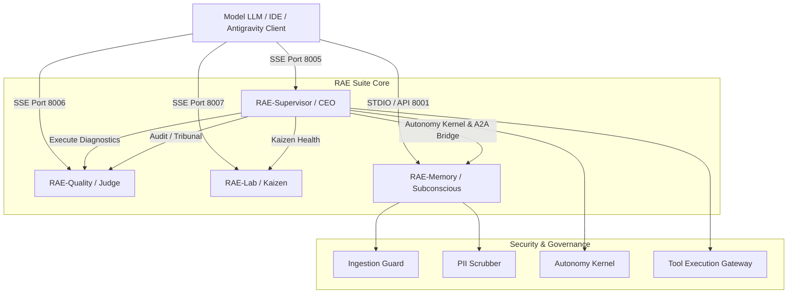

# Raport Techniczny: Architektura MCP w Silicon Oracle RAE Suite (v2.9/v3.0)

Model Context Protocol (MCP) w pakiecie Silicon Oracle RAE Suite stanowi szkielet komunikacyjny pozwalający zewnętrznym modelom językowym (np. Claude w Cursor/Claude Desktop, Gemini w Antigravity) na bezpieczne i ustrukturyzowane zarządzanie fabryką agentyczną, orkiestrację procesów oraz dostęp do rozproszonej pamięci semantycznej.

---

## 1. Topologia Architektoniczna MCP

Większość modułów RAE Suite uruchamia własne, wyspecjalizowane serwery MCP. Architektura wykorzystuje dwa główne kanały transportowe:
*   **SSE (Server-Sent Events) przez HTTP**: Używany do komunikacji wewnątrz klastra Docker i dla API Gateway, umożliwiając niezależne skalowanie usług.
*   **STDIO (Standard Input/Output)**: Używany jako lokalny fallback oraz do bezpośredniej integracji z IDE (Cursor, Claude Desktop).

---

## 2. Szczegółowa Analiza Modułów RAE i ich Integracji MCP

### A. RAE-Supervisor / CEO Orchestrator (Port: 8005, Domyślnie SSE)
Pełni rolę głównego punktu wejścia dla orkiestracji systemowej. Umożliwia monitorowanie i zarządzanie całą suitą za pomocą następujących narzędzi:

*   **Dostępne Narzędzia (Tools):**
    *   `get_cloud_status`: Zwraca listę wszystkich aktywnych kontenerów Docker w klastrze (wizerunek, status, porty).
    *   `get_service_logs`: Pobiera logi (tail) dla wybranego kontenera (np. `rae-hive`, `rae-quality`).
    *   `run_diagnostic`: Uruchamia zarejestrowane skrypty diagnostyczne (np. `diag-001` - weryfikacja integracji, `diag-002` - planowanie kognitywne).
    *   `search_rae_memory` & `create_rae_memory`: Narzędzia pomocnicze do szybkiego zapisu i wyszukiwania faktów w pamięci semantycznej bezpośrednio przez supervisora.
*   **Mechanizmy Bezpieczeństwa:**
    *   **Autonomy Kernel**: Każde wywołanie narzędzia przechodzi przez filtr intencji Autonomy Kernel, który ocenia ryzyko operacji i zatwierdza lub odrzuca wykonanie.
    *   **Tool Execution Gateway**: Bezpośrednie polecenia powłoki (np. `docker ps` czy skrypty python) są izolowane i kontrolowane przez gateway.
    *   **Audytowanie**: Wszystkie operacje są logowane jako `@audited_operation` z uwzględnieniem ścisłych wymogów bezpieczeństwa.

### B. RAE-Quality / Sędzia Trybunału (Port: 8006, SSE)
Moduł ten działa jako **Semantic Firewall** (Semantyczna zapora sieciowa), egzekwując standardy inżynieryjne kodu.

*   **Dostępne Narzędzia (Tools):**
    *   `run_static_quality_audit`: Uruchamia szybkie testy statyczne, lintery (ruff, black) oraz metryki pokrycia kodu testami (Coverage) na wybranej ścieżce projektu.
    *   `run_tribunal_audit`: Uruchamia zaawansowany **3-poziomowy Trybunał Jakości** (Tier 1: Guard statyczny, Tier 2: LLM Consensus dotyczący SOLID/Clean Code, Tier 3: Supreme Court z eskalacją do modeli Gemini) na przesłanym fragmencie kodu. Blokuje wdrożenie kodu niespełniającego poziomu `advanced_senior`.

### C. RAE-Lab / Analityk Kaizen (Port: 8007, SSE)
Moduł laboratoryjny, którego celem jest monitorowanie długu technicznego oraz wydajności klastra.

*   **Dostępne Narzędzia (Tools):**
    *   `get_factory_health_report`: Pobiera raport zdrowia fabryki agentycznej (Kaizen Health), zawierający trendy wydajnościowe, współczynniki długu technicznego (Lean Score, Complexity Index) oraz wagi modelu Multi-Armed Bandit (MAB).
    *   `record_telemetry_event`: Rejestruje zdarzenia telemetryczne dotyczące dokładności, opóźnienia i kosztu użytych modeli LLM w celu optymalizacji wydajności klastra.

### D. RAE-Memory / Podświadomość Klastra (Port: 8001 / Host, STDIO/SSE)
To serce pamięci semantycznej całej fabryki, udostępniające 4 warstwy przechowywania wiedzy (Episodic, Semantic, Working, Reflective). Jest to najbardziej rozbudowany serwer MCP w RAE Suite.

*   **Dostępne Narzędzia (Tools):**
    *   `save_memory`: Zapisuje wspomnienie w systemie. Zapytanie jest kierowane przez *Intelligent Bridge API*, co pozwala na automatyczne określenie optymalnej warstwy zapisu (np. `working` dla bieżącego zadania lub `longterm` dla trwałych faktów) oraz przypisanie wag ważności.
    *   `search_memory`: Semantyczne wyszukiwanie (wektorowe) w bazach Qdrant/pgvector dla bieżącego projektu i filtrów.
    *   `get_related_context`: Pobiera kontekst historyczny i logi zmian dla konkretnego pliku lub modułu (wyszukiwanie po metadanych `source`).
*   **Zarządzanie Ładem i Zgodnością (ISO/IEC 42001 & ISO 27001):**
    *   `request_approval`: Rejestruje prośby o autoryzację wysokiego ryzyka (np. usunięcie wspomnień, modyfikacja krytycznych polityk) przez czynnik ludzki (Human-in-the-Loop).
    *   `check_approval_status`: Weryfikuje status autoryzacji (UUID) operacji.
    *   `get_circuit_breakers`: Pobiera stan bezpieczników systemowych zapobiegających awariom kaskadowym.
    *   `list_policies`: Wyświetla aktywne polityki retencji danych, kontroli dostępu i scoringu zaufania dla danego dzierżawcy (Tenant).
*   **Funkcje Enterprise:**
    *   **PII Scrubber**: Automatycznie maskuje dane osobowe, klucze API, hasła, adresy e-mail i numery kart kredytowych z argumentów wywołań przed zapisem do plików dziennika (logów), co zapewnia zgodność z normami bezpieczeństwa.
    *   **OpenTelemetry Tracing**: Integracja z OTel umożliwia zbieranie rozproszonych śladów (Traces) z wywołań MCP.
    *   **Wbudowana Telemetria**: Liczniki Prometheus (`mcp_tools_called_total`, `mcp_tool_duration_seconds`) do monitorowania wydajności w czasie rzeczywistym.

### E. OpenClaw / Eskadra Specjalna (Klient MCP)
OpenClaw, będący super-agentem do zadań o najwyższym stopniu skomplikowania, nie udostępnia własnych narzędzi przez serwer MCP, lecz działa jako **aktywny klient MCP**.
*   Wykorzystuje narzędzie **`mcporter`** do dynamicznego odpytywania, autoryzacji i wywoływania narzędzi MCP z innych modułów suity (np. odpytuje RAE-Memory o dane historyczne lub RAE-Quality o ocenę wygenerowanego kodu).

---

## 3. Zestawienie Portów i Protokółów MCP

| Moduł RAE | Port (Host) | Port (Docker) | Domyślny Transport | Kluczowe Klasy / Pliki |
| :--- | :--- | :--- | :--- | :--- |
| **RAE-Supervisor** | `8005` | `8005` | SSE (FastAPI) | `rae_mcp_server.py`, `AutonomyKernel` |
| **RAE-Quality** | `8006` | `8000` | SSE (FastAPI) | `rae-quality/main.py`, `QualitySentinel` |
| **RAE-Lab** | `8007` | `8000` | SSE (FastAPI) | `rae-lab/metrics_aggregator.py`, `LabObservatory` |
| **RAE-Memory** | `8001` | `8000` | STDIO / SSE | `integrations/mcp/src/rae_mcp/server.py`, `RAEMemoryClient` |
| **OpenClaw** | *Brak* | *Brak* | Klient (mcporter) | `packages/rae-open-claw/src/acp/client.ts` |

Na podstawie analizy kodu źródłowego modułów MCP w pakiecie RAE Suite, tak, działanie MCP wymaga i kwalifikuje się do kilku kluczowych udoskonaleń.                                
                                                                                                                                                                                     
  Poniżej przedstawiam 5 głównych obszarów, w których wdrożenie poprawek znacząco podniesie wydajność, bezpieczeństwo oraz elastyczność systemu w warunkach produkcyjnych:           
  ──────                                                                                                                                                                             
  ### 1. Zastąpienie In-Memory Rate Limitera limitowaniem opartym na Redis                                                                                                           
                                                                                                                                                                                     
  • Problem: W pliku server.py zaimplementowano klasę RateLimiter przechowującą stan w pamięci procesu (self._requests: Dict[str, List[float]]).                                     
  • Dlaczego to wymaga poprawy: RAE z założenia jest architekturą rozproszoną (posiada klaster Redis, kontenery Celery itp.). Jeśli uruchomimy wiele instancji serwera Memory MCP za 
  load-balancerem, limitowanie zapytań przestanie działać spójnie (każdy kontener będzie miał swój niezależny licznik).                                                              
  • Sugerowane rozwiązanie: Wykorzystanie istniejącej w klastrze instancji Redis (która jest już konfigurowana w suite) do atomowego zliczania żądań za pomocą komendy INCR i EXPIRE 
  lub algorytmu Token Bucket w Redis.                                                                                                                                                
  ──────                                                                                                                                                                             
  ### 2. Rozszerzenie działania PII Scrubber na etap zapisu pamięci (Ingestion Stage)                                                                                                
                                                                                                                                                                                     
  • Problem: Klasa PIIScrubber w Memory MCP w pliku server.py jest wywoływana wyłącznie przed zapisem argumentów wywołania do logów:                                                 
    scrubbed_arguments = PIIScrubber.scrub(arguments, max_content_length=200)                                                                                                        
    logger.info("tool_called", tool=name, arguments=scrubbed_arguments)                                                                                                              
                                                                                                                                                                                     
  • Dlaczego to wymaga poprawy: Jeśli model LLM prześle poufne dane (hasło, klucz API) w argumencie content narzędzia save_memory, dane te zostaną wycięte z logów serwera MCP, ale  
  zostaną zapisane w postaci czystego tekstu w bazie wektorowej (Qdrant/pgvector). Zagraża to bezpieczeństwu danych (data leakage) i łamie standardy ISO 27001.                      
  • Sugerowane rozwiązanie: Automatyczne wywoływanie PIIScrubber.scrub(content) w metodzie store_memory przed wysłaniem żądania do API Gateway, aby fizycznie zanonimizować wrażliwe 
  dane przed ich wektoryzacją.                                                                                                                                                       
  ──────                                                                                                                                                                             
  ### 3. Optymalizacja kosztowa i wydajnościowa Autonomy Kernel dla operacji Read-Only                                                                                               
                                                                                                                                                                                     
  • Problem: W głównym orkiestratorze rae_mcp_server.py nawet bezinwazyjne wywołania telemetryczne (takie jak pobranie statusu kontenerów get_cloud_status czy odczyt logów          
  get_service_logs) są każdorazowo procesowane przez pełną pętlę decyzyjną agenta (self.kernel.execute_task(...)):                                                                   
    receipt = await self.kernel.execute_task(                                                                                                                                        
        goal_id="mcp-cloud-status-goal",                                                                                                                                             
        payload={"target_agent": "rae-hive", "command": "docker ps"}                                                                                                                 
    )                                                                                                                                                                                
                                                                                                                                                                                     
  • Dlaczego to wymaga poprawy: Powoduje to narzut czasowy (1-3 sekundy oczekiwania na decyzję LLM) oraz zużycie tokenów API dla operacji, które są w 100% bezpiecznymi odczytami    
  stanu systemu.                                                                                                                                                                     
  • Sugerowane rozwiązanie: Wdrożenie w AutonomyKernel statycznej klasyfikacji ryzyka (Risk Assessment Bypass). Narzędzia o statusie Read-Only Telemetry powinny być autoryzowane    
  natychmiastowo na poziomie kodu, z pominięciem kosztownego wnioskowania LLM.                                                                                                       
  ──────                                                                                                                                                                             
  ### 4. Dynamiczna konfiguracja listy diagnostyk w RAE-Supervisor                                                                                                                   
                                                                                                                                                                                     
  • Problem: W rae_mcp_server.py lista dozwolonych skryptów diagnostycznych (run_diagnostic) jest sztywno zakodowana w ciele klasy:                                                  
    ALLOWED_DIAGNOSTICS = {                                                                                                                                                          
        "diag-001": {"script": "validate_rae_integration.py", ...},                                                                                                                  
        "diag-002": {"script": "test_cognitive_planning_integration.py", ...}                                                                                                        
    }                                                                                                                                                                                
                                                                                                                                                                                     
  • Dlaczego to wymaga poprawy: Każde dodanie nowego skryptu testowego/weryfikacyjnego przez dewelopera wymaga bezpośredniej modyfikacji kodu źródłowego serwera MCP.                
  • Sugerowane rozwiązanie: Przeniesienie konfiguracji do zewnętrznego pliku konfiguracyjnego (np. config/diagnostics.yaml) i dynamiczne ładowanie listy dozwolonych diagnostyk przy 
  starcie serwera MCP.                                                                                                                                                               
  ──────                                                                                                                                                                             
  ### 5. Zarządzanie osieroconymi sesjami SSE (Orphaned Connections Cleanup)                                                                                                         
                                                                                                                                                                                     
  • Problem: Serwery MCP w modułach Quality i Lab uruchamiane są w kontenerach FastAPI za pomocą transportu SSE (SseServerTransport("/mcp/messages")).                               
  • Dlaczego to wymaga poprawy: W przypadku zerwania połączenia HTTP (np. uśpienie karty w przeglądarce, przeładowanie okna Cursor), serwer nie zamyka natychmiast powiązanych       
  procesów wątkowych ani nie zwalnia blokad na plikach deweloperskich w workspace, co może prowadzić do blokad transakcyjnych Yjs oraz wycieków pamięci.                             
  • Sugerowane rozwiązanie: Implementacja mechanizmu Heartbeat (ping-pong) na poziomie endpointów SSE oraz subskrypcji zdarzenia rozłączenia klienta w celu natychmiastowego         
  wywołania procedury czyszczącej w powiązanych agentach. 
